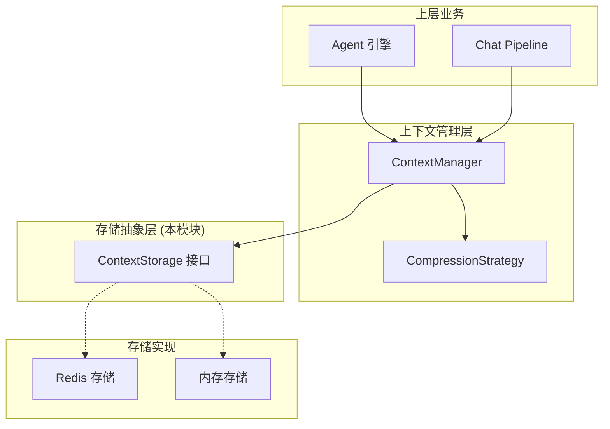

# Context Storage Contract 模块深度解析

## 概述：为什么需要这个模块？

想象你正在设计一个对话系统，用户和 AI 的每一次交互都需要被记录下来，以便在下一轮对话中保持上下文连贯。最直观的做法是什么？直接把消息存到数据库里，每次需要时再读出来。但这会带来几个问题：

1. **存储后端耦合**：如果今天用 Redis 做缓存，明天想换成 PostgreSQL，或者想在测试时用内存存储，业务逻辑就得跟着改
2. **上下文膨胀**：长对话会积累大量消息，但 LLM 的 context window 是有限的，不能无脑把所有历史消息都塞进去
3. **多实现并存**：生产环境需要持久化（Redis），单元测试需要轻量级（内存），开发环境可能需要不同的 TTL 策略

`context_storage_contract` 模块正是为了解决这些问题而存在。它定义了一个简洁的存储接口 `ContextStorage`，将**存储的实现细节**与**上下文管理的业务逻辑**彻底分离。这种设计让上层业务代码无需关心消息是存在 Redis、内存还是其他什么地方，只需通过统一的接口进行读写。

从架构角色来看，这个模块是一个**存储抽象层**（Storage Abstraction Layer），位于上下文管理核心逻辑与具体存储基础设施之间。它不决定"存什么"或"何时存"，只定义"怎么存"的契约。

---

## 架构与数据流



### 组件角色说明

| 组件 | 职责 | 依赖关系 |
|------|------|----------|
| `ContextStorage` | 定义存储契约：Save/Load/Delete | 被 `ContextManager` 调用 |
| `memoryStorage` | 内存实现，用于测试和开发 | 实现 `ContextStorage` |
| `redisStorage` | Redis 实现，用于生产环境 | 实现 `ContextStorage` |
| `ContextManager` | 上下文编排：添加消息、压缩、获取 | 调用 `ContextStorage` 和 `CompressionStrategy` |

### 数据流追踪：一次对话上下文的读取

当 Agent 引擎需要获取当前对话上下文时，数据流如下：

1. **AgentEngine** 调用 `ContextManager.GetContext(sessionID)`
2. **ContextManager** 调用 `ContextStorage.Load(sessionID)` 从存储层读取原始消息
3. 如果消息数量超过 token 限制，**ContextManager** 调用 `CompressionStrategy.Compress()` 进行压缩
4. 压缩后的消息返回给 **AgentEngine**，用于构建 LLM 请求

这个流程中，`ContextStorage` 只负责第 2 步的持久化读写，不关心消息如何被压缩或如何使用。这种职责分离使得每个组件都可以独立演进。

---

## 核心组件深度解析

### ContextStorage 接口

```go
type ContextStorage interface {
    Save(ctx context.Context, sessionID string, messages []chat.Message) error
    Load(ctx context.Context, sessionID string) ([]chat.Message, error)
    Delete(ctx context.Context, sessionID string) error
}
```

**设计意图**：这个接口只有三个方法，覆盖了 CRUD 中的 Create/Update（Save）、Read（Load）、Delete（Delete）。为什么没有单独的 Update？因为对话上下文的更新模式是**全量覆盖**而非增量修改——每次新消息到来时，会将完整的消息列表重新保存。这种设计简化了并发控制，避免了部分更新导致的数据不一致。

**参数设计**：
- `ctx context.Context`：所有方法都接收 context，支持超时控制和请求链路追踪
- `sessionID string`：会话标识，作为存储的 key 前缀
- `messages []chat.Message`：消息切片，注意是值传递而非指针，避免外部修改影响存储

**返回值**：
- `Load` 返回 `[]chat.Message, error`：调用者需要处理消息不存在的情况（通常返回空切片而非 nil）
- `Save` 和 `Delete` 只返回 `error`：遵循"失败即报错"的简单语义

**副作用**：
- `Save`：覆盖该 sessionID 下的所有历史消息
- `Delete`：物理删除存储中的数据，不可恢复
- `Load`：纯读取操作，无副作用

### memoryStorage 实现

```go
type memoryStorage struct {
    sessions map[string][]chat.Message
    mu       sync.RWMutex
}
```

**内部机制**：使用 `map[string][]chat.Message` 在内存中维护会话到消息列表的映射。`sync.RWMutex` 保证并发安全——读操作（Load）可以并发，写操作（Save/Delete）独占锁。

**使用场景**：
- 单元测试：无需启动 Redis，测试运行速度快
- 本地开发：快速迭代，无需配置外部依赖
- 临时会话：对持久化无要求的场景

**注意事项**：
- 进程重启后数据丢失
- 多实例部署时数据不共享
- 内存占用随会话数量线性增长

### redisStorage 实现

```go
type redisStorage struct {
    client *redis.Client
    ttl    time.Duration
    prefix string
}
```

**内部机制**：使用 Redis 的 String 类型存储序列化后的消息列表。Key 的格式为 `{prefix}:{sessionID}`，例如 `ctx:session:abc123`。`ttl` 字段控制自动过期时间，避免无限累积。

**设计权衡**：
- **序列化格式**：通常使用 JSON 或 Gob，JSON 可读性好但性能略低，Gob 性能好但调试困难
- **TTL 策略**：过短会导致用户对话中途丢失上下文，过长会占用过多内存。典型值为 24-72 小时
- **Key 前缀**：便于按业务分类管理和批量删除

**与 memoryStorage 的对比**：

| 维度 | memoryStorage | redisStorage |
|------|---------------|--------------|
| 持久化 | 否 | 是 |
| 多实例共享 | 否 | 是 |
| 性能 | 纳秒级 | 毫秒级 |
| 内存管理 | 手动 | TTL 自动过期 |
| 适用场景 | 测试/开发 | 生产环境 |

---

## 依赖关系分析

### 本模块调用的组件

| 被调用方 | 调用原因 | 耦合程度 |
|----------|----------|----------|
| `chat.Message` | 消息数据模型 | 低（仅作为参数类型） |
| `context.Context` | 超时和链路控制 | 低（标准库） |
| `redis.Client` | Redis 操作（仅 redisStorage） | 中（具体实现依赖） |
| `sync.RWMutex` | 并发控制（仅 memoryStorage） | 低（标准库） |

### 调用本模块的组件

| 调用方 | 期望行为 | 依赖的契约 |
|--------|----------|------------|
| `ContextManager` | 可靠的持久化，Load 后 Save 的数据必须一致 | Save 后立即可读，Delete 后不可读 |
| `AgentEngine` | 间接通过 ContextManager 使用 | 无直接依赖 |
| `ChatPipeline` | 间接通过 ContextManager 使用 | 无直接依赖 |

### 数据契约

**Save 操作的隐式契约**：
```
Save(sessionID, messages) 后，立即调用 Load(sessionID) 必须返回与 messages 等价的数据
```

**Load 操作的边界条件**：
- sessionID 不存在时：返回 `[]chat.Message{}`（空切片）而非 `nil`，避免调用者 nil 指针解引用
- 数据损坏时：返回 error 而非部分数据，保证数据完整性

**Delete 操作的语义**：
- 幂等性：对不存在的 sessionID 调用 Delete 不应报错
- 彻底性：Delete 后该 sessionID 的所有数据必须清除，包括元数据

---

## 设计决策与权衡

### 1. 接口极简主义：为什么只有三个方法？

**选择**：`ContextStorage` 只定义 `Save`/`Load`/`Delete`，没有 `Append`、`UpdateMessage`、`GetMessage` 等细粒度操作。

**原因**：
- **简化并发控制**：全量覆盖避免了"读 - 改 - 写"的竞态条件
- **降低实现复杂度**：不同存储后端（Redis、MySQL、S3）的实现难度差异小
- **符合使用模式**：上下文管理是批量操作，极少需要单条消息的增删改

**代价**：
- 长对话每次 Save 都会传输完整消息列表，网络开销较大
- 无法高效实现"只追加"的增量存储优化

### 2. 存储与压缩分离：为什么 ContextStorage 不负责压缩？

**选择**：`ContextStorage` 只负责原始消息的存取，压缩逻辑由 `CompressionStrategy` 接口独立处理。

**原因**：
- **单一职责**：存储层不应关心业务语义（哪些消息重要、如何摘要）
- **策略可变**：压缩策略可能随模型升级而调整（如从滑动窗口升级为智能摘要），存储层应保持稳定
- **可测试性**：可以独立测试存储的正确性和压缩的准确性

**架构模式**：这是典型的**策略模式**（Strategy Pattern），`ContextManager` 作为上下文（Context），持有 `ContextStorage` 和 `CompressionStrategy` 两个策略接口。

### 3. 全量覆盖 vs 增量更新

**选择**：`Save` 方法覆盖整个消息列表，而非提供 `Append(message)` 增量追加。

**权衡分析**：

| 方案 | 优点 | 缺点 |
|------|------|------|
| 全量覆盖 | 实现简单，无并发冲突，易于理解 | 大对话时网络传输量大 |
| 增量追加 | 小消息时性能好，节省带宽 | 需要处理并发追加的锁竞争，删除消息时复杂 |

**为什么选全量覆盖**：
- 对话消息的平均长度较短（通常<100 条），全量传输的开销可接受
- 增量更新的复杂度（锁、事务、版本控制）远超收益
- 压缩策略会在存储前过滤消息，实际存储的消息数通常远小于对话历史总数

### 4. 同步接口 vs 异步接口

**选择**：所有方法都是同步阻塞的，没有提供异步版本。

**原因**：
- **调用链简单**：上下文操作是请求处理的关键路径，异步化不会提升吞吐量
- **错误处理直接**：同步调用可以立即捕获存储失败，便于重试或降级
- **实现复杂度**：异步接口需要额外的回调或 Future 机制，增加使用门槛

**潜在问题**：
- Redis 网络延迟会直接阻塞请求线程
- 高并发场景下可能成为瓶颈

**缓解方案**：
- 使用连接池和超时控制
- 对非关键路径（如日志记录）使用异步存储

---

## 使用指南与示例

### 基本使用模式

```go
// 1. 创建存储实例（以 Redis 为例）
storage := llmcontext.NewRedisStorage(redisClient, 24*time.Hour, "ctx:session")

// 2. 保存上下文
messages := []chat.Message{
    {Role: "user", Content: "你好"},
    {Role: "assistant", Content: "你好！有什么可以帮助你的？"},
}
err := storage.Save(ctx, "session-123", messages)
if err != nil {
    // 处理存储失败
}

// 3. 加载上下文
loaded, err := storage.Load(ctx, "session-123")
if err != nil {
    // 处理加载失败
}

// 4. 删除上下文（会话结束时）
err = storage.Delete(ctx, "session-123")
```

### 与 ContextManager 配合使用

```go
// ContextManager 内部会调用 ContextStorage
manager := llmcontext.NewContextManager(storage, compressionStrategy, 4096)

// 添加消息（自动触发 Save）
err := manager.AddMessage(ctx, "session-123", newUserMessage)

// 获取压缩后的上下文（自动触发 Load + Compress）
context, err := manager.GetContext(ctx, "session-123")
```

### 配置选项

| 配置项 | 说明 | 推荐值 |
|--------|------|--------|
| `ttl` (Redis) | 会话过期时间 | 24-72 小时 |
| `prefix` (Redis) | Key 前缀 | `ctx:session` |
| `recentMessageCount` (Compression) | 保留的最近消息数 | 10-20 条 |
| `maxTokens` (ContextManager) | 最大 token 数 | 根据模型限制设置 |

### 扩展点

**实现自定义存储后端**：

```go
type MySQLStorage struct {
    db *sql.DB
}

func (s *MySQLStorage) Save(ctx context.Context, sessionID string, messages []chat.Message) error {
    // 实现 MySQL 存储逻辑
}

func (s *MySQLStorage) Load(ctx context.Context, sessionID string) ([]chat.Message, error) {
    // 实现 MySQL 加载逻辑
}

func (s *MySQLStorage) Delete(ctx context.Context, sessionID string) error {
    // 实现 MySQL 删除逻辑
}

// 确保实现 ContextStorage 接口
var _ llmcontext.ContextStorage = (*MySQLStorage)(nil)
```

---

## 边界情况与陷阱

### 1. 空消息列表的处理

**问题**：`Save(ctx, sessionID, []chat.Message{})` 应该存储空列表还是删除 session？

**当前行为**：存储空列表（序列化后为空 JSON 数组 `[]`）

**风险**：调用者可能误以为 session 被删除，但 `Load` 仍会返回空切片而非 error

**建议**：在业务层明确语义——空消息列表表示"会话存在但无内容"，与"会话不存在"区分开

### 2. 消息序列化的兼容性

**问题**：`chat.Message` 结构体升级（如新增字段）后，旧数据反序列化可能失败

**风险**：
- 新增必填字段：旧数据反序列化失败
- 字段重命名：旧数据丢失

**缓解方案**：
- 使用向后兼容的序列化格式（如 JSON，忽略未知字段）
- 添加数据迁移逻辑，在加载时升级旧格式

### 3. 并发写入冲突

**问题**：两个请求同时调用 `Save(sessionID, ...)`，后完成的会覆盖先完成的

**场景**：用户快速连续发送两条消息，两个 goroutine 同时处理

**当前行为**：无锁保护，最后一次写入获胜（Last Write Wins）

**风险**：可能丢失部分消息

**建议**：
- 在 `ContextManager` 层加锁，保证同一 session 的串行化
- 或使用版本号/时间戳检测冲突

### 4. Redis 连接失败

**问题**：Redis 不可用时，`Save` 和 `Load` 返回 error

**影响**：
- `Save` 失败：消息丢失，用户下一轮对话无上下文
- `Load` 失败：无法获取历史，LLM 收到空上下文

**降级策略**：
- 实现 `FallbackStorage`，Redis 失败时自动切换到内存存储
- 记录错误日志并告警，但不中断主流程（允许对话继续，只是无历史）

### 5. 内存存储的泄漏风险

**问题**：`memoryStorage` 没有自动过期机制，测试中创建的 session 会永久占用内存

**症状**：长时间运行的测试进程内存持续增长

**解决**：
- 测试结束后显式调用 `Delete`
- 或在 `memoryStorage` 中添加 TTL 支持（参考 `redisStorage`）

---

## 相关模块参考

- [Context Manager](context_manager.md)：上层编排组件，调用本模块进行持久化
- [Compression Strategies](compression_strategies.md)：压缩策略接口，与本模块配合使用
- [Chat Message Models](chat_core_message_and_tool_contracts.md)：`chat.Message` 数据模型定义
- [Redis Storage Implementation](redis_context_storage_implementation.md)：Redis 实现细节
- [Memory Storage Implementation](in_memory_context_storage_implementation.md)：内存实现细节

---

## 总结

`context_storage_contract` 模块体现了**依赖倒置原则**的经典应用：通过定义简洁的存储接口，将业务逻辑与基础设施解耦。这种设计带来的好处是：

1. **可测试性**：单元测试可以用 `memoryStorage` 替代 Redis，无需外部依赖
2. **可替换性**：生产环境可以根据需求切换存储后端（Redis → MySQL → S3）
3. **可维护性**：存储逻辑的变化不会影响上层业务代码

核心设计哲学是**简单优于复杂**——三个方法覆盖全部需求，全量覆盖避免并发陷阱，同步接口降低使用门槛。这种克制的设计使得模块易于理解和维护，是基础设施代码的典范。
