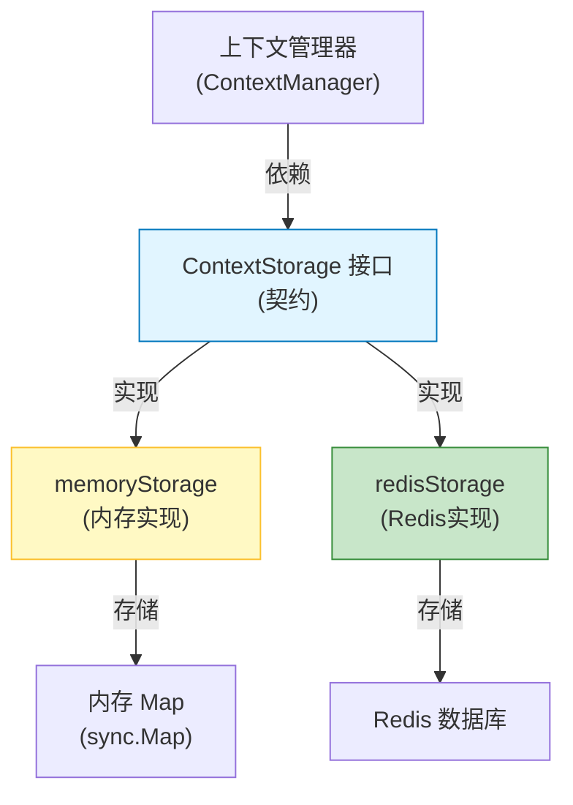

# context_storage_contracts_and_implementations 模块

## 概述

想象一下，当你与 AI 助手对话时，它需要记住之前的对话内容才能给出连贯的回答。这个模块就是专门负责"记住"这些对话上下文的基础设施——它提供了一套统一的接口和多种存储实现，让系统可以根据部署环境灵活选择是将对话历史保存在内存中还是 Redis 中。

这个模块解决的核心问题是：**如何在不污染业务逻辑的情况下，为对话上下文提供可插拔的持久化能力**。它通过定义清晰的契约（Contract），让业务代码只依赖接口，而具体的存储实现可以在运行时或部署时动态切换。

## 架构概览



### 架构解读

这个模块采用了经典的**策略模式**（Strategy Pattern）设计：

1. **ContextStorage 接口**：定义了"存储对话上下文"的核心契约，包含 Save、Load、Delete 三个基本操作。这是整个模块的"灵魂"，所有业务代码都只依赖这个接口。

2. **memoryStorage 实现**：基于内存的简单实现，使用 `map` 存储会话数据，适合开发测试环境或单实例部署。

3. **redisStorage 实现**：基于 Redis 的分布式实现，支持 TTL 自动过期，适合生产环境的多实例部署。

### 数据流向

当业务代码需要处理对话上下文时，数据流向如下：

1. **保存流程**：上下文管理器 → ContextStorage.Save() → 具体实现（内存/Redis）→ 持久化存储
2. **加载流程**：上下文管理器 → ContextStorage.Load() → 具体实现（内存/Redis）→ 返回会话消息
3. **删除流程**：上下文管理器 → ContextStorage.Delete() → 具体实现（内存/Redis）→ 清除数据

## 核心设计决策

### 1. 接口优先设计（Contract-First）

**决策**：先定义 `ContextStorage` 接口，再提供实现。

**为什么这样设计**：
- **解耦**：业务逻辑不需要知道数据是存在内存还是 Redis 中，降低了耦合度
- **可测试性**：测试时可以轻松使用内存实现，不需要依赖外部 Redis 服务
- **扩展性**：未来如果需要支持其他存储（如数据库、文件等），只需新增实现类即可

**替代方案**：直接提供具体实现类。但这样会导致业务代码与存储实现强绑定，切换存储时需要修改大量代码。

### 2. 内存实现的防御性拷贝

**决策**：在 `memoryStorage` 的 Save 和 Load 方法中，都对消息数组进行了深拷贝。

**为什么这样设计**：
- **防止外部修改**：如果不拷贝，外部代码修改返回的消息数组会直接影响存储的数据
- **线程安全**：配合读写锁，确保并发访问时的数据一致性

**权衡**：
- ✅ 优点：数据安全，避免意外修改
- ⚠️ 缺点：会有额外的内存开销，对于超大对话历史可能影响性能

### 3. Redis 实现的 TTL 策略

**决策**：`redisStorage` 支持配置 TTL（Time-To-Live），默认 24 小时自动过期。

**为什么这样设计**：
- **自动清理**：对话上下文通常不需要永久保存，TTL 可以自动清理旧数据，避免 Redis 内存溢出
- **可配置性**：不同场景可以设置不同的过期时间（如测试环境可以设置更短的 TTL）

**权衡**：
- ✅ 优点：无需手动清理，降低运维成本
- ⚠️ 缺点：如果 TTL 设置过短，可能导致用户对话意外丢失

### 4. Redis 键的前缀设计

**决策**：`redisStorage` 支持配置键前缀，默认为 "context:"。

**为什么这样设计**：
- **避免键冲突**：如果 Redis 被多个应用共享，前缀可以避免键名冲突
- **便于管理**：可以通过前缀统一管理和查询所有上下文相关的键

## 子模块说明

### context_storage_contract
定义了 `ContextStorage` 接口，是整个模块的核心契约。所有存储实现都必须遵守这个接口规范。

[查看详情 →](context_storage_contract.md)

### in_memory_context_storage_implementation
基于内存的 `ContextStorage` 实现，使用 `map` 存储会话数据，配合读写锁保证并发安全。

[查看详情 →](in_memory_context_storage_implementation.md)

### redis_context_storage_implementation
基于 Redis 的 `ContextStorage` 实现，支持 TTL 自动过期和键前缀配置，适合生产环境使用。

[查看详情 →](redis_context_storage_implementation.md)

## 跨模块依赖

### 依赖的模块
- **chat 模型**（`internal/models/chat`）：依赖 `chat.Message` 类型来表示对话消息
- **logger**（`internal/logger`）：用于记录日志
- **redis**（`github.com/redis/go-redis/v9`）：Redis 实现依赖的第三方库

### 被依赖的模块
- **context_manager_orchestration**：上下文管理器使用 `ContextStorage` 接口来持久化对话上下文

## 使用指南

### 基本使用

```go
// 选择存储实现
var storage ContextStorage

// 开发环境使用内存存储
storage = NewMemoryStorage()

// 生产环境使用 Redis 存储
redisClient := redis.NewClient(&redis.Options{Addr: "localhost:6379"})
storage, err := NewRedisStorage(redisClient, 24*time.Hour, "myapp:context:")
if err != nil {
    log.Fatalf("Failed to create Redis storage: %v", err)
}

// 使用存储
ctx := context.Background()
sessionID := "user-123"
messages := []chat.Message{...}

// 保存
err = storage.Save(ctx, sessionID, messages)

// 加载
loadedMessages, err := storage.Load(ctx, sessionID)

// 删除
err = storage.Delete(ctx, sessionID)
```

### 配置建议

| 环境 | 推荐实现 | 配置建议 |
|------|---------|---------|
| 本地开发 | memoryStorage | 无需配置 |
| 测试环境 | redisStorage | TTL: 1-2 小时，前缀: "test:context:" |
| 生产环境 | redisStorage | TTL: 24-72 小时，前缀: "prod:context:" |

## 注意事项与陷阱

### 1. 内存存储的数据丢失风险

**问题**：`memoryStorage` 中的数据在进程重启后会全部丢失。

**应对**：仅在开发测试环境使用，生产环境务必使用 `redisStorage`。

### 2. Redis 连接故障

**问题**：`redisStorage` 依赖 Redis 服务，如果 Redis 不可用，所有存储操作都会失败。

**应对**：
- 确保 Redis 服务高可用（如使用 Redis Sentinel 或 Cluster）
- 在调用方实现重试逻辑
- 考虑实现降级策略（如 Redis 不可用时回退到内存存储）

### 3. 大消息的性能问题

**问题**：如果对话历史非常长（比如几千条消息），存储和加载操作可能会变慢。

**应对**：
- 配合上下文压缩策略使用，避免存储过多历史消息
- 考虑实现分页加载（当前接口不支持，需要扩展）

### 4. JSON 序列化的限制

**问题**：`redisStorage` 使用 JSON 序列化消息，如果 `chat.Message` 类型包含不可序列化的字段，会导致保存失败。

**应对**：
- 确保 `chat.Message` 类型的所有字段都可以被 JSON 序列化
- 如果需要支持复杂类型，可以考虑使用其他序列化方式（如 gob）

---

这个模块虽然简单，但它是整个对话系统的基础组件之一。它的设计体现了"通过接口解耦"和"关注点分离"的设计思想，让存储实现的变化不会影响到上层业务逻辑。
