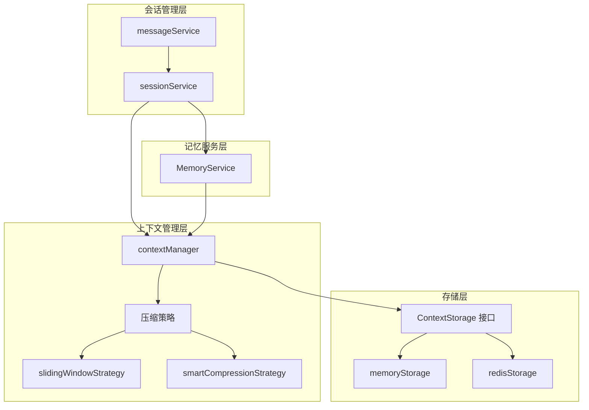
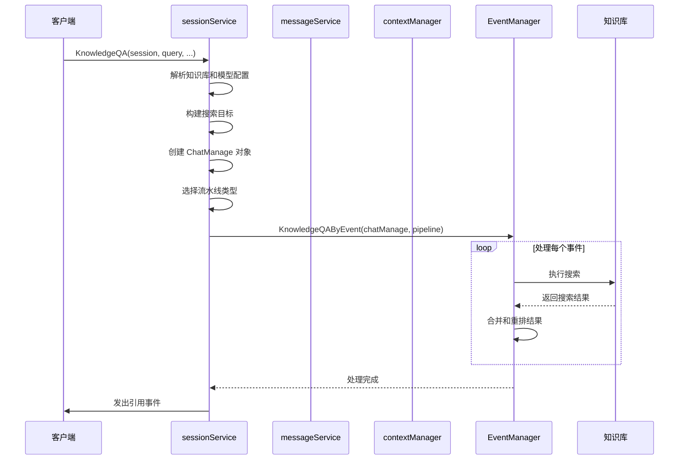
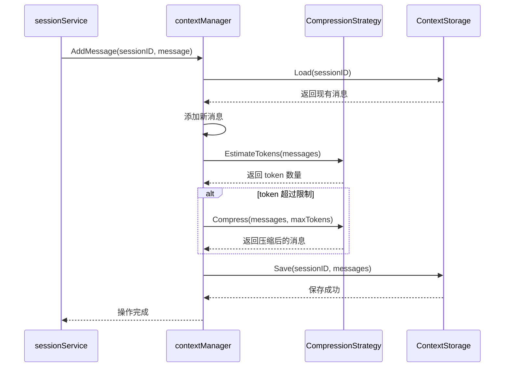
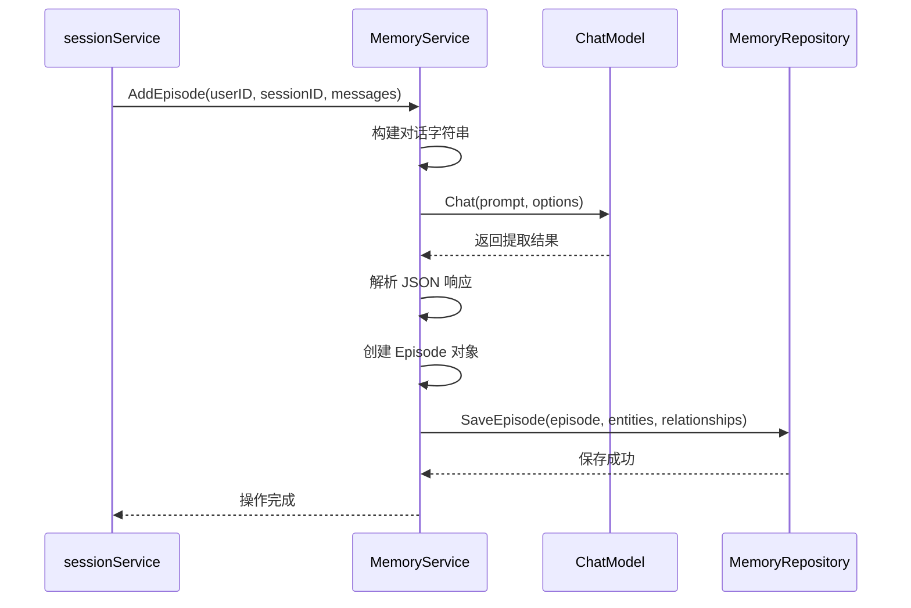

# conversation_context_and_memory_services 模块

## 1. 模块概述

**conversation_context_and_memory_services** 模块是整个系统的核心组件，负责管理对话会话、消息历史、上下文管理以及记忆提取与召回。它为上层应用提供了完整的对话生命周期支持，确保对话的连续性、上下文的一致性以及记忆的持久性。

这个模块解决了以下关键问题：
- 如何高效管理多个并发对话会话
- 如何在有限的 token 限制下保持对话上下文的连贯性
- 如何从历史对话中提取有用信息并在需要时召回
- 如何在不同的存储后端（内存、Redis）之间灵活切换

### 1.1 核心价值

想象一下，当您与一个 AI 助手进行长时间对话时，您希望它能够记住之前的讨论内容，而不是每次都像第一次见面一样。这个模块就像是 AI 助手的"大脑"，负责：
- 记住当前对话的上下文（短期记忆）
- 从历史对话中提取关键信息（长期记忆）
- 在有限的"注意力"范围内保持最重要的信息（上下文压缩）

## 2. 架构设计

### 2.1 整体架构图



### 2.2 架构详解

这个模块采用了清晰的分层架构，从上到下依次为：

1. **会话管理层**：负责会话和消息的生命周期管理
   - `sessionService`：管理会话的创建、更新、删除等操作
   - `messageService`：处理消息的存储和检索

2. **上下文管理层**：负责对话上下文的维护和压缩
   - `contextManager`：上下文管理的核心协调者
   - 压缩策略：提供不同的上下文压缩算法

3. **存储层**：提供上下文数据的持久化能力
   - `ContextStorage` 接口：定义了存储操作的标准
   - 多种实现：内存存储、Redis 存储等

4. **记忆服务层**：负责长期记忆的提取和召回
   - `MemoryService`：从对话中提取知识图谱并在需要时召回相关记忆

## 3. 核心组件解析

### 3.1 sessionService

**职责**：会话生命周期管理的核心服务，负责会话的创建、查询、更新和删除，同时也是知识问答和代理问答的入口点。

**设计亮点**：
- 采用依赖注入模式，通过构造函数接收所有依赖
- 提供了同步和异步两种标题生成方式
- 支持多种问答模式：知识库问答、代理问答、纯聊天等
- 实现了完整的会话清理逻辑，包括临时知识库和上下文的清理

**关键方法**：
- `CreateSession`：创建新会话
- `KnowledgeQA`：执行知识库问答
- `AgentQA`：执行代理问答
- `DeleteSession`：删除会话并清理相关资源

### 3.2 messageService

**职责**：消息管理服务，负责消息的创建、查询、更新和删除操作。

**设计亮点**：
- 每次操作前都会验证会话的存在性，确保数据一致性
- 支持多种消息检索方式：分页、最近消息、时间范围等
- 实现了租户隔离，确保数据安全

**关键方法**：
- `CreateMessage`：创建新消息
- `GetRecentMessagesBySession`：获取会话的最近消息
- `GetMessagesBySessionBeforeTime`：获取指定时间之前的消息

### 3.3 contextManager

**职责**：上下文管理的核心组件，负责对话上下文的维护、压缩和检索。

**设计亮点**：
- 将业务逻辑与存储实现分离，通过 `ContextStorage` 接口抽象存储操作
- 支持动态切换压缩策略
- 提供了系统提示词的设置和更新功能
- 实现了上下文统计信息的收集

**工作流程**：
1. 加载现有上下文
2. 添加新消息
3. 检查 token 数量，必要时进行压缩
4. 保存更新后的上下文

### 3.4 压缩策略

**slidingWindowStrategy**：
- **原理**：保留系统消息和最近的 N 条消息
- **优点**：实现简单，性能好
- **缺点**：可能丢失重要的历史信息
- **适用场景**：短对话或对历史信息依赖不大的场景

**smartCompressionStrategy**：
- **原理**：使用 LLM 对旧消息进行摘要，保留系统消息和最近的 N 条消息
- **优点**：能保留更多历史信息的语义
- **缺点**：实现复杂，有额外的 LLM 调用成本
- **适用场景**：长对话或需要保留历史上下文的场景

### 3.5 存储实现

**memoryStorage**：
- **特点**：基于内存的存储实现，性能最好
- **优点**：速度快，无需外部依赖
- **缺点**：数据不持久，服务重启后丢失
- **适用场景**：开发测试环境或短期会话

**redisStorage**：
- **特点**：基于 Redis 的存储实现，支持数据持久化
- **优点**：数据持久化，支持分布式环境
- **缺点**：需要外部 Redis 服务，有网络开销
- **适用场景**：生产环境或需要长期保存会话的场景

### 3.6 MemoryService

**职责**：长期记忆服务，负责从对话中提取知识图谱并在需要时召回相关记忆。

**设计亮点**：
- 使用 LLM 从对话中提取实体和关系，构建知识图谱
- 支持基于关键词的记忆检索
- 采用 JSON Schema 约束 LLM 输出格式，确保数据一致性

**工作流程**：
1. 从对话中提取实体和关系
2. 构建知识图谱并保存
3. 根据当前查询提取关键词
4. 基于关键词检索相关记忆

## 4. 关键设计决策

### 4.1 上下文压缩策略的选择

**决策**：提供两种压缩策略（滑动窗口和智能压缩），允许根据场景选择。

**权衡分析**：
- 滑动窗口策略：简单高效，但可能丢失重要信息
- 智能压缩策略：保留更多语义，但增加了 LLM 调用成本

**设计理由**：
不同的应用场景对上下文管理有不同的需求。对于短对话或实时性要求高的场景，滑动窗口策略更合适；对于长对话或需要保留历史上下文的场景，智能压缩策略更有价值。通过提供多种策略，系统可以根据实际需求灵活选择。

### 4.2 存储层的抽象

**决策**：通过 `ContextStorage` 接口抽象存储操作，提供多种实现。

**权衡分析**：
- 接口抽象增加了代码复杂度，但提高了灵活性
- 多种存储实现增加了维护成本，但满足了不同环境的需求

**设计理由**：
存储需求在不同环境下差异很大。开发环境可能只需要简单的内存存储，而生产环境可能需要 Redis 这样的持久化存储。通过接口抽象，系统可以在不同环境下使用不同的存储实现，而不需要修改业务逻辑。

### 4.3 会话和消息的分离设计

**决策**：将会话和消息分为两个独立的服务进行管理。

**权衡分析**：
- 分离设计增加了模块间的交互，但提高了代码的可维护性
- 每个服务职责单一，易于理解和测试

**设计理由**：
会话和消息虽然相关，但它们的职责不同。会话管理关注的是对话的整体状态，而消息管理关注的是具体消息的存储和检索。通过分离设计，每个服务可以专注于自己的职责，代码更加清晰，也更容易扩展。

## 5. 数据流分析

### 5.1 知识问答流程



### 5.2 上下文管理流程



### 5.3 记忆提取流程



## 6. 跨模块依赖

### 6.1 输入依赖

这个模块依赖以下模块：
- **data_access_repositories**：提供会话和消息的持久化能力
- **core_domain_types_and_interfaces**：定义了核心数据类型和接口
- **chat_pipeline_plugins_and_flow**：提供事件管理和流水线处理能力
- **model_providers_and_ai_backends**：提供 LLM 模型访问能力

### 6.2 输出依赖

以下模块依赖这个模块：
- **http_handlers_and_routing**：通过 HTTP 接口暴露会话和消息管理功能
- **agent_runtime_and_tools**：使用上下文管理和记忆服务功能

## 7. 使用指南

### 7.1 创建和管理会话

```go
// 创建会话
session, err := sessionService.CreateSession(ctx, &types.Session{
    TenantID: tenantID,
    Title:    "新会话",
})

// 获取会话
session, err := sessionService.GetSession(ctx, sessionID)

// 删除会话
err := sessionService.DeleteSession(ctx, sessionID)
```

### 7.2 执行知识问答

```go
// 执行知识问答
err := sessionService.KnowledgeQA(
    ctx,
    session,
    "用户问题",
    []string{"kb1", "kb2"}, // 知识库 ID 列表
    []string{}, // 知识 ID 列表
    assistantMessageID,
    summaryModelID,
    webSearchEnabled,
    eventBus,
    customAgent,
    enableMemory,
)
```

### 7.3 配置上下文管理

上下文管理可以通过租户配置进行自定义：

```yaml
context:
  max_tokens: 4000
  compression_strategy: "sliding_window" # 或 "smart_compression"
  recent_message_count: 10
  summarize_threshold: 20
```

## 8. 注意事项和最佳实践

### 8.1 注意事项

1. **会话清理**：删除会话时，确保同时清理相关的上下文和临时知识库，避免资源泄漏。
2. **租户隔离**：始终确保在多租户环境中正确处理租户 ID，避免数据混淆。
3. **上下文压缩**：智能压缩策略会增加 LLM 调用成本，在高并发场景下需要注意成本控制。
4. **Redis 连接**：使用 Redis 存储时，确保 Redis 服务的可用性和连接池配置合理。

### 8.2 最佳实践

1. **选择合适的压缩策略**：根据对话长度和历史信息的重要性选择合适的压缩策略。
2. **合理配置存储 TTL**：使用 Redis 存储时，根据业务需求合理配置 TTL，避免存储过多历史数据。
3. **监控上下文大小**：定期监控上下文的 token 数量，及时调整压缩策略和参数。
4. **异步处理标题生成**：使用 `GenerateTitleAsync` 方法异步生成会话标题，避免阻塞主流程。

## 9. 子模块文档

- [llm_context_management_and_storage](application_services_and_orchestration-conversation_context_and_memory_services-llm_context_management_and_storage.md)：详细介绍了上下文管理和存储的实现，包括压缩策略、上下文管理器和不同的存储实现。
- [session_conversation_lifecycle_service](application_services_and_orchestration-conversation_context_and_memory_services-session_conversation_lifecycle_service.md)：深入讲解了会话生命周期管理，包括会话的创建、查询、更新和删除，以及知识问答和代理问答的实现。
- [message_history_service](application_services_and_orchestration-conversation_context_and_memory_services-message_history_service.md)：详细介绍了消息历史管理服务，包括消息的创建、查询、更新和删除操作。
- [memory_extraction_and_recall_service](application_services_and_orchestration-conversation_context_and_memory_services-memory_extraction_and_recall_service.md)：深入讲解了记忆提取和召回服务，包括如何从对话中提取知识图谱以及如何根据当前查询召回相关记忆。
