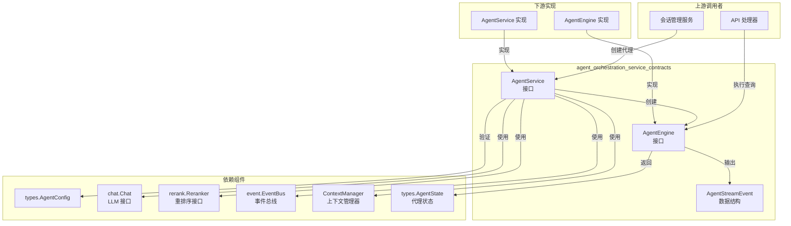

# Agent Orchestration Service Contracts 模块深度解析

## 1. 问题空间与模块定位

在构建一个复杂的 AI 代理系统时，我们面临着一个核心挑战：如何将代理的配置、执行引擎、以及运行时环境清晰地解耦，同时确保它们能够无缝协作？

想象一下，如果每次更换代理配置、切换 LLM 提供商或者调整工具调用策略，都需要重写整个代理执行逻辑，那将是一场维护噩梦。`agent_orchestration_service_contracts` 模块正是为了解决这个问题而诞生的——它定义了一套清晰的接口契约，将代理系统的不同关注点分离，使得系统可以灵活扩展而不破坏核心架构。

简单来说，这个模块扮演着**代理系统的“架构蓝图”**角色：它不包含具体实现，而是规定了“代理服务应该做什么”和“代理引擎应该如何工作”，让不同的实现可以遵循同一套标准进行协作。

## 2. 核心抽象与心智模型

### 2.1 主要抽象

这个模块定义了两个核心接口，形成了代理系统的骨干：

1. **`AgentService`** - 代理服务工厂与配置验证器
2. **`AgentEngine`** - 代理执行引擎

我们可以将其想象成一个**汽车制造厂**的场景：
- `AgentService` 像是**工厂的设计部门**，它负责验证设计图纸（`ValidateConfig`），并根据设计图纸和可用的零部件（LLM、重排序模型、事件总线等）组装出一台发动机（`CreateAgentEngine`）。
- `AgentEngine` 则像是**发动机本身**，一旦被制造出来，它就可以独立运转（`Execute`），接收燃料（用户查询和对话历史），并输出动力（代理状态和事件流）。

### 2.2 关键数据结构

虽然 `AgentStreamEvent` 是一个具体的结构体，但它在这个接口契约模块中扮演着重要角色，定义了代理执行过程中产生的事件格式：

```go
type AgentStreamEvent struct {
	Type      string                 // 事件类型："thought", "tool_call", "tool_result", "final_answer", "error", "references"
	Content   string                 // 增量内容
	Data      map[string]interface{} // 额外的结构化数据
	Done      bool                   // 是否为最后一个事件
	Iteration int                    // 当前迭代次数
}
```

这个结构体确保了所有代理引擎实现都能以统一的格式输出事件，便于下游消费。

## 3. 架构与数据流

让我们通过 Mermaid 图表来理解这个模块在整个系统中的位置和数据流向：



### 3.1 数据流向详解

1. **初始化阶段**：
   - 上游服务（如会话管理）首先调用 `AgentService.ValidateConfig` 来验证代理配置的有效性
   - 验证通过后，调用 `AgentService.CreateAgentEngine`，传入配置、LLM 模型、重排序模型、事件总线、上下文管理器等依赖
   - `AgentService` 返回一个实现了 `AgentEngine` 接口的实例

2. **执行阶段**：
   - 上游服务调用 `AgentEngine.Execute`，传入会话 ID、消息 ID、用户查询和 LLM 上下文
   - 代理引擎执行内部逻辑，可能通过事件总线发布事件，通过上下文管理器管理上下文
   - 执行过程中，引擎会产生 `AgentStreamEvent` 事件流（尽管接口中没有直接返回，但通常通过事件总线或回调传递）
   - 执行完成后，返回最终的 `AgentState` 状态对象

## 4. 组件深度解析

### 4.1 `AgentService` 接口

**设计意图**：作为代理系统的工厂和配置验证器，将代理引擎的创建逻辑与使用逻辑分离。

**核心方法**：

1. **`CreateAgentEngine`**
   - **目的**：创建一个可执行的代理引擎实例
   - **参数分析**：
     - `ctx context.Context`：用于控制创建过程的生命周期
     - `config *types.AgentConfig`：代理的配置信息，包含工具列表、提示词模板等
     - `chatModel chat.Chat`：LLM 聊天模型接口，用于生成响应
     - `rerankModel rerank.Reranker`：重排序模型接口，用于优化检索结果
     - `eventBus *event.EventBus`：事件总线，用于发布代理执行过程中的事件
     - `contextManager ContextManager`：上下文管理器，用于管理 LLM 上下文窗口
     - `sessionID string`：会话标识符，用于关联代理与特定会话
   - **返回值**：一个实现了 `AgentEngine` 接口的实例，以及可能的错误
   - **设计考量**：这个方法采用了依赖注入的模式，使得代理引擎不直接依赖具体实现，而是依赖抽象接口，极大提高了系统的可测试性和可扩展性。

2. **`ValidateConfig`**
   - **目的**：验证代理配置的有效性
   - **参数**：`config *types.AgentConfig` - 待验证的配置
   - **返回值**：如果配置无效则返回错误
   - **设计考量**：将配置验证逻辑集中在一处，确保只有有效的配置才能用于创建代理引擎，提前发现问题，避免在执行阶段出现难以调试的错误。

### 4.2 `AgentEngine` 接口

**设计意图**：定义代理执行的核心契约，所有代理引擎实现都必须遵循这个接口。

**核心方法**：

1. **`Execute`**
   - **目的**：执行代理逻辑，处理用户查询
   - **参数分析**：
     - `ctx context.Context`：用于控制执行过程的生命周期，支持取消和超时
     - `sessionID string`：会话 ID，用于跟踪整个会话
     - `messageID string`：消息 ID，用于跟踪特定消息
     - `query string`：用户的原始查询
     - `llmContext []chat.Message`：LLM 上下文，包含对话历史
   - **返回值**：
     - `*types.AgentState`：代理执行后的最终状态
     - `error`：执行过程中可能出现的错误
   - **设计考量**：
     - 接口设计简洁，只关注核心的执行逻辑
     - 通过 `context.Context` 支持优雅的取消和超时处理
     - 返回 `AgentState` 而不是直接返回结果，使得调用者可以了解代理的完整执行状态，而不仅仅是最终答案

### 4.3 `AgentStreamEvent` 结构体

**设计意图**：定义代理执行过程中产生的事件的统一格式。

**字段分析**：

- **`Type string`**：事件类型，预定义了多种类型（思考、工具调用、工具结果、最终答案、错误、引用），使得事件消费者可以根据类型做出不同处理
- **`Content string`**：增量内容，支持流式输出，这对于构建实时响应的用户体验至关重要
- **`Data map[string]interface{}`**：额外的结构化数据，提供了灵活性，可以传递任意类型的额外信息
- **`Done bool`**：标识是否为最后一个事件，简化了事件流的处理逻辑
- **`Iteration int`**：当前迭代次数，有助于理解代理的思考过程，特别是对于多步骤推理任务

## 5. 依赖关系分析

### 5.1 依赖的接口和类型

这个模块依赖于几个关键的接口和类型，形成了清晰的依赖关系：

1. **`types.AgentConfig`**：代理配置类型，包含代理的所有可配置参数
2. **`chat.Chat`**：LLM 聊天接口，抽象了不同 LLM 提供商的差异
3. **`rerank.Reranker`**：重排序接口，用于优化检索结果的顺序
4. **`event.EventBus`**：事件总线，用于在系统各组件之间传递事件
5. **`ContextManager`**：上下文管理器，用于管理 LLM 的上下文窗口
6. **`types.AgentState`**：代理状态类型，包含代理执行后的完整状态

### 5.2 依赖方向

所有这些依赖都是**单向的**——`agent_orchestration_service_contracts` 模块定义接口，其他模块实现这些接口，而不是相反。这是一个经典的**依赖倒置原则**的应用：高层模块（代理业务逻辑）不应该依赖低层模块（具体的 LLM 实现），两者都应该依赖抽象（这个模块定义的接口）。

### 5.3 契约保障

通过定义这些接口，这个模块确保了：
- 代理服务的实现可以自由更换，只要它们遵循 `AgentService` 接口
- 代理引擎的实现可以有多种变体（如单步代理、多步推理代理、ReAct 代理等），但都遵循 `AgentEngine` 接口
- 事件消费者可以统一处理来自不同代理引擎的事件，因为它们都使用 `AgentStreamEvent` 格式

## 6. 设计决策与权衡

### 6.1 接口 vs 具体实现

**决策**：只定义接口，不提供具体实现

**理由**：
- 保持模块的纯粹性，使其成为真正的“契约”模块
- 允许不同团队或场景使用不同的实现，而不会影响核心架构
- 提高系统的可测试性，可以轻松创建模拟实现进行单元测试

**权衡**：
- 增加了一定的复杂性，需要额外的模块来提供实现
- 对于简单场景可能显得过度设计，但对于复杂系统来说是必要的

### 6.2 依赖注入 vs 内部创建

**决策**：在 `CreateAgentEngine` 方法中通过参数传入所有依赖

**理由**：
- 遵循依赖注入原则，使依赖关系显式化
- 提高可测试性，可以轻松传入模拟对象
- 使代理引擎更加灵活，可以在运行时动态替换依赖

**权衡**：
- 方法签名较长，参数较多
- 增加了调用者的责任，需要正确构建所有依赖

### 6.3 事件驱动 vs 直接返回

**决策**：通过事件总线传递中间状态，通过返回值传递最终状态

**理由**：
- 事件驱动架构支持松耦合，事件生产者和消费者不需要相互知道
- 支持多个消费者同时监听代理执行过程
- 最终状态通过返回值传递，满足同步调用的需求

**权衡**：
- 增加了系统的复杂性，需要维护事件总线
- 调试可能更加困难，因为执行流程不是线性的

### 6.4 统一事件格式 vs 专用事件类型

**决策**：使用统一的 `AgentStreamEvent` 结构，通过 `Type` 字段区分事件类型

**理由**：
- 简化了事件处理逻辑，消费者只需要处理一种数据结构
- 提供了灵活性，可以轻松添加新的事件类型而无需修改接口
- 对于大多数场景，这种结构已经足够表达

**权衡**：
- 丧失了一些类型安全性，错误的 `Type` 值只能在运行时发现
- `Data` 字段使用 `map[string]interface{}`，需要类型断言才能访问具体数据

## 7. 使用指南与最佳实践

### 7.1 实现 `AgentService` 接口

当实现 `AgentService` 接口时，建议遵循以下最佳实践：

```go
type MyAgentService struct {
    // 可以包含一些共享的依赖或配置
}

func (s *MyAgentService) ValidateConfig(config *types.AgentConfig) error {
    // 1. 验证必填字段
    if config.Name == "" {
        return errors.New("agent name is required")
    }
    
    // 2. 验证配置的合理性
    if config.MaxIterations <= 0 {
        return errors.New("max iterations must be positive")
    }
    
    // 3. 验证工具配置
    for _, tool := range config.Tools {
        if err := validateTool(tool); err != nil {
            return err
        }
    }
    
    return nil
}

func (s *MyAgentService) CreateAgentEngine(
    ctx context.Context,
    config *types.AgentConfig,
    chatModel chat.Chat,
    rerankModel rerank.Reranker,
    eventBus *event.EventBus,
    contextManager ContextManager,
    sessionID string,
) (AgentEngine, error) {
    // 1. 首先验证配置（防御性编程）
    if err := s.ValidateConfig(config); err != nil {
        return nil, err
    }
    
    // 2. 创建并初始化引擎实例
    engine := &MyAgentEngine{
        config:         config,
        chatModel:      chatModel,
        rerankModel:    rerankModel,
        eventBus:       eventBus,
        contextManager: contextManager,
        sessionID:      sessionID,
        // 初始化其他字段
    }
    
    // 3. 执行必要的初始化逻辑
    if err := engine.initialize(ctx); err != nil {
        return nil, err
    }
    
    return engine, nil
}
```

### 7.2 实现 `AgentEngine` 接口

实现 `AgentEngine` 接口时，建议考虑以下几点：

```go
type MyAgentEngine struct {
    config         *types.AgentConfig
    chatModel      chat.Chat
    rerankModel    rerank.Reranker
    eventBus       *event.EventBus
    contextManager ContextManager
    sessionID      string
    // 其他内部状态
}

func (e *MyAgentEngine) Execute(
    ctx context.Context,
    sessionID, messageID, query string,
    llmContext []chat.Message,
) (*types.AgentState, error) {
    // 1. 设置超时或截止时间（如果需要）
    ctx, cancel := context.WithTimeout(ctx, e.config.Timeout)
    defer cancel()
    
    // 2. 初始化状态
    state := &types.AgentState{
        SessionID: sessionID,
        MessageID: messageID,
        Query:     query,
        Iteration: 0,
        Status:    types.AgentStatusRunning,
    }
    
    // 3. 发布开始事件
    e.publishEvent(ctx, event.AgentStarted, map[string]interface{}{
        "query": query,
    })
    
    // 4. 主执行循环
    for e.shouldContinue(state) {
        select {
        case <-ctx.Done():
            // 处理取消或超时
            state.Status = types.AgentStatusError
            state.Error = ctx.Err()
            return state, ctx.Err()
        default:
            // 执行单步逻辑
            if err := e.executeStep(ctx, state, llmContext); err != nil {
                state.Status = types.AgentStatusError
                state.Error = err
                return state, err
            }
        }
    }
    
    // 5. 完成执行
    state.Status = types.AgentStatusDone
    e.publishEvent(ctx, event.AgentFinished, map[string]interface{}{
        "final_answer": state.FinalAnswer,
    })
    
    return state, nil
}
```

### 7.3 发布事件

在代理引擎执行过程中，合理使用事件总线发布事件：

```go
func (e *MyAgentEngine) publishEvent(
    ctx context.Context,
    eventType string,
    data map[string]interface{},
) {
    streamEvent := AgentStreamEvent{
        Type:      eventType,
        Data:      data,
        Iteration: e.currentIteration,
        Done:      eventType == event.AgentFinished,
    }
    
    // 将流事件包装成总线事件
    busEvent := event.New(eventType, streamEvent)
    
    // 发布事件（忽略发布错误，避免影响主流程）
    _ = e.eventBus.Publish(ctx, busEvent)
}
```

## 8. 注意事项与潜在陷阱

### 8.1 上下文管理

- **陷阱**：忘记在 `Execute` 方法中处理 `context.Context` 的取消或超时
- **后果**：代理引擎可能会无限期运行，耗尽资源
- **建议**：总是在循环中检查 `ctx.Done()`，并设置合理的超时时间

### 8.2 错误处理

- **陷阱**：在发布事件时处理错误，可能导致主流程失败
- **后果**：一个无关紧要的事件发布失败可能导致整个代理执行失败
- **建议**：对于非关键操作（如事件发布），可以考虑忽略错误或仅记录日志

### 8.3 配置验证

- **陷阱**：在 `CreateAgentEngine` 中不调用 `ValidateConfig`，假设调用者已经验证过
- **后果**：无效的配置可能导致代理引擎在执行过程中出现难以调试的错误
- **建议**：遵循防御性编程原则，在 `CreateAgentEngine` 中再次验证配置

### 8.4 事件类型一致性

- **陷阱**：使用自定义的事件类型字符串，而不是预定义的常量
- **后果**：事件消费者可能无法正确识别和处理事件
- **建议**：使用统一的事件类型常量，并在文档中明确定义每种类型的语义

### 8.5 线程安全

- **陷阱**：假设 `AgentEngine` 的 `Execute` 方法不会被并发调用，在引擎实例中共享可变状态
- **后果**：可能出现竞态条件，导致不可预测的行为
- **建议**：要么确保 `AgentEngine` 实例每次调用都创建新的，要么正确同步共享状态

## 9. 总结

`agent_orchestration_service_contracts` 模块虽然代码量不大，但它是整个代理系统的架构基石。通过定义清晰的接口契约，它实现了关注点分离，使得系统可以灵活扩展，同时保持了一致性。

这个模块体现了几个重要的软件设计原则：
- **依赖倒置原则**：高层模块和低层模块都依赖抽象
- **接口隔离原则**：定义了小巧、专注的接口
- **开闭原则**：系统对扩展开放，对修改关闭

对于新加入团队的开发者来说，理解这个模块的设计意图和使用方法，是理解整个代理系统架构的关键第一步。
