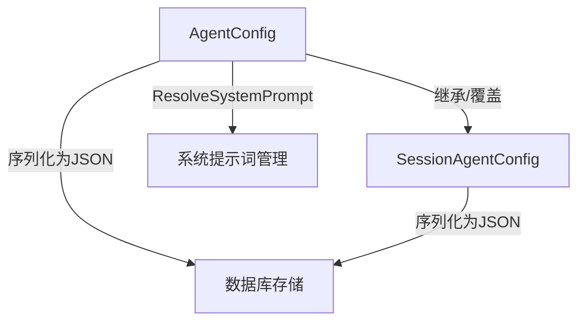

# Agent Configuration Scopes 模块技术深度解析

## 1. 模块概述

`agent_configuration_scopes` 模块是一个核心的配置管理组件，负责处理代理（Agent）的执行参数和运行时行为。在系统架构中，它解决了代理配置需要在不同作用域（租户级别和会话级别）间协调和合并的关键问题，通过分层设计实现了全局默认配置与个性化会话配置的有效结合。

## 2. 解决的问题

### 问题背景
在构建一个多租户、多会话的代理系统时，我们面临以下挑战：
- **配置继承性**：租户级别的默认配置需要被会话级别的配置覆盖或继承
- **向后兼容性**：系统演进过程中需要维护旧版本配置的兼容性
- **配置复杂性**：代理运行时涉及大量参数（迭代次数、温度、工具权限等）需要集中管理

### 设计思路
该模块采用了"分层配置+合并策略"的设计模式，将配置分为 `AgentConfig`（完整配置，用于租户级别和运行时）和 `SessionAgentConfig`（会话级别配置）两个主要结构，实现了配置的灵活管理。

## 3. 核心架构与组件

### 核心组件关系图



### 组件详细说明

#### 3.1 AgentConfig 结构体
`AgentConfig` 是代理配置的完整表示，包含所有代理执行所需的参数：

**主要字段：**
- `MaxIterations`：ReAct 循环的最大迭代次数
- `ReflectionEnabled`：是否启用反思功能
- `AllowedTools`：允许使用的工具名称列表
- `Temperature`：LLM 的温度参数
- `KnowledgeBases`/`KnowledgeIDs`：可访问的知识库和知识项
- `SystemPrompt`：统一的系统提示词（使用 `web_search_status` 占位符实现动态行为）
- `WebSearchEnabled`/`WebSearchMaxResults`：网络搜索相关配置
- `MCPSelectionMode`/`MCPServices`：MCP 服务选择配置
- `SkillsEnabled`/`SkillDirs`/`AllowedSkills`：技能配置（渐进式披露模式）

**特殊设计：**
- 包含旧版字段 `SystemPromptWebEnabled` 和 `SystemPromptWebDisabled`，标记为已弃用但保留用于向后兼容
- `SearchTargets` 字段标记为 `json:"-"`，仅在运行时使用，不进行序列化
- `Thinking` 字段使用指针类型，允许三态（启用、禁用、未设置）

#### 3.2 SessionAgentConfig 结构体
`SessionAgentConfig` 是会话级别的代理配置，只存储会话特有的配置项：

**主要字段：**
- `AgentModeEnabled`：会话是否启用代理模式
- `WebSearchEnabled`：会话是否启用网络搜索
- `KnowledgeBases`/`KnowledgeIDs`：会话可访问的知识库和知识项

**设计意图：**
- 只存储会话级别特有的配置，其他配置在运行时从租户级别读取
- 实现了配置的"关注点分离"，避免重复存储

#### 3.3 关键方法

##### ResolveSystemPrompt
```go
func (c *AgentConfig) ResolveSystemPrompt(webSearchEnabled bool) string
```
**功能**：根据网络搜索状态返回适当的提示词模板
**设计意图**：
- 优先使用新的统一 `SystemPrompt` 字段
- 提供向后兼容的降级机制，使用已弃用的字段
- 实现了提示词管理的平滑迁移

##### 数据库序列化方法
两个结构体都实现了 `driver.Valuer` 和 `sql.Scanner` 接口，支持与数据库的无缝交互：
- `Value()`：将配置序列化为 JSON 存储到数据库
- `Scan()`：从数据库读取 JSON 并反序列化为配置对象

## 4. 设计决策与权衡

### 4.1 分层配置设计
**决策**：将配置分为租户级完整配置和会话级部分配置
**权衡**：
- ✅ 优点：避免了配置重复，确保全局默认值的一致性
- ⚠️ 缺点：需要在运行时进行配置合并，增加了逻辑复杂度

### 4.2 向后兼容性策略
**决策**：保留已弃用字段并提供迁移路径
**权衡**：
- ✅ 优点：确保系统升级时的平滑过渡，不破坏现有配置
- ⚠️ 缺点：代码中存在冗余，需要额外的维护成本

### 4.3 JSON 序列化与数据库存储
**决策**：将配置对象序列化为 JSON 存储在数据库中
**权衡**：
- ✅ 优点：灵活性高，配置结构变化时不需要数据库 schema 迁移
- ⚠️ 缺点：无法利用数据库的类型检查和索引功能，查询性能可能受影响

### 4.4 渐进式披露模式（Skills 配置）
**决策**：采用渐进式披露模式管理技能
**设计意图**：
- 默认禁用技能，降低系统复杂度
- 允许按目录和名称白名单控制技能访问
- 为功能扩展提供了安全的演进路径

## 5. 数据流与使用场景

### 典型配置合并流程
1. 系统从租户配置中读取完整的 `AgentConfig`
2. 从会话配置中读取 `SessionAgentConfig`
3. 在运行时将会话配置合并到租户配置中，会话配置优先
4. 使用合并后的配置初始化代理执行环境

### 系统提示词解析流程
1. 检查是否设置了统一的 `SystemPrompt`
2. 如果没有，根据 `webSearchEnabled` 状态检查相应的已弃用字段
3. 返回最终确定的系统提示词

## 6. 扩展点与使用建议

### 扩展点
1. **配置合并策略**：可以实现自定义的配置合并逻辑，处理更复杂的配置继承场景
2. **系统提示词管理**：可以扩展 `ResolveSystemPrompt` 方法，支持更多动态占位符
3. **配置验证**：可以添加配置验证逻辑，确保配置值的合理性

### 使用建议
1. 对于新代码，**始终使用 `SystemPrompt` 字段**，避免使用已弃用的字段
2. 在修改配置结构时，**确保数据库序列化逻辑的兼容性**
3. 考虑添加配置版本管理，以便更好地处理配置结构的演进

## 7. 注意事项与潜在问题

1. **指针类型字段**：`Thinking` 字段使用指针类型，处理时需注意空指针检查
2. **运行时字段**：`SearchTargets` 字段不会被序列化，需要在运行时重新计算
3. **配置合并**：会话配置和租户配置的合并逻辑在系统其他部分实现，使用时需确保理解合并策略
4. **向后兼容性**：虽然保留了已弃用字段，但建议尽快迁移到新的配置结构

## 8. 与其他模块的关系

- 依赖于：`database/sql/driver`（数据库交互）、`encoding/json`（序列化）
- 被使用于：代理执行引擎、会话管理、租户配置管理等模块
- 相关模块：[agent_runtime_state_and_step_models](core-domain-types-and-interfaces-agent-conversation-and-runtime-contracts-agent-runtime-and-tool-call-contracts-agent-runtime-state-and-configuration-contracts-agent-runtime-state-and-step-models.md)

## 总结

`agent_configuration_scopes` 模块通过精心设计的分层配置结构，解决了多租户多会话系统中代理配置管理的复杂性问题。它在灵活性和一致性之间取得了良好的平衡，同时为系统演进提供了向后兼容的路径。理解这个模块的设计思路和实现细节，对于有效管理代理行为和扩展系统功能至关重要。
