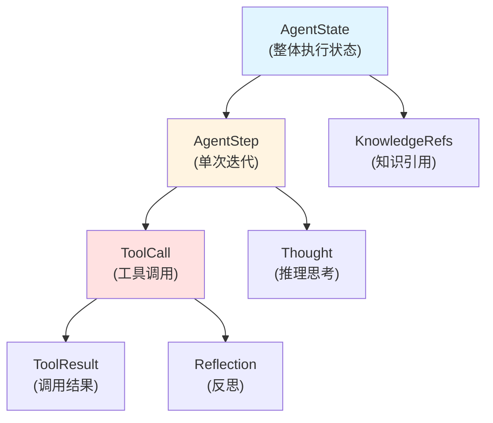

# Agent Runtime State and Step Models 技术深度解析

## 1. 模块概述与问题解决

### 1.1 问题背景

在构建智能代理系统时，我们面临一个核心挑战：如何在复杂的多轮交互中清晰、可追溯地管理代理的执行状态。想象一下，一个代理需要通过多个步骤的推理和工具调用来解决用户问题，就像一个侦探在破案过程中需要记录每一个线索、思考和行动一样。如果没有结构化的状态管理，我们将无法：

- 重现代理的决策过程
- 调试推理中的错误
- 实现会话的持久化和恢复
- 提供用户友好的执行透明度

### 1.2 解决方案

`agent_runtime_state_and_step_models` 模块提供了一套核心数据模型，用于结构化地表示代理的执行状态、推理步骤和工具调用。这套模型是整个代理系统的"记忆中心"，它将代理的执行过程分解为可观察、可序列化的组件，使得状态管理变得清晰且可维护。

## 2. 核心架构与心智模型

### 2.1 心智模型

你可以将这个模块的设计想象成**"侦探笔记本"**：

- **AgentState** 是整个笔记本，记录了从开始到现在的完整调查过程
- **AgentStep** 是笔记本中的每一页，记录了一个特定的推理和行动阶段
- **ToolCall** 是页面上记录的具体行动，比如询问证人、查阅档案等
- **ToolResult** 是行动的结果，比如证人的证词、档案中的信息

这个类比很好地体现了设计的核心思想：**将复杂的推理过程分解为可记录、可追溯的离散步骤**。

### 2.2 组件关系图



## 3. 核心组件深度解析

### 3.1 AgentState - 整体执行状态

**设计意图**：`AgentState` 是代理执行的"总控台"，它追踪整个推理过程的高级状态，就像游戏中的存档点一样。

```go
type AgentState struct {
    CurrentRound  int             // 当前轮次编号
    RoundSteps    []AgentStep     // 当前轮次中所有执行的步骤
    IsComplete    bool            // 代理是否已完成任务
    FinalAnswer   string          // 最终答案
    KnowledgeRefs []*SearchResult // 收集的知识引用
}
```

**关键设计决策**：
- **轮次概念**：通过 `CurrentRound` 和 `RoundSteps` 支持多轮对话，每轮可以包含多个步骤
- **完成标记**：`IsComplete` 和 `FinalAnswer` 提供清晰的任务完成状态
- **知识收集**：`KnowledgeRefs` 独立收集整个过程中引用的知识，便于后续的溯源和展示

**使用场景**：
- 会话持久化：将完整的执行状态保存到数据库
- 状态恢复：从保存的状态继续执行
- 结果展示：向用户展示完整的推理过程和引用来源

### 3.2 AgentStep - 单次迭代

**设计意图**：`AgentStep` 实现了 ReAct（Reasoning + Acting）模式的核心抽象，将"思考"和"行动"封装在一个迭代单元中。

```go
type AgentStep struct {
    Iteration int        // 迭代编号（0索引）
    Thought   string     // LLM的推理/思考（思考阶段）
    ToolCalls []ToolCall // 本步骤中调用的工具（行动阶段）
    Timestamp time.Time  // 步骤发生的时间
}
```

**设计亮点**：
- **分离关注点**：将 `Thought`（推理）和 `ToolCalls`（行动）明确分离，符合 ReAct 模式
- **时间戳记录**：`Timestamp` 允许精确追踪执行时序，便于调试和性能分析
- **多工具支持**：`ToolCalls` 是一个切片，支持在单个思考步骤中调用多个工具

**向后兼容性**：
```go
func (s *AgentStep) GetObservations() []string {
    // 提供向后兼容的观察结果获取方法
    // 从所有工具调用中提取输出和反思
}
```
这个方法展示了良好的 API 设计实践：在重构内部实现的同时，保持对外接口的稳定性。

### 3.3 ToolCall - 工具调用

**设计意图**：`ToolCall` 封装了一次完整的工具调用生命周期，从请求参数到执行结果，再到后续反思。

```go
type ToolCall struct {
    ID         string                 // LLM生成的函数调用ID
    Name       string                 // 工具名称
    Args       map[string]interface{} // 工具参数
    Result     *ToolResult            // 执行结果
    Reflection string                 // 代理对结果的反思（如启用）
    Duration   int64                  // 执行时间（毫秒）
}
```

**设计洞察**：
- **完整闭环**：从 `Args` 到 `Result` 再到 `Reflection`，形成了完整的调用-反馈-反思闭环
- **性能追踪**：`Duration` 字段允许监控工具执行性能，识别瓶颈
- **可追溯性**：`ID` 字段与 LLM 的函数调用 ID 对应，便于调试和审计

### 3.4 ToolResult - 工具执行结果

**设计意图**：`ToolResult` 提供了标准化的工具执行结果格式，同时支持人类可读输出和结构化数据。

```go
type ToolResult struct {
    Success bool                   // 执行是否成功
    Output  string                 // 人类可读输出
    Data    map[string]interface{} // 结构化数据（供程序使用）
    Error   string                 // 错误信息（如执行失败）
}
```

**设计权衡**：
- **双重输出**：同时提供 `Output`（人类友好）和 `Data`（机器友好），平衡了可理解性和可编程性
- **错误处理**：通过 `Success` 布尔值和 `Error` 字符串提供清晰的错误状态，而不是依赖异常

### 3.5 AgentConfig - 代理配置

**设计意图**：`AgentConfig` 集中管理代理的所有配置参数，支持租户级和运行时配置。

```go
type AgentConfig struct {
    MaxIterations     int      // 最大ReAct迭代次数
    ReflectionEnabled bool     // 是否启用反思
    AllowedTools      []string // 允许的工具列表
    Temperature       float64  // LLM温度参数
    // ... 更多配置字段
}
```

**设计亮点**：
- **渐进式披露**：通过 `SkillsEnabled`、`SkillDirs`、`AllowedSkills` 实现技能的渐进式披露模式
- **向后兼容性**：保留 `SystemPromptWebEnabled` 和 `SystemPromptWebDisabled` 字段，并标记为弃用，同时提供统一的 `SystemPrompt` 字段
- **数据库友好**：实现了 `driver.Valuer` 和 `sql.Scanner` 接口，支持直接序列化到数据库

**兼容性处理**：
```go
func (c *AgentConfig) ResolveSystemPrompt(webSearchEnabled bool) string {
    // 优先使用新的统一 SystemPrompt 字段
    // 降级到弃用字段以保持向后兼容
}
```

## 4. 数据流与交互

### 4.1 典型执行流程

让我们追踪一个典型的代理执行流程，看看这些组件如何协作：

1. **初始化**：创建 `AgentState`，`CurrentRound` 设为 0，`IsComplete` 设为 false
2. **推理循环**：
   - 创建新的 `AgentStep`，记录当前 `Iteration` 和 `Timestamp`
   - LLM 生成 `Thought`，填充到 `AgentStep.Thought`
   - LLM 决定调用工具，创建 `ToolCall` 对象
   - 执行工具，记录 `Duration`，填充 `ToolResult`
   - 如启用反思，生成 `Reflection` 并记录
   - 将 `ToolCall` 添加到 `AgentStep.ToolCalls`
   - 将 `AgentStep` 添加到 `AgentState.RoundSteps`
3. **完成检查**：
   - 如任务完成，设置 `AgentState.IsComplete = true` 和 `AgentState.FinalAnswer`
   - 收集所有知识引用到 `AgentState.KnowledgeRefs`

### 4.2 依赖关系

这个模块处于系统的**核心类型层**，它被多个上层模块依赖：

- **依赖此模块的模块**：
  - [agent_engine_orchestration](agent-runtime-and-tools-agent-core-orchestration-and-tooling-foundation-agent-engine-orchestration.md)：使用这些类型来管理执行流程
  - [agent_stream_event_contracts](core-domain-types-and-interfaces-agent-conversation-and-runtime-contracts-agent-runtime-and-tool-call-contracts-agent-orchestration-service-and-task-interfaces-agent-stream-event-contracts.md)：在事件中传递状态和步骤信息
  - [session_conversation_record_persistence](data-access-repositories-content-and-knowledge-management-repositories-conversation-history-repositories-session-conversation-record-persistence.md)：持久化会话状态

- **此模块依赖的模块**：
  - 基础 Go 标准库（context、encoding/json、time、database/sql/driver）
  - 内部类型定义（SearchResult）

## 5. 设计决策与权衡

### 5.1 结构化 vs 灵活性

**决策**：采用强类型的结构化数据模型，而不是灵活的 map[string]interface{}

**理由**：
- **类型安全**：编译时捕获错误，减少运行时异常
- **自文档化**：结构体字段本身就是文档
- **工具支持**：更好的 IDE 自动补全和重构支持

**权衡**：
- 牺牲了一些灵活性，添加新字段需要修改代码
- 但通过 `map[string]interface{}` 类型的 `Data` 和 `Args` 字段保留了必要的灵活性

### 5.2 可变 vs 不可变状态

**决策**：设计为可变状态模型，字段可以直接修改

**理由**：
- **执行效率**：避免频繁创建新对象，减少垃圾回收压力
- **易用性**：直接修改状态比创建新副本更直观
- **实时更新**：支持在执行过程中逐步填充信息

**权衡**：
- 可能导致并发安全问题（需要外部同步）
- 调试时状态变化可能难以追踪

### 5.3 完整历史 vs 仅当前状态

**决策**：保存完整的执行历史（所有步骤和工具调用）

**理由**：
- **可追溯性**：完整的历史对于调试和审计至关重要
- **用户体验**：可以向用户展示完整的推理过程，建立信任
- **重试和恢复**：可以从任意点重新开始执行

**权衡**：
- 内存占用更大，对于长时间运行的代理可能需要考虑内存管理
- 序列化和持久化开销更大

### 5.4 数据库序列化方式

**决策**：实现 `driver.Valuer` 和 `sql.Scanner` 接口，使用 JSON 序列化

**理由**：
- **简化存储**：不需要为每个字段创建数据库列
- **模式灵活性**：可以轻松添加新字段而不改变数据库 schema
- **查询友好**：JSON 字段在现代数据库中可以进行索引和查询

**权衡**：
- 失去了一些数据库级别的类型安全
- 查询 JSON 字段的性能可能不如传统列
- 需要处理 JSON 序列化/反序列化的错误

## 6. 使用指南与最佳实践

### 6.1 基本使用模式

```go
// 初始化代理状态
state := &agent.AgentState{
    CurrentRound: 0,
    IsComplete:   false,
    RoundSteps:   make([]agent.AgentStep, 0),
}

// 创建一个新的执行步骤
step := agent.AgentStep{
    Iteration: 0,
    Thought:   "我需要先搜索相关信息来回答这个问题",
    Timestamp: time.Now(),
    ToolCalls: make([]agent.ToolCall, 0),
}

// 添加工具调用
toolCall := agent.ToolCall{
    ID:   "call_123",
    Name: "web_search",
    Args: map[string]interface{}{
        "query": "如何学习Go语言",
    },
}

// 执行工具并记录结果
result, err := executeTool(toolCall)
if err != nil {
    toolCall.Result = &agent.ToolResult{
        Success: false,
        Error:   err.Error(),
    }
} else {
    toolCall.Result = result
    toolCall.Duration = calculateDuration()
}

// 组装完整状态
step.ToolCalls = append(step.ToolCalls, toolCall)
state.RoundSteps = append(state.RoundSteps, step)

// 任务完成
state.IsComplete = true
state.FinalAnswer = "根据搜索结果，学习Go语言的最佳方法是..."
```

### 6.2 配置使用示例

```go
// 创建代理配置
config := &agent.AgentConfig{
    MaxIterations:     10,
    ReflectionEnabled: true,
    AllowedTools:      []string{"web_search", "knowledge_search"},
    Temperature:       0.7,
    SystemPrompt:      "你是一个有帮助的助手...",
    WebSearchEnabled:  true,
    SkillsEnabled:     true,
}

// 解析系统提示词（处理向后兼容性）
prompt := config.ResolveSystemPrompt(config.WebSearchEnabled)

// 数据库存储示例（自动处理JSON序列化）
_, err := db.Exec("INSERT INTO agent_configs (config) VALUES (?)", config)
```

### 6.3 最佳实践

1. **并发安全**：如果在多 goroutine 环境中使用，确保对 `AgentState` 的访问有适当的同步机制
2. **内存管理**：对于长时间运行的代理，考虑实现步骤截断或归档机制，避免内存无限增长
3. **错误处理**：始终检查 `ToolResult.Success`，不要假设工具调用总是成功
4. **时间戳使用**：利用 `AgentStep.Timestamp` 和 `ToolCall.Duration` 进行性能分析和用户体验优化
5. **向后兼容**：当扩展这些类型时，遵循现有的兼容性模式，如 `ResolveSystemPrompt` 方法所示

## 7. 注意事项与陷阱

### 7.1 常见陷阱

1. **空指针解引用**：
   - 始终检查 `ToolCall.Result` 是否为 nil before accessing its fields
   - 注意 `AgentState` 指针本身可能为 nil

2. **JSON 序列化问题**：
   - 复杂的 `map[string]interface{}` 结构可能包含无法序列化的类型（如函数、通道）
   - 循环引用会导致序列化失败

3. **数据库扫描问题**：
   - `Scan` 方法在类型不匹配时静默返回 nil，而不是错误，这可能导致调试困难
   - 始终验证扫描后的数据完整性

4. **并发修改**：
   - 多个 goroutine 同时修改 `AgentState` 或 `AgentStep` 可能导致数据竞争
   - 考虑使用互斥锁或不可变模式

### 7.2 边缘情况

1. **空步骤**：
   - 一个 `AgentStep` 可能没有任何 `ToolCalls`（纯推理步骤）
   - 代码应该优雅处理这种情况

2. **部分完成的工具调用**：
   - 工具调用可能在执行过程中被中断，导致 `Result` 为 nil 或部分填充
   - 考虑添加状态字段来明确表示调用进度

3. **大量知识引用**：
   - `KnowledgeRefs` 可能变得非常大，影响内存使用和序列化性能
   - 考虑实现分页或懒加载机制

## 8. 总结

`agent_runtime_state_and_step_models` 模块是代理系统的核心基础设施，它提供了一套精心设计的数据模型，用于表示和管理代理的执行状态。这个模块的设计体现了几个关键原则：

1. **清晰的抽象**：通过 `AgentState`、`AgentStep`、`ToolCall` 等类型，将复杂的推理过程分解为可理解的组件
2. **实用性优先**：在类型安全和灵活性之间取得平衡，保留足够的适应性
3. **向后兼容**：通过谨慎的 API 设计和兼容性层，平滑处理演进
4. **可观测性**：完整记录执行过程，便于调试、审计和用户展示

理解这个模块的设计思想和使用模式，是有效构建和扩展代理系统的基础。无论是实现新的工具、添加执行策略，还是构建用户界面，这些核心类型都将是你的主要交互点。
