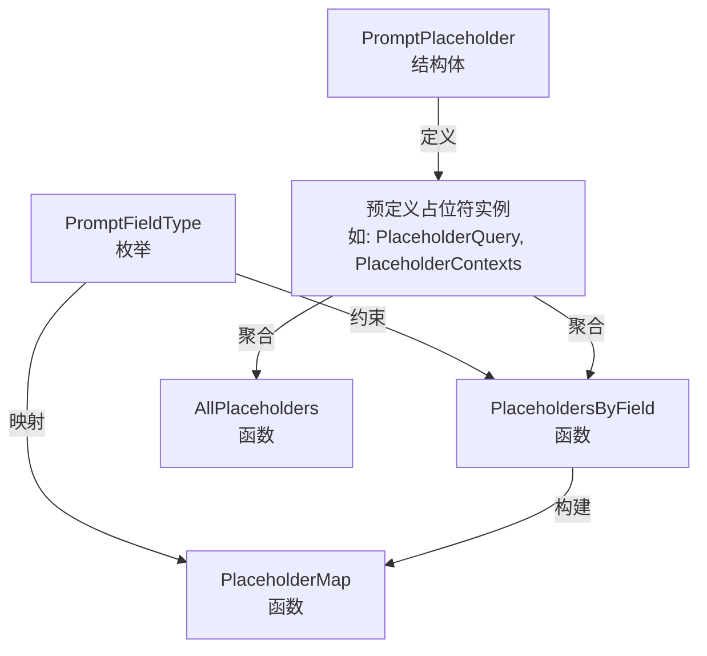

# prompt_placeholder_contracts 模块技术深度解析

## 1. 模块概述

在构建灵活的 AI 对话系统时，一个核心挑战是如何让提示词（prompt）模板既具有强大的表达能力，又能在不同的使用场景中保持一致性和可验证性。`prompt_placeholder_contracts` 模块正是为了解决这个问题而设计的。它为系统中所有可用于提示词模板的占位符提供了一个统一的契约定义和元数据注册表。

想象一下，如果没有这样一个模块，每个使用提示词模板的组件可能会各自定义自己的占位符，导致混乱的命名、不一致的描述，以及难以追踪的依赖关系。这个模块就像是一本"占位符字典"，不仅定义了所有可用的占位符，还明确了它们在不同提示词上下文中的可用性规则。

## 2. 核心概念与心智模型

### 2.1 核心抽象

这个模块的设计围绕两个核心概念展开：

1. **`PromptPlaceholder`**：占位符的元数据定义，包含名称、标签和描述，使占位符不仅是一个字符串标记，更是一个具有语义信息的实体。

2. **`PromptFieldType`**：提示词字段类型枚举，定义了系统中不同类型的提示词模板（如系统提示词、重写提示词等），并通过 `PlaceholdersByField` 函数建立了类型与可用占位符之间的映射关系。

### 2.2 心智模型

可以将这个模块想象成一个**占位符契约注册表**：
- 它是系统中所有提示词占位符的"单一事实来源"（SSOT）
- 它为每种提示词字段类型维护了一个"允许使用的占位符列表"，就像不同的表单有不同的可填写字段一样
- 它提供了元数据（标签、描述），使占位符具有自描述性，便于 UI 展示和开发者理解

## 3. 架构与数据流程

### 3.1 组件架构



### 3.2 数据流程

当系统需要使用占位符时，典型的数据流程如下：

1. **查询可用占位符**：调用方（如提示词模板编辑器、验证器）根据当前的 `PromptFieldType` 调用 `PlaceholdersByField()` 获取该上下文中允许使用的占位符列表。

2. **占位符验证**：调用方可以使用返回的 `PromptPlaceholder` 列表来验证模板中使用的占位符是否合法。

3. **元数据展示**：如果需要在 UI 中展示占位符信息（如下拉选择、帮助文档），可以使用 `Label` 和 `Description` 字段提供用户友好的展示。

4. **全局注册查询**：对于需要了解所有占位符的场景（如文档生成、全局搜索），可以使用 `AllPlaceholders()` 或 `PlaceholderMap()` 获取完整的注册表。

## 4. 核心组件深度解析

### 4.1 PromptPlaceholder 结构体

```go
type PromptPlaceholder struct {
    Name        string `json:"name"`
    Label       string `json:"label"`
    Description string `json:"description"`
}
```

**设计意图**：
- `Name`：占位符的标识符（不带大括号），用于在模板中实际引用，如 `{query}` 的名称是 `"query"`
- `Label`：面向用户的短标签，支持本地化（当前为中文），用于 UI 展示
- `Description`：详细的语义说明，解释这个占位符代表什么以及如何使用

**为什么这样设计**：
这种三元组结构（标识符+显示名+描述）是常见的元数据模式，它将机器使用的标识（Name）与人类使用的信息（Label、Description）分离，既保证了代码中的引用稳定性，又提供了良好的可理解性和可本地化能力。

### 4.2 PromptFieldType 枚举

```go
type PromptFieldType string

const (
    PromptFieldSystemPrompt        PromptFieldType = "system_prompt"
    PromptFieldAgentSystemPrompt   PromptFieldType = "agent_system_prompt"
    PromptFieldContextTemplate     PromptFieldType = "context_template"
    PromptFieldRewriteSystemPrompt PromptFieldType = "rewrite_system_prompt"
    PromptFieldRewritePrompt       PromptFieldType = "rewrite_prompt"
    PromptFieldFallbackPrompt      PromptFieldType = "fallback_prompt"
)
```

**设计意图**：
这个枚举定义了系统中所有不同类型的提示词字段，每种类型代表一个特定的使用场景，并有其专属的占位符集合。

**为什么这样设计**：
通过将提示词字段类型化，系统可以为不同的场景提供精确的占位符支持，避免在不相关的上下文中出现不合适的占位符（例如，在普通系统提示词中显示代理模式专用的知识库列表占位符）。这是一种**上下文感知的约束设计**。

### 4.3 预定义占位符实例

模块预定义了 9 个占位符实例，分为三类：

**通用占位符**（适用于多种场景）：
- `PlaceholderQuery`：用户当前问题
- `PlaceholderContexts`：检索到的相关内容
- `PlaceholderCurrentTime`：当前系统时间
- `PlaceholderCurrentWeek`：当前星期几

**重写提示词专用占位符**：
- `PlaceholderConversation`：历史对话内容
- `PlaceholderYesterday`：昨天的日期
- `PlaceholderAnswer`：助手的回答

**代理模式专用占位符**：
- `PlaceholderKnowledgeBases`：格式化的知识库列表
- `PlaceholderWebSearchStatus`：网络搜索工具状态

**设计意图**：
这些预定义实例是系统中"标准"占位符的权威定义，确保了整个系统中占位符使用的一致性。

### 4.4 PlaceholdersByField 函数

```go
func PlaceholdersByField(fieldType PromptFieldType) []PromptPlaceholder
```

**设计意图**：
这是模块的核心查询函数，它根据提示词字段类型返回该上下文中可用的占位符列表。

**内部机制**：
使用 `switch` 语句实现了从字段类型到占位符列表的映射，每个 `case` 分支明确列出了该场景下允许使用的占位符。

**为什么这样设计**：
使用显式的 `switch` 语句而不是动态映射，虽然看起来不够"灵活"，但具有几个关键优势：
1. **编译时安全性**：所有分支都是静态定义的，不会出现运行时错误
2. **清晰的意图表达**：一眼就能看出每种字段类型支持哪些占位符
3. **易于维护**：添加新的字段类型或修改现有类型的占位符列表非常直接

### 4.5 AllPlaceholders 和 PlaceholderMap 函数

```go
func AllPlaceholders() []PromptPlaceholder
func PlaceholderMap() map[PromptFieldType][]PromptPlaceholder
```

**设计意图**：
这两个函数提供了完整注册表的不同视图：
- `AllPlaceholders()` 返回一个扁平的所有占位符列表，适用于需要全局遍历的场景
- `PlaceholderMap()` 返回一个按字段类型分组的完整映射，适用于需要一次性获取所有分组的场景

## 5. 依赖分析

### 5.1 被依赖关系

这个模块是一个**底层契约模块**，它不依赖于系统中的其他模块（除了标准库），但会被以下类型的组件依赖：

1. **提示词模板引擎**：用于验证模板中使用的占位符是否合法
2. **提示词配置 UI**：用于展示可用占位符的下拉选择和帮助信息
3. **提示词组装服务**：用于知道哪些值需要注入到模板中
4. **配置验证器**：用于在启动或保存时验证提示词配置的正确性

### 5.2 数据契约

模块对外提供的数据契约非常简洁：
- 输入：`PromptFieldType` 枚举值
- 输出：`[]PromptPlaceholder` 或完整映射

这种设计确保了模块的**低耦合性**，它只提供元数据，不涉及实际的模板渲染或值注入逻辑。

## 6. 设计决策与权衡

### 6.1 静态定义 vs 动态注册

**决策**：使用静态预定义占位符和静态映射函数

**权衡分析**：
- ✅ **优点**：编译时安全、性能最优、代码自文档化、行为可预测
- ❌ **缺点**：添加新占位符需要修改代码并重新编译，不够"动态"

**为什么这样选择**：
在这个场景下，静态定义是更合适的选择，因为：
1. 占位符是系统的核心契约，不应该频繁变化
2. 静态定义确保了所有组件使用相同的"占位符语言"，避免了不一致
3. 性能和可预测性在这里比灵活性更重要

### 6.2 元数据包含本地化标签

**决策**：在 `PromptPlaceholder` 中包含中文标签

**权衡分析**：
- ✅ **优点**：UI 可以直接使用这些标签，无需额外的映射层
- ❌ **缺点**：将本地化信息硬编码在核心契约中，如果需要支持多种语言，这种设计会变得复杂

**为什么这样选择**：
这可能是一个基于当前需求的务实选择。如果未来需要多语言支持，可以考虑重构为：
1. 将 `Label` 改为本地化键
2. 提供一个独立的本地化模块来解析这些键

### 6.3 按字段类型分组的可用性设计

**决策**：不同的提示词字段类型有不同的可用占位符集合

**权衡分析**：
- ✅ **优点**：提供了上下文感知的约束，避免了不合适的占位符使用
- ❌ **缺点**：增加了模块的复杂度，需要维护额外的映射关系

**为什么这样选择**：
这种设计体现了**契约驱动开发**的思想，通过明确每个场景下允许使用的占位符，减少了误用的可能性，提高了系统的健壮性。

## 7. 使用指南与示例

### 7.1 基本用法

**查询特定字段类型的可用占位符**：
```go
// 获取系统提示词可用的占位符
systemPlaceholders := types.PlaceholdersByField(types.PromptFieldSystemPrompt)

for _, p := range systemPlaceholders {
    fmt.Printf("占位符: {%s}\n", p.Name)
    fmt.Printf("标签: %s\n", p.Label)
    fmt.Printf("描述: %s\n\n", p.Description)
}
```

**验证占位符是否在特定上下文中可用**：
```go
func IsPlaceholderAllowed(fieldType types.PromptFieldType, placeholderName string) bool {
    placeholders := types.PlaceholdersByField(fieldType)
    for _, p := range placeholders {
        if p.Name == placeholderName {
            return true
        }
    }
    return false
}

// 使用示例
allowed := IsPlaceholderAllowed(types.PromptFieldSystemPrompt, "query") // 返回 true
allowed = IsPlaceholderAllowed(types.PromptFieldSystemPrompt, "knowledge_bases") // 返回 false
```

**获取所有占位符用于文档生成**：
```go
// 获取完整的占位符映射
placeholderMap := types.PlaceholderMap()

for fieldType, placeholders := range placeholderMap {
    fmt.Printf("=== %s ===\n", fieldType)
    for _, p := range placeholders {
        fmt.Printf("  - {%s}: %s\n", p.Name, p.Description)
    }
}
```

### 7.2 常见模式

**模式 1：提示词模板验证器**
```go
type TemplateValidator struct {
    // 可以缓存占位符映射以提高性能
    placeholderMap map[types.PromptFieldType]map[string]bool
}

func NewTemplateValidator() *TemplateValidator {
    pm := types.PlaceholderMap()
    cached := make(map[types.PromptFieldType]map[string]bool)
    
    for ft, placeholders := range pm {
        nameSet := make(map[string]bool)
        for _, p := range placeholders {
            nameSet[p.Name] = true
        }
        cached[ft] = nameSet
    }
    
    return &TemplateValidator{placeholderMap: cached}
}

func (v *TemplateValidator) ValidateTemplate(fieldType types.PromptFieldType, template string) error {
    // 简单的正则表达式提取占位符
    re := regexp.MustCompile(`\{(\w+)\}`)
    matches := re.FindAllStringSubmatch(template, -1)
    
    allowedSet := v.placeholderMap[fieldType]
    
    for _, match := range matches {
        placeholderName := match[1]
        if !allowedSet[placeholderName] {
            return fmt.Errorf("占位符 {%s} 在 %s 上下文中不可用", placeholderName, fieldType)
        }
    }
    
    return nil
}
```

## 8. 注意事项与常见陷阱

### 8.1 名称约定

- 占位符名称应该使用小写字母和下划线，遵循 snake_case 命名规范
- 不要在 `Name` 字段中包含大括号，大括号是模板语法的一部分，不是占位符名称的一部分

### 8.2 扩展注意事项

如果需要添加新的占位符，需要：
1. 在预定义变量区域添加新的 `PromptPlaceholder` 实例
2. 在 `AllPlaceholders()` 函数中添加该实例
3. 在适当的 `PlaceholdersByField()` 分支中添加该实例
4. 如果需要，更新 `PlaceholderMap()` 函数（虽然当前实现是委托给 `PlaceholdersByField()` 的）

**遗漏任何一步都可能导致新占位符在某些场景下不可用！**

### 8.3 性能考虑

- `PlaceholdersByField()` 函数每次调用都会创建新的切片，但由于数据量很小（最多几个占位符），这不是性能问题
- 如果在高频调用的路径中使用，考虑缓存结果，如上面的示例所示

### 8.4 零值处理

- `PlaceholdersByField()` 对于未知的 `PromptFieldType` 会返回空切片，而不是 nil，这是安全的设计
- 调用方应该优雅地处理空切片的情况，而不是假设总会有返回值

## 9. 总结

`prompt_placeholder_contracts` 模块是一个看似简单但设计精良的契约定义模块。它通过提供统一的占位符元数据注册表，解决了提示词模板系统中的一致性和可验证性问题。

模块的核心价值在于：
1. **作为单一事实来源**，确保整个系统中占位符使用的一致性
2. **提供上下文感知的约束**，通过 `PlaceholdersByField()` 函数明确每种场景下的可用占位符
3. **包含自描述元数据**，使占位符不仅是机器可用的标识符，也是人类可理解的实体

这种设计体现了"契约优于约定"的软件工程原则，为构建灵活、可维护的提示词模板系统奠定了坚实的基础。
