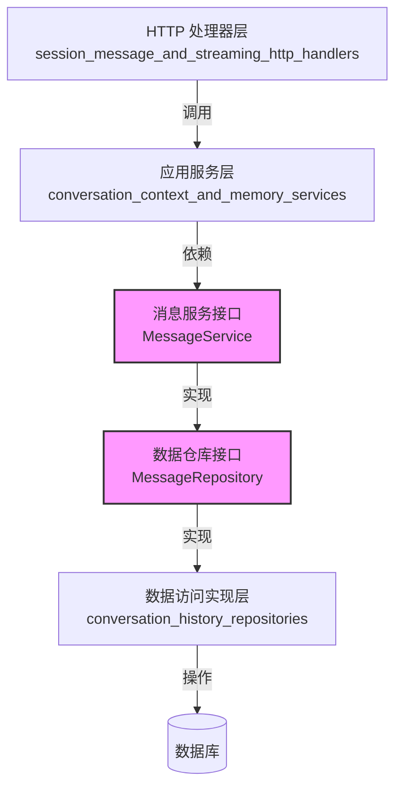

# message_service_and_repository_contracts 模块技术深度解析

## 1. 问题空间与模块定位

在多用户、多会话的智能对话系统中，消息历史管理是一个核心但容易被低估的挑战。想象一下：每个用户可能同时打开多个对话会话（Session），每个会话包含数十条甚至上百条消息，这些消息需要被持久化存储、快速检索、按时间排序、分页访问，同时还要支持更新和删除操作。

如果没有清晰的抽象，我们可能会在业务逻辑中直接嵌入数据库查询代码，导致：
- 业务逻辑与数据访问层紧密耦合
- 消息查询逻辑分散在各处，难以统一优化
- 更换数据存储方案时需要大量修改业务代码
- 难以进行单元测试（需要依赖真实数据库）

**本模块的核心价值**在于：定义了消息管理领域的标准接口契约，将"消息服务应该提供什么能力"与"这些能力如何实现"彻底解耦。它就像一份合同，规定了消息管理的所有必要操作，让上层业务逻辑可以依赖稳定的接口，而下层数据存储可以自由选择实现方式。

## 2. 核心抽象与心理模型

本模块定义了两个关键接口，形成了清晰的分层抽象：

### 2.1 MessageService：业务服务契约
`MessageService` 是面向业务逻辑的接口，它定义了对话系统正常运行所需的消息操作能力。可以将其想象为**"消息管理员"**，负责处理日常的消息创建、读取、更新和删除操作。

### 2.2 MessageRepository：数据仓库契约
`MessageRepository` 继承自 `MessageService`，并额外增加了一些数据仓库特有的操作。这是一个经典的**组合设计模式**，可以理解为：`MessageRepository` 是一个"增强版的消息管理员"，它不仅能处理日常业务操作，还能执行一些特殊的数据访问任务（比如获取用户的第一条消息）。

这种设计体现了一个重要的架构思想：**业务逻辑只依赖它真正需要的能力**。大多数业务组件只需要 `MessageService` 提供的基础功能，只有数据访问层的实现和某些特殊场景才需要 `MessageRepository` 的完整能力。

## 3. 组件深度解析

### 3.1 MessageService 接口

#### 设计意图
`MessageService` 接口定义了消息管理的核心业务操作，它的设计遵循了**CRUD 原则**（Create、Read、Update、Delete），但针对会话消息的场景进行了专门优化。

#### 核心方法解析

**1. CreateMessage(ctx context.Context, message *types.Message) (*types.Message, error)**
- **目的**：创建一条新消息
- **设计细节**：接收完整的消息对象，返回可能包含系统生成字段（如 ID、创建时间）的消息对象
- **为什么返回消息对象**：因为创建过程中系统可能会补充一些字段（如自增 ID、时间戳），调用方需要这些信息进行后续操作

**2. GetMessage(ctx context.Context, sessionID string, id string) (*types.Message, error)**
- **目的**：获取单条消息
- **设计细节**：需要同时提供 `sessionID` 和 `id`，这是一个重要的约束
- **为什么需要 sessionID**：这是一个安全设计，确保用户只能访问自己会话中的消息，防止越权访问

**3. GetMessagesBySession(ctx context.Context, sessionID string, page int, pageSize int) ([]*types.Message, error)**
- **目的**：分页获取会话的所有消息
- **设计细节**：支持分页参数，避免一次性加载过多消息导致性能问题
- **隐含契约**：返回的消息应该按时间顺序排列（通常是从旧到新）

**4. GetRecentMessagesBySession(ctx context.Context, sessionID string, limit int) ([]*types.Message, error)**
- **目的**：获取会话的最近消息
- **设计细节**：只需要限制数量，不需要分页，这是针对常见场景的优化
- **使用场景**：在用户打开会话时，快速展示最近的对话内容

**5. GetMessagesBySessionBeforeTime(ctx context.Context, sessionID string, beforeTime time.Time, limit int) ([]*types.Message, error)**
- **目的**：获取会话中特定时间之前的消息
- **设计细节**：结合了时间过滤和数量限制
- **使用场景**：实现"历史消息回溯"功能，当用户向上滚动查看更早的消息时使用

**6. UpdateMessage(ctx context.Context, message *types.Message) error**
- **目的**：更新消息内容
- **设计细节**：接收完整的消息对象，通过对象中的 ID 标识要更新的消息
- **隐含契约**：应该同时更新消息的修改时间

**7. DeleteMessage(ctx context.Context, sessionID string, id string) error**
- **目的**：删除消息
- **设计细节**：与 `GetMessage` 类似，需要同时提供 `sessionID` 和 `id` 进行安全校验

### 3.2 MessageRepository 接口

#### 设计意图
`MessageRepository` 接口继承自 `MessageService`，代表数据仓库的完整能力。这是一个经典的**分层架构设计**：`MessageService` 是业务层接口，`MessageRepository` 是数据访问层接口。

#### 额外方法解析

**GetFirstMessageOfUser(ctx context.Context, sessionID string) (*types.Message, error)**
- **目的**：获取用户在会话中的第一条消息
- **为什么放在 Repository 而不是 Service 中**：这是一个相对特殊的查询操作，不是所有业务场景都需要，因此放在更底层的数据仓库接口中
- **使用场景**：统计分析、会话回顾功能等

## 4. 架构角色与数据流向

### 4.1 架构位置

在整个系统架构中，本模块处于**核心域类型定义层**，它是连接业务逻辑和数据访问的桥梁：



### 4.2 典型数据流向

让我们通过一个常见的场景——"用户发送消息"——来追踪数据流向：

1. **HTTP 处理器层**：[message_http_handler] 接收用户的发送消息请求
2. **应用服务层**：[message_history_service] 处理业务逻辑（如验证会话权限、补充消息元数据）
3. **服务接口层**：调用 `MessageService.CreateMessage()` 方法
4. **数据仓库实现**：[message_history_and_trace_persistence] 中的实现类执行实际的数据库插入操作
5. **数据存储**：消息被持久化到数据库中
6. **返回路径**：创建好的消息对象沿着相反方向返回给调用方

## 5. 依赖关系分析

### 5.1 依赖的模块

本模块是一个非常底层的接口定义模块，它的依赖非常简洁：

- **internal/types**：定义了 `Message` 实体类型，这是本模块操作的核心数据结构
- **context**：Go 标准库，用于传递上下文信息（如超时控制、请求链路追踪）
- **time**：Go 标准库，用于时间相关操作

### 5.2 依赖本模块的组件

根据架构设计，以下类型的组件会依赖本模块：

1. **应用服务层**：如 [message_history_service]，会依赖 `MessageService` 接口进行业务操作
2. **数据访问实现层**：如 [message_history_and_trace_persistence]，会实现 `MessageRepository` 接口
3. **测试代码**：会使用模拟（Mock）对象实现这些接口进行单元测试

## 6. 设计决策与权衡

### 6.1 接口继承 vs 组合

**决策**：`MessageRepository` 继承自 `MessageService`

**权衡分析**：
- ✅ **优点**：
  - 避免代码重复，Repository 自动获得 Service 的所有方法
  - 符合"is-a"关系：Repository 是一种特殊的 Service
  - 可以将 Repository 实例直接传递给需要 Service 的地方
- ⚠️ **考虑点**：
  - 如果未来 Service 和 Repository 的职责差异变大，继承可能会成为负担
  - 在某些语言中（如 Go），接口继承是通过组合实现的，这种设计非常自然

**为什么选择继承**：在消息管理场景中，Repository 本质上就是 Service 的完整实现，继承关系非常清晰且符合直觉。

### 6.2 sessionID 作为查询参数

**决策**：几乎所有查询方法都要求提供 `sessionID`

**权衡分析**：
- ✅ **优点**：
  - **安全性**：强制在查询时进行会话校验，防止越权访问
  - **性能**：数据库查询可以利用会话索引，提高查询效率
  - **清晰性**：接口设计明确表达了"消息属于会话"的领域概念
- ⚠️ **考虑点**：
  - 增加了调用方的参数传递负担
  - 如果未来需要跨会话查询消息，这个设计会受限

**为什么选择这个设计**：在多租户会话系统中，安全和清晰的领域模型比灵活性更重要。跨会话查询是非常罕见的场景，如果真的需要，可以在 Repository 层添加额外方法。

### 6.3 分页 vs 限制数量

**决策**：同时提供 `GetMessagesBySession`（分页）和 `GetRecentMessagesBySession`（限制数量）

**权衡分析**：
- ✅ **优点**：
  - 为不同场景提供最合适的接口
  - 分页适合完整浏览历史，限制数量适合快速展示最近消息
- ⚠️ **考虑点**：
  - 接口数量增加，理解成本略微上升
  - 实现层需要维护两套逻辑

**为什么选择这个设计**：这两种场景的使用频率都很高，提供专门的接口可以让调用代码更清晰，也便于实现层进行针对性优化（例如，`GetRecentMessagesBySession` 可以使用倒序索引快速获取最新消息）。

### 6.4 Context 作为第一个参数

**决策**：所有方法都将 `context.Context` 作为第一个参数

**设计理由**：
- 这是 Go 语言的标准实践
- 支持请求链路追踪
- 支持超时控制
- 支持传递请求级别的元数据

这是一个没有争议的设计决策，完全符合 Go 生态系统的最佳实践。

## 7. 使用指南与最佳实践

### 7.1 正确的依赖方式

**✅ 推荐做法**：业务逻辑依赖 `MessageService` 接口

```go
// 在应用服务中，只依赖 MessageService
type MessageHistoryService struct {
    messageService interfaces.MessageService
}

func NewMessageHistoryService(ms interfaces.MessageService) *MessageHistoryService {
    return &MessageHistoryService{messageService: ms}
}
```

**❌ 避免做法**：业务逻辑直接依赖 `MessageRepository`

```go
// 不推荐：业务逻辑不需要 Repository 的额外能力
type MessageHistoryService struct {
    messageRepo interfaces.MessageRepository
}
```

### 7.2 实现 Repository 接口

当实现 `MessageRepository` 接口时，需要注意以下几点：

1. **参数验证**：在执行数据库操作前，验证所有输入参数的有效性
2. **错误处理**：合理包装数据库错误，不要直接返回原始数据库错误
3. **时间处理**：确保正确处理时区问题，统一使用 UTC 时间
4. **事务管理**：如果需要原子性操作，正确使用数据库事务

### 7.3 常见使用模式

**模式 1：创建消息**

```go
message := &types.Message{
    SessionID: sessionID,
    Content:   content,
    Role:      "user",
    CreatedAt: time.Now().UTC(),
}

createdMessage, err := messageService.CreateMessage(ctx, message)
if err != nil {
    return fmt.Errorf("创建消息失败: %w", err)
}
```

**模式 2：分页获取消息**

```go
// 获取第一页，每页 20 条消息
messages, err := messageService.GetMessagesBySession(ctx, sessionID, 1, 20)
if err != nil {
    return fmt.Errorf("获取消息列表失败: %w", err)
}
```

**模式 3：实现无限滚动**

```go
// 假设 earliestTime 是当前显示的最早消息的时间
olderMessages, err := messageService.GetMessagesBySessionBeforeTime(
    ctx, 
    sessionID, 
    earliestTime, 
    20,
)
if err != nil {
    return fmt.Errorf("获取历史消息失败: %w", err)
}
```

## 8. 注意事项与潜在陷阱

### 8.1 隐含的契约

本接口定义中有一些没有在代码中明确表达但非常重要的契约：

1. **消息排序**：`GetMessagesBySession` 和 `GetRecentMessagesBySession` 返回的消息应该按创建时间排序（通常是从旧到新）
2. **ID 唯一性**：消息的 ID 在会话中应该是唯一的
3. **字段不变性**：某些字段（如 `CreatedAt`、`SessionID`）在创建后不应该被修改
4. **错误类型**：实现应该返回一致的错误类型（如 "未找到" 错误、"权限不足" 错误）

### 8.2 常见错误

**错误 1：忽略 sessionID 校验**

```go
// 错误实现：没有验证 sessionID 是否匹配
func (repo *MessageRepo) GetMessage(ctx context.Context, sessionID string, id string) (*types.Message, error) {
    // 直接根据 id 查询，忽略 sessionID
    var msg types.Message
    err := repo.db.Where("id = ?", id).First(&msg).Error
    return &msg, err
}
```

**正确实现**：

```go
func (repo *MessageRepo) GetMessage(ctx context.Context, sessionID string, id string) (*types.Message, error) {
    var msg types.Message
    err := repo.db.Where("id = ? AND session_id = ?", id, sessionID).First(&msg).Error
    if errors.Is(err, gorm.ErrRecordNotFound) {
        return nil, fmt.Errorf("消息不存在或无权访问: %w", err)
    }
    return &msg, err
}
```

**错误 2：分页参数从 0 开始**

虽然接口没有明确定义，但通常分页的页码应该从 1 开始。实现时需要注意处理这个约定。

### 8.3 性能考虑

1. **索引设计**：确保数据库表在 `session_id` 和 `created_at` 字段上有合适的索引
2. **查询优化**：`GetMessagesBySessionBeforeTime` 是一个可能频繁调用的方法，需要特别注意查询性能
3. **N+1 查询**：如果消息包含关联数据（如附件、引用），注意避免 N+1 查询问题

## 9. 扩展与演进

### 9.1 可能的扩展方向

未来可能需要添加的功能：

1. **批量操作**：批量创建、批量删除消息
2. **消息搜索**：按内容关键词搜索消息
3. **消息统计**：获取消息数量统计
4. **软删除**：支持消息的软删除和恢复
5. **消息元数据**：支持按标签、类型等元数据筛选消息

### 9.2 演进建议

如果需要扩展这些接口，建议遵循以下原则：

1. **保持向后兼容**：不要修改现有方法的签名，只添加新方法
2. **接口分离**：如果新功能属于不同的关注点，考虑定义新的接口
3. **默认实现**：在 Go 中，可以通过组合的方式为旧接口提供新方法的默认实现

## 10. 总结

`message_service_and_repository_contracts` 模块是一个简洁但重要的接口定义模块，它体现了优秀的领域驱动设计思想：

1. **清晰的抽象**：通过 `MessageService` 和 `MessageRepository` 两个接口，明确分离了业务服务和数据仓库的职责
2. **安全的设计**：强制在所有操作中包含 `sessionID`，从接口层面防止越权访问
3. **实用的方法**：提供的方法都是针对对话系统的真实场景设计的，既不过度设计也不缺失必要功能
4. **Go 风格的实践**：遵循 Go 语言的最佳实践，如使用 `context`、返回错误而不是抛出异常

这个模块虽然代码量不多，但它是整个会话系统的基石之一，理解它的设计思想对于理解整个系统的架构非常重要。

## 11. 相关模块链接

- [会话生命周期 API](sdk_client_library-agent_session_and_message_api-session_lifecycle_api.md)
- [消息历史与追踪持久化](data_access_repositories-content_and_knowledge_management_repositories-conversation_history_repositories-message_history_and_trace_persistence.md)
- [消息 HTTP 处理器](http_handlers_and_routing-session_message_and_streaming_http_handlers-message_http_handler.md)
- [消息历史服务](application_services_and_orchestration-conversation_context_and_memory_services-message_history_service.md)
