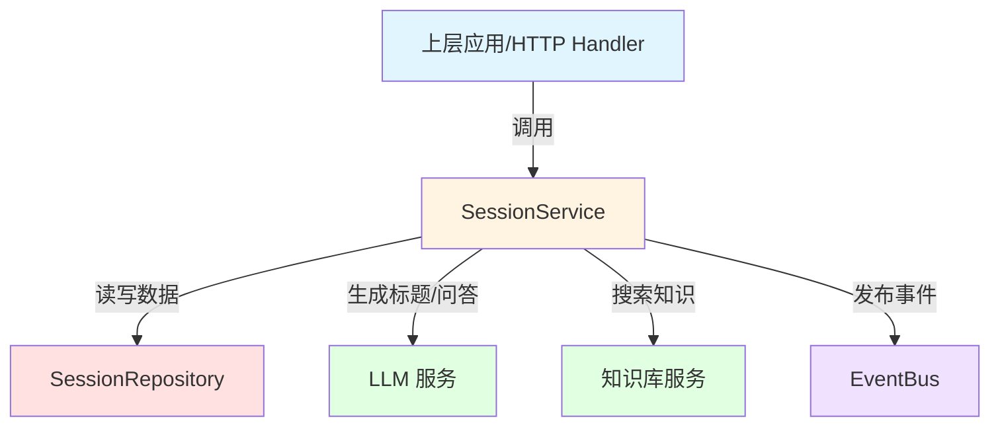

# Session Persistence and Service Interfaces 模块技术深度解析

## 1. 问题空间与存在意义

在构建一个支持多租户、多会话的智能对话系统时，我们面临几个核心挑战：

1. **会话数据的持久化与隔离**：需要确保每个租户的会话数据安全存储且严格隔离，同时提供高效的 CRUD 操作
2. **会话与业务逻辑的解耦**：会话管理需要处理从创建、查询到删除的完整生命周期，但不应与具体的数据库实现或业务流程绑定
3. **复杂会话能力的抽象**：现代对话系统不仅仅是存储会话元数据，还需要支持标题生成、知识库问答、Agent 交互等高级功能
4. **异步与事件驱动**：标题生成等耗时操作需要异步执行，避免阻塞主流程，同时需要通过事件机制通知结果

一个简单的 CRUD 接口无法满足这些需求——我们需要一个清晰的抽象层，将数据持久化与业务能力分离，同时定义明确的契约让上下游组件依赖。

这就是 `session_persistence_and_service_interfaces` 模块存在的原因：它定义了会话管理领域的核心契约，向上层业务提供统一的会话操作能力，向下层数据实现定义持久化标准。

## 2. 心理模型与核心抽象

可以将这个模块想象成**对话系统的"会话前台与后台"**：

- **SessionRepository** 是**后台仓库管理员**：它只负责"货物"（会话数据）的入库、出库、盘点，不关心货物用来做什么。它严格按照"仓库规则"（租户隔离）工作，每个操作都要检查租户 ID。
- **SessionService** 是**前台业务经理**：它负责接待客户（上层应用），理解业务需求（创建会话、生成标题、问答等），需要时调用仓库管理员存取货物，还要协调其他部门（LLM、知识库、事件总线）完成复杂任务。

这种分离带来了清晰的职责边界：Repository 只做数据持久化，Service 编排业务逻辑。两者通过接口定义契约，实现可以灵活替换而不影响对方。

## 3. 架构与数据流



### 核心组件角色

1. **SessionRepository（数据持久化接口）**
   - 职责：定义会话数据的 CRUD 契约，确保租户隔离
   - 特点：所有读写操作都显式传入 `tenantID`，强制数据隔离
   - 关键方法：`Create`、`Get`、`GetByTenantID`、`Update`、`Delete`、`BatchDelete`

2. **SessionService（业务服务接口）**
   - 职责：定义会话管理的业务能力，编排多个子系统完成复杂操作
   - 特点：不直接暴露 `tenantID`（通常从 context 中获取），提供更高层次的抽象
   - 关键能力域：
     - 会话生命周期管理（Create/Get/Update/Delete）
     - 智能标题生成（同步/异步）
     - 知识库问答（KnowledgeQA）
     - Agent 问答（AgentQA）
     - 上下文管理（ClearContext）

### 典型数据流

#### 场景 1：创建会话并异步生成标题

```
上层应用 → SessionService.CreateSession() 
         → SessionRepository.Create() 
         → 返回 Session
         → 上层应用调用 SessionService.GenerateTitleAsync()
         → 后台异步调用 LLM 生成标题
         → 生成完成后通过 EventBus 发布事件
```

#### 场景 2：知识库问答

```
上层应用 → SessionService.KnowledgeQA()
         → SessionRepository.Get() 验证会话存在
         → 调用知识库服务搜索相关内容
         → 调用 LLM 生成回答
         → 通过 EventBus 流式推送答案片段
         → 完成后推送结束事件
```

## 4. 组件深度解析

### SessionRepository 接口

**设计意图**：作为数据持久化的抽象层，隔离具体数据库实现，确保租户隔离原则强制执行。

**核心方法解析**：

- `Create(ctx context.Context, session *types.Session) (*types.Session, error)`
  - 创建新会话，返回带 ID 的完整会话对象
  - 实现需要确保会话 ID 唯一性，设置创建时间等默认字段

- `Get(ctx context.Context, tenantID uint64, id string) (*types.Session, error)`
  - **关键设计**：显式传入 `tenantID`，确保即使调用者传入其他租户的会话 ID 也无法获取数据
  - 返回值：找到返回会话，否则返回 nil 或特定错误

- `GetPagedByTenantID(ctx context.Context, tenantID uint64, page *types.Pagination) ([]*types.Session, int64, error)`
  - 支持分页查询，返回会话列表和总数
  - 通常按更新时间倒序排列（最新会话在前）

- `BatchDelete(ctx context.Context, tenantID uint64, ids []string) error`
  - 批量删除，原子性保证取决于具体实现
  - 设计考虑：批量操作比循环调用 Delete 更高效

**设计亮点**：
- 所有方法都接收 `context.Context`，支持超时控制和链路追踪
- 显式租户隔离，避免跨租户数据泄露的安全隐患
- 方法命名简洁，遵循 Go 语言惯例

### SessionService 接口

**设计意图**：定义会话管理的完整业务能力，作为上层应用与下层系统之间的协调者。

**核心能力域解析**：

#### 1. 会话生命周期管理
- `CreateSession/GetSession/UpdateSession/DeleteSession/BatchDeleteSessions`
- 封装了 Repository 的操作，但通常从 context 中提取 tenantID，简化调用者代码
- 可能包含额外的业务逻辑（如创建时初始化默认配置）

#### 2. 智能标题生成
```go
GenerateTitle(ctx context.Context, session *types.Session, messages []types.Message, modelID string) (string, error)
GenerateTitleAsync(ctx context.Context, session *types.Session, userQuery string, modelID string, eventBus *event.EventBus)
```
- **设计意图**：根据对话内容自动生成有意义的会话标题，提升用户体验
- **同步版本**：适用于可以等待的场景，直接返回生成的标题
- **异步版本**：适用于响应时间敏感的场景，通过事件通知结果
- **modelID 参数**：可选，允许调用者指定生成标题的模型，灵活性与简单性的平衡

#### 3. 知识库问答
```go
KnowledgeQA(ctx context.Context,
    session *types.Session, query string, knowledgeBaseIDs []string, knowledgeIDs []string,
    assistantMessageID string, summaryModelID string, webSearchEnabled bool, eventBus *event.EventBus,
    customAgent *types.CustomAgent, enableMemory bool,
) error
```
- **设计意图**：这是系统的核心能力之一——基于知识库内容回答用户问题
- **参数设计解析**：
  - `knowledgeBaseIDs`/`knowledgeIDs`：支持多知识库和指定知识文件搜索
  - `assistantMessageID`：用于关联生成的回答消息，支持后续更新
  - `summaryModelID`：可选覆盖默认摘要模型
  - `webSearchEnabled`：是否启用网络搜索补充知识库结果
  - `eventBus`：通过事件流式推送答案、引用和完成状态
  - `customAgent`：可选覆盖 Agent 配置（如历史轮数）
  - `enableMemory`：是否启用记忆功能
- **返回值设计**：返回 `error` 表示启动失败，成功启动后通过事件推送结果

#### 4. Agent 问答
```go
AgentQA(
    ctx context.Context,
    session *types.Session,
    query string,
    assistantMessageID string,
    summaryModelID string,
    eventBus *event.EventBus,
    customAgent *types.CustomAgent,
    knowledgeBaseIDs []string,
    knowledgeIDs []string,
) error
```
- **与 KnowledgeQA 的区别**：AgentQA 支持更复杂的工具调用和推理流程，而 KnowledgeQA 专注于知识库问答
- **设计考虑**：将两种能力分离，保持接口清晰，避免单一接口过于臃肿

#### 5. 上下文管理
```go
ClearContext(ctx context.Context, sessionID string) error
```
- **设计意图**：清除会话的 LLM 上下文，让后续对话"重新开始"
- **实现通常**：删除或标记历史消息为不活跃，重置上下文管理器状态

## 5. 依赖关系分析

### 上游依赖（谁使用这个模块）

- **HTTP Handler**：REST API 层直接调用 `SessionService` 处理请求
- **其他业务服务**：需要管理会话的服务会依赖这两个接口

### 下游依赖（这个模块使用谁）

- `types.Session`、`types.Message`、`types.Pagination` 等：核心领域模型
- `event.EventBus`：事件总线，用于异步通知和流式输出
- `types.CustomAgent`：自定义 Agent 配置模型
- `types.SearchResult`：知识搜索结果模型

### 数据契约

**输入契约**：
- `Session` 对象必须包含必要字段（租户 ID、名称等）
- `Pagination` 对象需要合理的页码和页大小
- 知识库 ID 列表不能为空（如果指定了知识库搜索）

**输出契约**：
- 成功的查询返回非 nil 的 `Session` 或列表
- 错误时返回有意义的错误信息（如 "session not found"、"permission denied"）
- 异步操作通过 EventBus 发送标准化事件

## 6. 设计决策与权衡

### 1. Repository 与 Service 分离

**选择**：将数据访问与业务逻辑分离为两个接口

**原因**：
- 遵循单一职责原则：Repository 只关心数据持久化，Service 关心业务流程
- 便于测试：可以轻松 mock Repository 测试 Service 逻辑
- 灵活替换：可以切换 Repository 实现（如从 MySQL 到 PostgreSQL）而不影响 Service

**权衡**：
- 增加了一层抽象，代码量稍多
- 简单场景下可能感觉"过度设计"

### 2. 显式租户 ID（Repository 层）

**选择**：Repository 的所有方法都显式传入 `tenantID`

**原因**：
- 安全性：强制租户隔离，防止忘记传入导致的跨租户数据访问
- 明确性：接口签名清楚表明这是多租户系统
- 一致性：所有操作遵循相同模式

**权衡**：
- 调用者需要多传一个参数
- Service 层需要从 context 提取并传递

### 3. Service 层不显式传租户 ID

**选择**：Service 方法通常不接收 `tenantID`，而是从 context 提取

**原因**：
- 简化调用者代码：上游不需要知道租户 ID 从哪来
- 封装租户获取逻辑：可以灵活改变租户 ID 的来源（如 JWT token、context key）
- 更符合业务语义：业务操作是"当前用户的会话"，而不是"租户 X 的会话 Y"

**权衡**：
- 隐含依赖 context 中的租户信息，增加了测试难度（需要准备带租户的 context）
- 如果 context 中没有租户信息会导致运行时错误

### 4. 同步与异步标题生成并存

**选择**：同时提供 `GenerateTitle` 和 `GenerateTitleAsync`

**原因**：
- 灵活性：满足不同场景需求（同步场景需要立即显示标题，异步场景需要快速响应）
- 渐进式体验：异步版本可以先显示临时标题，生成完成后更新

**权衡**：
- API 表面变大
- 调用者需要选择合适的版本

### 5. 通过 EventBus 输出而非返回值（KnowledgeQA/AgentQA）

**选择**：问答方法通过 EventBus 发送事件，而不是直接返回结果

**原因**：
- 流式输出支持：LLM 生成通常是流式的，事件机制可以逐段推送
- 解耦：调用者不需要知道结果如何传递，只需要订阅事件
- 丰富性：可以发送多种事件（答案片段、引用、完成、错误等）

**权衡**：
- 学习曲线：调用者需要理解事件模型
- 调试难度：异步事件流比同步返回更难追踪

## 7. 使用指南与最佳实践

### 使用 SessionRepository

```go
// 创建会话
session := &types.Session{
    TenantID: 123,
    Name:     "新会话",
}
createdSession, err := repo.Create(ctx, session)

// 获取会话（带租户隔离）
session, err := repo.Get(ctx, tenantID, sessionID)

// 分页查询
page := &types.Pagination{
    Page:     1,
    PageSize: 20,
}
sessions, total, err := repo.GetPagedByTenantID(ctx, tenantID, page)
```

### 使用 SessionService

```go
// 创建会话
session := &types.Session{
    Name: "我的对话",
}
created, err := service.CreateSession(ctx, session)

// 异步生成标题（不阻塞主流程）
service.GenerateTitleAsync(ctx, created, userQuery, "", eventBus)

// 知识库问答
err := service.KnowledgeQA(
    ctx,
    session,
    "如何使用这个产品？",
    []string{"kb1", "kb2"},
    nil,
    assistantMsgID,
    "",
    true,
    eventBus,
    nil,
    true,
)
```

### 最佳实践

1. **错误处理**：
   - Repository 层返回 "not found" 错误时，Service 层应该转换为业务友好的错误
   - 总是检查 context 错误（超时、取消）

2. **Context 使用**：
   - Service 层确保 context 包含租户信息
   - 传递 context 到所有下游调用，支持链路追踪和超时控制

3. **异步操作**：
   - 使用 `GenerateTitleAsync` 而非同步版本，除非确实需要等待结果
   - 确保订阅 EventBus 接收异步结果事件

4. **资源清理**：
   - 调用 `ClearContext` 在合适时机释放 LLM 上下文资源
   - 批量删除不用的会话，控制存储成本

## 8. 注意事项与陷阱

### 常见陷阱

1. **租户隔离绕过**
   - 危险：Repository 实现中忘记检查 `tenantID`，导致跨租户数据访问
   - 防范：在 Repository 实现的所有查询中强制加入 `tenantID` 条件

2. **Context 中缺少租户信息**
   - 现象：Service 层方法 panic 或返回错误，因为 context 中没有租户
   - 防范：在 Service 入口处验证租户信息存在，并返回清晰错误

3. **EventBus 为 nil**
   - 现象：`KnowledgeQA`/`AgentQA` 调用成功但没有任何输出
   - 防范：确保传递非 nil 的 EventBus，或在 Service 内部提供默认值

4. **异步操作中的 Context 生命周期**
   - 危险：`GenerateTitleAsync` 中使用的 context 可能在操作完成前被取消
   - 防范：在异步方法内部创建新的 context（保留链路追踪信息）

### 隐含契约

1. **Session.ID 生成**：Repository 的 `Create` 方法负责生成唯一 ID，调用者不应预先设置
2. **时间戳管理**：`CreatedAt`、`UpdatedAt` 等字段通常由 Repository 自动管理
3. **事件顺序**：问答操作的事件按顺序发送：引用 → 答案片段（多个）→ 完成
4. **并发安全**：Service 方法应该是并发安全的，Repository 实现也需要处理并发

### 性能考虑

- `GetPagedByTenantID` 应该合理设置分页大小，避免一次加载过多会话
- `BatchDelete` 比循环调用 `Delete` 高效，批量操作时优先使用
- 标题生成是耗时操作，生产环境始终使用异步版本

## 9. 扩展点

### 自定义 Repository 实现

可以实现 `SessionRepository` 接口以支持不同的数据库：
- MySQL/PostgreSQL：关系型数据库实现
- MongoDB：文档数据库实现
- 缓存层：Redis 缓存热点会话数据

### 自定义 Service 实现

可以包装或替换 `SessionService` 以添加横切关注点：
- 日志记录：包装所有方法记录调用日志
- 指标收集：统计各方法的调用次数和耗时
- 权限检查：在业务方法前添加额外的权限验证

### 事件订阅

通过监听 EventBus 可以扩展功能：
- 标题生成事件：更新会话标题并通知前端
- 问答完成事件：记录对话统计、触发后续工作流

## 10. 相关模块

- [Chat Management Contract](./core-domain-types-and-interfaces-agent-conversation-and-runtime-contracts-session-lifecycle-and-conversation-controls-contracts-chat-management-contract.md)：会话管理的另一个核心契约
