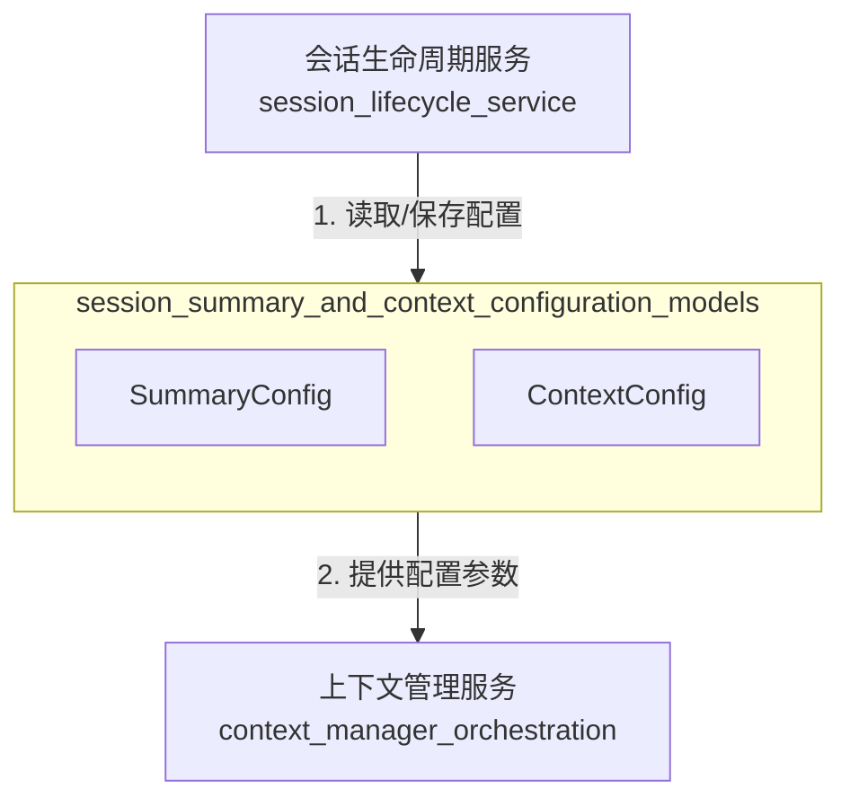

# 会话摘要与上下文配置模型技术深度剖析

## 1. 模块概述

在对话式AI系统中，会话摘要和上下文管理是两个核心挑战。`session_summary_and_context_configuration_models`模块专注于解决这两个问题，为会话提供灵活且可配置的摘要生成参数和上下文压缩策略。

想象一下，当你与AI进行长时间对话时，它需要记住之前的交互，但又不能把所有历史消息一股脑塞给LLM（大语言模型）——因为模型的上下文窗口是有限的。这个模块就像一个聪明的"记忆管家"：它知道如何高效地生成会话摘要，也知道如何在保持对话连贯性的同时，智能地压缩历史上下文。

## 2. 核心组件详解

### 2.1 SummaryConfig - 摘要生成配置

`SummaryConfig`结构体封装了生成会话摘要所需的所有LLM参数，让我们可以精细控制摘要的生成过程。

#### 设计意图
这个结构体的设计体现了"配置即数据"的理念——将所有LLM生成参数集中管理，使得：
- 不同会话可以使用不同的摘要生成策略
- 可以在运行时动态调整摘要生成行为
- 参数可以持久化存储和恢复

#### 核心字段解析
- **MaxTokens/MaxCompletionTokens**: 控制生成文本的长度限制
- **Temperature/TopK/TopP**: 调整生成的随机性和创造性
- **FrequencyPenalty/PresencePenalty**: 防止生成内容重复
- **Prompt/ContextTemplate**: 定义摘要生成的提示词模板
- **Thinking**: 控制是否启用思考模式（用于支持深度推理的模型）

### 2.2 ContextConfig - 上下文管理配置

`ContextConfig`是这个模块的另一个核心，它解决了LLM上下文窗口有限的问题。

#### 设计思路
这里采用了两种互补的策略来管理上下文：

1. **滑动窗口策略**：保留最近的N条消息，简单高效，适合短对话
2. **智能压缩策略**：使用LLM对旧消息进行摘要，保留核心信息的同时大幅减少token消耗

这种二元设计是一个典型的"简单优先，智能可选"的 tradeoff——默认情况下可以使用开销小的滑动窗口，当需要更好的上下文理解时再启用智能压缩。

#### 核心字段
- **MaxTokens**: LLM上下文的token上限（硬约束）
- **CompressionStrategy**: 选择压缩策略（"sliding_window"或"smart"）
- **RecentMessageCount**: 无论哪种策略，都会保留的最近消息数量
- **SummarizeThreshold**: 触发智能压缩的消息数量阈值

## 3. 数据持久化设计

这个模块的一个巧妙之处在于它实现了`driver.Valuer`和`sql.Scanner`接口，使得这些复杂的配置结构体可以直接作为数据库字段处理。

```go
// 例如 ContextConfig 的数据库序列化
func (c *ContextConfig) Value() (driver.Value, error) {
    return json.Marshal(c)
}

func (c *ContextConfig) Scan(value interface{}) error {
    // 反序列化逻辑
}
```

这种设计让配置对象的持久化变得透明——应用层代码不需要关心这些配置是如何存储到数据库的，GORM会自动处理JSON序列化和反序列化。

## 4. 架构关系与数据流向

这个模块在整个系统中扮演着"配置契约"的角色：



### 典型数据流

1. **会话创建时**：客户端可以提供自定义的`SummaryConfig`和`ContextConfig`，或者使用系统默认值
2. **会话进行中**：上下文管理服务根据`ContextConfig`的策略来处理历史消息
3. **需要摘要时**：摘要生成组件使用`SummaryConfig`中的参数调用LLM生成摘要
4. **会话持久化**：整个配置对象被序列化为JSON存储在数据库中

## 5. 设计权衡与决策

### 5.1 为什么使用JSON序列化存储配置？

**选择**：将复杂配置结构序列化为JSON存储在单个数据库字段中

**权衡分析**：
- ✅ 优点：
  - 灵活扩展：添加新配置字段不需要数据库迁移
  - 简化ORM映射：不需要为每个配置字段创建单独的数据库列
  - 保持数据完整性：配置作为一个整体被读取和写入
  
- ⚠️ 缺点：
  - 无法在数据库层面进行配置字段的索引和查询
  - 迁移配置结构需要应用层处理
  - 比规范化表结构占用更多存储空间

**为什么这样选择**：对于配置数据，灵活性比查询能力更重要——配置很少需要按字段查询，但经常需要扩展和修改。

### 5.2 为什么分离摘要配置和上下文配置？

**选择**：将`SummaryConfig`和`ContextConfig`设计为两个独立的结构体

**设计理念**：这符合"关注点分离"原则——摘要生成是关于"如何总结过去"，而上下文管理是关于"如何呈现现在"。两者虽然相关，但解决的是不同的问题，有不同的变化频率。

### 5.3 上下文策略的二元选择

**选择**：只提供"滑动窗口"和"智能压缩"两种策略，没有提供更复杂的策略

**设计思考**：这里采用了"足够好"的设计哲学。这两种策略覆盖了95%的使用场景：
- 滑动窗口适合快速、轻量的交互
- 智能压缩适合需要长期记忆的深度对话

添加更多策略会增加系统复杂度，而收益递减。

## 6. 使用指南与最佳实践

### 6.1 典型配置示例

```go
// 短对话、高频率交互场景
simpleContextConfig := &ContextConfig{
    MaxTokens:           4096,
    CompressionStrategy: ContextCompressionSlidingWindow,
    RecentMessageCount:  10,
    SummarizeThreshold:  20,
}

// 长对话、需要深度理解场景
smartContextConfig := &ContextConfig{
    MaxTokens:           8192,
    CompressionStrategy: ContextCompressionSmart,
    RecentMessageCount:  5,
    SummarizeThreshold:  10,
}
```

### 6.2 关键注意事项

⚠️ **Gotcha 1**: `RecentMessageCount`应该小于`SummarizeThreshold`，否则智能压缩永远不会触发。

⚠️ **Gotcha 2**: 当使用智能压缩时，要确保`SummaryConfig`已经正确配置——压缩过程本身需要调用LLM生成摘要。

⚠️ **Gotcha 3**: `MaxTokens`的设置需要考虑当前使用的LLM的实际上下文窗口限制，设置得太大会导致LLM调用失败。

## 7. 扩展点与未来可能性

虽然当前设计已经相当完善，但还有一些潜在的扩展方向：

1. **更多压缩策略**：可以添加基于重要性的选择性保留策略
2. **分层摘要**：对于超长会话，可以支持多级摘要（日摘要→周摘要→月摘要）
3. **自适应策略**：根据对话内容动态调整压缩策略
4. **配置验证**：添加配置验证逻辑，防止无效配置导致的运行时错误

## 8. 总结

`session_summary_and_context_configuration_models`模块是一个精心设计的组件，它通过清晰的抽象和灵活的配置，解决了对话式AI系统中的记忆管理问题。它的设计体现了几个重要的软件设计原则：

- **关注点分离**：将摘要配置和上下文配置解耦
- **灵活性与简单性平衡**：提供两种策略覆盖大多数场景
- **配置即数据**：将配置作为一等公民，支持持久化和动态调整

这个模块虽然代码量不大，但在整个对话系统中扮演着至关重要的角色——它直接影响着AI的"记忆力"和对话的连贯性。
