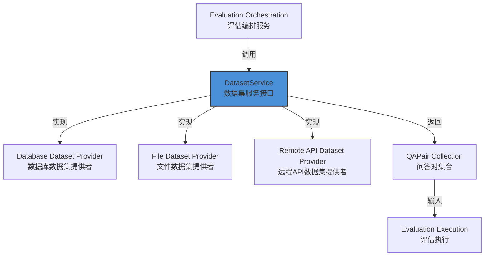

# Dataset Service Interface Contract 技术深度解析

## 1. 模块概览

**Dataset Service Interface Contract** 模块是系统评估框架的核心基础设施契约层，它定义了数据集管理服务与评估系统其他组件之间的标准接口。

### 为什么这个模块存在？

在一个复杂的评估系统中，我们面临一个关键问题：如何让评估引擎能够以统一、可插拔的方式访问不同来源的问答数据集？评估逻辑不应该被特定的数据集存储实现（比如数据库、文件、远程API）所束缚，同时数据集的提供者也需要一个稳定的契约来保证他们的实现能够被评估系统正确使用。

这个模块通过定义简洁而强大的 `DatasetService` 接口，优雅地解决了这个问题。它就像评估系统与数据源之间的"翻译适配器标准"——任何实现了这个接口的数据源，都可以无缝接入评估流程。

## 2. 核心抽象与架构

### 核心组件

本模块的核心是 `DatasetService` 接口，它位于整个评估体系的数据源边界上：

```go
// DatasetService defines operations for dataset management
type DatasetService interface {
    // GetDatasetByID retrieves QA pairs from dataset by ID
    GetDatasetByID(ctx context.Context, datasetID string) ([]*types.QAPair, error)
}
```

### 架构定位

在整个系统架构中，`DatasetService` 是评估数据流的起点：



## 3. 组件深度解析

### DatasetService 接口

**设计意图**：这个接口的设计遵循了接口隔离原则（Interface Segregation Principle）——它只做一件事，并且把这件事做好。接口设计者没有试图定义一个包罗万象的数据集管理接口，而是专注于评估系统真正需要的核心能力：根据ID获取问答对。

**参数分析**：
- `ctx context.Context`：提供了请求上下文，支持超时控制、取消和链路追踪，这是Go语言中处理可取消操作的标准模式
- `datasetID string`：数据集的唯一标识符，使用字符串类型保证了最大的灵活性（可以容纳UUID、自增ID、复合键等多种标识方案）

**返回值设计**：
- `[]*types.QAPair`：问答对集合的指针切片，使用指针可以避免大切片的复制开销
- `error`：标准的错误返回机制，允许调用者根据不同的错误类型进行适当处理

**为什么只有一个方法？**

这是一个深思熟虑的设计决策。在接口设计中，"少即是多"。评估系统只需要"根据ID获取数据集"这一个能力，因此接口就只定义这一个方法。这样的设计有几个显著优势：

1. **易于实现**：任何想要提供数据集的组件只需要实现这一个方法
2. **易于测试**：单元测试时可以轻松创建Mock实现
3. **稳定契约**：接口越简单，未来需要变更的可能性就越小
4. **灵活性高**：实现者可以在内部拥有复杂的管理逻辑，但对外只暴露必要的能力

## 4. 依赖关系与数据流

### 模块依赖关系

从模块树可以看出，`dataset_service_interface_contract` 位于依赖链的核心位置：

```
core_domain_types_and_interfaces
└── evaluation_dataset_and_metric_contracts
    └── dataset_qa_contracts
        ├── qa_pair_domain_model
        └── dataset_service_interface_contract ← 当前模块
```

**上游依赖**（使用此接口的模块）：
- [application_services_and_orchestration.evaluation_dataset_and_metric_services](application_services_and_orchestration-evaluation_dataset_and_metric_services.md)：评估编排服务会使用 `DatasetService` 来加载评估数据
- 其他评估执行组件

**下游依赖**（实现此接口的模块）：
- 数据访问层的数据集仓库实现
- 可能的外部数据集集成适配器

### 典型数据流

让我们追踪一个完整的评估请求中数据是如何流动的：

1. **评估发起**：用户通过API发起评估请求，指定数据集ID
2. **数据集加载**：评估编排服务调用 `DatasetService.GetDatasetByID()` 获取问答对
3. **评估执行**：遍历问答对，依次调用LLM并与预期答案比较
4. **指标计算**：使用评估指标计算结果质量
5. **结果存储**：保存评估结果供后续分析

这种设计使得评估流程与数据来源完全解耦——你可以从数据库、JSON文件、S3存储桶或远程API加载数据，而无需修改评估逻辑。

## 5. 设计决策与权衡

### 设计决策1：极简接口设计 vs 功能丰富接口

**选择**：采用极简接口设计，只定义一个方法

**权衡分析**：
- ✅ **优点**：接口简洁、易于实现、降低耦合、提高可测试性
- ❌ **缺点**：如果未来需要更多数据集操作（如列表、创建、更新），需要在别处定义

**为什么这是正确的选择**：根据依赖倒置原则，高层模块（评估引擎）不应该依赖低层模块（具体数据存储），两者都应该依赖抽象。这个接口正是由高层模块的需求驱动设计的——评估引擎只需要"获取数据集"这一个能力，因此接口就只提供这个能力。

### 设计决策2：返回指针切片 vs 值切片

**选择**：返回 `[]*types.QAPair` 而不是 `[]types.QAPair`

**权衡分析**：
- ✅ **优点**：避免大型数据集的内存复制，支持在需要时修改问答对（尽管这在评估场景中可能不推荐）
- ❌ **缺点**：引入了空指针风险，增加了一点间接访问开销

**为什么这是正确的选择**：在评估场景中，数据集可能包含成千上万的问答对，使用值切片会导致大量的内存复制，影响性能。而使用指针切片更符合Go语言处理大型数据集合的惯用法。

### 设计决策3：使用string类型的ID vs 泛型ID

**选择**：使用 `string` 作为数据集ID类型，而不是使用泛型或更复杂的类型

**权衡分析**：
- ✅ **优点**：最大的兼容性，易于序列化，适用于各种ID方案（UUID、数字ID、路径等）
- ❌ **缺点**：失去了类型安全，没有编译时检查

**为什么这是正确的选择**：在系统边界处，使用简单、通用的类型通常是更好的选择。不同的实现可能使用不同的ID方案，而string是它们的共同语言。类型安全可以在实现层面通过验证来保证。

## 6. 使用指南与最佳实践

### 如何实现 DatasetService

以下是一个典型的数据库实现示例：

```go
type databaseDatasetService struct {
    db *sql.DB
}

func NewDatabaseDatasetService(db *sql.DB) DatasetService {
    return &databaseDatasetService{db: db}
}

func (s *databaseDatasetService) GetDatasetByID(ctx context.Context, datasetID string) ([]*types.QAPair, error) {
    // 1. 验证输入
    if datasetID == "" {
        return nil, errors.New("datasetID is required")
    }

    // 2. 执行查询（使用ctx支持超时和取消）
    rows, err := s.db.QueryContext(ctx, 
        "SELECT id, question, answer, metadata FROM qa_pairs WHERE dataset_id = ?", 
        datasetID)
    if err != nil {
        return nil, fmt.Errorf("failed to query dataset: %w", err)
    }
    defer rows.Close()

    // 3. 扫描结果
    var pairs []*types.QAPair
    for rows.Next() {
        pair := &types.QAPair{}
        err := rows.Scan(&pair.ID, &pair.Question, &pair.Answer, &pair.Metadata)
        if err != nil {
            return nil, fmt.Errorf("failed to scan row: %w", err)
        }
        pairs = append(pairs, pair)
    }

    // 4. 检查遍历错误
    if err := rows.Err(); err != nil {
        return nil, fmt.Errorf("error iterating rows: %w", err)
    }

    return pairs, nil
}
```

### 如何创建Mock实现用于测试

```go
type MockDatasetService struct {
    mock.Mock
}

func (m *MockDatasetService) GetDatasetByID(ctx context.Context, datasetID string) ([]*types.QAPair, error) {
    args := m.Called(ctx, datasetID)
    return args.Get(0).([]*types.QAPair), args.Error(1)
}

// 使用示例
func TestEvaluationFlow(t *testing.T) {
    mockDS := new(MockDatasetService)
    testData := []*types.QAPair{
        {Question: "2+2=?", Answer: "4"},
        {Question: "地球是圆的吗？", Answer: "是的"},
    }
    mockDS.On("GetDatasetByID", mock.Anything, "test-dataset").Return(testData, nil)
    
    // 注入mockDS到评估服务进行测试...
}
```

## 7. 注意事项与常见陷阱

### 常见陷阱1：忽略Context

**问题**：实现时没有使用传入的 `ctx` 参数，导致无法取消或超时控制

**解决方案**：始终使用 `ctx` 进行数据库查询、HTTP请求等操作：
```go
// ❌ 错误做法
rows, err := s.db.Query("SELECT ...")

// ✅ 正确做法
rows, err := s.db.QueryContext(ctx, "SELECT ...")
```

### 常见陷阱2：返回空切片而不是nil

**问题**：在没有数据时返回 `[]*types.QAPair{}` 而不是 `nil`

**说明**：在Go中，空切片和nil在功能上通常是等价的，但在某些情况下（如JSON序列化）可能有细微差别。最重要的是保持一致性——如果没有数据且没有错误，返回空切片是可接受的。

### 常见陷阱3：不验证输入

**问题**：直接使用 `datasetID` 而不验证它是否为空或格式正确

**解决方案**：始终在方法开始时验证输入参数：
```go
if datasetID == "" {
    return nil, errors.New("datasetID cannot be empty")
}
// 可以添加更多格式验证
```

### 常见陷阱4：错误包装不足

**问题**：直接返回底层错误，没有添加上下文信息

**解决方案**：使用 `fmt.Errorf` 和 `%w` 动词包装错误，保留错误链同时添加上下文：
```go
// ❌ 错误做法
return nil, err

// ✅ 正确做法
return nil, fmt.Errorf("failed to load dataset %s: %w", datasetID, err)
```

## 8. 总结

`DatasetService` 接口是一个看似简单实则设计精良的抽象，它体现了优秀接口设计的多个原则：

- **单一职责**：只做一件事
- **依赖倒置**：高层模块定义需求，低层模块实现
- **接口隔离**：不强迫实现者依赖不需要的方法
- **简洁性**：易于理解、实现和测试

这个接口是整个评估系统灵活性和可扩展性的基石——通过简单地替换 `DatasetService` 的实现，你可以将评估系统连接到任何数据源，而无需修改核心评估逻辑。这正是"面向接口编程"思想的一个典范应用。
