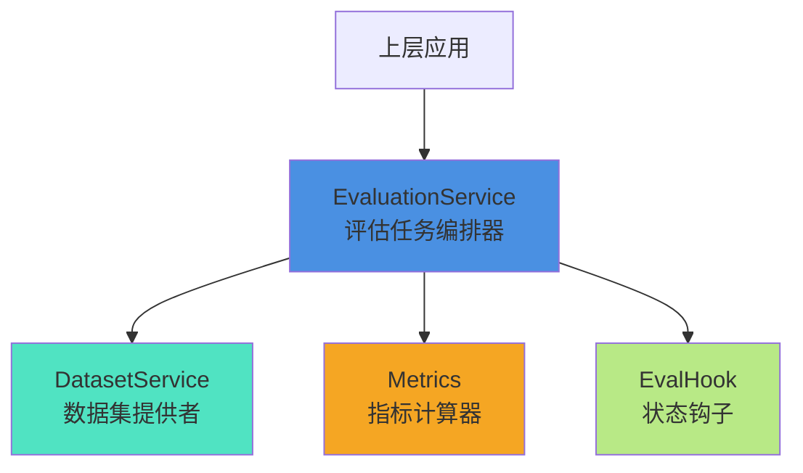
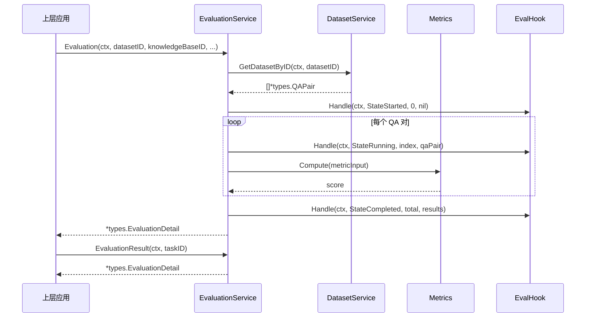

# Evaluation Service Execution Interface 深度技术文档

## 1. 模块概述

**evaluation_service_execution_interface** 模块是整个评估系统的核心抽象层，定义了评估任务执行、指标计算、钩子机制和数据集管理的统一接口契约。它位于系统的 `core_domain_types_and_interfaces` 层级，作为评估领域的 "语言标准" 存在——类似于操作系统的系统调用接口，它定义了上层应用可以依赖的评估能力，同时隔离了具体实现的复杂性。

这个模块解决的核心问题是：如何让评估系统的不同部分（任务编排、指标计算、数据管理、状态监控）能够松耦合地协同工作，同时保持接口的稳定性和可扩展性。如果没有这个抽象层，评估逻辑会散落在各处，更换评估算法或添加新指标将意味着修改大量耦合代码。

## 2. 核心抽象与心智模型

理解这个模块的关键是把握四个核心抽象角色，它们像一个评估工厂的不同车间一样协同工作：



1.  **EvaluationService（评估任务编排器）**：这是整个评估系统的 "入口大门" 和 "指挥中心"。它不直接计算指标或读取数据，而是协调各方完成评估流程。可以把它想象成乐队指挥——不演奏任何乐器，但控制整个演出的节奏和顺序。
2.  **DatasetService（数据集提供者）**：负责提供评估所需的 QA 对数据。它是评估系统的 "原料仓库"，隔离了数据存储的具体实现（数据库、文件、远程服务等）。
3.  **Metrics（指标计算器）**：这是评估系统的 "质检车间"，负责根据输入数据计算具体的指标分数。它是一个纯函数式的抽象——给定输入，产生输出，没有副作用。
4.  **EvalHook（状态钩子）**：评估流程的 "监控摄像头" 和 "事件响应器"。它在评估状态变化时被调用，可以用于日志记录、进度更新、实时监控等横切关注点。

## 3. 组件深度解析

### 3.1 EvaluationService 接口

```go
type EvaluationService interface {
    Evaluation(ctx context.Context, datasetID string, knowledgeBaseID string,
        chatModelID string, rerankModelID string,
    ) (*types.EvaluationDetail, error)
    EvaluationResult(ctx context.Context, taskID string) (*types.EvaluationDetail, error)
}
```

**设计意图**：这个接口采用了"任务提交-结果查询"的异步模式，这是长时间运行任务的标准设计模式。

*   **Evaluation 方法**：启动一个新的评估任务。注意它返回的是 `*types.EvaluationDetail` 而不是最终结果——这暗示了评估任务可能是异步执行的，返回的是任务的初始状态。
*   **EvaluationResult 方法**：根据任务 ID 查询评估结果。这种设计允许评估任务在后台运行，客户端可以轮询或通过其他机制获取结果。

**参数设计洞察**：
- `datasetID`：指定使用哪个数据集进行评估
- `knowledgeBaseID`：评估所针对的知识库
- `chatModelID` 和 `rerankModelID`：评估过程中使用的模型配置

这种参数设计表明评估系统是多维度的——可以针对不同的数据集、知识库和模型组合进行评估。

### 3.2 Metrics 接口

```go
type Metrics interface {
    Compute(metricInput *types.MetricInput) float64
}
```

**设计意图**：这是一个典型的策略模式接口。它将指标计算算法封装在统一的接口下，使得可以在运行时切换不同的指标计算策略。

*   **Compute 方法**：接收 `*types.MetricInput`，返回一个 `float64` 分数。这种设计确保了所有指标都遵循相同的计算模式，同时保持了极高的灵活性——任何可以从输入计算出浮点数分数的逻辑都可以实现这个接口。

**纯函数设计**：这个接口没有 `context` 参数，也没有返回 `error`，这表明它的设计意图是成为一个无副作用的纯函数——只依赖输入，不改变状态，不会失败（或者失败由内部处理）。

### 3.3 EvalHook 接口

```go
type EvalHook interface {
    Handle(ctx context.Context, state types.EvalState, index int, data interface{}) error
}
```

**设计意图**：这是一个观察者模式的接口，用于在评估流程的各个关键点插入自定义逻辑。

*   **Handle 方法**：在评估状态变化时被调用。
    *   `ctx`：提供上下文传递和取消能力
    *   `state`：当前的评估状态（类型为 `types.EvalState`）
    *   `index`：当前处理的项索引（可能是 QA 对的索引）
    *   `data`：与当前状态相关的数据（使用 `interface{}` 保持灵活性）
    *   `error` 返回值：允许钩子阻止评估流程的继续

**灵活性与权衡**：使用 `interface{}` 作为数据类型提供了最大的灵活性，但也牺牲了类型安全。这是一个有意的设计选择——因为不同的评估状态可能需要完全不同类型的数据。

### 3.4 DatasetService 接口

```go
type DatasetService interface {
    GetDatasetByID(ctx context.Context, datasetID string) ([]*types.QAPair, error)
}
```

**设计意图**：这是一个仓库模式接口，用于隔离数据集的获取逻辑。

*   **GetDatasetByID 方法**：根据数据集 ID 获取 QA 对列表。这种设计将评估系统与具体的数据存储方式解耦——数据集可以存储在数据库、文件系统、远程服务或任何其他地方，只要实现了这个接口。

**上下文感知**：注意这个方法包含 `context.Context` 参数，这表明数据集获取可能是一个 I/O 密集型操作，需要支持超时和取消。

## 4. 数据流动与架构角色

### 4.1 典型评估流程数据流

虽然我们没有具体的实现代码，但根据接口设计，可以推断出一个典型的评估流程：



### 4.2 架构中的位置

这个模块位于系统的 **核心域层**，它不依赖任何具体的技术实现，只依赖领域类型（`types` 包）。它是评估领域的 "语言核心"，定义了：

*   **上游依赖**：谁调用它？通常是 [evaluation_orchestration_and_state](application-services-and-orchestration-evaluation-dataset-and-metric-services-evaluation-orchestration-and-state.md) 模块中的评估编排服务，以及 [evaluation_endpoint_handler](http-handlers-and-routing-evaluation-and-web-search-handlers-evaluation-endpoint-handler.md) 中的 HTTP 处理器。
*   **下游契约**：它依赖谁？它定义了对数据集服务的契约，具体的实现由 [dataset_modeling_and_service](application-services-and-orchestration-evaluation-dataset-and-metric-services-dataset-modeling-and-service.md) 等模块提供。

## 5. 设计决策与权衡

### 5.1 异步任务模式的选择

**决策**：采用"任务提交-结果查询"的分离接口设计，而不是同步等待结果。

**原因**：
- 评估任务通常涉及大量数据处理和模型调用，可能需要很长时间
- 同步接口会导致 HTTP 超时或资源锁定
- 这种模式支持任务的持久化和恢复

**权衡**：
- ✅ 优点：更好的用户体验，支持长时间运行任务，系统更健壮
- ❌ 缺点：客户端需要实现轮询或通知机制，增加了复杂性

### 5.2 最小接口设计原则

**决策**：每个接口只定义 1-2 个方法，保持接口的极小性。

**原因**：
- 遵循接口隔离原则（ISP）：客户端不应该依赖它不需要的方法
- 提高可测试性：小型接口更容易模拟和测试
- 增强灵活性：可以组合多个小型接口来创建复杂的行为

**权衡**：
- ✅ 优点：高内聚、低耦合，易于理解和实现
- ❌ 缺点：可能导致接口数量增加，需要更多的组合

### 5.3 灵活但类型不安全的钩子设计

**决策**：在 `EvalHook` 中使用 `interface{}` 作为数据类型。

**原因**：
- 评估流程的不同状态需要传递完全不同类型的数据
- 保持接口的通用性，避免为每种状态创建不同的钩子接口
- 允许钩子处理未来可能添加的新状态，而无需修改接口

**权衡**：
- ✅ 优点：最大的灵活性和向前兼容性
- ❌ 缺点：失去了编译时类型安全，需要运行时类型断言，增加了出错的可能性

### 5.4 纯函数式的指标计算

**决策**：`Metrics` 接口没有 `context`，不返回 `error`，设计为纯函数。

**原因**：
- 指标计算应该是确定性的——相同的输入总是产生相同的输出
- 简化错误处理：指标计算失败的情况应该在内部处理或返回默认值
- 便于并行计算：纯函数天然适合并行化

**权衡**：
- ✅ 优点：易于测试、可缓存、可并行
- ❌ 缺点：限制了指标计算的能力（例如不能进行 I/O 操作），如果确实需要这些能力，必须通过其他方式解决

## 6. 使用指南与最佳实践

### 6.1 实现 EvaluationService

当实现 `EvaluationService` 时，应该考虑：

1.  **异步执行**：`Evaluation` 方法应该快速返回，实际的评估工作在后台 goroutine 中执行
2.  **任务持久化**：评估任务的状态应该持久化存储，以便支持崩溃恢复和 `EvaluationResult` 查询
3.  **错误处理**：区分"任务提交失败"和"任务执行失败"——前者在 `Evaluation` 方法中返回错误，后者在 `EvaluationDetail` 中记录

### 6.2 实现 Metrics

实现 `Metrics` 接口时：

1.  **保持纯函数性**：不要依赖外部状态，不要修改输入参数
2.  **性能考虑**：指标计算可能被频繁调用，应该保持高效
3.  **边界情况**：处理空输入、异常值等边界情况，返回合理的默认值而不是崩溃

### 6.3 使用 EvalHook

使用 `EvalHook` 时：

1.  **快速返回**：钩子的 `Handle` 方法应该快速执行，不要阻塞评估流程
2.  **错误处理**：如果返回错误，评估流程可能会被中断，只在真正严重的情况下返回错误
3.  **类型安全**：在使用 `data` 参数前，始终进行类型断言和安全检查

## 7. 边缘情况与注意事项

### 7.1 并发安全性

虽然接口本身没有明确说明，但考虑到评估系统的性质，实现应该假设：

- 多个 `Evaluation` 调用可能同时发生
- `EvaluationResult` 可能在评估还在进行时被调用
- `EvalHook` 的 `Handle` 方法可能被并发调用

因此，所有实现都应该是并发安全的。

### 7.2 上下文传播

所有接收 `context.Context` 的方法都应该正确地传播上下文：

- 尊重上下文的取消信号
- 通过上下文传递请求范围的值（如日志跟踪 ID）
- 在进行 I/O 操作时使用上下文设置超时

### 7.3 数据集大小考量

`DatasetService.GetDatasetByID` 返回的是完整的 QA 对切片，这对于大型数据集可能会有内存问题。当前的接口设计暗示数据集不会太大，或者系统有足够的内存处理。如果需要处理超大规模数据集，可能需要考虑流式处理的方式。

## 8. 相关模块参考

- [evaluation_task_definition_and_request](core-domain-types-and-interfaces-evaluation-dataset-and-metric-contracts-evaluation-task-and-execution-contracts-evaluation-task-definition-contracts.md)：定义评估任务的核心数据结构
- [evaluation_result_and_task_responses](core-domain-types-and-interfaces-evaluation-dataset-and-metric-contracts-evaluation-task-and-execution-contracts-evaluation-result-and-task-responses.md)：定义评估结果的数据结构
- [metric_models_and_extension_hooks](core-domain-types-and-interfaces-evaluation-dataset-and-metric-contracts-metric-models-and-extension-hooks.md)：具体的指标模型实现
- [evaluation_orchestration_and_state](application-services-and-orchestration-evaluation-dataset-and-metric-services-evaluation-orchestration-and-state.md)：评估服务的具体实现
- [evaluation_endpoint_handler](http-handlers-and-routing-evaluation-and-web-search-handlers-evaluation-endpoint-handler.md)：评估功能的 HTTP 接口层

---

这个模块是评估系统的"骨架"，它定义了评估领域的核心概念和交互方式，但没有提供任何具体的实现。理解它的设计意图对于在评估系统中工作至关重要——它不仅是一组接口，更是评估领域知识的结构化表达。