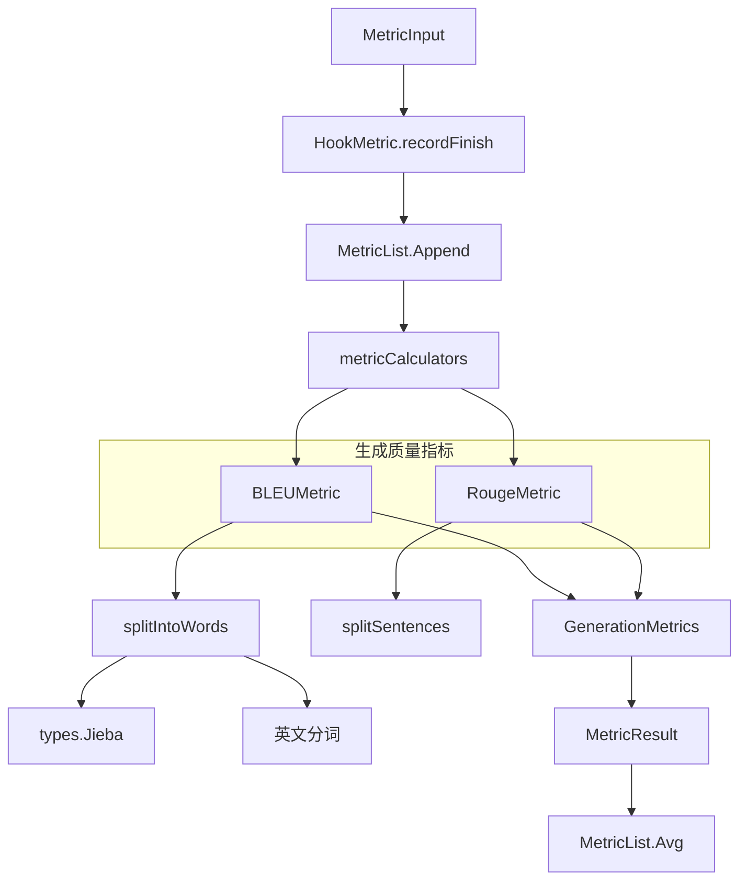

# generation_metric_models 模块技术深度解析

## 1. 模块概述

`generation_metric_models` 模块位于评估框架的核心位置，它解决了一个关键问题：如何客观、量化地评估 LLM 生成文本的质量。这个模块与检索评估指标一起，形成了一个完整的评估体系，让我们能够系统地比较不同模型、不同配置的优劣。

### 1.1 问题背景

在构建知识问答系统时，我们面临一个挑战：如何知道我们的系统在变好？人工评估虽然准确，但速度慢、成本高，而且主观因素影响大。我们需要一套自动化、标准化的文本质量评估工具，这就是 `generation_metric_models` 模块存在的原因。

### 1.2 核心能力

该模块提供了两类主要的生成质量评估指标：

1. **BLEU 指标**：评估文本生成的精确性，通过比较 n-gram 重叠来衡量生成文本与参考文本的相似度
2. **ROUGE 指标**：评估文本生成的召回性，特别关注于重要信息的覆盖程度

这两种指标相互补充，BLEU 侧重于"说了多少对的"，ROUGE 侧重于"覆盖了多少重要的"。

## 2. 核心架构与数据流



### 2.1 关键组件角色

#### 2.1.1 `GenerationMetrics` 结构体
位于 `internal/types/evaluation.go`，是整个模块的数据契约核心，定义了我们收集的所有生成质量指标：

```go
type GenerationMetrics struct {
    BLEU1 float64 `json:"bleu1"`  // BLEU-1 分数（一元组匹配）
    BLEU2 float64 `json:"bleu2"`  // BLEU-2 分数（二元组匹配）
    BLEU4 float64 `json:"bleu4"`  // BLEU-4 分数（四元组匹配）

    ROUGE1 float64 `json:"rouge1"`  // ROUGE-1 分数（一元组召回）
    ROUGE2 float64 `json:"rouge2"`  // ROUGE-2 分数（二元组召回）
    ROUGEL float64 `json:"rougel"`  // ROUGE-L 分数（最长公共子序列）
}
```

这个结构体设计反映了一个重要的设计理念：我们需要从多个维度评估文本质量，而不是依赖单一指标。BLEU 从 1 元到 4 元的覆盖，让我们既能看到词语级别的匹配，也能看到短语和句子结构的匹配。

#### 2.1.2 `BLEUMetric` 类
位于 `internal/application/service/metric/bleu.go`，实现了 BLEU 算法。这个类的设计很有意思：

- 它支持**平滑处理**（smoothing），避免了当某些 n-gram 没有匹配时分数直接降为 0 的问题
- 它使用**权重配置**，让用户可以自定义不同 n-gram 的重要性
- 它包含**简短惩罚**（brevity penalty），防止系统通过生成超短文本获得高分

这个设计体现了对 BLEU 算法本身局限性的深刻理解，并通过工程手段进行了弥补。

#### 2.1.3 `RougeMetric` 类
位于 `internal/application/service/metric/rouge.go`，实现了 ROUGE 算法。它的设计特点：

- 支持多种 ROUGE 变体（1-gram, 2-gram, LCS 等）
- 支持独占匹配模式（exclusive）
- 可以返回精确率、召回率或 F1 分数

#### 2.1.4 文本预处理管道
位于 `internal/application/service/metric/common.go`，这是整个评估系统的基础设施：

```go
func splitIntoWords(sentences []string) []string {
    // 正则匹配中英文段落（中文块、英文块、其他字符）
    re := regexp.MustCompile(`([\p{Han}]+)|([a-zA-Z0-9_.,!?]+)|(\p{P})`)
    
    var tokens []string
    for _, text := range sentences {
        matches := re.FindAllStringSubmatch(text, -1)
        
        for _, groups := range matches {
            chineseBlock := groups[1]
            englishBlock := groups[2]
            punctuation := groups[3]
            
            switch {
            case chineseBlock != "": // 处理中文部分
                words := types.Jieba.Cut(chineseBlock, true)
                tokens = append(tokens, words...)
            case englishBlock != "": // 处理英文部分
                engTokens := strings.Fields(englishBlock)
                tokens = append(tokens, engTokens...)
            case punctuation != "": // 保留标点符号
                tokens = append(tokens, punctuation)
            }
        }
    }
    return tokens
}
```

这个函数展示了一个关键的设计决策：**双语支持**。系统不是简单地按空格分词，而是：
1. 先通过正则表达式区分中文块、英文块和标点符号
2. 对中文使用 Jieba 分词器
3. 对英文使用简单的空格分词
4. 保留标点符号参与匹配

这种设计确保了指标在中英文混合场景下的有效性。

## 3. 指标计算深度解析

### 3.1 BLEU 指标计算原理

BLEU（Bilingual Evaluation Understudy）指标的核心思想是：**好的翻译应该与参考翻译在词语和短语使用上相似**。

让我们看一下 `modifiedPrecision` 方法的实现，这是 BLEU 算法的核心：

```go
func (b *BLEUMetric) modifiedPrecision(candidate Sentence, references []Sentence, n int) float64 {
    nphrase := b.getNphrase(candidate, n)
    if len(nphrase) == 0 {
        return 0.0
    }
    
    counts := b.countNphrase(nphrase)
    
    if len(counts) == 0 {
        return 0.0
    }
    
    maxCounts := map[string]int{}
    for i := range references {
        referenceCounts := b.countNphrase(b.getNphrase(references[i], n))
        for ngram := range counts {
            if v, ok := maxCounts[ngram]; !ok {
                maxCounts[ngram] = referenceCounts[ngram]
            } else if v < referenceCounts[ngram] {
                maxCounts[ngram] = referenceCounts[ngram]
            }
        }
    }
    
    clippedCounts := map[string]int{}
    for ngram, count := range counts {
        clippedCounts[ngram] = min(count, maxCounts[ngram])
    }
    
    smoothingFactor := 0.0
    if b.smoothing {
        smoothingFactor = 1.0
    }
    return (float64(sum(clippedCounts)) + smoothingFactor) / (float64(sum(counts)) + smoothingFactor)
}
```

这个方法体现了几个关键的设计选择：

1. **修正精度**：不简单地计算候选文本中出现的 n-gram 在参考文本中的比例，而是对每个 n-gram 的计数进行"裁剪"（clipping），确保不会因为重复某个正确的 n-gram 而获得不公平的高分

2. **多参考支持**：当有多个参考文本时，取每个 n-gram 在所有参考文本中的最大计数

3. **平滑处理**：当启用平滑时，在分子分母都加 1，避免某些 n-gram 完全没有匹配时导致整个分数为 0

然后是简短惩罚的计算：

```go
func (b *BLEUMetric) brevityPenalty(candidate Sentence, references []Sentence) float64 {
    c := len(candidate)
    refLens := []int{}
    for i := range references {
        refLens = append(refLens, len(references[i]))
    }
    minDiffInd, minDiff := 0, -1
    for i := range refLens {
        if minDiff == -1 || abs(refLens[i]-c) < minDiff {
            minDiffInd = i
            minDiff = abs(refLens[i] - c)
        }
    }
    r := refLens[minDiffInd]
    if c > r {
        return 1
    }
    return math.Exp(float64(1 - float64(r)/float64(c)))
}
```

这里的设计很巧妙：它不是简单地取最短的参考文本长度，而是取**与候选文本长度最接近**的参考文本长度。这样设计的原因是，有时候生成稍微长一点的文本是可以接受的，只要不是过短。

### 3.2 ROUGE 指标计算原理

ROUGE（Recall-Oriented Understudy for Gisting Evaluation）与 BLEU 互补，它更关注于**信息的覆盖度**而不是精确匹配。

`RougeMetric` 的设计采用了策略模式，通过 `AvailableMetrics` 映射表将不同的 ROUGE 变体解耦：

```go
var AvailableMetrics = map[string]func([]string, []string, bool) map[string]float64{
    "rouge-1": func(hyp, ref []string, exclusive bool) map[string]float64 {
        return rougeN(hyp, ref, 1, false, exclusive) // Unigram-based ROUGE
    },
    "rouge-2": func(hyp, ref []string, exclusive bool) map[string]float64 {
        return rougeN(hyp, ref, 2, false, exclusive) // Bigram-based ROUGE
    },
    // ... 更多变体
    "rouge-l": func(hyp, ref []string, exclusive bool) map[string]float64 {
        return rougeLSummaryLevel(hyp, ref, false, exclusive) // Longest common subsequence based ROUGE
    },
}
```

这种设计使得添加新的 ROUGE 变体变得非常容易，只需要在映射表中添加一个新条目即可。

## 4. 指标集成与聚合

### 4.1 指标计算器配置

在 `metric_hook.go` 中，我们看到了如何将各种指标组织在一起：

```go
var metricCalculators = []struct {
    calc     interfaces.Metrics                 // Metric calculator implementation
    getField func(*types.MetricResult) *float64 // Field accessor for result
}{
    // 生成质量指标
    {metric.NewBLEUMetric(true, metric.BLEU1Gram), func(r *types.MetricResult) *float64 {
        return &r.GenerationMetrics.BLEU1
    }},
    {metric.NewBLEUMetric(true, metric.BLEU2Gram), func(r *types.MetricResult) *float64 {
        return &r.GenerationMetrics.BLEU2
    }},
    {metric.NewBLEUMetric(true, metric.BLEU4Gram), func(r *types.MetricResult) *float64 {
        return &r.GenerationMetrics.BLEU4
    }},
    {metric.NewRougeMetric(true, "rouge-1", "f"), func(r *types.MetricResult) *float64 {
        return &r.GenerationMetrics.ROUGE1
    }},
    {metric.NewRougeMetric(true, "rouge-2", "f"), func(r *types.MetricResult) *float64 {
        return &r.GenerationMetrics.ROUGE2
    }},
    {metric.NewRougeMetric(true, "rouge-l", "f"), func(r *types.MetricResult) *float64 {
        return &r.GenerationMetrics.ROUGEL
    }},
}
```

这是一个非常优雅的设计，使用了**函数式编程**的思想：

1. 每个指标计算器都与一个"字段访问器"函数配对
2. 这种设计将"计算什么"和"结果放在哪里"解耦
3. 添加新指标只需要添加一个新的配置项，不需要修改聚合逻辑

### 4.2 指标聚合流程

整个指标聚合流程如下：

1. **数据收集**：`HookMetric` 记录每个 QA 对的中间结果
2. **指标计算**：`recordFinish` 方法触发所有指标的计算
3. **结果存储**：`MetricList` 存储所有 QA 对的指标结果
4. **平均计算**：`Avg` 方法计算所有 QA 对的平均指标

这种流水线式的设计使得系统具有很好的可观测性——我们不仅能看到最终的平均分数，还能深入分析每个 QA 对的表现。

## 5. 设计决策与权衡

### 5.1 双语支持设计

**决策**：实现了中文和英文混合的文本预处理管道

**原因**：
- 知识问答系统经常需要处理中英文混合的场景
- 中文需要分词，英文按空格分词即可
- 直接统一按字符处理会丢失语义信息

**权衡**：
- ✅ 优点：指标在双语场景下更准确
- ❌ 缺点：增加了系统复杂度，依赖外部 Jieba 分词库

### 5.2 指标组合设计

**决策**：同时使用 BLEU 和 ROUGE 两类指标

**原因**：
- BLEU 侧重于精确性，ROUGE 侧重于召回性
- 单一指标容易被"游戏"（例如生成极短或极长的文本）
- 多个指标提供更全面的质量画像

**权衡**：
- ✅ 优点：评估更全面，不易被误导
- ❌ 缺点：解释结果更复杂，没有单一的"好坏"判断

### 5.3 平滑处理设计

**决策**：BLEU 指标默认启用平滑处理

**原因**：
- 不使用平滑时，只要有一个 n-gram 没有匹配，整个 BLEU 分数就会降为 0
- 这对于短文本特别不友好
- 平滑处理让分数变化更平缓、更合理

**权衡**：
- ✅ 优点：分数更稳定、更符合直觉
- ❌ 缺点：数学上不那么"纯粹"，可能会轻微高估质量

## 6. 使用指南与注意事项

### 6.1 如何添加新的生成质量指标

1. 在 `internal/application/service/metric/` 下创建新的指标实现
2. 确保新类型实现 `interfaces.Metrics` 接口
3. 在 `metricCalculators` 数组中添加新指标的配置

### 6.2 常见陷阱与注意事项

1. **文本预处理的重要性**：指标结果对分词方式非常敏感。确保评估和生产环境使用相同的预处理逻辑。

2. **指标的局限性**：这些都是基于词汇重叠的指标，它们不理解语义。一个高分数不代表生成的文本真的"好"，只是说明它在词汇上与参考文本相似。

3. **参考文本的质量**：指标的有效性完全依赖于参考文本的质量。垃圾进，垃圾出。

4. **中英文混合场景**：当前的分词策略对纯中文和纯英文都工作得不错，但对中英文混合的短语可能不是最优的。

### 6.3 如何解释指标结果

- **BLEU 分数高，ROUGE 分数低**：生成的文本可能很精确，但遗漏了一些重要信息
- **ROUGE 分数高，BLEU 分数低**：生成的文本覆盖了重要信息，但表达方式可能不太精确
- **所有分数都高**：恭喜，你的系统在词汇层面上表现得很好（但仍然建议进行人工评估）
- **所有分数都低**：需要从检索质量、模型配置、提示工程等多个方面进行排查

## 7. 总结

`generation_metric_models` 模块是一个精心设计的文本质量评估工具包。它的价值不在于提供"完美"的评估，而在于提供**一致、可比较**的评估。

这个模块的设计体现了几个重要的软件工程原则：
1. **关注点分离**：数据结构、算法实现、指标聚合各司其职
2. **可扩展性**：新指标可以轻松添加，不需要修改现有代码
3. **双语友好**：考虑到了中文的特殊性，不是简单地照搬英文解决方案
4. **实用主义**：对算法的局限性有清醒认识，并通过工程手段进行弥补

在使用这个模块时，最重要的是要记住：这些指标是**辅助工具**，不是真理的最终裁决者。它们可以告诉你系统是否在改进，但不能告诉你系统是否已经"足够好"。
