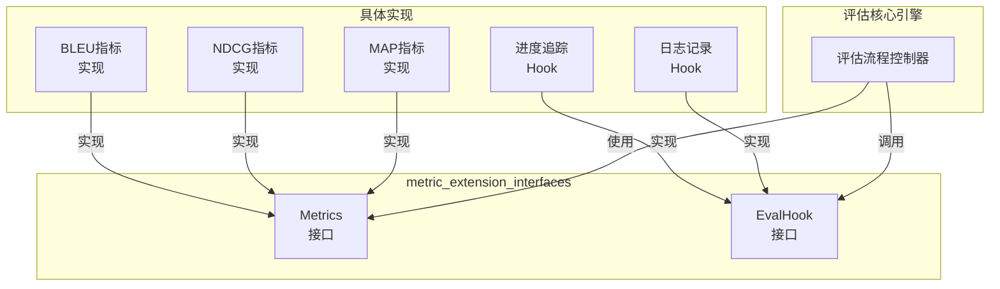

# metric_extension_interfaces 模块技术深度解析

## 1. 问题空间：为什么需要这个模块？

在评估系统中，核心挑战在于**如何在保持核心评估逻辑稳定的同时，支持灵活的指标扩展和流程定制**。想象一下，如果评估代码直接硬编码了所有指标计算逻辑，那么每次添加新指标、调整现有指标或需要在评估流程中插入自定义逻辑时，都需要修改核心评估代码，这不仅违反了开闭原则，还会导致代码变得脆弱且难以维护。

这个模块的出现正是为了解决这个问题：它提供了一组清晰的接口抽象，将指标计算和评估流程扩展点与核心评估引擎解耦，使得系统可以在不修改核心代码的情况下，动态地添加新的评估指标和自定义评估流程钩子。

## 2. 核心抽象与心理模型

理解这个模块的关键在于掌握两个核心抽象：

### `Metrics` 接口：指标计算器
把它想象成一个**通用的评分机器**——你给它输入数据（`MetricInput`），它就会输出一个分数（`float64`）。不同的指标实现就是不同类型的评分机器，有的计算精确度，有的计算召回率，有的计算BLEU分数等等。核心评估引擎不需要知道具体是哪种评分机器，它只需要知道如何"喂"数据给它，然后获取结果。

### `EvalHook` 接口：评估流程钩子
把它想象成**评估过程中的检查站**——在评估流程的不同阶段（如开始、每个样本处理完、结束等），核心引擎会停下来，通知所有注册的钩子，让它们有机会执行自定义逻辑。这就像在工厂生产线上，每个工位都可以安装质量检查设备，在生产过程的不同阶段进行检查或记录。



## 3. 数据流程与组件交互

让我们通过一个典型的评估任务来追踪数据如何流经这个模块：

1. **评估启动**：核心评估引擎从`EvaluationService`接收到评估请求，准备开始评估。
   
2. **数据准备**：通过`DatasetService`获取测试数据集（`[]*types.QAPair`）。

3. **指标计算**：
   - 核心引擎为每个测试样本生成模型输出
   - 将期望输出与实际输出组装成`types.MetricInput`
   - 调用所有注册的`Metrics.Compute()`方法计算各项指标
   - 收集计算结果并聚合

4. **钩子调用**：在评估流程的关键点（如开始、每个样本处理完、结束等），核心引擎会：
   - 确定当前的`EvalState`
   - 准备相关的上下文数据
   - 调用所有注册的`EvalHook.Handle()`方法

整个流程中，核心引擎只依赖于接口，不依赖于具体实现，这使得系统具有极高的可扩展性。

## 4. 组件深度解析

### `Metrics` 接口

```go
type Metrics interface {
    Compute(metricInput *types.MetricInput) float64
}
```

**设计意图**：这是一个典型的策略模式接口，它将指标计算算法封装成独立的策略。每个指标都是一个独立的策略实现，可以单独开发、测试和部署。

**参数**：
- `metricInput *types.MetricInput`：包含了计算指标所需的所有数据，通常包括期望输出、实际输出、上下文信息等。

**返回值**：
- `float64`：指标计算的结果分数，通常在0到1之间，但具体范围取决于指标定义。

**设计考量**：
- 接口设计非常简洁，只包含一个方法，这使得实现起来非常容易
- 返回值使用`float64`是一个通用的选择，可以适应大多数指标的需求
- 没有错误返回值，这意味着指标计算应该是"安全的"——如果遇到问题，应该通过返回特殊值（如0或NaN）来处理，而不是返回错误

### `EvalHook` 接口

```go
type EvalHook interface {
    Handle(ctx context.Context, state types.EvalState, index int, data interface{}) error
}
```

**设计意图**：这是一个典型的观察者模式接口，它允许外部组件监听评估流程的状态变化并做出响应。

**参数**：
- `ctx context.Context`：上下文，用于传递超时、取消信号和其他请求范围的数据
- `state types.EvalState`：当前的评估状态，表示评估流程处于哪个阶段
- `index int`：当前处理的样本索引，对于批量操作可能是-1
- `data interface{}`：与当前状态相关的数据，类型取决于具体的状态

**返回值**：
- `error`：如果钩子处理失败，可以返回错误，这可能会影响评估流程的继续执行

**设计考量**：
- 使用`context.Context`是Go语言的标准做法，提供了良好的请求控制能力
- `EvalState`是一个枚举类型，定义了评估流程的所有可能状态
- `data interface{}`提供了最大的灵活性，但也意味着实现者需要进行类型断言
- 允许返回错误是一个重要的设计决策，这意味着钩子可以影响评估流程的执行

## 5. 设计决策与权衡

### 接口极简主义 vs 功能丰富

**决策**：选择了极简的接口设计，每个接口只包含一个方法。

**理由**：
- 遵循"接口隔离原则"，客户端不应该依赖它不需要的方法
- 简单的接口更容易实现和测试
- 可以通过组合多个简单接口来创建更复杂的功能

**权衡**：
- 优点：灵活性高，实现简单
- 缺点：可能需要创建更多的接口类型，代码量稍多

### 无错误返回 vs 有错误返回

**决策**：`Metrics.Compute()`没有错误返回，而`EvalHook.Handle()`有错误返回。

**理由**：
- 指标计算应该是纯粹的计算逻辑，不应该有副作用，也不应该失败（或者失败时可以返回默认值）
- 钩子可能涉及IO操作、状态修改等有副作用的操作，这些操作可能会失败，需要能够报告错误

**权衡**：
- 优点：符合两种接口的不同使用场景
- 缺点：一致性稍差，需要开发者理解两种接口的不同预期

### 通用数据类型 vs 具体数据类型

**决策**：`EvalHook.Handle()`使用`interface{}`作为数据参数。

**理由**：
- 不同的评估状态可能需要传递完全不同类型的数据
- 使用`interface{}`提供了最大的灵活性，可以适应未来的扩展

**权衡**：
- 优点：灵活性高，适应各种场景
- 缺点：类型不安全，需要运行时类型断言，容易出现类型错误

## 6. 依赖关系分析

### 依赖的模块

- `internal/types`：提供了核心的数据类型定义，如`EvaluationDetail`、`MetricInput`、`EvalState`、`QAPair`等。这是本模块的基础数据契约。

### 被依赖的模块

- 核心评估引擎：使用这两个接口来执行评估任务和扩展评估流程。
- 各种指标实现模块：如检索质量指标、文本生成质量指标等，它们实现了`Metrics`接口。

### 数据契约

本模块依赖于以下关键数据契约：
- `types.MetricInput`：包含计算指标所需的所有数据
- `types.EvalState`：定义了评估流程的所有可能状态
- `types.QAPair`：表示数据集中的一个问答对
- `types.EvaluationDetail`：包含评估任务的详细信息和结果

## 7. 使用指南与示例

### 实现自定义指标

要实现一个自定义指标，只需要实现`Metrics`接口：

```go
type MyCustomMetric struct{}

func (m *MyCustomMetric) Compute(metricInput *types.MetricInput) float64 {
    expected := metricInput.ExpectedOutput
    actual := metricInput.ActualOutput
    
    if expected == actual {
        return 1.0
    }
    return 0.0
}
```

### 实现自定义钩子

要实现一个自定义钩子，只需要实现`EvalHook`接口：

```go
type LoggingHook struct {
    logger *zap.Logger
}

func (h *LoggingHook) Handle(ctx context.Context, state types.EvalState, index int, data interface{}) error {
    h.logger.Info("Evaluation state changed",
        zap.String("state", string(state)),
        zap.Int("index", index),
        zap.Any("data", data),
    )
    return nil
}
```

### 核心接口使用注意事项

1. **线程安全**：如果你的指标或钩子可能被并发调用，确保它们是线程安全的。
2. **错误处理**：`EvalHook.Handle()`返回的错误可能会中止评估流程，只在真正需要中止时返回错误。
3. **性能考虑**：指标计算应该是快速的，避免在`Compute()`方法中进行耗时操作。
4. **类型安全**：在处理`EvalHook.Handle()`的`data`参数时，务必进行安全的类型断言。

## 8. 边界情况与潜在陷阱

### 常见问题

1. **指标返回值范围**：虽然接口没有强制规定，但大多数指标期望返回0到1之间的值。如果你的指标返回不同范围的值，确保文档清楚说明。
2. **空输入处理**：`metricInput`可能包含空值或无效数据，确保你的实现能够优雅地处理这些情况。
3. **钩子执行顺序**：多个钩子的执行顺序通常是不确定的，不要依赖特定的执行顺序。
4. **上下文取消**：在`EvalHook.Handle()`中，应该尊重`ctx.Done()`信号，在评估被取消时及时清理资源。

### 性能考虑

- 指标计算通常会在每个样本上执行多次，确保计算效率。
- 如果指标需要复杂的初始化，考虑在构造函数中完成，而不是在每次`Compute()`调用时。
- 钩子不应该执行耗时操作，否则会显著影响评估性能。

## 9. 总结

`metric_extension_interfaces`模块是评估系统的扩展点定义核心，它通过两个简洁而强大的接口——`Metrics`和`EvalHook`——实现了评估系统的可扩展性和灵活性。这个模块的设计体现了几个重要的软件设计原则：开闭原则、接口隔离原则、策略模式和观察者模式。

理解这个模块的关键在于认识到它的价值不在于它做了什么，而在于它让什么成为可能——它让评估系统可以在不修改核心代码的情况下，不断地添加新的评估指标和扩展评估流程，从而适应不断变化的评估需求。
