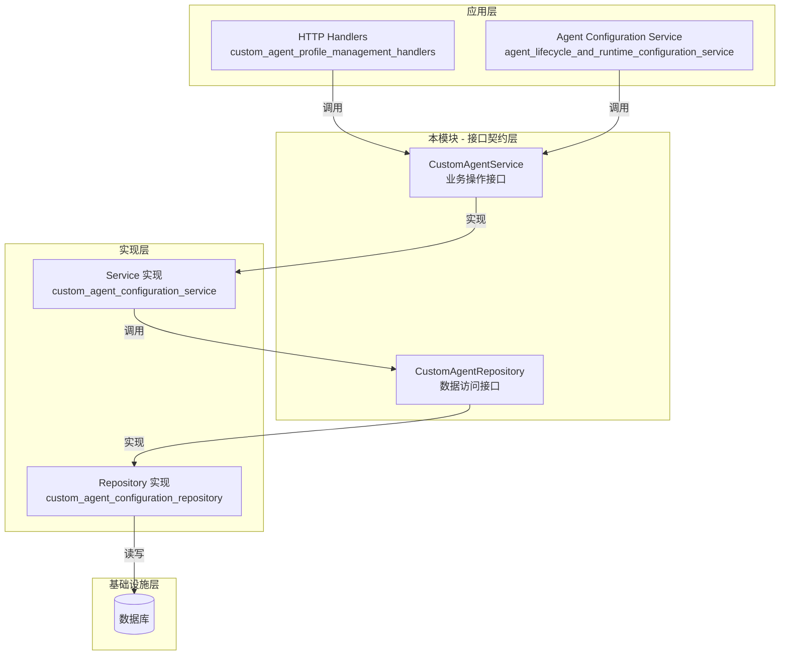

# Custom Agent Service and Persistence Interfaces 技术深度解析

## 1. 模块概览与问题空间

`custom_agent_service_and_persistence_interfaces` 模块定义了自定义代理管理系统的核心契约，位于应用架构的领域层边界。这个模块解决了一个核心问题：**如何在多租户环境中安全、一致地管理自定义代理的生命周期，同时支持内置代理与共享代理的访问控制**。

### 为什么需要这个模块？

想象一个没有明确契约的代理管理系统：业务逻辑可能直接操作数据库表，权限检查散落各处，代理复制和更新逻辑重复实现，不同组件对代理数据的理解不一致。这种设计会导致：
- 业务逻辑与持久化细节强耦合
- 多租户隔离容易被破坏
- 内置代理和自定义代理的行为不一致
- 代码复用困难且测试复杂

本模块通过定义清晰的接口边界，将代理管理的业务操作与数据持久化分离，为整个系统提供了一致的代理管理抽象。

## 2. 核心抽象与心智模型

理解这个模块的关键在于把握两个核心接口的角色划分和它们之间的关系。可以将其想象成**图书馆管理系统**：

- **CustomAgentService** 是图书管理员：负责处理借书、还书、查找书籍等业务操作，验证读者权限，管理图书的借阅状态，处理特殊请求（如复印图书）。
- **CustomAgentRepository** 是图书仓库保管员：只负责图书的物理存放和检索，不关心谁来借书或借书规则，只按编号和区域存取图书。
- **types.CustomAgent** 是图书本身：包含书名、作者、ISBN 等信息。

这种分离遵循了**领域驱动设计（DDD）**中的服务-仓库模式，以及**单一职责原则**。

## 3. 架构设计与数据流程

### Mermaid 架构图



### 数据流与组件交互

#### 关键操作流程：创建代理

1. **HTTP 层**接收创建请求，构建 `types.CustomAgent` 对象
2. **调用** `CustomAgentService.CreateAgent(ctx, agent)`
3. **服务实现层**执行：
   - 从 `ctx` 提取租户 ID 和用户身份
   - 验证权限（是否允许创建代理）
   - 验证代理配置（名称合法性、模型配置等）
   - 设置创建时间、创建者等元数据
   - **调用** `CustomAgentRepository.CreateAgent(ctx, agent)`
4. **仓库实现层**执行：
   - 生成唯一 ID
   - 执行数据库 INSERT 操作
   - 处理唯一约束冲突等错误
5. 结果沿调用链反向返回，最终返回包含生成 ID 的代理对象

#### 关键操作流程：查询共享代理

1. 调用 `CustomAgentService.GetAgentByIDAndTenant(ctx, id, tenantID)`
2. 服务层：
   - 验证当前用户是否有权访问目标租户的代理
   - **跳过内置代理解析**（这是与 `GetAgentByID` 的关键区别）
   - 直接调用仓库层的 `GetAgentByID(ctx, id, tenantID)`
3. 返回结果

## 4. 核心组件深度解析

### CustomAgentService 接口

**职责**：定义自定义代理管理的高层业务操作契约。

**设计意图**：
- 封装所有代理相关的业务逻辑（权限、验证、排序、内置代理处理）
- 提供统一的入口点，隐藏复杂的实现细节
- 支持租户隔离和跨租户共享场景

#### 关键方法解析

##### `CreateAgent(ctx context.Context, agent *types.CustomAgent) (*types.CustomAgent, error)`

**为什么这样设计**：
- 接收指针类型的 `agent`，允许实现修改对象（如设置 ID、创建时间）
- 返回创建后的完整对象，确保调用方获得系统生成的字段
- 上下文携带用户身份和租户信息，实现隐式的多租户隔离

**隐含契约**：
- 实现必须验证代理配置的完整性和合法性
- 实现必须检查当前用户是否有创建代理的权限
- 返回的代理必须包含系统生成的唯一 ID

##### `GetAgentByID(ctx context.Context, id string) (*types.CustomAgent, error)`

**特殊之处**：
- 从上下文获取租户 ID（隐式租户隔离）
- 包含**内置代理解析**逻辑（优先查找内置代理）
- 这是最常用的查询方法，适用于当前租户内的操作

##### `GetAgentByIDAndTenant(ctx context.Context, id string, tenantID uint64) (*types.CustomAgent, error)`

**设计决策**：
- 显式接收 `tenantID`，支持跨租户访问（共享代理场景）
- **跳过内置代理解析**（因为内置代理是全局的，不需要按租户查询）
- 这个方法体现了系统对"共享代理"的支持

**使用场景**：
- 用户访问其他租户共享的代理
- 系统管理员跨租户管理代理

##### `ListAgents(ctx context.Context) ([]*types.CustomAgent, error)`

**排序约定**：
- **内置代理优先**（保证用户总是能看到系统提供的基础代理）
- 自定义代理按**创建时间排序**（隐含契约，文档中明确说明）

**为什么内置代理优先**：
- 提升用户体验：用户首先看到的是系统推荐的、经过验证的代理
- 降低新手门槛：内置代理通常配置良好，适合快速上手

##### `UpdateAgent(ctx context.Context, agent *types.CustomAgent) (*types.CustomAgent, error)`

**权限约束**：
- 明确禁止修改**内置代理**（文档中声明的错误情况）
- 实现必须验证代理的所有权（只能更新自己租户的代理）

##### `DeleteAgent(ctx context.Context, id string) error`

**约束**：
- 禁止删除**内置代理**
- 级联删除考虑：实现需要处理与该代理相关的资源（如会话历史）

##### `CopyAgent(ctx context.Context, id string) (*types.CustomAgent, error)`

**设计亮点**：
- 这是一个**业务级操作**，而非简单的数据库复制
- 隐含的业务规则：
  - 复制的代理属于当前租户
  - 名称可能需要添加 "(副本)" 后缀
  - 复制过程中可能需要重置某些状态字段
  - 记录复制来源信息

**为什么需要这个方法**：
- 用户希望基于现有代理进行微调，而不是从零开始配置
- 这是一个高频操作，因此作为一级方法提供

### CustomAgentRepository 接口

**职责**：定义代理数据的持久化和检索契约。

**设计原则**：
- **纯粹的数据访问**：不包含业务逻辑，只负责 CRUD 操作
- **显式租户隔离**：所有查询方法都显式接收 `tenantID`，确保数据隔离
- **复合主键设计**：从 `DeleteAgent` 方法可以推断，代理使用 `(id, tenantID)` 作为复合主键

#### 关键方法解析

##### `GetAgentByID(ctx context.Context, id string, tenantID uint64) (*types.CustomAgent, error)`

**与 Service 层的区别**：
- 显式接收 `tenantID`（Repository 层不假设当前租户）
- 不处理内置代理（Repository 只负责持久化的数据）

##### `ListAgentsByTenantID(ctx context.Context, tenantID uint64) ([]*types.CustomAgent, error)`

**契约特点**：
- 没有指定排序顺序（Repository 层不关心业务排序）
- 只返回指定租户的代理（没有内置代理）
- Service 层会在此基础上添加内置代理并排序

##### `DeleteAgent(ctx context.Context, id string, tenantID uint64) error`

**设计细节**：
- 同时需要 `id` 和 `tenantID`，确认了**复合主键**的设计
- 这种设计可以防止：
  - 误删其他租户的数据
  - ID 冲突时的误操作

## 5. 依赖关系分析

### 模块依赖结构

```
本模块
├── 依赖: internal/types (types.CustomAgent)
└── 被依赖: 
    ├── application_services_and_orchestration/agent_identity_tenant_and_configuration_services/agent_configuration_and_capability_services
    └── http_handlers_and_routing/agent_tenant_organization_and_model_management_handlers/custom_agent_profile_management_handlers
```

### 关键数据契约

**types.CustomAgent** 是整个模块的核心数据结构，虽然我们没有看到它的定义，但从接口使用可以推断它包含：
- 唯一标识符（ID）
- 租户关联（TenantID）
- 基本信息（名称、描述、图标等）
- 配置信息（模型选择、提示词模板、工具配置等）
- 元数据（创建时间、更新时间、创建者等）
- 标志位（是否内置、是否共享等）

### 与其他模块的交互

1. **与 custom_agent_domain_models 的关系**：
   - 本模块定义接口，那个模块定义数据结构
   - 两者共同构成自定义代理的领域模型

2. **与 custom_agent_configuration_repository 的关系**：
   - 本模块定义契约，那个模块提供实现
   - 典型的"依赖倒置原则"应用

3. **与 agent_sharing_service 的关系**：
   - 共享服务会使用 `GetAgentByIDAndTenant` 方法访问其他租户的代理

## 6. 设计决策与权衡

### 1. 服务层与仓库层分离

**选择**：明确区分业务操作（Service）和数据访问（Repository）

**理由**：
- **可测试性**：可以轻松 mock Repository 来测试 Service 逻辑
- **单一职责**：Service 处理业务规则，Repository 处理持久化
- **灵活性**：可以更换持久化方案而不影响业务逻辑

**权衡**：
- 增加了一层抽象，简单场景下可能显得过度设计
- 需要维护两个接口及其实现

### 2. 上下文传递租户信息 vs 显式参数

**选择**：Service 层从 `ctx` 隐式获取租户，Repository 层显式接收 `tenantID`

**理由**：
- Service 层：简化 API，调用方不需要手动传递租户（避免错误）
- Repository 层：显式依赖，更清晰，更容易测试，不依赖上下文解析

**权衡**：
- Service 层实现必须正确地从上下文解析租户（增加了实现复杂度）
- Repository 层方法签名稍显冗长，但更安全

### 3. 内置代理的处理方式

**选择**：Service 层在查询时合并内置代理，Repository 层不涉及

**理由**：
- 内置代理可能不是存储在数据库中（可能在代码中定义）
- 内置代理是业务概念，不是持久化概念
- 保持 Repository 层的纯粹性

**权衡**：
- Service 层需要维护内置代理的定义和查找逻辑
- List 操作需要合并两个来源的数据并排序

### 4. CopyAgent 作为一级操作

**选择**：将代理复制作为 Service 接口的一级方法，而不是让调用方实现

**理由**：
- 高频业务操作，提供统一实现避免重复代码
- 复制过程包含业务规则（如名称处理、权限验证）
- 可以在复制时记录审计信息

**权衡**：
- 增加了接口的大小
- 如果复制逻辑变化，需要修改接口

### 5. 复合主键设计

**选择**：使用 `(id, tenantID)` 作为代理的复合主键

**理由**：
- 天然支持多租户隔离
- 允许不同租户使用相同的 ID（虽然实现中可能使用全局唯一 ID）
- 删除和更新操作必须提供租户 ID，防止跨租户操作

**权衡**：
- 查询操作总是需要两个参数
- 与全局唯一 ID 相比，稍微复杂一些

## 7. 使用指南与最佳实践

### 服务消费者指南

**对于 HTTP 处理器或应用服务的开发者**：

1. **优先使用 Service 层**：不要绕过 Service 直接使用 Repository
2. **正确传递上下文**：确保 `ctx` 包含正确的用户身份和租户信息
3. **处理特定错误**：
   - 权限不足错误：返回 403
   - 代理不存在：返回 404
   - 不能修改/删除内置代理：返回 400 或 403

### 服务实现者指南

**对于实现这些接口的开发者**：

1. **Service 实现必须**：
   - 从 `ctx` 正确解析用户身份和租户 ID
   - 在所有操作前验证权限
   - 处理内置代理的逻辑（查询时合并，更新/删除时保护）
   - 在 `ListAgents` 中确保正确的排序顺序
   - 在 `CopyAgent` 中实现完整的复制业务逻辑

2. **Repository 实现必须**：
   - 确保所有操作都严格遵守租户隔离
   - 不包含任何业务逻辑，只做数据访问
   - 正确处理复合主键 `(id, tenantID)`
   - 不要尝试处理内置代理

## 8. 边缘情况与注意事项

### 内置代理的特殊性

- **无法修改或删除**：任何对内置代理的更新或删除操作都应该失败
- **不存储在数据库中**：Repository 层不会返回内置代理
- **全局可见**：所有租户都能看到相同的内置代理列表

### 共享代理的访问控制

- `GetAgentByIDAndTenant` 是访问其他租户代理的唯一途径
- 实现必须验证当前用户是否有权访问目标租户的代理
- 共享代理不是内置代理，所以会跳过内置代理解析

### 多租户隔离的强制执行

- Repository 层的所有方法都显式接收 `tenantID`，这是最后的安全防线
- 即使 Service 层出现漏洞，Repository 层也能防止跨租户数据访问
- 删除和更新操作必须同时提供 `id` 和 `tenantID`

### 上下文的重要性

- Service 层的大多数方法都依赖 `ctx` 来获取租户信息
- 如果上下文不正确，可能导致：访问错误的租户数据、权限检查失败、操作被拒绝
- 测试时必须正确构造包含租户信息的上下文

## 9. 总结

`custom_agent_service_and_persistence_interfaces` 模块是自定义代理管理系统的核心契约层，通过清晰的接口分离解决了多租户环境下代理生命周期管理的复杂性。它体现了几个重要的设计原则：

1. **依赖倒置**：高层模块（应用服务）和低层模块（持久化实现）都依赖于抽象
2. **关注点分离**：业务逻辑与数据访问明确分离
3. **接口隔离**：定义了最小化的、内聚的接口
4. **防御性设计**：通过显式租户参数和复合主键确保多租户安全

理解这个模块的关键是把握 Service 层和 Repository 层的职责划分，以及它们如何协同工作来实现安全、灵活的代理管理。