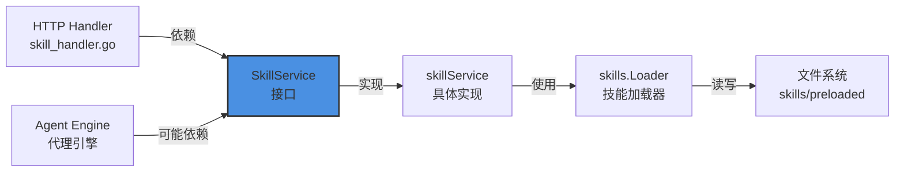

# skill_capability_service_interface 模块技术深度解析

## 1. 模块概述与问题空间

### 1.1 什么问题需要解决？

在 WeKnora 系统中，Agent Skills 是扩展智能代理功能的核心机制。这些技能遵循 Claude 的 Progressive Disclosure（渐进式披露）设计模式，允许代理在需要时才加载详细的指令内容，而不是一次性将所有技能信息加载到内存中。

问题在于，我们需要一个统一的服务层来：
1. **发现和列出预加载的技能** - 提供轻量级的元数据，让系统知道有哪些技能可用
2. **按需加载完整的技能定义** - 只在需要时才加载完整的技能指令，节省内存
3. **提供一致的技能访问接口** - 让不同的调用方（HTTP 处理器、代理引擎）都能以相同方式访问技能

如果没有这个服务层，每个组件都会直接与文件系统和技能加载器交互，导致代码重复、耦合度高，难以维护和测试。

### 1.2 模块的核心价值

`skill_capability_service_interface` 模块通过定义 `SkillService` 接口，提供了一个清晰的抽象层，将技能管理的业务逻辑与具体实现解耦。这种设计使得：
- 技能管理逻辑可以独立演进
- 可以轻松替换底层实现（例如从文件系统加载改为从数据库加载）
- 便于进行单元测试（可以 mock 这个接口）

## 2. 核心抽象与心智模型

### 2.1 渐进式披露模式

这个模块的核心设计理念是 **Claude 的 Progressive Disclosure（渐进式披露）模式**。想象一下图书馆的卡片目录系统：

- **Level 1（元数据）**：卡片目录上的书名和简介 - 总是可见，让你知道有哪些书
- **Level 2（指令）**：书的完整内容 - 只有当你决定借阅并打开书时才能看到
- **Level 3（资源）**：书中引用的其他资料 - 按需访问

在技能系统中：
- `SkillMetadata` 对应 Level 1（轻量级，始终加载）
- `Skill` 中的 `Instructions` 对应 Level 2（按需加载）
- `SkillFile` 对应 Level 3（额外资源）

### 2.2 服务接口的角色

可以将 `SkillService` 想象成一个**技能图书馆管理员**：
- 当你询问"有哪些技能可用？"时，管理员会给你一份技能目录（`ListPreloadedSkills`）
- 当你说"我要借这个技能"时，管理员会去找到完整的技能定义并交给你（`GetSkillByName`）

## 3. 核心组件详解

### 3.1 SkillService 接口

```go
type SkillService interface {
    // ListPreloadedSkills returns metadata for all preloaded skills
    ListPreloadedSkills(ctx context.Context) ([]*skills.SkillMetadata, error)

    // GetSkillByName retrieves a skill by its name
    GetSkillByName(ctx context.Context, name string) (*skills.Skill, error)
}
```

这个接口定义了两个核心方法，它们的设计都遵循了单一职责原则：

#### ListPreloadedSkills 方法

**目的**：获取所有预加载技能的轻量级元数据

- **参数**：`context.Context` - 用于传递请求上下文、超时控制等
- **返回值**：
  - `[]*skills.SkillMetadata` - 技能元数据列表，只包含名称、描述和基础路径
  - `error` - 错误信息

**设计意图**：这个方法的设计体现了"只返回必要信息"的原则。在大多数情况下，调用方只需要知道有哪些技能可用，而不需要完整的技能内容。通过只返回元数据，我们大大减少了内存占用和网络传输量。

#### GetSkillByName 方法

**目的**：根据技能名称获取完整的技能定义

- **参数**：
  - `context.Context` - 请求上下文
  - `name string` - 技能名称
- **返回值**：
  - `*skills.Skill` - 完整的技能对象，包含指令内容
  - `error` - 错误信息

**设计意图**：这个方法实现了按需加载。只有当真正需要使用某个技能时，才会加载其完整内容。这种懒加载策略对于拥有大量技能的系统来说，可以显著提升启动性能和内存使用效率。

## 4. 架构与数据流

### 4.1 组件关系图



### 4.2 典型数据流

#### 场景 1：列出可用技能（前端请求）

1. **HTTP 请求** → `SkillHandler.ListSkills`
2. 调用 `SkillService.ListPreloadedSkills(ctx)`
3. `skillService` 确保自己已初始化（懒加载模式）
4. 委托给 `skills.Loader.DiscoverSkills()` 发现技能
5. 返回 `[]*SkillMetadata`
6. `SkillHandler` 转换为响应格式，返回给前端

#### 场景 2：获取完整技能（代理使用）

1. **代理引擎** → 调用 `SkillService.GetSkillByName(ctx, "skill-name")`
2. `skillService` 确保初始化
3. 委托给 `skills.Loader.LoadSkillInstructions(name)`
4. 加载并解析 `SKILL.md` 文件
5. 返回完整的 `*Skill` 对象

## 5. 设计决策与权衡

### 5.1 接口与实现分离

**决策**：定义 `SkillService` 接口，而不是直接提供具体实现

**原因**：
- **依赖倒置原则**：高层模块（如 HTTP 处理器）依赖抽象，而不是具体实现
- **可测试性**：可以轻松创建 mock 实现进行单元测试
- **可扩展性**：未来可以添加不同的实现（如从数据库加载技能）

**权衡**：
- ✅ 优点：降低耦合，提高灵活性
- ⚠️ 缺点：增加了一层抽象，对于简单场景可能略显过度设计

### 5.2 懒加载初始化

**决策**：`skillService` 使用 `ensureInitialized` 方法进行懒加载初始化

**原因**：
- 避免在应用启动时就进行不必要的文件系统操作
- 如果技能功能未被使用，不会产生任何开销
- 可以优雅地处理技能目录不存在的情况

**权衡**：
- ✅ 优点：启动更快，资源使用更高效
- ⚠️ 缺点：第一次调用会有额外的初始化开销，需要处理并发初始化的情况（使用互斥锁）

### 5.3 只读操作的并发安全

**决策**：使用 `sync.RWMutex` 而不是 `sync.Mutex`

**原因**：
- `ListPreloadedSkills` 和 `GetSkillByName` 都是只读操作
- 多个 goroutine 可以同时进行读操作，提高并发性能
- 只有在初始化时才需要写锁

**权衡**：
- ✅ 优点：读操作并发性能更好
- ⚠️ 缺点：RWMutex 比 Mutex 稍微复杂一些，内存开销略大

### 5.4 技能目录的灵活配置

**决策**：支持通过环境变量 `WEKNORA_SKILLS_DIR` 配置技能目录，并有多个回退策略

**原因**：
- 不同的部署环境可能有不同的目录结构
- 开发环境和生产环境的需求不同
- 提供合理的默认值，简化配置

**权衡**：
- ✅ 优点：灵活性高，适应不同场景
- ⚠️ 缺点：增加了路径解析的逻辑复杂性

## 6. 依赖分析

### 6.1 模块依赖

`skill_capability_service_interface` 模块是一个相对轻量级的接口定义模块，它的依赖非常简单：

- **直接依赖**：
  - `context.Context`：标准库，用于上下文传递
  - `github.com/Tencent/WeKnora/internal/agent/skills`：技能核心模型和加载器

- **被依赖**：
  - `internal/application/service/skill_service.go`：实现了这个接口
  - `internal/handler/skill_handler.go`：HTTP 层使用这个接口
  - （潜在）代理引擎：可能在运行时使用这个接口加载技能

### 6.2 数据契约

这个模块依赖两个关键的数据结构，它们都来自 `skills` 包：

1. **SkillMetadata** - 轻量级技能元数据
   ```go
   type SkillMetadata struct {
       Name        string
       Description string
       BasePath    string
   }
   ```

2. **Skill** - 完整的技能定义
   ```go
   type Skill struct {
       Name         string
       Description  string
       BasePath     string
       FilePath     string
       Instructions string  // 按需加载
       Loaded       bool
   }
   ```

## 7. 使用指南与常见模式

### 7.1 如何使用 SkillService

在你的组件中使用 `SkillService` 非常简单，只需要遵循依赖注入的模式：

```go
// 1. 在你的结构体中依赖 SkillService 接口
type YourComponent struct {
    skillService interfaces.SkillService
}

// 2. 通过构造函数注入
func NewYourComponent(skillService interfaces.SkillService) *YourComponent {
    return &YourComponent{
        skillService: skillService,
    }
}

// 3. 使用服务
func (c *YourComponent) DoSomething(ctx context.Context) error {
    // 列出技能
    skills, err := c.skillService.ListPreloadedSkills(ctx)
    if err != nil {
        return err
    }
    
    // 或者获取特定技能
    skill, err := c.skillService.GetSkillByName(ctx, "my-skill")
    if err != nil {
        return err
    }
    
    // 使用技能...
    return nil
}
```

### 7.2 创建 SkillService 实例

在应用的组合根（composition root）中，你可以这样创建实例：

```go
skillService := service.NewSkillService()
```

### 7.3 配置技能目录

有三种方式配置技能目录（按优先级排序）：

1. **环境变量**：设置 `WEKNORA_SKILLS_DIR` 环境变量
2. **可执行文件相对路径**：查找 `{executable_dir}/skills/preloaded`
3. **当前工作目录**：查找 `{cwd}/skills/preloaded`
4. **默认值**：使用 `skills/preloaded`

## 8. 注意事项与潜在陷阱

### 8.1 技能文件格式要求

`SkillService` 期望技能文件遵循特定的格式：
- 每个技能是一个目录
- 目录中必须有 `SKILL.md` 文件
- `SKILL.md` 必须以 YAML frontmatter 开头，用 `---` 包围
- 技能名称只能包含 Unicode 字母、数字和连字符
- 不能包含保留字 "anthropic" 和 "claude"

如果技能文件格式不正确，`GetSkillByName` 会返回错误。

### 8.2 并发安全

`skillService` 的实现是并发安全的，但需要注意：
- 初始化是线程安全的
- 多个读操作可以并发进行
- 但技能目录的内容在运行时更改不会自动反映 - 需要重启服务

### 8.3 技能可用性与沙箱模式

从 `SkillHandler.ListSkills` 的实现可以看出，技能的可用性与沙箱模式相关联：
- 只有当 `WEKNORA_SANDBOX_MODE` 不为空且不为 "disabled" 时，`skills_available` 才为 true
- 前端会根据这个标志决定是否显示技能 UI

这是因为技能可能包含需要在沙箱中执行的脚本，没有沙箱环境可能会有安全风险。

### 8.4 错误处理

使用 `SkillService` 时，需要妥善处理以下错误情况：
- 技能目录不存在（会被自动创建，但可能没有技能）
- 技能文件格式无效
- 请求的技能不存在
- 文件系统权限问题

## 9. 总结

`skill_capability_service_interface` 模块是一个设计精巧的接口定义模块，它通过定义 `SkillService` 接口，为技能管理提供了一个清晰、一致的抽象层。这个模块体现了几个重要的设计原则：

1. **依赖倒置**：高层模块依赖抽象，而不是具体实现
2. **渐进式披露**：只在需要时才加载完整信息
3. **懒加载**：延迟初始化，提高启动性能
4. **接口隔离**：定义最小化的接口，只包含必要的方法

虽然这个模块很小，但它在整个系统中扮演着重要的角色，连接了 HTTP 层、应用服务层和技能核心功能层，是理解 WeKnora 技能系统的关键入口点。

## 10. 相关模块链接

- [skill 核心模型与加载器](agent-runtime-and-tools-agent-skills-lifecycle-and-skill-tools-skill-definition-models.md)
- [skill_service 具体实现](application-services-and-orchestration-agent-identity-tenant-and-configuration-services-agent-configuration-and-capability-services.md)
- [skill HTTP 处理器](http-handlers-and-routing-agent-tenant-organization-and-model-management-handlers.md)
