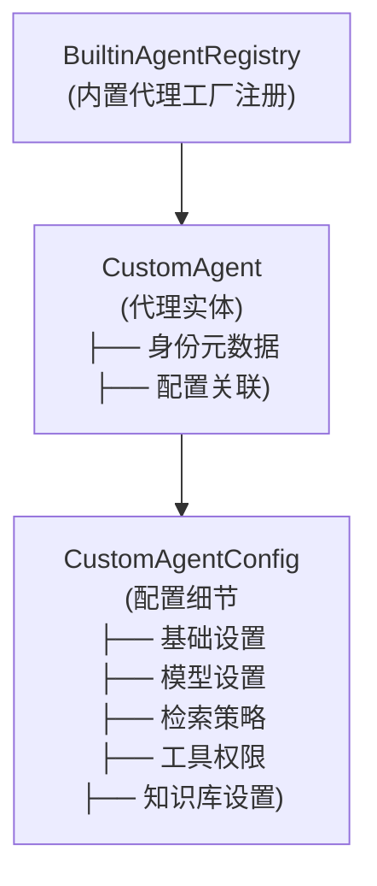

# Custom Agent Domain Models 模块深度解析

## 1. 概述

**问题背景**：在构建一个支持多租户的 AI 助手平台中，需要支持不同场景的 AI 代理配置管理是一个复杂问题。不同用户需要不同的代理配置，有的只需要快速的 RAG 问答，有的需要多步推理和工具调用，还有的需要专业领域的数据分析。直接硬编码这些配置会导致代码难以维护和扩展。

**模块解决的问题**：这个模块提供了一套统一的代理配置领域模型，允许系统同时支持内置代理（如快速问答、智能推理、数据分析师）和用户自定义代理，并通过统一的配置结构来描述代理的所有行为特征，包括使用的模型、检索策略、工具权限、知识库访问权限等。

简单来说，这个模块是整个代理系统的"配置中心"，它定义了代理"是什么"、"能做什么"以及"怎么做"的核心数据结构。

## 2. 架构与核心抽象

### 2.1 核心架构图



### 2.2 核心抽象与思维模型

我们可以把这个模块想象成一个**代理的"身份证+简历"系统：

- **CustomAgent** 是代理的"身份证"，包含了代理的基本身份信息（ID、名称、描述、所属租户等）
- **CustomAgentConfig** 是代理的"详细简历"，详细描述了代理的技能、偏好、工作方式等
- **BuiltinAgentRegistry** 是"人才库"，提供了预置的代理模板

这种设计的核心思想是**配置驱动**：将代理的行为完全由配置决定，而不是硬编码在逻辑中。这使得系统可以灵活地创建、复制、修改代理配置，而无需改变代码。

### 2.3 两种代理模式

模块定义了两种核心代理模式：

1. **Quick Answer（快速问答模式）**：类似传统 RAG 模式，直接基于检索结果回答问题，速度快但推理能力有限
2. **Smart Reasoning（智能推理模式）**：ReAct 模式，支持多步思考、工具调用、推理链，能力强但耗时较长

这两种模式覆盖了绝大多数使用场景，通过 `AgentMode` 常量统一管理。

## 3. 组件深度解析

### 3.1 CustomAgent 结构体

**职责**：作为代理的核心实体，代表一个完整的代理配置，包含身份元数据和具体配置。

```go
type CustomAgent struct {
    ID string        // 代理唯一标识，内置代理使用固定 ID，自定义代理使用 UUID
    Name string       // 代理名称
    Description string // 代理描述
    Avatar string     // 代理头像（emoji 或图标名）
    IsBuiltin bool   // 是否为内置代理
    TenantID uint64   // 租户 ID（复合主键）
    CreatedBy string  // 创建者用户 ID
    Config CustomAgentConfig // 代理详细配置
    // ... 时间戳字段
}
```

**设计亮点**：
- 使用复合主键 `(ID, TenantID)`，这意味着同一个租户下代理 ID 唯一，不同租户可以有相同 ID 的代理（特别是内置代理）
- 内置代理与自定义代理共享同一数据结构，通过 `IsBuiltin` 标志区分，简化了代码逻辑
- `Config` 字段使用 JSON 类型存储，提供了极大的配置灵活性

### 3.2 CustomAgentConfig 结构体

这是模块中最复杂的结构体，包含了代理行为的所有配置细节，可分为以下几个部分：

#### 3.2.1 基础设置
- `AgentMode`：代理模式，决定代理的基本行为范式
- `SystemPrompt`：系统提示词，定义代理的角色和行为
- `ContextTemplate`：上下文模板，用于格式化检索到的知识块

#### 3.2.2 模型设置
- `ModelID`：对话使用的模型 ID
- `RerankModelID`：重排序模型 ID
- `Temperature`：LLM 温度参数
- `MaxCompletionTokens`：最大生成 token 数
- `Thinking`：是否启用思考模式

#### 3.2.3 智能推理模式设置
- `MaxIterations`：ReAct 循环最大迭代次数
- `AllowedTools`：允许使用的工具列表
- `ReflectionEnabled`：是否启用反思
- `MCPSelectionMode`：MCP 服务选择模式
- `MCPServices`：选定的 MCP 服务 ID 列表

#### 3.2.4 技能设置
- `SkillsSelectionMode`：技能选择模式
- `SelectedSkills`：选定的技能名称列表

#### 3.2.5 知识库设置
- `KBSelectionMode`：知识库选择模式
- `KnowledgeBases`：关联的知识库 ID 列表
- `RetrieveKBOnlyWhenMentioned`：是否仅在明确提及知识库时才检索

#### 3.2.6 检索策略设置
- `EmbeddingTopK`：向量检索 top K
- `KeywordThreshold`：关键词检索阈值
- `VectorThreshold`：向量检索阈值
- `RerankTopK`：重排序 top K
- `RerankThreshold`：重排序阈值

**设计亮点**：
- 配置字段按功能分组，结构清晰
- 使用"选择模式+选定列表"的模式（如 `KBSelectionMode` + `KnowledgeBases`），提供了灵活的资源选择方式
- 大量使用默认值机制，减少配置负担

### 3.3 内置代理工厂函数

模块提供了三个内置代理的工厂函数：

1. **GetBuiltinQuickAnswerAgent**：快速问答（RAG）代理
2. **GetBuiltinSmartReasoningAgent**：智能推理（ReAct）代理
3. **GetBuiltinDataAnalystAgent**：数据分析师代理

这些函数返回预设配置的代理实例，展示了如何使用配置结构创建不同类型的代理。

**设计亮点**：
- 使用工厂模式创建内置代理，便于扩展新的内置代理
- 每个内置代理都有明确的定位和预设配置
- 数据分析师代理展示了如何通过配置实现专业领域的代理

### 3.4 BuiltinAgentRegistry 注册表

```go
var BuiltinAgentRegistry = map[string]func(uint64) *CustomAgent{
    BuiltinQuickAnswerID:    GetBuiltinQuickAnswerAgent,
    BuiltinSmartReasoningID: GetBuiltinSmartReasoningAgent,
    BuiltinDataAnalystID:    GetBuiltinDataAnalystAgent,
}
```

这是一个注册表模式，将内置代理 ID 映射到对应的工厂函数。这种设计使得添加新的内置代理变得简单，只需在注册表中添加条目即可。

### 3.5 辅助方法

#### EnsureDefaults 方法
确保代理配置有合理的默认值，避免零值导致的意外行为。

```go
func (a *CustomAgent) EnsureDefaults() {
    // 设置各种默认值...
    // 智能推理模式强制启用多轮对话
    if a.Config.AgentMode == AgentModeSmartReasoning {
        a.Config.MultiTurnEnabled = true
    }
}
```

#### IsAgentMode 方法
便捷方法，判断代理是否为智能推理模式。

## 4. 数据流动与依赖关系

### 4.1 模块在系统中的位置

这个模块处于系统的**核心领域层**，是多个上层模块依赖它：

- [custom_agent_configuration_repository](data-access-repositories-agent-configuration-and-external-service-repositories-custom-agent-configuration-repository.md)：持久化 CustomAgent 实体
- [custom_agent_service_and_persistence_interfaces](core-domain-types-and-interfaces-identity-tenant-organization-and-configuration-contracts-custom-agent-and-skill-capability-contracts-custom-agent-service-and-persistence-interfaces.md)：定义代理服务的接口
- [agent_configuration_and_capability_services](application-services-and-orchestration-agent-identity-tenant-and-configuration-services-agent-configuration-and-capability-services.md)：使用这些模型提供代理配置服务

### 4.2 典型数据流程

1. **代理创建流程**：
   - 调用内置代理工厂函数（如 `GetBuiltinQuickAnswerAgent`）或创建自定义 `CustomAgent` 实例
   - 调用 `EnsureDefaults()` 设置默认值
   - 通过 Repository 层持久化到数据库

2. **代理使用流程**：
   - 从 Repository 层加载 `CustomAgent` 实例
   - 根据 `Config.AgentMode` 决定使用哪种执行路径
   - 从 `Config` 中读取各种参数配置执行逻辑

## 5. 设计决策与权衡

### 5.1 配置驱动的设计

**决策**：将代理的所有行为都通过配置描述，而不是硬编码。

**为什么这样做**：
- 灵活性：可以创建各种类型的代理而无需修改代码
- 可扩展性：新的代理特性只需在配置中添加新字段
- 可序列化：配置可以轻松保存、加载、复制、分享

**权衡**：
- 配置结构会变得复杂，需要仔细管理
- 配置验证逻辑需要额外处理

### 5.2 内置代理与自定义代理统一结构

**决策**：内置代理和自定义代理使用同一个数据结构，通过 `IsBuiltin` 标志区分。

**为什么这样做**：
- 代码复用：不需要为内置代理和自定义代理写两套逻辑
- 统一接口：上层代码不需要知道是内置还是自定义代理
- 便于迁移：自定义代理可以"升级"为内置代理

**权衡**：
- 结构需要同时满足两种代理的需求，可能有些字段对某种代理无用

### 5.3 JSON 存储配置

**决策**：`CustomAgentConfig` 实现了 `driver.Valuer` 和 `sql.Scanner` 接口，作为 JSON 存储在数据库中。

**为什么这样做**：
- 灵活性：配置结构变化不需要数据库迁移
- 可读性：JSON 结构直观，易于调试
- 性能：对于配置这种读多写少的数据，JSON 存储足够高效

**权衡**：
- 失去了数据库的类型检查和索引能力
- 配置结构的查询和过滤需要在应用层处理

### 5.4 复合主键设计

**决策**：使用 `(ID, TenantID)` 作为复合主键。

**为什么这样做**：
- 多租户隔离：每个租户有自己的代理命名空间
- 内置代理复用：内置代理在每个租户都有相同的 ID，但属于不同租户
- 数据隔离：租户间数据天然隔离

**权衡**：
- 查询时总是需要同时提供 ID 和 TenantID
- 增加了查询复杂度

### 5.5 注册表模式管理内置代理

**决策**：使用 `BuiltinAgentRegistry` 映射内置代理 ID 到工厂函数。

**为什么这样做**：
- 易于扩展：添加新的内置代理只需在注册表中添加条目
- 集中管理：所有内置代理在一个地方管理
- 运行时发现：可以动态查询可用的内置代理

**权衡**：
- 注册表需要手动维护，可能忘记添加新代理

## 6. 使用指南与示例

### 6.1 创建自定义代理

```go
// 创建一个自定义代理
agent := &CustomAgent{
    ID:          uuid.New().String(),
    Name:        "我的专属助手",
    Description: "一个专门为我定制的 AI 助手",
    Avatar:      "🤖",
    IsBuiltin:   false,
    TenantID:    123,
    CreatedBy:   "user-456",
    Config: CustomAgentConfig{
        AgentMode:     AgentModeQuickAnswer,
        SystemPrompt: "你是一个乐于助人的 AI 助手...",
        ModelID:      "gpt-4",
        Temperature:   0.7,
        KBSelectionMode: "selected",
        KnowledgeBases: []string{"kb-1", "kb-2"},
    },
}

// 设置默认值
agent.EnsureDefaults()
```

### 6.2 获取内置代理

```go
// 获取快速问答内置代理
quickAnswerAgent := GetBuiltinQuickAnswerAgent(tenantID)

// 通过注册表获取内置代理
smartReasoningAgent := GetBuiltinAgent(BuiltinSmartReasoningID, tenantID)
```

### 6.3 扩展新的内置代理

1. 在 `custom_agent.go` 中添加新的工厂函数：

```go
func GetBuiltinMyNewAgent(tenantID uint64) *CustomAgent {
    return &CustomAgent{
        ID:          "builtin-my-new-agent",
        Name:        "我的新代理",
        // ... 配置
    }
}
```

2. 在 `BuiltinAgentRegistry` 中添加条目：

```go
var BuiltinAgentRegistry = map[string]func(uint64) *CustomAgent{
    // ... 现有条目
    "builtin-my-new-agent": GetBuiltinMyNewAgent,
}
```

3. 在 `builtinAgentIDsOrdered` 中添加 ID（如果需要显示）：

```go
var builtinAgentIDsOrdered = []string{
    // ... 现有 ID
    "builtin-my-new-agent",
}
```

## 7. 边界情况与注意事项

### 7.1 零值与默认值

注意 `EnsureDefaults()` 方法不会覆盖已设置的零值。例如，如果显式将 `Temperature` 设置为 0，`EnsureDefaults()` 会将其重置为默认值 0.7。这可能不是预期行为。

### 7.2 配置验证

模块本身不做配置验证，例如 `ModelID` 是否存在、`KnowledgeBases` 中的 ID 是否有效等。这些验证需要在上层服务中处理。

### 7.3 多租户安全

由于使用复合主键，查询时务必始终包含 `TenantID`，否则可能会访问到其他租户的数据。

### 7.4 内置代理的不可变性

内置代理在代码中定义，不应在数据库中修改。如果需要修改内置代理的行为，应该创建自定义代理。

### 7.5 配置字段的兼容性

当添加新的配置字段时，注意与旧版本的兼容性。由于使用 JSON 存储，旧数据可能缺少新字段，需要在 `EnsureDefaults()` 中处理。

## 8. 总结

`custom_agent_domain_models` 模块是整个代理系统的核心配置中心，它通过统一的配置结构描述代理的所有行为特征。模块的设计体现了配置驱动、灵活扩展的理念，同时通过复合主键实现了多租户隔离，通过注册表模式管理内置代理。

这个模块的设计使得系统可以灵活地支持各种类型的代理，从简单的 RAG 问答到复杂的多步推理代理，都可以通过配置来实现。
