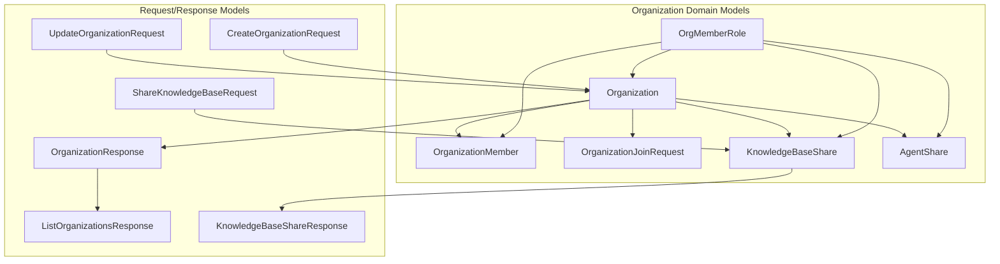

# Organization Domain and Response Models 模块技术深度解析

## 1. 模块概述

### 1.1 架构概览



### 1.2 问题空间与设计目标

在多租户协作系统中，跨租户资源共享与团队协作是一个复杂但至关重要的需求。传统的单租户隔离模型无法满足现代团队协作中"共享知识库"、"联合工作空间"等场景的需求。直接开放租户间的资源访问又会带来严重的安全和治理问题。

`organization_domain_and_response_models` 模块正是为了解决这一问题而设计的。它提供了一个完整的组织（Organization）抽象层，使得：

- 不同租户的用户可以加入同一个"协作空间"
- 资源（知识库、智能体）可以在组织内安全共享
- 权限控制可以在组织级别进行精细管理
- 加入流程和成员管理可以灵活配置

### 1.2 核心设计理念

想象一下，这个模块就像是一个虚拟的"办公室大楼"：
- **Organization** 是大楼本身，有自己的名称、标识和管理规则
- **OrganizationMember** 是大楼的住户，每个人有不同的门禁卡级别（admin/editor/viewer）
- **KnowledgeBaseShare** 和 **AgentShare** 是住户放在共享区域的物品，只有拥有相应权限的人才能使用
- **OrganizationJoinRequest** 是访客申请进入大楼的请求，需要管理员批准

这种设计将资源共享从"直接的租户间访问"转变为"通过组织的间接协作"，既保证了灵活性，又维持了安全性。

## 2. 核心组件深度解析

### 2.1 权限模型：OrgMemberRole

```go
type OrgMemberRole string

const (
    OrgRoleAdmin  OrgMemberRole = "admin"
    OrgRoleEditor OrgMemberRole = "editor"
    OrgRoleViewer OrgMemberRole = "viewer"
)
```

**设计意图**：这是一个经典的三级权限模型，采用了"最小权限原则"的设计思想。权限级别通过数字映射（Admin:3, Editor:2, Viewer:1）实现了权限的层次化检查。

**关键方法**：
- `IsValid()`：验证角色是否合法，防止非法角色值进入系统
- `HasPermission(required)`：检查当前角色是否满足所需权限级别，这种基于级别的权限检查比直接比较字符串更灵活和安全

### 2.2 组织实体：Organization

```go
type Organization struct {
    ID                    string         `json:"id" gorm:"type:varchar(36);primaryKey"`
    Name                  string         `json:"name" gorm:"type:varchar(255);not null"`
    OwnerID               string         `json:"owner_id" gorm:"type:varchar(36);not null;index"`
    InviteCode            string         `json:"invite_code" gorm:"type:varchar(32);uniqueIndex"`
    InviteCodeExpiresAt   *time.Time     `json:"invite_code_expires_at"`
    InviteCodeValidityDays int           `json:"invite_code_validity_days" gorm:"default:7"`
    RequireApproval       bool           `json:"require_approval" gorm:"default:false"`
    Searchable            bool           `json:"searchable" gorm:"default:false"`
    MemberLimit           int            `json:"member_limit" gorm:"default:50"`
    // ... 其他字段
}
```

**设计亮点**：

1. **灵活的邀请机制**：
   - 支持邀请码（InviteCode）和有效期控制
   - 可配置的邀请码有效期（0=永不过期，1/7/30天）
   - 这种设计平衡了便利性和安全性，适合不同场景

2. **治理配置**：
   - `RequireApproval`：控制加入是否需要审批
   - `Searchable`：控制组织是否可被搜索发现
   - `MemberLimit`：限制组织成员数量

3. **数据完整性保障**：
   - 使用 GORM 的软删除（DeletedAt）
   - 合理的索引设计（OwnerID、InviteCode）
   - 明确的关联关系（Owner、Members、Shares）

### 2.3 成员关系：OrganizationMember

```go
type OrganizationMember struct {
    ID             string        `json:"id" gorm:"type:varchar(36);primaryKey"`
    OrganizationID string        `json:"organization_id" gorm:"type:varchar(36);not null;index"`
    UserID         string        `json:"user_id" gorm:"type:varchar(36);not null;index"`
    TenantID       uint64        `json:"tenant_id" gorm:"not null;index"`
    Role           OrgMemberRole `json:"role" gorm:"type:varchar(32);not null;default:'viewer'"`
    // ...
}
```

**关键设计决策**：

1. **租户隔离与共享的平衡**：
   - 每个成员记录都包含 TenantID，这确保了即使在共享组织中，我们仍然可以追踪用户的原始租户
   - 这种设计使得跨租户协作成为可能，同时保留了租户级别的数据隔离能力

2. **默认权限策略**：
   - 新成员默认为 viewer 角色，遵循最小权限原则
   - 权限升级需要通过显式的请求和审批流程

### 2.4 加入请求：OrganizationJoinRequest

```go
type OrganizationJoinRequest struct {
    ID              string            `json:"id" gorm:"type:varchar(36);primaryKey"`
    OrganizationID  string            `json:"organization_id" gorm:"type:varchar(36);not null;index"`
    UserID          string            `json:"user_id" gorm:"type:varchar(36);not null;index"`
    RequestType     JoinRequestType   `json:"request_type" gorm:"type:varchar(32);not null;default:'join';index"`
    PrevRole        OrgMemberRole     `json:"prev_role" gorm:"column:prev_role;type:varchar(32)"`
    RequestedRole   OrgMemberRole     `json:"requested_role" gorm:"type:varchar(32);not null;default:'viewer'"`
    Status          JoinRequestStatus `json:"status" gorm:"type:varchar(32);not null;default:'pending';index"`
    // ...
}
```

**设计亮点**：

1. **统一的请求模型**：
   - 同一个模型支持"新成员加入"和"现有成员权限升级"两种场景
   - 通过 `RequestType` 和 `PrevRole` 字段区分不同场景

2. **完整的审计追踪**：
   - 记录了请求者、请求时间、审批者、审批时间、审批消息等完整信息
   - 这种设计满足了企业级应用的合规性要求

### 2.5 资源共享模型

#### 2.5.1 知识库共享：KnowledgeBaseShare

```go
type KnowledgeBaseShare struct {
    ID              string        `json:"id" gorm:"type:varchar(36);primaryKey"`
    KnowledgeBaseID string        `json:"knowledge_base_id" gorm:"type:varchar(36);not null;index"`
    OrganizationID  string        `json:"organization_id" gorm:"type:varchar(36);not null;index"`
    SharedByUserID  string        `json:"shared_by_user_id" gorm:"type:varchar(36);not null"`
    SourceTenantID  uint64        `json:"source_tenant_id" gorm:"not null;index"`
    Permission      OrgMemberRole `json:"permission" gorm:"type:varchar(32);not null;default:'viewer'"`
    // ...
}
```

#### 2.5.2 智能体共享：AgentShare

```go
type AgentShare struct {
    ID             string         `json:"id" gorm:"type:varchar(36);primaryKey"`
    AgentID        string         `json:"agent_id" gorm:"type:varchar(36);not null;index"`
    OrganizationID string         `json:"organization_id" gorm:"type:varchar(36);not null;index"`
    SourceTenantID uint64         `json:"source_tenant_id" gorm:"not null;index"`
    Permission     OrgMemberRole  `json:"permission" gorm:"type:varchar(32);not null;default:'viewer'"`
    // ...
}
```

**关键设计洞察**：

1. **源租户追踪**：
   - 每个共享记录都包含 `SourceTenantID`，这对于跨租户资源访问至关重要
   - 当组织成员访问共享资源时，系统需要知道原始租户以正确处理权限和计费

2. **双重权限模型**：
   - 资源本身有共享权限（Permission）
   - 用户在组织中有角色权限（Role）
   - 实际有效权限是两者的交集（取较小值）

3. **软删除支持**：
   - 共享记录支持软删除，这对于审计和恢复非常重要
   - 删除共享不会立即破坏历史数据

### 2.6 响应模型设计

#### 2.6.1 OrganizationResponse

```go
type OrganizationResponse struct {
    ID                      string     `json:"id"`
    Name                    string     `json:"name"`
    // ... 基本信息
    MemberCount             int        `json:"member_count"`
    ShareCount              int        `json:"share_count"`
    AgentShareCount         int        `json:"agent_share_count"`
    PendingJoinRequestCount int        `json:"pending_join_request_count"`
    IsOwner                 bool       `json:"is_owner"`
    MyRole                  string     `json:"my_role,omitempty"`
    HasPendingUpgrade       bool       `json:"has_pending_upgrade"`
    // ...
}
```

**设计亮点**：

1. **计算字段的聚合**：
   - 响应模型包含了大量在数据库层面不会直接存储的计算字段（MemberCount、ShareCount 等）
   - 这种设计将数据聚合逻辑集中在服务层，减少了前端的复杂性

2. **用户视角的个性化**：
   - `IsOwner`、`MyRole`、`HasPendingUpgrade` 等字段是针对当前请求用户的个性化信息
   - 同一个组织对不同用户会返回不同的个性化信息

## 3. 数据流与架构角色

### 3.1 模块在系统中的位置

这个模块处于系统的**核心领域层**，扮演着以下角色：

1. **数据契约定义者**：定义了组织协作相关的所有核心数据结构
2. **API 边界守护者**：通过 Request/Response 模型定义了清晰的 API 契约
3. **权限模型提供者**：提供了完整的权限检查和验证逻辑

### 3.2 关键数据流

#### 3.2.1 组织创建流程

```
CreateOrganizationRequest 
    ↓
[验证与业务逻辑层]
    ↓
Organization (存储到数据库)
    ↓
OrganizationResponse (返回给客户端)
```

#### 3.2.2 资源共享流程

```
ShareKnowledgeBaseRequest
    ↓
[权限检查：用户是否有知识库的共享权限？]
    ↓
[创建 KnowledgeBaseShare 记录]
    ↓
[更新组织的共享计数]
    ↓
KnowledgeBaseShareResponse
```

#### 3.2.3 加入审批流程

```
SubmitJoinRequestRequest
    ↓
[创建 OrganizationJoinRequest (status=pending)]
    ↓
[通知组织管理员]
    ↓
ReviewJoinRequestRequest
    ↓
[更新 JoinRequest 状态]
    ↓
[如果批准：创建 OrganizationMember]
    ↓
JoinRequestResponse
```

## 4. 设计决策与权衡

### 4.1 权限模型：三级 vs 更细粒度

**决策**：采用 admin/editor/viewer 三级权限模型

**权衡分析**：
- ✅ 优点：简单易懂，覆盖 90% 的使用场景
- ❌ 缺点：无法支持更细粒度的权限控制（如"只能编辑特定类型的内容"）

**设计理由**：在通用性和简洁性之间选择了简洁性。三级权限模型对于大多数协作场景已经足够，过于复杂的权限模型会增加用户的认知负担和实现复杂度。

### 4.2 邀请码 vs 直接链接

**决策**：使用邀请码机制，而不是直接的加入链接

**权衡分析**：
- ✅ 优点：邀请码可以设置有效期，可以撤销，更安全
- ❌ 缺点：用户体验稍差，需要输入验证码

**设计理由**：安全性优先于便利性。邀请码机制提供了更好的控制能力，可以防止链接泄露导致的未授权访问。

### 4.3 响应模型的字段聚合

**决策**：在响应模型中包含大量计算字段和聚合信息

**权衡分析**：
- ✅ 优点：减少前端请求次数，提供更好的用户体验
- ❌ 缺点：增加了服务端的计算开销，响应生成更复杂

**设计理由**：用户体验优先于服务端性能。这些聚合信息对于 UI 展示是必需的，通过在服务端一次性计算，可以避免前端多次请求带来的网络延迟和复杂性。

### 4.4 软删除的使用

**决策**：对 Organization、KnowledgeBaseShare、AgentShare 使用软删除

**权衡分析**：
- ✅ 优点：保留历史数据，支持审计和恢复
- ❌ 缺点：数据库会积累大量"已删除"数据，查询性能可能受影响

**设计理由**：数据完整性和审计需求优先于存储效率。对于企业级应用，保留操作历史和支持数据恢复是重要的功能。

## 5. 使用指南与最佳实践

### 5.1 权限检查的正确方式

```go
// ✅ 正确：使用 HasPermission 方法
if userRole.HasPermission(OrgRoleEditor) {
    // 允许编辑操作
}

// ❌ 错误：直接比较字符串
if userRole == OrgRoleAdmin || userRole == OrgRoleEditor {
    // 这种方式不够灵活，难以扩展
}
```

### 5.2 有效权限的计算

当用户访问共享资源时，有效权限是用户组织角色和资源共享权限的较小值：

```go
func calculateEffectivePermission(userRole, sharePermission OrgMemberRole) OrgMemberRole {
    if userRole.HasPermission(sharePermission) {
        return sharePermission
    }
    return userRole
}
```

### 5.3 响应模型的构建

构建响应模型时，需要注意：

1. **个性化信息**：确保 `IsOwner`、`MyRole` 等字段是针对当前请求用户的
2. **敏感信息过滤**：只有组织管理员才能看到 `PendingJoinRequestCount`
3. **计数一致性**：确保各种计数字段的计算方式一致且准确

## 6. 常见陷阱与注意事项

### 6.1 TenantID 的重要性

**陷阱**：忘记在查询和操作中考虑 TenantID

**后果**：可能导致跨租户的数据泄露或操作错误

**解决方案**：始终在涉及租户数据的操作中包含 TenantID 过滤

### 6.2 邀请码的安全性

**陷阱**：使用简单的邀请码或过长的有效期

**后果**：可能导致未授权用户加入组织

**最佳实践**：
- 使用足够复杂的邀请码（至少 8 位，包含字母和数字）
- 设置合理的有效期（默认 7 天，最长不超过 30 天）
- 定期轮换邀请码

### 6.3 权限变更的传播

**陷阱**：用户角色变更后，没有重新计算其有效权限

**后果**：用户可能仍然拥有旧权限，或者无法获得新权限

**解决方案**：在角色变更时，确保相关的权限缓存被清除，或者使用实时计算而非缓存

### 6.4 软删除的数据处理

**陷阱**：查询时忘记过滤软删除的记录

**后果**：已删除的组织或共享仍然出现在结果中

**解决方案**：使用 GORM 的 `Unscoped()` 方法时要非常小心，通常应该让 GORM 自动过滤软删除记录

## 7. 扩展点与未来可能的演进

### 7.1 权限模型的扩展

虽然当前使用三级权限模型，但设计中已经预留了扩展空间：

- `OrgMemberRole` 是字符串类型，可以轻松添加新角色
- `HasPermission` 方法集中了权限检查逻辑，便于修改

### 7.2 更丰富的邀请机制

未来可能添加：
- 一次性邀请码
- 针对特定用户的邀请
- 邀请使用次数限制

### 7.3 组织结构的层级化

当前的组织模型是扁平的，未来可能支持：
- 组织层级结构
- 部门或团队的概念
- 组织间的关联关系

## 8. 相关模块参考

- [组织生命周期和治理契约](core-domain-types-and-interfaces-identity-tenant-organization-and-configuration-contracts-organization-governance-membership-and-join-workflow-contracts-organization-lifecycle-and-governance-contracts.md)
- [组织成员管理契约](core-domain-types-and-interfaces-identity-tenant-organization-and-configuration-contracts-organization-governance-membership-and-join-workflow-contracts-organization-membership-management-contracts.md)
- [组织资源共享契约](core-domain-types-and-interfaces-identity-tenant-organization-and-configuration-contracts-organization-resource-sharing-and-access-control-contracts.md)

---

这个模块是整个组织协作功能的基石，它的设计既考虑了当前的需求，也为未来的扩展预留了空间。理解这个模块的设计思想，对于在系统中进行组织相关的开发工作至关重要。
