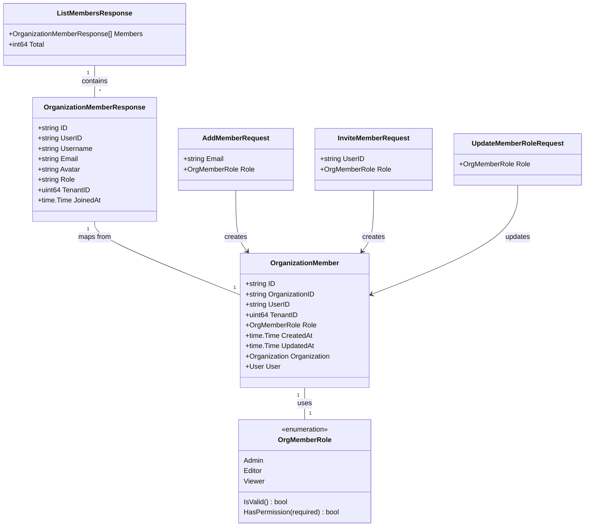

# 组织成员管理契约模块技术深度解析

## 1. 模块概述

在多租户协作场景中，组织（Organization）作为跨租户资源共享的核心载体，其成员管理是权限控制和协作安全的基石。`organization_membership_management_contracts` 模块定义了组织成员身份、角色体系、邀请流程和权限检查等核心数据结构与契约，为上层应用提供了统一、类型安全的组织成员管理接口。

这个模块解决的核心问题是：如何在跨租户的协作环境中，以清晰的角色层级和灵活的权限控制，安全地管理组织成员的加入、角色变更和资源访问？

## 2. 核心抽象与心智模型

### 2.1 角色层级与权限模型

本模块的核心心智模型是**基于角色的权限控制（RBAC）**，但采用了一种简化而实用的变体。想象组织是一个公司办公室：
- **Admin（管理员）**：拥有办公室的钥匙，可以更改门锁、邀请新成员、分配办公区域
- **Editor（编辑者）**：可以使用办公设备和修改共享文档，但不能更改办公室配置
- **Viewer（查看者）**：只能进入办公室查看文档，不能进行任何修改

这种类比体现在 `OrgMemberRole` 类型的设计中，通过数值化的权限等级（Admin=3, Editor=2, Viewer=1）实现了"至少拥有某权限"的检查逻辑。

### 2.2 成员身份与资源共享

模块中的另一个关键抽象是**组织成员作为用户与组织、租户之间的关联桥梁**。`OrganizationMember` 不仅记录了用户在组织中的角色，还关联了用户所属的租户（TenantID），这为跨租户资源共享提供了必要的上下文信息。

## 3. 架构与数据流程

### 3.1 核心组件关系



### 3.2 数据流转路径

成员管理的典型数据流程如下：

1. **成员添加流程**：
   - 上层服务接收 `AddMemberRequest` 或 `InviteMemberRequest`
   - 验证请求中的 `OrgMemberRole` 是否有效（通过 `IsValid()` 方法）
   - 创建 `OrganizationMember` 记录，关联用户、组织和租户
   - 保存到数据库（通过 GORM 映射）

2. **角色变更流程**：
   - 接收 `UpdateMemberRoleRequest`
   - 验证新角色的有效性
   - 更新 `OrganizationMember` 中的 `Role` 字段
   - 保存变更

3. **成员列表查询流程**：
   - 查询数据库获取 `OrganizationMember` 列表
   - 关联查询获取用户信息（用户名、邮箱、头像等）
   - 转换为 `OrganizationMemberResponse` 格式
   - 组装成 `ListMembersResponse` 返回

## 4. 核心组件深度解析

### 4.1 OrgMemberRole - 角色与权限系统

```go
type OrgMemberRole string

const (
    OrgRoleAdmin  OrgMemberRole = "admin"
    OrgRoleEditor OrgMemberRole = "editor"
    OrgRoleViewer OrgMemberRole = "viewer"
)
```

**设计意图**：
- 使用字符串类型而非枚举，便于数据库存储和 API 交互
- 三种角色形成清晰的权限层级，覆盖从完全控制到只读的常见协作场景

**关键方法**：

1. `IsValid() bool`：验证角色是否为预定义的有效值
   - **设计理由**：防止无效角色值进入系统，保证数据一致性
   - **使用场景**：在处理请求参数时进行前置验证

2. `HasPermission(required OrgMemberRole) bool`：检查当前角色是否至少拥有所需权限
   - **设计亮点**：通过数值化权限等级（Admin=3, Editor=2, Viewer=1）实现简洁的权限比较
   - **权限逻辑**：Admin ≥ Editor ≥ Viewer，即高权限角色自动拥有低权限角色的所有权限
   - **使用场景**：在资源访问控制中，判断用户是否有权执行特定操作

### 4.2 OrganizationMember - 成员关系核心模型

```go
type OrganizationMember struct {
    ID             string        `json:"id" gorm:"type:varchar(36);primaryKey"`
    OrganizationID string        `json:"organization_id" gorm:"type:varchar(36);not null;index"`
    UserID         string        `json:"user_id" gorm:"type:varchar(36);not null;index"`
    TenantID       uint64        `json:"tenant_id" gorm:"not null;index"`
    Role           OrgMemberRole `json:"role" gorm:"type:varchar(32);not null;default:'viewer'"`
    CreatedAt      time.Time     `json:"created_at"`
    UpdatedAt      time.Time     `json:"updated_at"`
    
    // Associations
    Organization *Organization `json:"organization,omitempty" gorm:"foreignKey:OrganizationID"`
    User         *User         `json:"user,omitempty" gorm:"foreignKey:UserID"`
}
```

**设计意图**：
- 作为用户与组织之间的关联表，同时记录成员角色和所属租户
- 多索引设计（OrganizationID、UserID、TenantID）优化各种查询场景

**关键字段解析**：
- `TenantID`：记录成员所属的租户，这是跨租户资源共享的关键上下文
- `Role`：默认值为 'viewer'，确保新成员默认拥有最低权限，符合安全最佳实践
- 关联字段 `Organization` 和 `User`：支持 GORM 的预加载，便于获取完整的成员信息

### 4.3 请求/响应契约

#### 4.3.1 AddMemberRequest - 添加成员请求

```go
type AddMemberRequest struct {
    Email string        `json:"email" binding:"required,email"`
    Role  OrgMemberRole `json:"role" binding:"required"`
}
```

**设计意图**：
- 通过邮箱而非用户 ID 添加成员，提供更友好的用户体验
- 使用 `binding` 标签实现请求参数的自动验证

#### 4.3.2 InviteMemberRequest - 直接邀请成员请求

```go
type InviteMemberRequest struct {
    UserID string        `json:"user_id" binding:"required"`
    Role   OrgMemberRole `json:"role" binding:"required"`
}
```

**设计意图**：
- 与 `AddMemberRequest` 形成互补，适用于已知用户 ID 的场景（如内部系统集成）
- 两种添加方式的分离提供了灵活性，同时保持接口的清晰性

#### 4.3.3 UpdateMemberRoleRequest - 更新成员角色请求

```go
type UpdateMemberRoleRequest struct {
    Role OrgMemberRole `json:"role" binding:"required"`
}
```

**设计意图**：
- 单一职责原则：只负责角色更新，不包含其他字段
- 简化的接口设计，降低误用风险

#### 4.3.4 OrganizationMemberResponse - 成员信息响应

```go
type OrganizationMemberResponse struct {
    ID       string    `json:"id"`
    UserID   string    `json:"user_id"`
    Username string    `json:"username"`
    Email    string    `json:"email"`
    Avatar   string    `json:"avatar"`
    Role     string    `json:"role"`
    TenantID uint64    `json:"tenant_id"`
    JoinedAt time.Time `json:"joined_at"`
}
```

**设计意图**：
- 聚合了 `OrganizationMember` 和 `User` 的信息，提供完整的成员视图
- `JoinedAt` 字段映射自 `OrganizationMember.CreatedAt`，语义更清晰
- 扁平化结构，便于前端直接使用

#### 4.3.5 ListMembersResponse - 成员列表响应

```go
type ListMembersResponse struct {
    Members []OrganizationMemberResponse `json:"members"`
    Total   int64                        `json:"total"`
}
```

**设计意图**：
- 标准的分页列表响应结构
- `Total` 字段支持前端实现分页控件

## 5. 依赖关系分析

### 5.1 模块依赖

本模块是一个**契约定义模块**，依赖关系相对简单：
- **内部依赖**：`User`、`Organization` 等核心领域模型
- **外部依赖**：`gorm.io/gorm`（用于数据库映射）、`time`（时间处理）

### 5.2 被依赖情况

从模块树结构看，本模块被以下模块依赖：
- [organization_governance_membership_management](application_services_and_orchestration-agent_identity_tenant_and_configuration_services-identity_tenant_and_organization_management-organization_governance_and_membership_management.md)：组织治理与成员管理服务
- [organization_membership_and_governance_repository](data_access_repositories-identity_tenant_and_organization_repositories-organization_membership_sharing_and_access_control_repositories-organization_membership_and_governance_repository.md)：组织成员与治理仓库

### 5.3 数据契约

模块与外部交互的关键数据契约：
- **输入契约**：各种请求结构（`AddMemberRequest`、`InviteMemberRequest`、`UpdateMemberRoleRequest`）
- **输出契约**：各种响应结构（`OrganizationMemberResponse`、`ListMembersResponse`）
- **持久化契约**：`OrganizationMember` 的 GORM 标签定义了数据库表结构

## 6. 设计决策与权衡

### 6.1 角色设计：简化 vs 灵活

**决策**：采用三种固定角色（Admin/Editor/Viewer）而非可配置的权限系统

**权衡分析**：
- ✅ **优点**：简单易懂，降低用户认知负担；实现简单，减少出错概率；性能优化（无需复杂的权限计算）
- ❌ **缺点**：灵活性受限，无法满足高度定制化的权限需求

**设计理由**：在协作场景中，这三种角色覆盖了 90% 以上的使用场景。过度灵活的权限系统会增加用户理解成本和实现复杂度，而简化的角色设计在大多数情况下已经足够。

### 6.2 权限检查：层级化 vs 独立化

**决策**：通过数值化权限等级实现"至少拥有某权限"的检查逻辑

**权衡分析**：
- ✅ **优点**：逻辑简洁，易于理解和实现；符合用户对权限的直觉认知（管理员应该能做编辑者能做的所有事情）
- ❌ **缺点**：权限层级固定，无法实现非层级化的权限组合

**设计理由**：在协作场景中，权限通常是层级化的。如果需要非层级化的权限，可以通过未来引入权限位掩码等方式扩展，但当前设计在满足需求的同时保持了简洁性。

### 6.3 成员标识：邮箱 vs 用户 ID

**决策**：同时支持通过邮箱（`AddMemberRequest`）和用户 ID（`InviteMemberRequest`）添加成员

**权衡分析**：
- ✅ **优点**：提供灵活性，适应不同场景（邮箱适合用户交互，用户 ID 适合系统集成）
- ❌ **缺点**：接口略有冗余，需要维护两种添加方式

**设计理由**：两种方式各有适用场景，同时支持可以提高模块的适用性。在内部实现中，可以共享核心添加逻辑，减少代码重复。

### 6.4 默认角色：最小权限原则

**决策**：新成员默认角色为 'viewer'

**权衡分析**：
- ✅ **优点**：符合安全最佳实践，默认给予最小权限，降低安全风险
- ❌ **缺点**：可能需要额外的角色变更操作，增加用户操作步骤

**设计理由**：安全性优先于便利性。用户可以根据需要提升权限，但默认给予最低权限可以防止意外的数据泄露或修改。

## 7. 使用指南与最佳实践

### 7.1 角色验证

在处理任何角色相关的请求时，始终先验证角色的有效性：

```go
if !request.Role.IsValid() {
    return errors.New("invalid role")
}
```

### 7.2 权限检查

使用 `HasPermission` 方法进行权限检查，而不是直接比较字符串：

```go
// 正确做法
if member.Role.HasPermission(OrgRoleEditor) {
    // 允许编辑操作
}

// 错误做法
if member.Role == OrgRoleAdmin || member.Role == OrgRoleEditor {
    // 容易出错，且难以维护
}
```

### 7.3 成员添加

选择合适的成员添加方式：
- **用户交互场景**：使用 `AddMemberRequest`（通过邮箱）
- **系统集成场景**：使用 `InviteMemberRequest`（通过用户 ID）

### 7.4 响应转换

将 `OrganizationMember` 转换为 `OrganizationMemberResponse` 时，确保关联加载用户信息：

```go
// 使用 GORM 预加载
var member OrganizationMember
db.Preload("User").First(&member, id)

// 转换为响应
response := OrganizationMemberResponse{
    ID:       member.ID,
    UserID:   member.UserID,
    Username: member.User.Username,
    Email:    member.User.Email,
    Avatar:   member.User.Avatar,
    Role:     string(member.Role),
    TenantID: member.TenantID,
    JoinedAt: member.CreatedAt,
}
```

## 8. 边缘情况与注意事项

### 8.1 角色变更的权限要求

**注意**：只有 Admin 角色才能变更其他成员的角色，且不能将自己降级（防止失去管理权限）。

**处理建议**：在服务层实现这些业务规则，而不是仅依赖数据库约束。

### 8.2 成员数量限制

**注意**：组织有 `MemberLimit` 字段限制成员数量，添加成员时需要检查是否已达上限。

**处理建议**：在添加成员前先查询当前成员数量，并与 `MemberLimit` 比较。

### 8.3 跨租户数据隔离

**注意**：虽然组织支持跨租户协作，但每个成员仍然属于特定的租户（`TenantID` 字段）。

**处理建议**：在查询和显示成员信息时，注意租户上下文，避免跨租户数据泄露。

### 8.4 软删除与数据一致性

**注意**：`Organization` 使用软删除（`DeletedAt` 字段），但 `OrganizationMember` 没有软删除。

**处理建议**：当组织被软删除时，考虑如何处理相关的成员记录（是级联删除、保留还是标记为无效）。

### 8.5 角色字符串的大小写敏感性

**注意**：`OrgMemberRole` 是字符串类型，比较时是大小写敏感的。

**处理建议**：在处理请求参数时，统一转换为小写，并确保数据库中存储的也是小写值。

## 9. 总结

`organization_membership_management_contracts` 模块是组织协作系统的基础契约层，通过清晰的角色体系、简洁的权限模型和类型安全的接口定义，为上层应用提供了可靠的组织成员管理基础设施。

模块的设计体现了**简洁性优先**、**安全性优先**和**实用性优先**的原则，在满足大多数协作场景需求的同时，保持了代码的清晰性和可维护性。

对于新贡献者，理解本模块的关键在于掌握其角色层级的心智模型、权限检查的逻辑以及各种请求/响应契约的用途。在使用本模块时，务必遵循最佳实践，注意边缘情况，确保组织成员管理的安全性和一致性。
