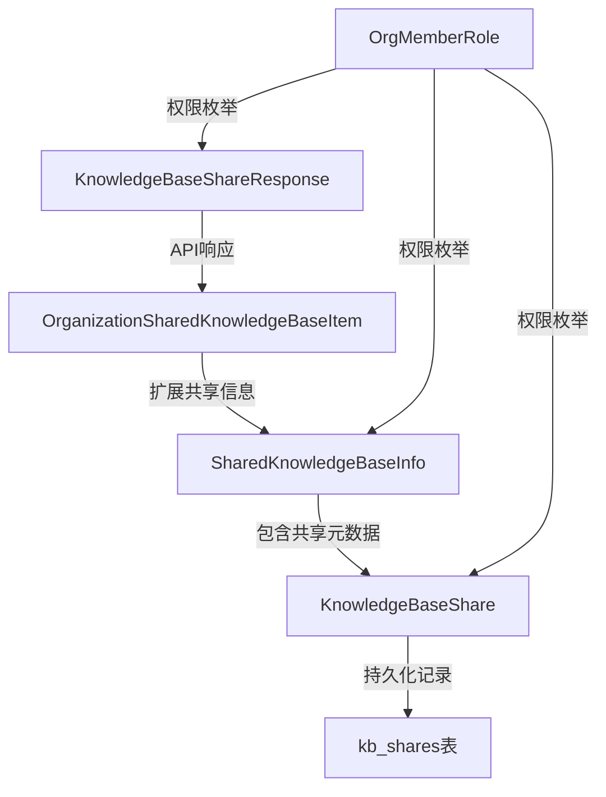

# 知识库共享域与响应模型深度解析

## 1. 模块概述

### 问题空间

在多租户协作场景中，用户经常需要跨租户边界共享知识库资源。传统的直接共享方式存在几个关键问题：
- **权限控制粒度粗**：要么完全共享，要么完全不共享，缺乏细粒度的权限管理
- **跨租户隔离性**：需要在保护租户数据安全的同时实现资源共享
- **可追溯性差**：无法清晰记录谁共享了什么、给了谁、以及何时共享
- **权限计算复杂**：用户在组织中的角色和资源共享权限需要综合计算

本模块通过定义一套完整的领域模型和响应契约，优雅地解决了这些问题，为知识库共享提供了坚实的基础。

### 核心价值

这个模块是组织资源共享系统的**数据契约层**，它定义了：
- 知识库共享记录的持久化模型
- 跨租户资源访问的权限边界
- API 响应的数据结构
- 权限计算的基础规则

## 2. 架构设计

### 核心组件关系图



### 数据流转

当用户请求共享知识库或查看共享列表时，数据流转如下：

1. **共享创建流程**：
   - 接收 `ShareKnowledgeBaseRequest` 请求
   - 创建 `KnowledgeBaseShare` 记录并持久化
   - 返回 `KnowledgeBaseShareResponse` 给调用方

2. **共享列表查询流程**：
   - 从数据库加载 `KnowledgeBaseShare` 记录
   - 关联查询知识库和组织信息
   - 构建 `SharedKnowledgeBaseInfo` 或 `OrganizationSharedKnowledgeBaseItem`
   - 转换为 `KnowledgeBaseShareResponse` 并返回

## 3. 核心组件详解

### 3.1 KnowledgeBaseShare - 共享记录实体

**设计意图**：这是知识库共享的核心持久化模型，代表一个知识库被共享到某个组织的完整记录。

```go
type KnowledgeBaseShare struct {
    ID               string         `json:"id" gorm:"type:varchar(36);primaryKey"`
    KnowledgeBaseID  string         `json:"knowledge_base_id" gorm:"type:varchar(36);not null;index"`
    OrganizationID   string         `json:"organization_id" gorm:"type:varchar(36);not null;index"`
    SharedByUserID   string         `json:"shared_by_user_id" gorm:"type:varchar(36);not null"`
    SourceTenantID   uint64         `json:"source_tenant_id" gorm:"not null;index"`
    Permission       OrgMemberRole  `json:"permission" gorm:"type:varchar(32);not null;default:'viewer'"`
    // ... 时间戳和软删除字段
}
```

**关键设计点**：
- **SourceTenantID**：这是一个至关重要的字段，它记录了知识库原始所属的租户ID。在跨租户共享场景中，这是实现数据隔离和权限验证的基础，确保即使共享后，我们也能正确追踪资源的所有权。
- **Permission**：使用 `OrgMemberRole` 枚举，复用了组织成员的权限体系，保持了权限模型的一致性。
- **软删除**：通过 `DeletedAt` 字段支持软删除，保留了共享历史记录，便于审计和追溯。

### 3.2 SharedKnowledgeBaseInfo - 共享信息聚合

**设计意图**：这是一个**数据传输对象（DTO）**，用于将知识库共享记录与相关的元数据聚合在一起，避免了API调用方需要多次查询的问题。

```go
type SharedKnowledgeBaseInfo struct {
    KnowledgeBase  *KnowledgeBase `json:"knowledge_base"`
    ShareID        string         `json:"share_id"`
    OrganizationID string         `json:"organization_id"`
    OrgName        string         `json:"org_name"`
    Permission     OrgMemberRole  `json:"permission"`
    SourceTenantID uint64         `json:"source_tenant_id"`
    SharedAt       time.Time      `json:"shared_at"`
}
```

**设计权衡**：
- **数据冗余**：`OrgName` 等字段是冗余的，因为可以通过 `OrganizationID` 查询获取。但这种冗余是有意为之的，它避免了 N+1 查询问题，提高了列表查询的性能。
- **包含完整 KnowledgeBase**：直接包含完整的知识库对象，使得前端可以一次性获取所有需要的信息，简化了客户端逻辑。

### 3.3 OrganizationSharedKnowledgeBaseItem - 组织视角的共享项

**设计意图**：这是在组织上下文中查看共享知识库时使用的模型，扩展了基础的共享信息，增加了"是否属于我"和"是否来自智能体"等上下文相关的信息。

```go
type OrganizationSharedKnowledgeBaseItem struct {
    SharedKnowledgeBaseInfo
    IsMine          bool                `json:"is_mine"`
    SourceFromAgent *SourceFromAgentInfo `json:"source_from_agent,omitempty"`
}
```

**关键扩展**：
- **IsMine**：标识当前知识库是否属于当前用户，这在组织共享列表中很有用，可以让用户快速区分自己的资源和他人共享的资源。
- **SourceFromAgent**：这是一个非常有趣的设计，它处理了一种特殊情况：知识库不是直接共享的，而是通过共享智能体间接获得的。这种设计保持了模型的灵活性，可以处理不同来源的共享资源。

### 3.4 KnowledgeBaseShareResponse - API响应模型

**设计意图**：这是暴露给外部API的响应模型，专门为前端展示需求而设计，包含了计算后的有效权限等前端友好的字段。

```go
type KnowledgeBaseShareResponse struct {
    ID                string    `json:"id"`
    KnowledgeBaseID   string    `json:"knowledge_base_id"`
    KnowledgeBaseName string    `json:"knowledge_base_name"`
    KnowledgeBaseType string    `json:"knowledge_base_type"`
    KnowledgeCount    int64     `json:"knowledge_count"`
    ChunkCount        int64     `json:"chunk_count"`
    // ... 其他字段
    Permission        string    `json:"permission"`
    MyRoleInOrg       string    `json:"my_role_in_org"`
    MyPermission      string    `json:"my_permission"`
    // ... 其他字段
}
```

**设计亮点**：
- **MyPermission**：这是一个计算字段，表示当前用户的有效权限。它的值是 `min(Permission, MyRoleInOrg)`，体现了权限的"最小权限原则"。这是一个重要的业务规则，被直接编码到了响应模型中。
- **统计信息**：包含了 `KnowledgeCount` 和 `ChunkCount` 等统计信息，这些信息对于前端展示很有用，但不会存储在共享记录表中，而是通过关联查询获取。
- **扁平化结构**：将嵌套的 `KnowledgeBase` 对象扁平化，简化了前端的访问路径。

### 3.5 OrgMemberRole - 权限枚举与权限计算

**设计意图**：定义了组织成员和资源共享的权限级别，并提供了权限验证的逻辑。

```go
type OrgMemberRole string

const (
    OrgRoleAdmin  OrgMemberRole = "admin"
    OrgRoleEditor OrgMemberRole = "editor"
    OrgRoleViewer OrgMemberRole = "viewer"
)

func (r OrgMemberRole) HasPermission(required OrgMemberRole) bool {
    roleLevel := map[OrgMemberRole]int{
        OrgRoleAdmin:  3,
        OrgRoleEditor: 2,
        OrgRoleViewer: 1,
    }
    return roleLevel[r] >= roleLevel[required]
}
```

**设计洞察**：
- **权限层级**：使用数字映射来表示权限层级，这是一种经典的权限设计模式，使得权限比较变得简单直观。
- **HasPermission 方法**：将权限验证逻辑封装在枚举类型中，遵循了面向对象的封装原则，使得权限逻辑集中管理，易于维护。

## 4. 设计决策与权衡

### 4.1 权限模型的选择

**决策**：复用 `OrgMemberRole` 作为共享权限的枚举，而不是创建单独的权限类型。

**权衡分析**：
- **优点**：保持了权限体系的一致性，减少了概念复杂度，用户不需要学习两套不同的权限系统。
- **缺点**：如果未来需要为共享设置与组织成员角色不同的权限级别，这种设计可能会限制灵活性。
- **为什么这样选择**：在当前的业务场景中，共享权限和组织成员权限的需求是一致的，一致性的好处超过了灵活性的损失。

### 4.2 有效权限的计算

**决策**：在 `KnowledgeBaseShareResponse` 中预先计算 `MyPermission`，而不是让前端自己计算。

**权衡分析**：
- **优点**：
  - 避免了前端重复实现权限计算逻辑
  - 确保了权限计算的一致性（所有客户端使用相同的逻辑）
  - 减轻了前端的负担
- **缺点**：
  - 增加了后端的计算开销
  - 响应模型与当前用户上下文绑定，降低了缓存效率
- **为什么这样选择**：权限计算是核心业务逻辑，应该集中在后端控制，避免前端实现不一致导致的安全问题。

### 4.3 软删除的使用

**决策**：使用 GORM 的软删除功能，而不是物理删除共享记录。

**权衡分析**：
- **优点**：
  - 保留了完整的审计历史
  - 可以恢复误删除的共享
  - 便于数据分析和报表
- **缺点**：
  - 数据库表会不断增长
  - 查询时需要考虑软删除的过滤
- **为什么这样选择**：在企业级应用中，数据的可追溯性通常比存储空间更重要，软删除是一个合理的选择。

### 4.4 SourceTenantID 的设计

**决策**：在 `KnowledgeBaseShare` 中显式存储 `SourceTenantID`。

**权衡分析**：
- **优点**：
  - 可以快速查询某个租户共享出去的所有知识库
  - 在跨租户访问时，可以验证访问者是否有权限访问源租户的资源
  - 支持跨租户的嵌入模型访问（这在字段注释中明确提到）
- **缺点**：
  - 数据冗余（理论上可以通过 KnowledgeBaseID 查询获取）
  - 需要确保数据一致性（如果知识库的租户ID变更，这里也需要更新）
- **为什么这样选择**：这是一个**性能优化**和**安全考虑**的决策。通过冗余存储，避免了每次查询都要关联知识库表，同时在跨租户场景下，这是一个重要的安全标识。

## 5. 依赖关系与数据契约

### 5.1 上游依赖

本模块依赖以下核心概念：
- **KnowledgeBase**：知识库领域模型（未在本文件中定义，但被引用）
- **Organization**：组织领域模型（在同一文件中定义）
- **User**：用户领域模型（未在本文件中定义，但被引用）
- **gorm**：ORM 框架，用于数据库映射

### 5.2 下游消费者

根据模块结构，以下模块可能依赖本模块：
- [knowledge_base_sharing_service_and_repository_interfaces](core-domain-types-and-interfaces-identity-tenant-organization-and-configuration-contracts-organization-resource-sharing-and-access-control-contracts-knowledge-base-sharing-contracts-knowledge-base-sharing-service-and-repository-interfaces.md)：服务接口层
- [knowledge_base_sharing_access_repository](data-access-repositories-identity-tenant-and-organization-repositories-organization-membership-sharing-and-access-control-repositories-shared-resource-access-repositories-knowledge-base-share-access-repository.md)：仓储实现层
- [knowledge_base_sharing_access_service](application-services-and-orchestration-agent-identity-tenant-and-configuration-services-resource-sharing-and-access-services-knowledge-base-sharing-access-service.md)：服务实现层
- 相关的 HTTP 处理器层

### 5.3 数据契约

模块定义了以下关键数据契约：
1. **共享记录契约**：`KnowledgeBaseShare` 定义了共享记录的持久化结构
2. **API 响应契约**：`KnowledgeBaseShareResponse` 定义了外部 API 的响应格式
3. **权限契约**：`OrgMemberRole` 和它的 `HasPermission` 方法定义了权限验证的规则

## 6. 使用指南与最佳实践

### 6.1 权限计算模式

当需要计算用户对共享资源的有效权限时，使用以下模式：

```go
// 计算有效权限
effectivePermission := calculateEffectivePermission(share.Permission, userRoleInOrg)

// 验证权限
if !effectivePermission.HasPermission(requiredPermission) {
    return errors.New("insufficient permissions")
}
```

其中 `calculateEffectivePermission` 应该实现 `min(Permission, MyRoleInOrg)` 的逻辑。

### 6.2 跨租户访问验证

在处理跨租户访问时，务必验证 `SourceTenantID`：

```go
// 伪代码示例
func accessSharedKnowledgeBase(share KnowledgeBaseShare, currentTenantID uint64) error {
    // 验证不是访问自己的租户（如果需要）
    if share.SourceTenantID == currentTenantID {
        return nil // 或者特殊处理
    }
    
    // 验证共享记录未被删除
    if share.DeletedAt.Valid {
        return errors.New("share has been revoked")
    }
    
    // 其他权限验证...
    return nil
}
```

### 6.3 API 响应构建

构建 `KnowledgeBaseShareResponse` 时，确保正确设置 `MyPermission`：

```go
// 伪代码示例
func buildShareResponse(share KnowledgeBaseShare, kb KnowledgeBase, org Organization, userRole OrgMemberRole) KnowledgeBaseShareResponse {
    // 计算有效权限
    myPermission := getEffectivePermission(share.Permission, userRole)
    
    return KnowledgeBaseShareResponse{
        ID:                share.ID,
        KnowledgeBaseID:   kb.ID,
        KnowledgeBaseName: kb.Name,
        // ... 其他字段
        Permission:        string(share.Permission),
        MyRoleInOrg:       string(userRole),
        MyPermission:      string(myPermission),
        // ... 其他字段
    }
}
```

## 7. 注意事项与陷阱

### 7.1 权限计算的一致性

**陷阱**：在不同地方实现权限计算逻辑，可能导致不一致。

**建议**：
- 将权限计算逻辑封装在一个共享的包中
- 始终使用 `OrgMemberRole.HasPermission()` 方法进行权限验证
- 在 `KnowledgeBaseShareResponse.MyPermission` 中提供计算结果，避免前端重复计算

### 7.2 软删除的处理

**陷阱**：忘记在查询中过滤软删除的记录，导致已撤销的共享仍然可见。

**建议**：
- 使用 GORM 的自动软删除功能
- 在自定义查询中显式添加 `deleted_at IS NULL` 条件
- 考虑为软删除的记录提供单独的审计查询接口

### 7.3 SourceTenantID 的数据一致性

**陷阱**：当知识库的租户ID变更时，共享记录中的 `SourceTenantID` 没有同步更新。

**建议**：
- 在业务逻辑中禁止变更知识库的租户ID
- 如果必须变更，确保级联更新所有相关的共享记录
- 添加数据库约束或触发器来防止不一致（如果数据库支持）

### 7.4 权限层级的扩展

**陷阱**：在 `OrgMemberRole.HasPermission()` 中硬编码权限层级，增加新权限级别时容易出错。

**建议**：
- 如果频繁变更权限层级，考虑使用更灵活的权限矩阵
- 添加单元测试覆盖所有权限组合的验证逻辑
- 在代码注释中清晰记录权限层级的设计意图

## 8. 总结

`knowledge_base_sharing_domain_and_response_models` 模块是组织资源共享系统的基础，它通过精心设计的领域模型和响应契约，解决了跨租户知识库共享的核心问题。

模块的关键价值在于：
1. **清晰的权限模型**：通过 `OrgMemberRole` 和 `HasPermission` 方法提供了一致的权限体系
2. **完整的共享记录**：`KnowledgeBaseShare` 记录了共享的所有关键信息，包括 `SourceTenantID` 这一重要的跨租户标识
3. **前端友好的响应模型**：`KnowledgeBaseShareResponse` 预计算了有效权限，简化了客户端逻辑
4. **灵活的扩展设计**：通过 `SourceFromAgent` 等设计，为未来的扩展预留了空间

在使用这个模块时，要特别注意权限计算的一致性、软删除的处理和数据一致性的维护。遵循这些最佳实践，将能够构建一个安全、可靠、可扩展的知识库共享系统。
