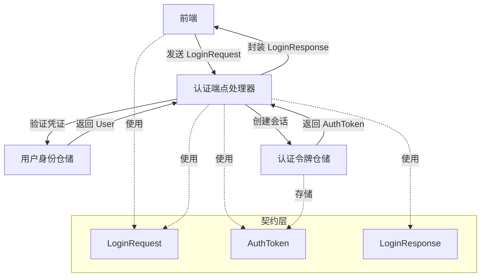

# Login and Session Authentication Payload Contracts

## 概述

`login_and_session_auth_payload_contracts` 模块是系统认证基础设施的核心组成部分，定义了用户登录流程和会话认证的契约。它作为认证系统的"语言规范"，确保前后端、认证服务与业务逻辑之间的交互清晰、一致且类型安全。

### 问题背景

在多租户 SaaS 系统中，用户认证面临几个关键挑战：
- **契约一致性**：前端请求、后端处理和响应需要统一的数据结构
- **安全边界**：敏感信息（如密码）需要在传输和存储时明确隔离
- **多租户感知**：认证过程需要同时识别用户和其所属租户
- **会话管理**：需要标准化的 token 结构来支持访问控制和刷新机制

如果没有明确的契约，这些问题可能导致：前端与后端字段不匹配、敏感信息泄露、认证流程混乱，以及难以维护的代码。

## 核心抽象与心智模型

### 主要抽象

本模块定义了四个核心概念，形成了完整的认证流程契约：

1. **LoginRequest** - 认证请求载体：包含用户身份凭证（邮箱+密码）
2. **User** - 用户身份核心模型：存储用户的基本信息和安全凭证
3. **AuthToken** - 会话身份凭证：代表已认证用户的访问权限
4. **LoginResponse** - 认证结果封装：包含用户信息、租户信息和 token

### 类比理解

可以把这个模块想象成**机场的安检系统**：
- `LoginRequest` 是你出示的护照和机票（身份凭证）
- `AuthToken` 是安检通过后给你的登机牌（会话凭证）
- `LoginResponse` 是安检结果，包含你的个人信息、航班信息（租户信息）和登机牌

## 架构与数据流向



### 数据流程详解

1. **请求阶段**：前端发送 `LoginRequest` 到认证端点，包含邮箱和密码
2. **验证阶段**：认证服务使用请求中的凭证查询用户仓储，验证密码
3. **会话创建**：验证成功后，创建 `AuthToken` 记录并存储
4. **响应阶段**：将用户信息、租户信息和 token 封装到 `LoginResponse` 返回

## 核心组件深度解析

### User

**设计意图**：作为系统中用户身份的核心表示，同时兼顾数据库存储、API 响应和安全考虑。

```go
type User struct {
    ID                  string         `json:"id"         gorm:"type:varchar(36);primaryKey"`
    Username            string         `json:"username"   gorm:"type:varchar(100);uniqueIndex;not null"`
    Email               string         `json:"email"      gorm:"type:varchar(255);uniqueIndex;not null"`
    PasswordHash        string         `json:"-"          gorm:"type:varchar(255);not null"`
    Avatar              string         `json:"avatar"     gorm:"type:varchar(500)"`
    TenantID            uint64         `json:"tenant_id"  gorm:"index"`
    IsActive            bool           `json:"is_active"  gorm:"default:true"`
    CanAccessAllTenants bool           `json:"can_access_all_tenants" gorm:"default:false"`
    CreatedAt           time.Time      `json:"created_at"`
    UpdatedAt           time.Time      `json:"updated_at"`
    DeletedAt           gorm.DeletedAt `json:"deleted_at" gorm:"index"`
    Tenant              *Tenant        `json:"tenant,omitempty" gorm:"foreignKey:TenantID"`
}
```

**核心安全设计**：
- **PasswordHash 字段隔离**：使用 `json:"-"` 标签确保密码哈希永远不会被序列化到 API 响应中
- **唯一索引约束**：Username 和 Email 都有 `uniqueIndex`，防止重复注册
- **软删除支持**：通过 `DeletedAt` 字段支持用户的软删除，保留历史数据
- **租户隔离**：`TenantID` 字段实现多租户数据隔离，`CanAccessAllTenants` 支持跨租户管理员

**UserInfo 转换方法**：

```go
func (u *User) ToUserInfo() *UserInfo {
    return &UserInfo{
        ID:                  u.ID,
        Username:            u.Username,
        Email:               u.Email,
        Avatar:              u.Avatar,
        TenantID:            u.TenantID,
        IsActive:            u.IsActive,
        CanAccessAllTenants: u.CanAccessAllTenants,
        CreatedAt:           u.CreatedAt,
        UpdatedAt:           u.UpdatedAt,
    }
}
```

这个方法提供了安全的 User 到 UserInfo 的转换，确保敏感信息被正确过滤，是深度防御策略的重要组成部分。

### LoginRequest

**设计意图**：定义登录请求的严格契约，确保必填字段存在且格式正确。

```go
type LoginRequest struct {
    Email    string `json:"email"    binding:"required,email"`
    Password string `json:"password" binding:"required,min=6"`
}
```

**关键特性**：
- 使用 Gin 的 `binding` 标签进行参数验证，在请求到达业务逻辑前就过滤无效输入
- `email` 标签确保邮箱格式正确性
- `min=6` 为密码设置最小长度要求，这是安全策略的第一道防线

**设计权衡**：
- ✅ **选择字段级验证**：在 API 边界捕获错误，避免无效数据进入系统
- ⚠️ **密码长度限制在此定义**：这意味着验证逻辑与契约耦合，变更需要同步更新文档和客户端

### AuthToken

**设计意图**：标准化认证令牌的存储和传输结构，支持完整的会话生命周期管理。

```go
type AuthToken struct {
    ID        string    `json:"id"         gorm:"type:varchar(36);primaryKey"`
    UserID    string    `json:"user_id"    gorm:"type:varchar(36);index;not null"`
    Token     string    `json:"token"      gorm:"type:text;not null"`
    TokenType string    `json:"token_type" gorm:"type:varchar(50);not null"`
    ExpiresAt time.Time `json:"expires_at"`
    IsRevoked bool      `json:"is_revoked" gorm:"default:false"`
    CreatedAt time.Time `json:"created_at"`
    UpdatedAt time.Time `json:"updated_at"`
    User      *User     `json:"user,omitempty" gorm:"foreignKey:UserID"`
}
```

**核心机制**：
- **TokenType 区分**：支持 `access_token` 和 `refresh_token` 两种类型，实现灵活的会话管理
- **IsRevoked 标志**：允许即时撤销 token，无需等待过期
- **ExpiresAt 时间戳**：支持自动过期机制，降低令牌泄露风险
- **User 关联**：通过 GORM 关联建立与用户实体的关系

**设计权衡**：
- ✅ **存储完整 token 记录**：支持审计、撤销和会话管理，但增加了存储开销
- ✅ **使用软删除（通过 IsRevoked）**：保留历史记录用于审计，但需要过滤逻辑
- ⚠️ **Token 字段使用 text 类型**：适应各种 token 格式（JWT、opaque 等），但没有长度限制

### LoginResponse

**设计意图**：封装完整的认证成功响应，提供客户端初始化会话所需的全部信息。

```go
type LoginResponse struct {
    Success      bool    `json:"success"`
    Message      string  `json:"message,omitempty"`
    User         *User   `json:"user,omitempty"`
    Tenant       *Tenant `json:"tenant,omitempty"`
    Token        string  `json:"token,omitempty"`
    RefreshToken string  `json:"refresh_token,omitempty"`
}
```

**关键设计**：
- **包含 User 和 Tenant**：客户端可以在一次请求中获取用户配置和租户上下文
- **双 token 机制**：同时返回访问令牌和刷新令牌，平衡安全性和用户体验
- **omitempty 标签**：在失败响应中省略敏感字段，只保留 Success 和 Message

**设计权衡**：
- ✅ **一次往返获取所有信息**：减少客户端请求次数，但增加了响应体积
- ✅ **分离 Token 和 User/Tenant**：允许 token 独立刷新，而无需重新获取用户信息
- ⚠️ **直接包含 User 实体**：可能意外暴露敏感字段（尽管 User 结构体中 PasswordHash 已设置为 json:"-"）

## 依赖关系分析

### 依赖的模块

- **GORM**：用于 ORM 映射和数据库操作
- **Gin**：用于参数验证（binding 标签）
- **time**：用于时间戳管理
- **internal/types/user.Tenant**：租户信息关联（虽然在当前代码片段中未完全展示）

### 被依赖的模块

从模块树来看，这个模块被以下关键模块依赖：
- [auth_initialization_and_system_operations_handlers](http-handlers-and-routing-auth-initialization-and-system-operations-handlers.md)：使用这些契约处理认证 HTTP 请求
- [user_identity_and_auth_repositories](data-access-repositories-identity-tenant-and-organization-repositories-user-identity-and-auth-repositories.md)：存储和检索 AuthToken
- [user_auth_service_and_repository_interfaces](core-domain-types-and-interfaces-identity-tenant-organization-and-configuration-contracts-user-identity-registration-and-auth-contracts-user-auth-service-and-repository-interfaces.md)：定义使用这些契约的服务接口

## 设计决策与权衡

### 1. 契约与验证逻辑耦合

**决策**：在结构体标签中直接定义验证规则（如 `binding:"required,email"`）

**权衡**：
- ✅ 优点：验证规则与数据结构定义在一起，自文档化
- ⚠️ 缺点：将验证逻辑与数据契约耦合，变更验证规则需要重新编译

**替代方案**：可以使用单独的验证器层，但会增加代码复杂度

### 2. 敏感信息处理

**决策**：在 User 结构体中使用 `json:"-"` 明确排除 PasswordHash 字段

**权衡**：
- ✅ 优点：在序列化层面防止敏感信息泄露，是深度防御的一部分
- ⚠️ 缺点：依赖开发者记得正确设置标签，缺乏编译时检查

### 3. Token 存储策略

**决策**：在数据库中存储完整的 token 记录，包括 revocation 状态

**权衡**：
- ✅ 优点：支持即时撤销、会话审计和多设备管理
- ⚠️ 缺点：每次请求都需要数据库查询验证 token，增加了性能开销

**替代方案**：使用无状态 JWT，但会失去即时撤销能力

## 使用指南与最佳实践

### 客户端使用示例

```javascript
// 发送登录请求
const login = async (email, password) => {
  const response = await fetch('/api/auth/login', {
    method: 'POST',
    headers: { 'Content-Type': 'application/json' },
    body: JSON.stringify({ email, password })
  });
  
  const result = await response.json();
  if (result.success) {
    // 存储 token
    localStorage.setItem('token', result.token);
    localStorage.setItem('refreshToken', result.refresh_token);
    
    // 初始化用户状态
    setUser(result.user);
    setTenant(result.tenant);
  }
  return result;
};
```

### 服务端使用模式

```go
// 认证处理器示例
func (h *AuthHandler) Login(c *gin.Context) {
    var req types.LoginRequest
    if err := c.ShouldBindJSON(&req); err != nil {
        c.JSON(http.StatusBadRequest, types.LoginResponse{
            Success: false,
            Message: "Invalid request format",
        })
        return
    }
    
    // 验证用户凭证
    user, err := h.userRepo.Authenticate(req.Email, req.Password)
    if err != nil {
        c.JSON(http.StatusUnauthorized, types.LoginResponse{
            Success: false,
            Message: "Invalid credentials",
        })
        return
    }
    
    // 创建访问令牌
    accessToken, err := h.tokenService.CreateToken(user.ID, "access_token")
    if err != nil {
        // 处理错误
    }
    
    // 创建刷新令牌
    refreshToken, err := h.tokenService.CreateToken(user.ID, "refresh_token")
    if err != nil {
        // 处理错误
    }
    
    // 返回响应
    c.JSON(http.StatusOK, types.LoginResponse{
        Success:      true,
        User:         user,
        Tenant:       user.Tenant,
        Token:        accessToken.Token,
        RefreshToken: refreshToken.Token,
    })
}
```

## 边缘情况与注意事项

### 常见陷阱

1. **字段命名不一致**：前端使用驼峰命名，后端结构体标签要正确匹配（如 `refresh_token` 与 `RefreshToken`）
2. **omitempty 的意外行为**：当布尔值为 false 或数字为 0 时，omitempty 会省略字段，可能导致客户端解析问题
3. **Tenant 关联的加载**：LoginResponse 中的 Tenant 字段依赖 GORM 的预加载，忘记预加载会导致返回空值

### 安全考虑

1. **密码传输**：始终使用 HTTPS，LoginRequest 中的密码是明文传输的
2. **Token 存储**：AuthToken 中的 Token 字段应该是哈希值还是原始值？当前设计存储原始值，便于直接返回给客户端，但泄露风险更高
3. **响应字段过滤**：尽管 User 结构体排除了 PasswordHash，但系统提供了 `ToUserInfo()` 方法进行安全转换，建议在所有 API 响应中优先使用 UserInfo 而非直接返回 User
4. **租户隔离验证**：即使有 TenantID 字段，也不应完全依赖它进行访问控制，应在服务层实施额外的验证逻辑
5. **敏感字段审计**：对 PasswordHash、Token 等敏感字段的访问应进行审计日志记录

### 扩展指南

当需要扩展认证功能时：
- 新增认证方式（如 OAuth）：创建新的请求结构体（如 `OAuthLoginRequest`），保持响应格式一致
- 支持多因素认证：扩展 `LoginResponse` 增加中间状态字段，或创建专门的 `MFAResponse`
- 增强会话控制：在 `AuthToken` 中添加设备信息、IP 地址等字段，支持更细粒度的会话管理

## 总结

`login_and_session_auth_payload_contracts` 模块是系统认证流程的"通用语言"，通过明确的契约定义解决了多租户环境下的认证一致性问题。它的设计体现了几个关键原则：安全敏感数据的明确处理、API 边界的强验证、以及完整会话生命周期的支持。虽然在契约与验证耦合、token 存储策略等方面做出了权衡，但这些选择在当前的系统架构下是合理的，平衡了安全性、可维护性和用户体验。
