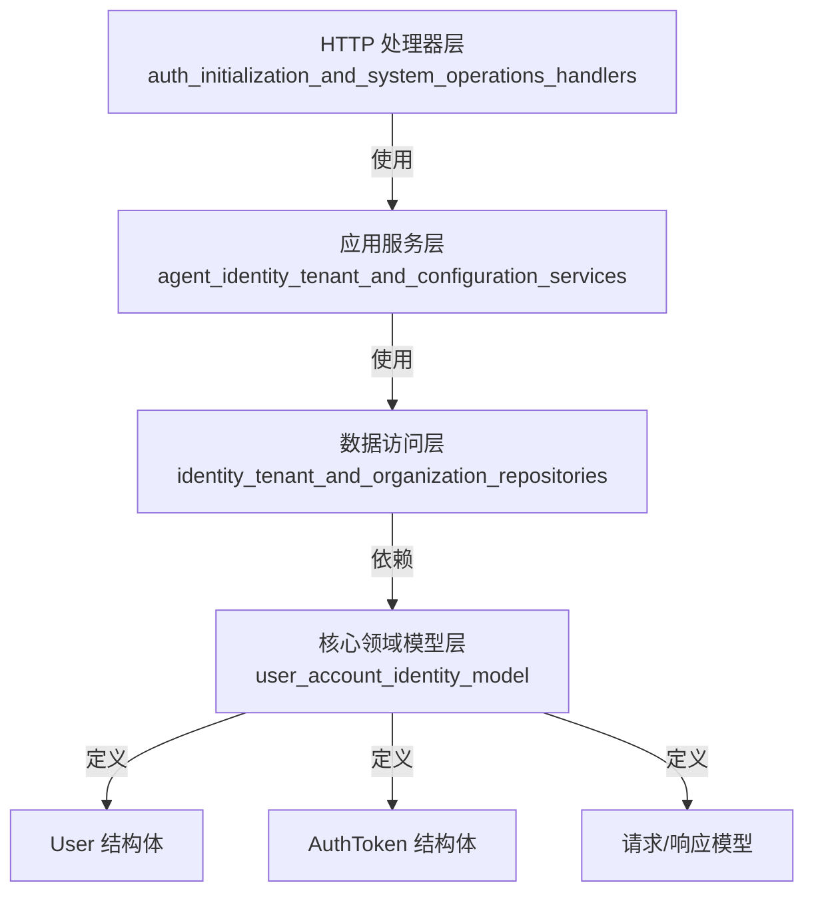

# user_account_identity_model 模块技术深度解析

## 1. 模块概述

`user_account_identity_model` 模块是系统身份认证和用户管理的核心数据模型层，位于 `core_domain_types_and_interfaces/identity_tenant_organization_and_configuration_contracts/user_identity_registration_and_auth_contracts/` 路径下。这个模块定义了用户账户、身份认证和相关请求/响应的数据结构，为整个系统的用户身份管理提供了基础数据契约。

### 解决的核心问题

在多租户 SaaS 系统中，用户身份管理面临几个关键挑战：
- 需要安全地存储用户凭证，同时避免敏感信息泄露
- 支持跨租户访问控制
- 提供清晰的 API 契约，确保前后端数据交互的一致性
- 与 ORM 框架集成，实现数据持久化

这个模块通过分层的数据模型设计，优雅地解决了这些问题。

## 2. 核心组件解析

### 2.1 User 结构体

`User` 是系统中用户的核心数据模型，代表了一个完整的用户账户实体。

```go
type User struct {
    ID                  string         `json:"id"         gorm:"type:varchar(36);primaryKey"`
    Username            string         `json:"username"   gorm:"type:varchar(100);uniqueIndex;not null"`
    Email               string         `json:"email"      gorm:"type:varchar(255);uniqueIndex;not null"`
    PasswordHash        string         `json:"-"          gorm:"type:varchar(255);not null"`
    Avatar              string         `json:"avatar"     gorm:"type:varchar(500)"`
    TenantID            uint64         `json:"tenant_id"  gorm:"index"`
    IsActive            bool           `json:"is_active"  gorm:"default:true"`
    CanAccessAllTenants bool           `json:"can_access_all_tenants" gorm:"default:false"`
    CreatedAt           time.Time      `json:"created_at"`
    UpdatedAt           time.Time      `json:"updated_at"`
    DeletedAt           gorm.DeletedAt `json:"deleted_at" gorm:"index"`
    Tenant              *Tenant        `json:"tenant,omitempty" gorm:"foreignKey:TenantID"`
}
```

**设计要点**：
- 使用 UUID 作为主键（`ID` 字段），确保分布式系统中的唯一性
- `PasswordHash` 字段使用 `json:"-"` 标签，完全避免在 API 响应中暴露
- 用户名和邮箱都有唯一性约束，确保用户账户的唯一性
- 支持软删除（`DeletedAt` 字段），保留数据完整性
- 通过 `Tenant` 关联实现多租户支持
- `CanAccessAllTenants` 字段支持跨租户访问控制

### 2.2 AuthToken 结构体

`AuthToken` 管理用户的认证令牌，支持访问令牌和刷新令牌。

```go
type AuthToken struct {
    ID        string    `json:"id"         gorm:"type:varchar(36);primaryKey"`
    UserID    string    `json:"user_id"    gorm:"type:varchar(36);index;not null"`
    Token     string    `json:"token"      gorm:"type:text;not null"`
    TokenType string    `json:"token_type" gorm:"type:varchar(50);not null"`
    ExpiresAt time.Time `json:"expires_at"`
    IsRevoked bool      `json:"is_revoked" gorm:"default:false"`
    CreatedAt time.Time `json:"created_at"`
    UpdatedAt time.Time `json:"updated_at"`
    User      *User     `json:"user,omitempty" gorm:"foreignKey:UserID"`
}
```

**设计要点**：
- 支持多种令牌类型（通过 `TokenType` 区分）
- 令牌可以被撤销（`IsRevoked` 字段）
- 包含过期时间，支持自动失效
- 通过外键与用户关联，确保令牌的归属明确

### 2.3 请求/响应模型

模块定义了清晰的 API 契约模型：

- **LoginRequest**：登录请求，包含邮箱和密码字段
- **RegisterRequest**：注册请求，包含用户名、邮箱和密码字段
- **LoginResponse**：登录响应，包含用户信息、租户信息和令牌
- **RegisterResponse**：注册响应，包含用户信息和租户信息

这些模型都使用了 `binding` 标签进行数据验证，确保输入数据的有效性。

### 2.4 UserInfo 结构体与转换方法

`UserInfo` 是专门用于 API 响应的用户信息模型，不包含敏感数据。

```go
type UserInfo struct {
    ID                  string    `json:"id"`
    Username            string    `json:"username"`
    Email               string    `json:"email"`
    Avatar              string    `json:"avatar"`
    TenantID            uint64    `json:"tenant_id"`
    IsActive            bool      `json:"is_active"`
    CanAccessAllTenants bool      `json:"can_access_all_tenants"`
    CreatedAt           time.Time `json:"created_at"`
    UpdatedAt           time.Time `json:"updated_at"`
}

func (u *User) ToUserInfo() *UserInfo {
    return &UserInfo{
        ID:                  u.ID,
        Username:            u.Username,
        Email:               u.Email,
        Avatar:              u.Avatar,
        TenantID:            u.TenantID,
        IsActive:            u.IsActive,
        CanAccessAllTenants: u.CanAccessAllTenants,
        CreatedAt:           u.CreatedAt,
        UpdatedAt:           u.UpdatedAt,
    }
}
```

**设计要点**：
- 明确分离了数据存储模型和 API 响应模型
- 通过 `ToUserInfo` 方法实现安全转换，避免敏感信息泄露
- 保持了数据的一致性，同时提供了灵活性

## 3. 架构与数据流

### 3.1 模块在系统中的位置

`user_account_identity_model` 模块位于系统架构的核心领域层，为上层的应用服务和数据访问层提供数据契约：



### 3.2 典型数据流

以用户登录流程为例，数据在系统中的流动如下：

1. **请求接收**：HTTP 层接收登录请求，验证 `LoginRequest` 格式
2. **服务处理**：应用服务层处理登录逻辑，验证用户凭证
3. **数据访问**：数据访问层使用 `User` 模型查询数据库
4. **令牌生成**：创建 `AuthToken` 记录并生成 JWT 令牌
5. **响应构建**：使用 `LoginResponse` 模型构建响应，通过 `ToUserInfo` 安全转换用户数据

## 4. 设计决策与权衡

### 4.1 数据模型分层设计

**决策**：将数据模型分为存储模型（`User`）和 API 响应模型（`UserInfo`）

**原因**：
- 安全性：避免敏感字段（如密码哈希）意外暴露
- 灵活性：可以独立演进 API 响应格式，不影响数据库结构
- 清晰性：明确区分了内部数据表示和外部数据契约

**权衡**：
- 增加了一定的代码复杂性，需要维护两个模型和转换方法
- 但换取了更好的安全性和可维护性

### 4.2 软删除 vs 硬删除

**决策**：使用 GORM 的软删除功能（`DeletedAt` 字段）

**原因**：
- 数据完整性：保留用户数据用于审计和分析
- 可恢复性：允许恢复误删除的用户账户
- 关联数据：避免因删除用户导致关联数据的外键约束问题

**权衡**：
- 占用更多存储空间
- 查询时需要考虑软删除的过滤条件
- 但对于用户账户管理这种场景，软删除的优势明显大于劣势

### 4.3 UUID 主键 vs 自增 ID

**决策**：使用 UUID 作为主键（`ID` 字段为 varchar(36)）

**原因**：
- 分布式系统友好：可以在应用层生成 ID，不依赖数据库
- 安全性：不暴露系统的数据量和增长趋势
- 迁移便利：在不同数据库间迁移数据时不会产生 ID 冲突

**权衡**：
- UUID 索引性能略低于整数索引
- 占用更多存储空间（36 字符 vs 4/8 字节整数）
- 但在用户账户这种读写比例较高、数据量相对可控的场景下，UUID 是更合适的选择

## 5. 使用指南与最佳实践

### 5.1 模型转换

始终使用 `ToUserInfo` 方法将 `User` 转换为 API 响应：

```go
// 正确做法
userInfo := user.ToUserInfo()

// 错误做法：直接使用 User 结构体
// 可能导致敏感信息泄露
```

### 5.2 数据库查询

使用 GORM 时，注意处理软删除和关联加载：

```go
// 查询单个用户（自动过滤已删除用户）
var user User
db.First(&user, "id = ?", userID)

// 包含租户信息查询
db.Preload("Tenant").First(&user, "id = ?", userID)

// 查询所有用户（包括已删除的）
db.Unscoped().Find(&users)
```

### 5.3 数据验证

利用结构体标签进行数据验证：

```go
// 在 HTTP 处理器中
var req LoginRequest
if err := c.ShouldBindJSON(&req); err != nil {
    // 处理验证错误
    c.JSON(http.StatusBadRequest, gin.H{"error": err.Error()})
    return
}
```

## 6. 注意事项与潜在陷阱

### 6.1 敏感信息保护

- 永远不要在日志中记录完整的用户信息，特别是密码相关字段
- 使用 `UserInfo` 而不是 `User` 作为 API 响应
- 定期审查代码，确保没有新的敏感信息泄露路径

### 6.2 租户隔离

- 始终在查询中包含 `TenantID` 过滤条件，除非用户有 `CanAccessAllTenants` 权限
- 注意跨租户操作的安全性检查
- 避免在租户间共享用户数据

### 6.3 令牌管理

- 正确处理令牌的过期和撤销
- 定期清理过期和已撤销的令牌
- 实现令牌刷新机制，提升用户体验

## 7. 相关模块

- [user_auth_service_and_repository_interfaces](core-domain-types-and-interfaces-identity-tenant-organization-and-configuration-contracts-user-identity-registration-and-auth-contracts-user-auth-service-and-repository-interfaces.md)：用户认证服务和仓库接口
- [tenant_lifecycle_and_runtime_configuration_contracts](core-domain-types-and-interfaces-identity-tenant-organization-and-configuration-contracts-tenant-lifecycle-and-runtime-configurations-contracts.md)：租户生命周期和运行时配置契约
- [identity_tenant_and_organization_management](application-services-and-orchestration-agent-identity-tenant-and-configuration-services-identity-tenant-and-organization-management.md)：身份、租户和组织管理服务

## 8. 总结

`user_account_identity_model` 模块是系统身份管理的基石，通过精心设计的数据模型和清晰的 API 契约，为上层功能提供了可靠的支持。模块在安全性、可维护性和灵活性之间取得了良好的平衡，其设计决策体现了对多租户 SaaS 系统特点的深刻理解。

新加入团队的开发者应该重点关注模型的分层设计、安全转换方法以及租户隔离机制，这些是正确使用和扩展此模块的关键。
