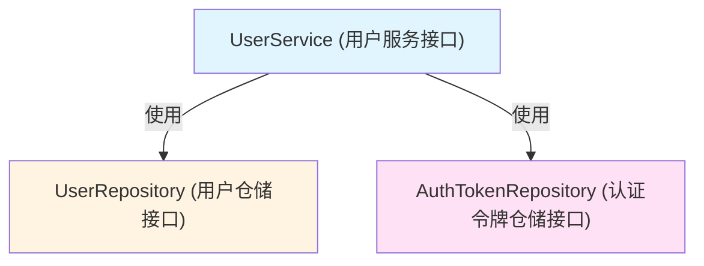
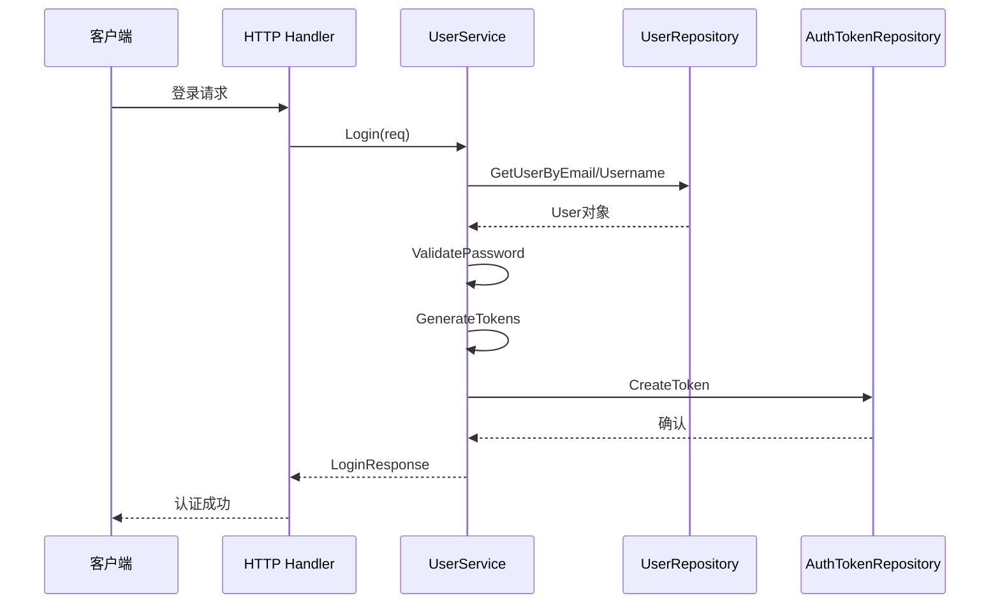

# 用户认证服务与仓储接口 (user_auth_service_and_repository_interfaces)

## 一、模块概述

本模块定义了系统中用户身份管理和认证功能的核心契约接口，是整个身份认证体系的"骨架"。它通过清晰的接口抽象，将用户认证领域的业务逻辑与具体实现分离，使得系统可以灵活地支持不同的认证策略和存储方案。

### 解决的核心问题

在任何多用户系统中，用户认证都是一个复杂且关键的领域：
- 需要同时支持用户注册、登录、密码管理等多种身份操作
- 需要安全地存储和验证用户凭据
- 需要管理认证令牌的生命周期
- 需要在不同的实现方式（如数据库存储 vs 内存存储，传统密码认证 vs OAuth）之间保持灵活性

如果没有这些接口抽象，业务逻辑层会直接依赖具体的实现细节，导致代码耦合度高、难以测试和演进。

## 二、架构与核心抽象

### 2.1 核心架构视图



### 2.2 关键抽象概念

这三个接口形成了一个清晰的分层架构：

1. **UserService** - 业务编排层：
   - 它是认证领域的"指挥中心"，负责协调各种认证相关的操作
   - 它不直接操作数据存储，而是通过仓储接口来完成
   - 包含业务规则（如密码验证、令牌生成逻辑）

2. **UserRepository** - 用户数据访问层：
   - 专注于用户数据的持久化和检索
   - 提供 CRUD 操作和查询能力
   - 隐藏了具体的存储实现细节

3. **AuthTokenRepository** - 令牌数据访问层：
   - 专门负责认证令牌的存储和管理
   - 支持令牌的创建、查找、更新和撤销
   - 提供过期令牌清理等维护功能

### 2.3 类比理解

可以将这个架构想象成一家银行的安全系统：
- **UserService** 是银行的安全经理，负责制定安全策略和协调各种安全操作
- **UserRepository** 是银行的客户档案柜，存储客户的基本信息
- **AuthTokenRepository** 是银行的钥匙管理系统，负责发放、验证和回收访问钥匙

## 三、核心组件详解

### 3.1 UserService 接口

**设计意图**：定义用户认证和账户管理的完整业务能力集合。

**核心方法分类**：

| 功能类别 | 方法 | 说明 |
|---------|------|------|
| 账户生命周期 | `Register`, `DeleteUser` | 创建和删除用户账户 |
| 认证流程 | `Login`, `GenerateTokens`, `ValidateToken`, `RefreshToken`, `RevokeToken` | 处理登录、令牌管理 |
| 密码管理 | `ChangePassword`, `ValidatePassword` | 密码变更和验证 |
| 用户查询 | `GetUserByID`, `GetUserByEmail`, `GetUserByUsername`, `GetCurrentUser`, `SearchUsers` | 多种方式获取用户信息 |
| 信息更新 | `UpdateUser` | 修改用户基本信息 |

**关键设计点**：
- 所有方法都接收 `context.Context` 参数，支持请求级别的超时控制和链路追踪
- 返回值设计考虑了错误处理，所有可能失败的操作都返回 `error`
- `GetCurrentUser` 方法体现了上下文传递的设计模式，从当前请求上下文中提取用户信息

### 3.2 UserRepository 接口

**设计意图**：抽象用户数据的持久化操作，隔离业务逻辑与数据存储细节。

**核心方法**：
- `CreateUser` / `UpdateUser` / `DeleteUser`：基本的 CRUD 操作
- `GetUserByID` / `GetUserByEmail` / `GetUserByUsername`：支持多种唯一标识的查询
- `ListUsers`：支持分页的用户列表查询
- `SearchUsers`：模糊搜索能力

**设计特点**：
- 专注于数据访问，不包含业务逻辑
- 方法命名清晰地表达了数据操作意图
- 分页查询使用 `offset` 和 `limit` 参数，这是一种简单通用的分页策略

### 3.3 AuthTokenRepository 接口

**设计意图**：专门管理认证令牌的生命周期，支持令牌的安全使用和清理。

**核心方法**：
- `CreateToken` / `UpdateToken` / `DeleteToken`：令牌的基本操作
- `GetTokenByValue`：通过令牌值查找令牌（核心验证操作）
- `GetTokensByUserID`：查询用户的所有令牌
- `DeleteExpiredTokens`：批量清理过期令牌（维护操作）
- `RevokeTokensByUserID`：撤销用户的所有令牌（安全响应操作）

**设计亮点**：
- 专门的令牌仓储体现了关注点分离原则
- 支持批量操作（如 `DeleteExpiredTokens` 和 `RevokeTokensByUserID`），考虑了系统维护和安全场景
- 通过 `GetTokenByValue` 支持令牌验证流程

## 四、数据流向与依赖关系

### 4.1 典型认证流程



### 4.2 依赖关系分析

**依赖流向**：
- 上层应用（如 HTTP handlers）依赖 `UserService` 接口
- `UserService` 实现依赖 `UserRepository` 和 `AuthTokenRepository` 接口
- 仓储接口的实现依赖具体的存储技术（如数据库）

**被依赖模块**：
- [identity_tenant_and_organization_repositories](data-access-repositories-identity-tenant-and-organization-repositories.md) 中的实现会实现这些接口
- [auth_initialization_and_system_operations_handlers](http-handlers-and-routing-auth-initialization-and-system-operations-handlers.md) 会使用 `UserService` 来处理认证请求

**数据契约**：
- 所有接口都基于 `internal/types` 包中定义的数据模型（如 `User`、`AuthToken`、`RegisterRequest` 等）
- 这些模型定义了模块间交换数据的结构，形成了明确的契约

## 五、设计决策与权衡

### 5.1 接口分离 vs 统一接口

**决策**：将用户服务、用户仓储、令牌仓储分离为三个独立的接口。

**原因**：
- 遵循**单一职责原则**，每个接口专注于一个领域
- 仓储接口可以独立于服务接口进行测试和实现
- 令牌管理有其独特的生命周期和安全要求，独立出来更清晰

**权衡**：
- ✅ 优点：提高了代码的可测试性和可维护性
- ⚠️ 缺点：增加了接口的数量，可能让初学者感到复杂

### 5.2 接口方法的完整性

**决策**：在接口中定义了非常完整的方法集，覆盖了用户认证的各种场景。

**原因**：
- 作为核心领域接口，需要提供完整的能力抽象
- 避免后续因为缺少方法而破坏接口契约

**权衡**：
- ✅ 优点：接口功能完整，能满足各种业务场景
- ⚠️ 缺点：实现者需要实现所有方法，即使某些方法在特定场景下可能用不到

### 5.3 Context 作为第一个参数

**决策**：所有接口方法都将 `context.Context` 作为第一个参数。

**原因**：
- 支持请求级别的取消和超时控制
- 便于传递请求范围的元数据（如追踪 ID）
- 这是 Go 语言中处理请求上下文的标准模式

**权衡**：
- ✅ 优点：符合 Go 语言惯用法，支持可观测性和可靠性
- ⚠️ 缺点：所有方法调用都需要传递 context，增加了一些样板代码

### 5.4 仓储模式的使用

**决策**：使用仓储模式（Repository Pattern）来抽象数据访问。

**原因**：
- 隔离业务逻辑与数据存储细节
- 便于切换不同的存储实现（如从 SQL 切换到 NoSQL）
- 便于在测试中使用内存存储或 mock 实现

**权衡**：
- ✅ 优点：提高了系统的灵活性和可测试性
- ⚠️ 缺点：增加了一层抽象，对于简单系统可能过度设计

## 六、使用指南与最佳实践

### 6.1 接口使用示例

虽然我们只有接口定义，但可以展示典型的使用模式：

```go
// 假设的服务实现初始化
func NewUserService(
    userRepo UserRepository,
    tokenRepo AuthTokenRepository,
) UserService {
    return &userServiceImpl{
        userRepo: userRepo,
        tokenRepo: tokenRepo,
    }
}

// 登录流程的典型实现
func (s *userServiceImpl) Login(ctx context.Context, req *types.LoginRequest) (*types.LoginResponse, error) {
    // 1. 查找用户
    user, err := s.userRepo.GetUserByEmail(ctx, req.Email)
    if err != nil {
        return nil, err
    }
    
    // 2. 验证密码
    if err := s.ValidatePassword(ctx, user.ID, req.Password); err != nil {
        return nil, err
    }
    
    // 3. 生成令牌
    accessToken, refreshToken, err := s.GenerateTokens(ctx, user)
    if err != nil {
        return nil, err
    }
    
    // 4. 返回响应
    return &types.LoginResponse{
        AccessToken:  accessToken,
        RefreshToken: refreshToken,
        User:         user,
    }, nil
}
```

### 6.2 实现注意事项

对于实现这些接口的开发者，需要注意：

1. **UserRepository 实现**：
   - 确保 `GetUserByEmail` 和 `GetUserByUsername` 的查询是大小写敏感还是不敏感（根据业务需求）
   - `SearchUsers` 方法应该支持模糊匹配
   - 分页查询需要考虑性能，避免全表扫描

2. **AuthTokenRepository 实现**：
   - `GetTokenByValue` 是高频调用方法，需要优化查询性能
   - 定期调用 `DeleteExpiredTokens` 清理过期令牌，避免数据膨胀
   - `RevokeTokensByUserID` 需要在用户安全事件（如密码重置）时被调用

3. **UserService 实现**：
   - 密码应该使用安全的哈希算法（如 bcrypt）存储，永远不要存储明文密码
   - 令牌生成应该使用加密安全的随机数生成器
   - `GetCurrentUser` 方法需要从 context 中正确提取用户信息，这通常依赖于中间件设置

### 6.3 测试策略

这些接口非常适合使用测试替身（Test Doubles）：

```go
// MockUserRepository 用于测试
type MockUserRepository struct {
    mock.Mock
}

func (m *MockUserRepository) GetUserByEmail(ctx context.Context, email string) (*types.User, error) {
    args := m.Called(ctx, email)
    if args.Get(0) == nil {
        return nil, args.Error(1)
    }
    return args.Get(0).(*types.User), args.Error(1)
}

// 测试 UserService 的 Login 方法
func TestUserService_Login(t *testing.T) {
    // 设置 mock
    mockUserRepo := new(MockUserRepository)
    mockTokenRepo := new(MockAuthTokenRepository)
    
    // 创建服务实例
    service := NewUserService(mockUserRepo, mockTokenRepo)
    
    // 设置期望
    testUser := &types.User{ID: "123", Email: "test@example.com"}
    mockUserRepo.On("GetUserByEmail", mock.Anything, "test@example.com").Return(testUser, nil)
    
    // 执行测试
    // ...
}
```

## 七、边缘情况与潜在陷阱

### 7.1 并发安全

**问题**：这些接口没有明确规定并发安全要求，但在实际使用中，它们经常会被并发调用。

**建议**：
- 实现者应该确保仓储操作是并发安全的
- 特别是令牌的创建和验证操作，需要考虑竞态条件
- 使用数据库事务来确保操作的原子性

### 7.2 错误处理

**问题**：接口定义使用了通用的 `error` 类型，没有区分不同类型的错误（如用户不存在、密码错误、系统错误）。

**建议**：
- 实现者应该定义和返回有意义的错误类型
- 调用者需要根据错误类型做出不同的响应（如返回 401 还是 500 HTTP 状态码）
- 考虑使用 Go 1.13+ 的错误包装和 `errors.Is`/`errors.As` 来处理错误链

### 7.3 令牌安全性

**问题**：令牌管理有许多安全细节，接口本身无法强制这些安全要求。

**注意事项**：
- 令牌应该有合理的过期时间
- 刷新令牌应该是一次性使用的，使用后立即失效并生成新的
- 令牌撤销应该立即生效，不能有延迟
- 考虑在令牌中包含版本号，便于密钥轮换

### 7.4 数据一致性

**问题**：用户服务操作可能涉及多个仓储的操作，需要保持数据一致性。

**建议**：
- 实现者应该考虑使用分布式事务或本地事务（如果可能）
- 在失败情况下要有补偿机制
- 考虑使用事件驱动架构来处理最终一致性场景

## 八、总结

`user_auth_service_and_repository_interfaces` 模块是系统身份认证领域的核心契约定义，它通过清晰的接口抽象，实现了业务逻辑与数据访问的分离。这种设计带来了高度的灵活性和可测试性，但也需要实现者仔细考虑各种边缘情况和安全问题。

对于新加入团队的开发者来说，理解这些接口的设计意图和使用方式，是掌握系统认证体系的第一步。当你需要实现新的认证功能或修改现有功能时，请首先考虑这些接口如何支持你的需求，并遵循已有的设计模式。

## 九、相关模块参考

- [identity_tenant_and_organization_repositories](data-access-repositories-identity-tenant-and-organization-repositories.md) - 这些接口的实现模块
- [auth_initialization_and_system_operations_handlers](http-handlers-and-routing-auth-initialization-and-system-operations-handlers.md) - 使用这些接口的 HTTP 处理器
- [user_identity_registration_and_auth_contracts](core-domain-types-and-interfaces-identity-tenant-organization-and-configuration-contracts-user-identity-registration-and-auth-contracts.md) - 相关的数据模型定义
