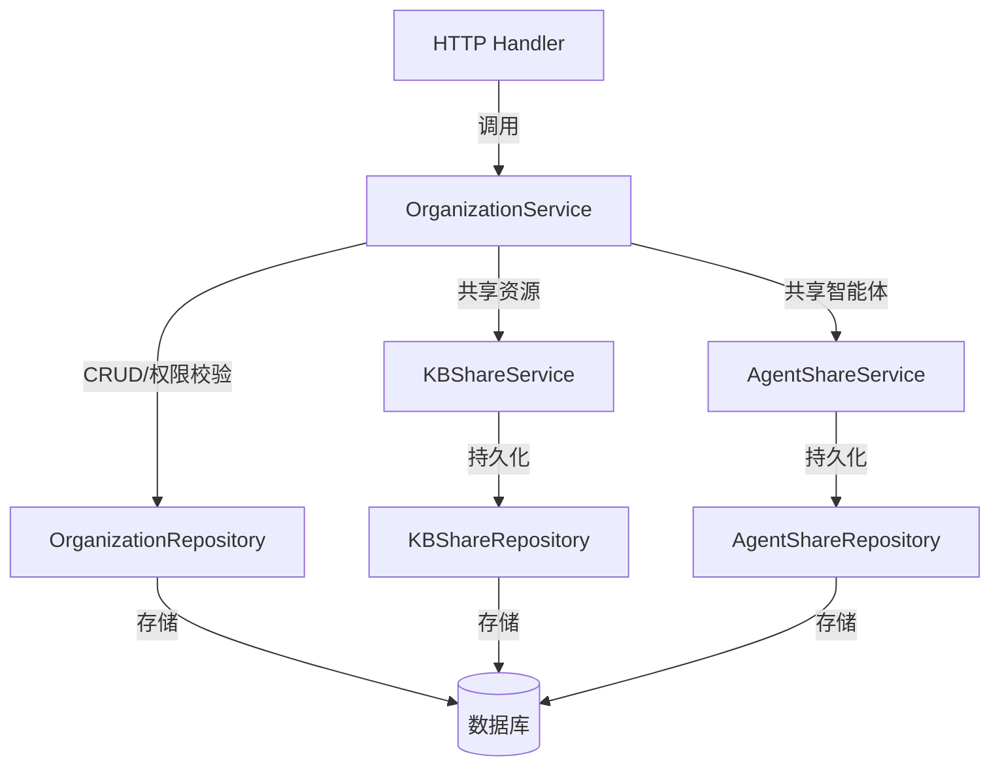

# organization_service_and_persistence_interfaces 模块技术深度解析

## 1. 问题空间：为什么需要这个模块？

在多租户、多组织的协作平台中，我们面临着几个核心挑战：

- **组织边界管理**：如何定义一个组织？如何让用户在不同组织间切换？
- **成员身份与权限**：组织内部不同角色（管理员、普通成员）如何差异化授权？
- **资源共享与隔离**：如何在组织内共享知识库、智能体等资源，同时确保跨组织边界的安全隔离？
- **加入流程的多样性**：有些组织希望开放邀请码加入，有些需要审批，有些甚至希望被搜索发现——如何统一这些流程？

**设计洞察**：与其在每个资源（知识库、智能体）层面重复实现权限逻辑，不如建立一个独立的组织治理层，作为资源共享的"信任边界"。这个模块就是这个治理层的契约定义。

---

## 2. 核心抽象与心智模型

把这个模块想象成一个**"数字写字楼的物业管理系统"**：

- `Organization` 是一层楼或一个办公区——有自己的名字、规则和成员列表
- `OrganizationMember` 是门卡——记录了谁能进哪层楼、拥有什么权限级别
- `OrganizationService` 是前台服务台——处理注册、加入、换卡、邀请等所有业务操作
- `OrganizationRepository` 是档案室——持久化所有组织和成员数据
- `JoinRequest` 是访客申请单——需要管理员审批才能进门

关键的分离是：**服务接口负责业务规则和权限校验，仓库接口只负责数据存取**。

---

## 3. 架构与数据流向



### 典型数据流（以用户通过邀请码加入组织为例）：

1. **请求入口**：HTTP 层调用 `OrganizationService.JoinByInviteCode()`
2. **服务层处理**：
   - 通过 `OrganizationRepository.GetByInviteCode()` 查找组织
   - 验证邀请码有效性（是否过期等）
   - 使用 `OrganizationRepository.AddMember()` 添加成员
3. **返回结果**：返回完整的 `Organization` 对象给上层

---

## 4. 核心组件深度解析

### 4.1 OrganizationService 接口

**职责**：定义组织生命周期管理、成员管理、邀请机制、加入请求处理的业务契约。

**关键方法分类**：

| 分类 | 核心方法 | 设计意图 |
|------|---------|---------|
| **CRUD** | `CreateOrganization`, `GetOrganization`, `UpdateOrganization`, `DeleteOrganization` | 基础生命周期管理，注意 `CreateOrganization` 需要 `userID`（创建者成为管理员） |
| **成员管理** | `AddMember`, `RemoveMember`, `UpdateMemberRole`, `ListMembers` | 组织内部治理，所有修改操作都需要 `operatorUserID` 进行权限校验 |
| **邀请码** | `GenerateInviteCode`, `JoinByInviteCode` | 便捷加入机制，支持临时邀请 |
| **加入审批** | `SubmitJoinRequest`, `ListJoinRequests`, `ReviewJoinRequest` | 受控加入流程，支持管理员审核 |
| **权限检查** | `IsOrgAdmin`, `GetUserRoleInOrg` | 供其他服务调用的授权原语 |

**设计亮点**：
- 每个写操作都传递 `userID`，确保权限校验在服务层统一进行
- 区分"通过邀请码加入"（`JoinByInviteCode`）和"申请加入"（`JoinByOrganizationID`），支持不同组织治理策略
- 提供 `RequestRoleUpgrade` 让现有成员可以申请更高权限

### 4.2 OrganizationRepository 接口

**职责**：定义组织和成员数据的持久化契约，不包含业务逻辑。

**与 Service 的关键区别**：
- Repository 方法不做权限校验（例如 `AddMember` 直接接收 `OrganizationMember` 对象）
- Repository 提供更细粒度的数据操作（如 `ListMembersByUserForOrgs` 批量查询）
- Repository 处理邀请码过期时间等底层数据细节

**特殊方法**：
- `ListSearchable`：支持组织发现功能
- `UpdateInviteCode`：单独更新邀请码（带过期时间）
- `GetPendingRequestByType`：区分"加入请求"和"角色升级请求"

### 4.3 共享服务接口（KBShareService / AgentShareService）

这两个接口是组织治理能力的延伸——**组织是资源共享的容器**。

**设计模式**：
- 共享通过 `Share` 记录建立（知识库 ↔ 组织，带权限）
- 提供批量查询方法（如 `ListSharedKnowledgeBaseIDsByOrganizations`）优化侧边栏等场景的性能
- 权限检查方法（如 `HasKBPermission`）供下游服务使用

---

## 5. 设计决策与权衡

### 5.1 Service vs Repository 分离

**选择**：严格区分业务逻辑（Service）和数据访问（Repository）

**原因**：
- 业务规则可能变化（例如邀请码过期策略），但数据存取相对稳定
- 便于测试——可以 mock Repository 测试 Service 逻辑
- 权限校验集中在 Service 层，避免 Repository 泄露

**权衡**：
- 增加了一层抽象，简单场景可能显得冗余
- 必须小心避免业务逻辑泄露到 Repository 层

### 5.2 组织 vs 租户的关系

**观察**：接口中同时出现 `orgID` 和 `tenantID`，例如 `CreateOrganization` 需要 `tenantID`。

**设计意图**：
- 租户是资源隔离的边界（数据库、存储等）
- 组织是租户内的协作单元
- 一个租户可以有多个组织
- 跨租户共享需要特殊处理（如 `GetKBSourceTenant` 方法所示）

### 5.3 邀请码 vs 审批流双轨制

**选择**：同时支持邀请码（即时加入）和审批流（申请-审核）

**原因**：
- 不同组织有不同的安全需求
- 邀请码适合内部团队快速协作
- 审批流适合开放社区或敏感组织

**权衡**：
- 增加了接口复杂度
- 但通过 `JoinRequestType` 统一了数据模型

### 5.4 批量操作优化

**观察**：接口中有很多批量方法，如 `ListMembersByUserForOrgs`、`ListSharedKnowledgeBaseIDsByOrganizations`

**设计意图**：
- 针对 UI 侧边栏、组织列表等读多写少的场景优化
- 避免 N+1 查询问题

---

## 6. 使用指南与最佳实践

### 6.1 如何正确实现这些接口

**对于 OrganizationService 实现者**：
```go
// ✅ 正确：在 Service 层做权限校验
func (s *organizationService) RemoveMember(ctx context.Context, orgID string, memberUserID string, operatorUserID string) error {
    // 1. 检查操作者是否是管理员
    isAdmin, err := s.IsOrgAdmin(ctx, orgID, operatorUserID)
    if err != nil {
        return err
    }
    if !isAdmin {
        return errors.New("permission denied")
    }
    // 2. 执行操作
    return s.repo.RemoveMember(ctx, orgID, memberUserID)
}
```

**对于 Repository 实现者**：
```go
// ✅ 正确：Repository 只做数据存取
func (r *organizationRepository) RemoveMember(ctx context.Context, orgID string, userID string) error {
    // 直接执行数据库操作，不做权限检查
    return r.db.WithContext(ctx).Where("org_id = ? AND user_id = ?", orgID, userID).Delete(&OrganizationMember{}).Error
}
```

### 6.2 扩展点

- **自定义权限逻辑**：通过实现 `OrganizationService` 替换权限校验规则
- **不同存储后端**：通过实现 `OrganizationRepository` 支持不同数据库
- **自定义邀请码生成**：在 `GenerateInviteCode` 实现中定制邀请码格式和过期策略

---

## 7. 边缘情况与注意事项

### 7.1 隐式契约

- `CreateOrganization` 的调用者应该确保创建者被自动添加为管理员（接口没有明确说，但这是业务常识）
- 邀请码应该有过期时间（虽然 `UpdateInviteCode` 的 `expiresAt` 是可选指针）
- 删除组织应该级联删除相关的共享记录（`KBShareRepository.DeleteByOrganizationID` 暗示了这一点）

### 7.2 常见陷阱

1. **在 Repository 层做权限校验**：这会导致业务逻辑分散
2. **忽略 tenantID**：跨租户操作可能导致数据泄露
3. **忘记处理软删除**：`KBShareRepository` 有 `DeleteByKnowledgeBaseID` 等软删除方法，实现时需要注意
4. **并发问题**：加入请求的审批和成员添加需要事务保护

### 7.3 性能考虑

- 批量查询方法（如 `ListSharedKnowledgeBaseIDsByOrganizations`）应该被优先使用，避免循环调用
- `CountPendingJoinRequests` 等计数方法在大数据量下可能需要优化

---

## 8. 相关模块参考

- [organization_domain_and_response_models](core-domain-types-and-interfaces-identity-tenant-organization-and-configuration-organization-governance-membership-and-join-workflow-organization-lifecycle-and-governance-organization-domain-and-response-models.md)：定义了本模块使用的数据模型
- [organization_lifecycle_request_contracts](core-domain-types-and-interfaces-identity-tenant-organization-and-configuration-organization-governance-membership-and-join-workflow-organization-lifecycle-and-governance-organization-lifecycle-request-contracts.md)：定义了请求/响应契约
- [organization_governance_and_membership_management_repository](data-access-repositories-identity-tenant-and-organization-repositories-organization-membership-sharing-and-access-control-repositories-organization-membership-and-governance-repository.md)：本接口的参考实现
