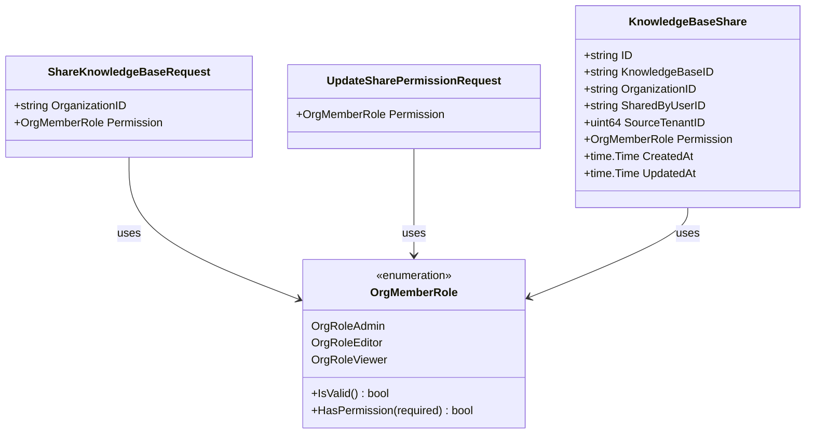

# knowledge_base_sharing_request_contracts 模块技术深度解析

## 1. 模块概述

### 问题空间

在多租户协作场景中，知识库共享是一个核心需求。当一个组织需要跨租户边界共享知识资产时，会面临几个关键挑战：

- **权限控制的复杂性**：如何在共享资源的同时，确保不同角色的用户获得适当的访问权限？
- **跨租户资源隔离**：如何在保持租户数据隔离的前提下，实现安全的资源共享？
- **共享操作的可追溯性**：谁共享了什么资源，何时共享的，授予了什么权限？
- **权限层级管理**：如何处理组织成员角色与共享资源权限之间的关系？

简单的直接访问方案无法解决这些问题，因为它缺乏细粒度的权限控制、审计追踪和租户隔离保障。

### 解决方案

`knowledge_base_sharing_request_contracts` 模块通过定义一组结构化的请求契约，为知识库共享操作提供了标准化的接口。这些契约不仅定义了数据结构，还通过验证规则确保了操作的安全性和一致性。

核心思想是将共享操作抽象为明确的请求-响应模式，通过中心化的权限模型来管理跨组织资源访问。

## 2. 架构与数据模型

### 核心数据结构



### 核心组件解析

#### ShareKnowledgeBaseRequest

这是共享知识库的核心请求结构，它定义了将知识库共享到组织所需的基本信息：

```go
type ShareKnowledgeBaseRequest struct {
    OrganizationID string        `json:"organization_id" binding:"required"`
    Permission     OrgMemberRole `json:"permission" binding:"required"`
}
```

**设计意图**：
- `OrganizationID` 明确指定了共享的目标组织，确保操作的目标性
- `Permission` 字段定义了授予该组织的权限级别，使用标准化的 `OrgMemberRole` 枚举
- 通过 `binding:"required"` 标签强制验证，防止无效请求

**为什么这样设计？**
这种设计将共享操作的意图清晰地表达出来，同时将权限模型与组织模型统一起来，确保了权限体系的一致性。

#### UpdateSharePermissionRequest

用于更新已共享知识库的权限：

```go
type UpdateSharePermissionRequest struct {
    Permission OrgMemberRole `json:"permission" binding:"required"`
}
```

**设计意图**：
- 专注于权限变更这一单一职责，符合接口隔离原则
- 与共享请求使用相同的权限类型，保持权限模型的一致性

## 3. 权限模型深度解析

### OrgMemberRole 权限系统

`OrgMemberRole` 是整个权限系统的核心，它定义了三个基本角色：

```go
type OrgMemberRole string

const (
    OrgRoleAdmin  OrgMemberRole = "admin"
    OrgRoleEditor OrgMemberRole = "editor"
    OrgRoleViewer OrgMemberRole = "viewer"
)
```

### 权限检查机制

```go
func (r OrgMemberRole) HasPermission(required OrgMemberRole) bool {
    roleLevel := map[OrgMemberRole]int{
        OrgRoleAdmin:  3,
        OrgRoleEditor: 2,
        OrgRoleViewer: 1,
    }
    return roleLevel[r] >= roleLevel[required]
}
```

**设计意图**：
- 使用数字等级实现权限的层级比较，简化权限检查逻辑
- 采用"至少拥有"的权限模型，高级角色自动拥有低级角色的所有权限

**为什么使用数字等级？**
数字等级提供了一种简单而有效的方式来表示权限的包含关系。它使得权限检查变得直观且高效，同时也为未来可能的权限级别扩展预留了空间。

### 有效权限计算

在实际使用中，用户对共享知识库的有效权限是两个因素的交集：
1. 知识库共享时授予组织的权限 (`KnowledgeBaseShare.Permission`)
2. 用户在组织中的角色 (`OrganizationMember.Role`)

有效权限 = 两者中的较低权限

这种设计确保了：
- 资源所有者可以控制共享资源的最高权限级别
- 组织管理员可以控制成员对共享资源的实际访问能力

## 4. 数据流转与依赖关系

### 共享操作流程

1. **请求发起**：用户提交 `ShareKnowledgeBaseRequest`，指定目标组织和权限级别
2. **权限验证**：系统验证用户是否有共享该知识库的权限
3. **创建共享记录**：生成 `KnowledgeBaseShare` 记录，保存共享详情
4. **权限生效**：组织成员根据自身角色和共享权限获得访问能力

### 模块依赖关系

该模块与以下核心模块有紧密联系：

- [knowledge_base_sharing_domain_and_response_models](core-domain-types-and-interfaces-identity-tenant-organization-and-configuring-organization-resource-sharing-and-access-control-knowledge-base-sharing-knowledge-base-sharing-domain-and-response-models.md) - 定义了共享操作的响应模型
- [knowledge_base_sharing_service_and_repository_interfaces](core-domain-types-and-interfaces-identity-tenant-organization-and-configuring-organization-resource-sharing-and-access-control-knowledge-base-sharing-knowledge-base-sharing-service-and-repository-interfaces.md) - 定义了共享服务和仓储接口
- [organization_resource_sharing_and_access_control_contracts](core-domain-types-and-interfaces-identity-tenant-organization-and-configuring-organization-resource-sharing-and-access-control.md) - 定义了组织级别的资源共享契约

## 5. 设计决策与权衡

### 决策1：统一的权限模型

**选择**：使用相同的 `OrgMemberRole` 枚举表示组织成员角色和资源共享权限

**权衡**：
- ✅ 优点：权限模型统一，理解和维护简单
- ❌ 缺点：可能不够灵活，无法表达资源特有的细粒度权限

**为什么这样选择**：
在大多数协作场景中，这种统一的权限模型已经足够表达所需的访问控制级别。它简化了系统的认知负担，减少了权限转换和映射的复杂性。

### 决策2：有效权限的交集计算

**选择**：用户有效权限 = min(共享权限, 组织角色)

**权衡**：
- ✅ 优点：双重控制，资源所有者和组织管理员都有控制权
- ❌ 缺点：权限计算逻辑稍显复杂，可能导致用户权限不如预期

**为什么这样选择**：
这种设计确保了资源所有者不会因为共享到组织而失去对资源的控制，同时组织管理员也可以限制成员对外部资源的访问。

### 决策3：请求契约与数据模型分离

**选择**：`ShareKnowledgeBaseRequest` 与 `KnowledgeBaseShare` 是分开的结构

**权衡**：
- ✅ 优点：API 契约与内部数据模型解耦，可以独立演进
- ❌ 缺点：需要进行结构转换，增加了少量代码

**为什么这样选择**：
API 契约应该关注外部交互的需求，而数据模型关注内部存储和业务逻辑。将它们分离可以让两者各自优化，而不会相互牵制。

## 6. 使用指南与最佳实践

### 基本使用示例

```go
// 创建共享请求
shareReq := &types.ShareKnowledgeBaseRequest{
    OrganizationID: "org-123",
    Permission:     types.OrgRoleViewer,
}

// 更新权限请求
updateReq := &types.UpdateSharePermissionRequest{
    Permission: types.OrgRoleEditor,
}
```

### 最佳实践

1. **权限最小化原则**：始终授予完成工作所需的最低权限
2. **验证角色有效性**：在使用前调用 `OrgMemberRole.IsValid()` 确保角色值合法
3. **权限检查一致性**：使用 `HasPermission()` 进行权限比较，而不是直接比较字符串
4. **记录共享操作**：保存完整的共享记录，包括共享者、时间、权限等信息

## 7. 边缘情况与注意事项

### 常见陷阱

1. **忽略有效权限计算**：直接使用共享权限而不考虑用户在组织中的角色
2. **权限降级的影响**：降低共享权限可能会影响组织中所有成员的访问
3. **组织删除后的处理**：删除组织时需要考虑如何处理相关的共享记录
4. **跨租户嵌入模型访问**：共享知识库时，需要确保目标组织可以访问源租户的嵌入模型

### 错误处理

- 始终验证请求的必填字段（利用 `binding` 标签）
- 检查 `OrgMemberRole` 的有效性
- 处理权限升级/降级时的边界情况

## 8. 扩展与未来方向

### 可能的扩展点

1. **更细粒度的权限**：引入资源特定的权限，如"只能搜索不能查看完整内容"
2. **过期时间**：为共享关系添加过期时间，实现临时共享
3. **共享审批流程**：为敏感资源的共享添加审批机制
4. **权限继承**：支持组织内的权限继承结构

### 与其他模块的集成

该模块是组织资源共享体系的基础，未来可能需要与以下方面深度集成：
- 审计日志系统，记录所有共享操作
- 通知系统，告知用户资源共享状态的变化
- 用量统计，跟踪共享资源的使用情况
