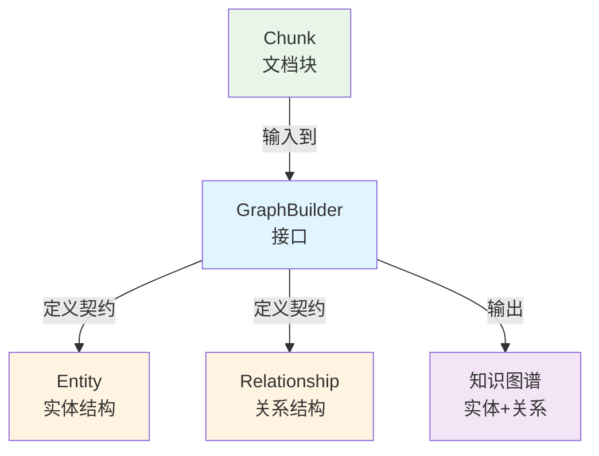

# 知识图谱实体关系构建契约模块技术深度解析

## 1. 模块概述

想象一下，你有一堆散落的拼图碎片（文档块），每块碎片上都有一些图案和文字。你需要把这些碎片拼起来，不仅要看到每块碎片上的内容，还要理解它们之间的关系——哪些碎片属于同一个场景，哪些人物在不同场景中出现，它们之间有什么联系。这就是 `graph_entity_relationship_builder_contracts` 模块要解决的问题。

这个模块定义了知识图谱构建的核心契约，它为从文档中提取实体和关系提供了标准化的数据模型和操作接口。在没有这些契约之前，不同的图谱构建实现可能会有各自的数据结构，导致组件之间难以集成和替换。通过定义统一的 `Entity`、`Relationship` 和 `GraphBuilder` 接口，这个模块建立了知识图谱领域的通用语言，使得图谱构建、查询和可视化等组件可以松耦合地协同工作。

## 2. 核心概念与架构

### 2.1 心智模型

我们可以把知识图谱想象成一个**社交网络**：
- **Entity（实体）** 是社交网络中的**用户**——每个用户有自己的ID、昵称（Title）、职业（Type）和个人简介（Description）
- **Relationship（关系）** 是用户之间的**好友关系**——它连接两个用户，描述他们之间的关系类型和强度
- **GraphBuilder（图谱构建器）** 是**社交网络分析工具**——它负责收集用户数据、建立关系网络，并提供查询功能来发现谁和谁有关系、谁是谁的朋友的朋友

这个类比很贴切，因为知识图谱本质上就是一个语义网络，而社交网络是语义网络的一种常见形式。

### 2.2 组件架构



这个模块的架构非常简洁，它只定义了三个核心组件：
1. **Entity**：表示图谱中的节点
2. **Relationship**：表示图谱中的边
3. **GraphBuilder**：定义了构建和查询图谱的操作接口

这些组件共同构成了知识图谱构建的抽象层，具体的实现可以由其他模块提供（比如 [knowledge_graph_construction](application_services_and_orchestration-knowledge_ingestion_extraction_and_graph_services-knowledge_graph_construction.md) 模块）。

## 3. 核心组件深度解析

### 3.1 Entity（实体）

**设计意图**：`Entity` 结构体表示知识图谱中的节点，它封装了一个概念、人物、地点或事物的所有必要信息。

```go
type Entity struct {
	ID          string   // 唯一标识符
	ChunkIDs    []string // 引用出现该实体的文档块
	Frequency   int      // 在语料库中的出现次数（JSON序列化时忽略）
	Degree      int      // 与其他实体的连接数（JSON序列化时忽略）
	Title       string   // 显示名称
	Type        string   // 实体类型（如人物、概念、组织）
	Description string   // 简要说明或上下文
}
```

**关键设计决策**：
- **分离计算字段与业务字段**：`Frequency` 和 `Degree` 字段被标记为 `json:"-"`，这意味着它们不会被序列化到JSON中。这些是计算字段，用于内部排序和分析，不需要暴露给外部消费者。
- **多出处追踪**：`ChunkIDs` 数组允许记录实体在多个文档块中出现，这对于溯源和可信度评估非常重要。
- **语义丰富度**：除了基本的 `Title` 和 `Type`，还包含 `Description` 字段，为实体提供上下文信息，这对于后续的检索和推理至关重要。

### 3.2 Relationship（关系）

**设计意图**：`Relationship` 结构体表示知识图谱中两个实体之间的语义连接，它不仅记录连接关系，还包含关系的强度和描述信息。

```go
type Relationship struct {
	ID             string   // 唯一标识符（JSON序列化时忽略）
	ChunkIDs       []string // 引用建立该关系的文档块（JSON序列化时忽略）
	CombinedDegree int      // 连接实体的度数之和，用于排序（JSON序列化时忽略）
	Weight         float64  // 基于文本证据的关系强度（JSON序列化时忽略）
	Source         string   // 关系起始实体的ID
	Target         string   // 关系结束实体的ID
	Description    string   // 实体关系的描述
	Strength       int      // 归一化的关系重要性度量（1-10）
}
```

**关键设计决策**：
- **有向图设计**：通过 `Source` 和 `Target` 字段明确区分关系的起点和终点，支持更精确的语义表达（例如"Alice雇佣Bob"和"Bob被Alice雇佣"是不同的）。
- **多重强度度量**：同时提供 `Weight`（浮点数，原始计算值）和 `Strength`（整数，归一化1-10），前者适合内部算法使用，后者适合用户界面展示。
- **隐藏内部字段**：与 `Entity` 类似，多个内部计算字段被标记为 `json:"-"`，保持外部API的简洁性。
- **溯源支持**：`ChunkIDs` 字段记录了关系是从哪些文档块中提取的，这对于验证关系的可靠性非常重要。

### 3.3 GraphBuilder（图谱构建器接口）

**设计意图**：`GraphBuilder` 接口定义了构建和查询知识图谱的核心操作，它是这个模块的核心抽象，允许不同的实现可以互换使用。

```go
type GraphBuilder interface {
	// 从提供的文档块构建知识图谱
	BuildGraph(ctx context.Context, chunks []*Chunk) error
	
	// 获取与指定块直接相关的块ID
	GetRelationChunks(chunkID string, topK int) []string
	
	// 获取与指定块间接相关的块ID（二度关系）
	GetIndirectRelationChunks(chunkID string, topK int) []string
	
	// 获取当前知识图谱中的所有实体
	GetAllEntities() []*Entity
	
	// 获取当前知识图谱中的所有关系
	GetAllRelationships() []*Relationship
}
```

**关键设计决策**：
- **构建与查询分离**：接口明确区分了图谱构建（`BuildGraph`）和图谱查询（其他方法）操作，符合单一职责原则。
- **上下文支持**：`BuildGraph` 方法接收 `context.Context` 参数，支持超时控制和取消操作，这对于处理大规模文档集合非常重要。
- **分层次查询**：同时提供直接关系查询（`GetRelationChunks`）和间接关系查询（`GetIndirectRelationChunks`），支持不同粒度的上下文扩展需求。
- **诊断与可视化支持**：`GetAllEntities` 和 `GetAllRelationships` 方法主要用于可视化和诊断，这对于开发和调试非常有帮助。

## 4. 数据流程与依赖关系

### 4.1 数据流程

典型的知识图谱构建和查询流程如下：

1. **输入阶段**：文档处理管道（可能来自 [docreader_pipeline](docreader_pipeline.md) 模块）产生的 `Chunk` 对象作为输入
2. **构建阶段**：调用 `GraphBuilder.BuildGraph()` 方法，从文档块中提取实体和关系，构建图谱
3. **查询阶段**：
   - 直接关系查询：`GetRelationChunks()` 用于获取与某个块直接相关的其他块
   - 间接关系查询：`GetIndirectRelationChunks()` 用于扩展检索范围，发现更多相关内容
4. **输出阶段**：实体和关系可以用于可视化、增强检索结果、支持推理等

### 4.2 依赖关系

**被此模块依赖的组件**：
- `Chunk` 类型：作为 `BuildGraph` 方法的输入，这个类型应该在同一包或相关包中定义

**依赖此模块的组件**：
- [knowledge_graph_construction](application_services_and_orchestration-knowledge_ingestion_extraction_and_graph_services-knowledge_graph_construction.md) 模块：很可能包含 `GraphBuilder` 接口的具体实现
- 检索相关模块：可能使用 `GetRelationChunks` 和 `GetIndirectRelationChunks` 来增强检索结果
- 可视化组件：可能使用 `GetAllEntities` 和 `GetAllRelationships` 来展示知识图谱

## 5. 设计决策与权衡

### 5.1 契约优先设计

**决策**：这个模块只定义接口和数据结构，不提供具体实现。

**权衡**：
- ✅ **优点**：实现了解耦，不同的图谱构建算法可以互换使用，不影响依赖此接口的代码
- ❌ **缺点**：增加了一层抽象，可能会让初学者感到困惑，需要额外的模块来提供实现

**为什么这样选择**：在一个复杂系统中，知识图谱构建算法可能会不断演进和优化，通过定义稳定的接口，可以确保系统的其他部分不会因为算法的变化而受到影响。

### 5.2 字段可见性控制

**决策**：使用 `json:"-"` 标签隐藏内部计算字段。

**权衡**：
- ✅ **优点**：保持了外部API的简洁性，避免暴露不必要的实现细节
- ❌ **缺点**：如果某些消费者确实需要这些内部字段，就无法通过JSON序列化获取它们

**为什么这样选择**：内部计算字段（如 `Frequency`、`Degree`、`Weight`）可能会随着算法的变化而变化，将它们隐藏起来可以保持API的稳定性。如果确实需要暴露这些信息，可以通过专门的方法来提供。

### 5.3 同步 vs 异步构建

**决策**：`BuildGraph` 方法是同步的（返回 `error` 而不是通道或回调）。

**权衡**：
- ✅ **优点**：API更简单，更容易理解和使用
- ❌ **缺点**：对于大规模文档集合，可能会阻塞调用者较长时间

**为什么这样选择**：虽然 `BuildGraph` 方法是同步的，但它接收 `context.Context` 参数，调用者可以通过上下文来控制超时和取消。此外，调用者总是可以在自己的goroutine中调用这个方法，所以同步接口实际上提供了更大的灵活性。

### 5.4 直接与间接关系查询分离

**决策**：提供两个独立的方法 `GetRelationChunks` 和 `GetIndirectRelationChunks`，而不是一个接受度数参数的通用方法。

**权衡**：
- ✅ **优点**：API更明确，调用者可以清楚地知道自己在获取什么
- ❌ **缺点**：如果未来需要支持更高阶的关系（三度、四度），就需要添加更多方法

**为什么这样选择**：在大多数实际应用场景中，直接关系和二度间接关系是最常用的。通过提供这两个专门的方法，可以满足绝大多数需求，同时保持API的简洁性。如果确实需要更通用的支持，可以在未来添加一个接受度数参数的方法。

## 6. 使用指南与最佳实践

### 6.1 基本使用模式

实现 `GraphBuilder` 接口的典型模式：

```go
type MyGraphBuilder struct {
	entities map[string]*Entity
	relationships map[string]*Relationship
	// 其他内部状态
}

func NewMyGraphBuilder() *MyGraphBuilder {
	return &MyGraphBuilder{
		entities: make(map[string]*Entity),
		relationships: make(map[string]*Relationship),
	}
}

func (b *MyGraphBuilder) BuildGraph(ctx context.Context, chunks []*Chunk) error {
	// 实现图谱构建逻辑
	// 1. 从chunks中提取实体
	// 2. 提取实体之间的关系
	// 3. 构建内部数据结构
	// 4. 计算Frequency、Degree等字段
	return nil
}

func (b *MyGraphBuilder) GetRelationChunks(chunkID string, topK int) []string {
	// 实现直接关系查询逻辑
	return nil
}

// 实现其他接口方法...
```

### 6.2 最佳实践

1. **实体标准化**：在提取实体时，应该进行标准化处理，例如将"Apple Inc."和"Apple"视为同一个实体，避免图谱中出现冗余节点。

2. **关系强度计算**：`Strength` 字段应该基于多个因素综合计算，包括实体共现频率、关系描述的明确程度、文档的权威性等。

3. **内存管理**：对于大规模知识图谱，应该考虑内存使用效率。可以考虑使用分页加载或按需计算的策略，而不是一次性加载所有实体和关系。

4. **错误处理**：`BuildGraph` 方法应该妥善处理 `context.Context` 的取消和超时信号，及时清理资源并返回适当的错误。

5. **增量更新**：如果可能，考虑支持增量更新图谱，而不是每次都从头构建。这可以大大提高处理大规模文档集合的效率。

## 7. 注意事项与陷阱

### 7.1 潜在陷阱

1. **实体消歧困难**：同一个词可能指代不同的实体（例如"Apple"可能指苹果公司，也可能指水果），如果不进行适当的消歧，会导致图谱质量下降。

2. **关系提取噪声**：自动提取的关系可能包含错误或噪声，应该有机制来验证和过滤这些关系。

3. **性能考虑**：`GetIndirectRelationChunks` 方法可能会涉及复杂的图遍历，对于大规模图谱，可能会有性能问题。应该考虑使用索引或缓存来优化查询性能。

4. **线程安全**：如果 `GraphBuilder` 的实现会被多个goroutine并发访问，需要确保实现是线程安全的。

### 7.2 隐含契约

虽然接口定义中没有明确说明，但实现者应该遵循以下隐含契约：

1. **确定性**：对于相同的输入，`BuildGraph` 应该产生相同的输出。
2. **幂等性**：多次调用 `BuildGraph` 应该不会产生副作用（除非明确设计为增量更新）。
3. **结果排序**：`GetRelationChunks` 和 `GetIndirectRelationChunks` 返回的结果应该按照相关性排序，最相关的在前。
4. **资源清理**：如果实现使用了外部资源（如临时文件、数据库连接等），应该提供清理这些资源的方法。

## 8. 总结

`graph_entity_relationship_builder_contracts` 模块是知识图谱构建的基础，它定义了实体、关系和图谱构建器的核心契约。通过采用契约优先的设计，它实现了图谱构建算法与使用图谱的组件之间的解耦，使得系统可以灵活地演进和优化。

这个模块的设计体现了几个重要的原则：
- **关注点分离**：数据结构与操作分离，契约与实现分离
- **API稳定性**：通过隐藏内部字段，保持外部API的稳定性
- **灵活性**：提供足够的扩展点，支持不同的实现和使用场景

对于新加入团队的开发者，理解这个模块的设计意图和权衡是非常重要的，因为它是整个知识图谱功能的基础，很多其他模块都依赖于它。
