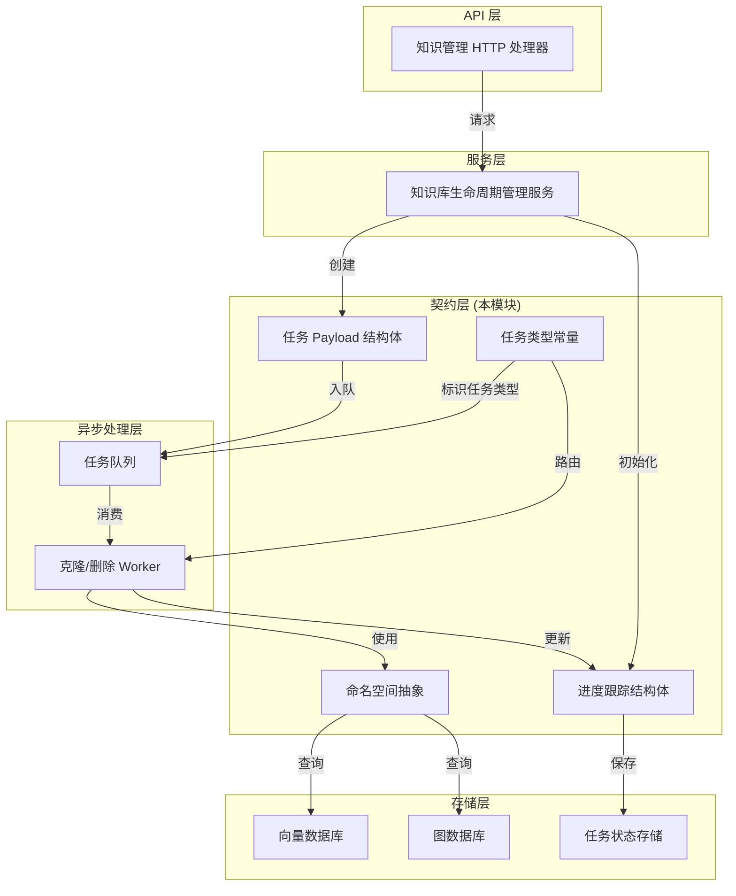

# knowledge_lifecycle_and_namespace_payload_contracts 模块深度解析

## 1. 模块概述与问题空间

在多租户知识管理系统中，知识库和知识内容的生命周期管理涉及复杂的异步操作场景。当您需要复制一个包含数千条知识的知识库、批量删除索引或清理整个知识库时，这些操作既不能阻塞主线程，也不能简单地同步执行——它们需要可靠的任务编排、状态跟踪和错误恢复机制。

这就是 `knowledge_lifecycle_and_namespace_payload_contracts` 模块存在的原因。它定义了知识生命周期管理中**异步任务契约**和**命名空间抽象**，为上层服务提供统一的任务提交格式和状态跟踪模型，同时通过命名空间机制隔离不同租户、知识库和知识的资源边界。

### 核心问题场景

想象一下：
- 您需要将一个包含 10,000 条知识的知识库完整复制到另一个租户，包括所有索引和向量
- 您需要批量删除某个知识库中特定模型生成的所有向量索引，但保留其他索引
- 您需要跟踪这些长时间运行操作的进度，支持失败重试和状态查询

没有统一的任务契约，每个操作都会有自己的参数格式、状态表示和错误处理方式，导致系统复杂度爆炸。这个模块正是为了解决这个问题而设计的。

## 2. 核心抽象与心智模型

### 2.1 任务类型常量：统一的任务标识体系

模块首先定义了一套完整的任务类型常量，这是整个异步任务系统的"路由表"：

```go
const (
    TypeKBClone             = "kb:clone"              // 知识库复制任务
    TypeIndexDelete         = "index:delete"          // 索引删除任务
    TypeKBDelete            = "kb:delete"             // 知识库删除任务
    TypeKnowledgeListDelete = "knowledge:list_delete" // 批量删除知识任务
    // ... 其他任务类型
)
```

这些常量遵循 `domain:action` 的命名模式，既表达了操作的领域（知识库、索引、知识），又明确了操作类型（克隆、删除等）。这种设计让任务调度器可以通过字符串匹配快速路由到对应的处理器。

### 2.2 命名空间抽象：资源隔离的基石

`NameSpace` 结构体是一个看似简单但设计精巧的抽象：

```go
type NameSpace struct {
    KnowledgeBase string `json:"knowledge_base"`
    Knowledge     string `json:"knowledge"`
}

func (n NameSpace) Labels() []string {
    // 返回非空的标签列表
}
```

**设计意图**：
- 用组合而非继承的方式表达资源层级关系
- 通过 `Labels()` 方法提供灵活的标签生成，支持从粗到细的资源定位
- 空字段自动忽略，避免无效标签污染

这个抽象在图数据库查询、向量索引隔离等场景中特别有用——您可以用 `[kb1, doc1]` 精确标识某个文档，也可以只用 `[kb1]` 表示整个知识库。

## 3. 关键组件深度解析

### 3.1 KBClonePayload：知识库复制任务契约

```go
type KBClonePayload struct {
    TenantID uint64 `json:"tenant_id"`
    TaskID   string `json:"task_id"`
    SourceID string `json:"source_id"`
    TargetID string `json:"target_id"`
}
```

**设计亮点**：
- **租户隔离**：`TenantID` 确保跨租户操作的安全性，防止数据泄露
- **幂等性支持**：`TaskID` 让任务处理器可以去重，避免重复执行
- **最小化原则**：只包含克隆操作必需的四个字段，没有冗余信息

这个结构体会被序列化后放入任务队列，由后台的克隆处理器消费。

### 3.2 KBCloneProgress：复制任务的状态跟踪

```go
type KBCloneProgress struct {
    TaskID    string            `json:"task_id"`
    SourceID  string            `json:"source_id"`
    TargetID  string            `json:"target_id"`
    Status    KBCloneTaskStatus `json:"status"`
    Progress  int               `json:"progress"`   // 0-100
    Total     int               `json:"total"`      // 总知识数
    Processed int               `json:"processed"`  // 已处理数
    Message   string            `json:"message"`    // 状态消息
    Error     string            `json:"error"`      // 错误信息
    CreatedAt int64             `json:"created_at"`
    UpdatedAt int64             `json:"updated_at"`
}
```

**为什么这样设计**：
- **双重进度表示**：同时提供百分比 `Progress` 和绝对值 `Total/Processed`，百分比给用户看，绝对值用于精确的进度计算
- **错误隔离**：`Error` 字段独立存在，失败时可以保留错误信息而不覆盖其他状态
- **时间戳审计**：`CreatedAt/UpdatedAt` 支持性能分析和问题排查
- **状态机约束**：通过 `KBCloneTaskStatus` 类型约束，只有预定义的状态是合法的

### 3.3 删除操作家族：细粒度的资源清理

模块定义了三个不同层次的删除 Payload，这体现了**精确控制**的设计理念：

1. **IndexDeletePayload** - 最细粒度：删除特定模型、特定知识库的特定 chunk 索引
2. **KnowledgeListDeletePayload** - 中间层次：批量删除知识条目
3. **KBDeletePayload** - 最粗粒度：删除整个知识库及其所有关联资源

**IndexDeletePayload 的设计特别值得注意**：

```go
type IndexDeletePayload struct {
    TenantID         uint64                  `json:"tenant_id"`
    KnowledgeBaseID  string                  `json:"knowledge_base_id"`
    EmbeddingModelID string                  `json:"embedding_model_id"`
    KBType           string                  `json:"kb_type"`
    ChunkIDs         []string                `json:"chunk_ids"`
    EffectiveEngines []RetrieverEngineParams `json:"effective_engines"`
}
```

这里的 `EffectiveEngines` 字段是一个关键设计——它允许删除操作精确知道哪些检索引擎受到了影响，从而只清理必要的索引，而不是盲目地删除所有东西。这种设计在支持多种向量数据库的混合部署场景中特别有价值。

## 4. 数据流与架构角色

### 4.1 架构概览



### 4.2 在系统中的位置

这个模块位于 **核心领域契约层**，它不包含任何业务逻辑，只定义：
- 任务提交的数据契约
- 任务状态的数据契约
- 资源命名的抽象

它的上游调用者通常是：
- [knowledge_base_lifecycle_management](../application-services-and-orchestration-knowledge-ingestion-extraction-and-graph-services-knowledge-base-lifecycle-management.md) - 知识库生命周期管理服务
- HTTP 处理器层的知识管理端点

它的下游消费者通常是：
- 异步任务处理器（如知识库克隆 Worker）
- 任务状态存储层
- 图数据库和向量检索层

### 4.2 典型数据流：知识库克隆

让我们追踪一个知识库克隆操作的完整数据流：

1. **请求接收**：HTTP 层接收克隆请求，生成 `TaskID`
2. **Payload 构建**：创建 `KBClonePayload`，填充租户、源/目标知识库 ID
3. **任务入队**：将 Payload 序列化后放入任务队列，同时初始化 `KBCloneProgress` 为 `pending` 状态
4. **Worker 消费**：克隆 Worker 从队列取出任务，解析 Payload
5. **进度更新**：Worker 周期性更新 `KBCloneProgress`，增加 `Processed` 计数，计算 `Progress` 百分比
6. **完成通知**：克隆完成后，设置状态为 `completed` 或 `failed`

在整个流程中，这个模块的契约确保了每个环节的数据格式一致性。

## 5. 设计决策与权衡

### 5.1 为什么使用结构体而不是接口？

您可能会问：为什么所有 Payload 都是具体的结构体，而不是定义一个通用的 `TaskPayload` 接口？

**选择：具体结构体 + 类型常量**

**原因**：
- **序列化友好**：结构体可以直接被 JSON 序列化/反序列化，接口则需要额外的类型断言和注册机制
- **性能考虑**：在高频任务队列中，避免运行时类型断言可以节省可观的 CPU 周期
- **调试便利**：具体结构体的字段一目了然，调试时更容易 inspect

**权衡**：
- 失去了一些编译时的多态性
- 添加新任务类型需要修改常量定义和调度器代码

这是一个**性能和简单性优先**的选择，在任务类型相对稳定的场景下非常合理。

### 5.2 为什么进度跟踪同时包含百分比和绝对值？

```go
Progress  int // 0-100
Total     int // 总知识数
Processed int // 已处理数
```

**设计考量**：
- **用户体验**：百分比对用户直观，UI 可以直接用来渲染进度条
- **精确计算**：绝对值让调用者可以重新计算百分比，也能知道"总共有多少工作"
- **容错恢复**：如果任务中断，可以从 `Processed` 的值继续，而不是丢失进度

### 5.3 NameSpace 的 Labels() 方法为什么返回 []string 而不是 map？

**选择**：有序字符串切片

**原因**：
- **层级表达**：切片的顺序隐含了层级关系（知识库在前，知识在后）
- **图数据库友好**：大多数图数据库的标签查询接受字符串列表
- **灵活性**：不需要指定键名，减少了不必要的复杂性

## 6. 使用指南与最佳实践

### 6.1 任务提交的正确姿势

当您需要提交一个知识库克隆任务时：

```go
payload := &types.KBClonePayload{
    TenantID: tenantID,
    TaskID:   generateUniqueTaskID(), // 确保幂等性
    SourceID: sourceKBID,
    TargetID: targetKBID,
}

// 初始化进度记录
progress := &types.KBCloneProgress{
    TaskID:    payload.TaskID,
    SourceID:  payload.SourceID,
    TargetID:  payload.TargetID,
    Status:    types.KBCloneStatusPending,
    Progress:  0,
    CreatedAt: time.Now().Unix(),
    UpdatedAt: time.Now().Unix(),
}
```

**关键要点**：
- 始终生成唯一的 `TaskID`，即使是重试同一个操作
- 初始化进度记录时设置合理的时间戳
- 不要在 Payload 中传递大体积数据，使用引用（如 `EntriesURL`）

### 6.2 命名空间的使用场景

```go
// 场景1：整个知识库
kbNS := types.NameSpace{KnowledgeBase: "kb123"}
labels := kbNS.Labels() // ["kb123"]

// 场景2：特定知识
docNS := types.NameSpace{
    KnowledgeBase: "kb123",
    Knowledge:     "doc456",
}
labels := docNS.Labels() // ["kb123", "doc456"]
```

## 7. 边缘情况与注意事项

### 7.1 空字段的语义

`NameSpace.Labels()` 会自动忽略空字符串，这意味着：
- 空的 `KnowledgeBase` 不会产生标签
- 空的 `Knowledge` 不会产生标签

这在大多数情况下是期望的行为，但如果您需要明确表示"缺失"，可能需要额外的处理。

### 7.2 进度值的精度

`KBCloneProgress.Progress` 是整数类型（0-100），这意味着：
- 小批量任务可能看不到平滑的进度更新
- 对于 1000 个知识的库，每处理 10 个知识进度才 +1

如果您需要更细粒度的进度，应该使用 `Processed/Total` 自行计算。

### 7.3 错误字段的使用

`KBCloneProgress.Error` 字段应该只包含机器可读的错误信息吗？还是应该包含用户友好的消息？

**当前设计**：两者都可能包含，取决于实现。建议的做法是：
- `Error` 存储技术错误信息（用于调试）
- `Message` 存储用户友好的状态描述

### 7.4 并发安全

这些结构体本身**不是并发安全的**。如果多个 goroutine 需要更新同一个 `KBCloneProgress`，您需要自己加锁：

```go
type SafeProgress struct {
    mu       sync.Mutex
    progress *types.KBCloneProgress
}

func (sp *SafeProgress) Update(processed int) {
    sp.mu.Lock()
    defer sp.mu.Unlock()
    sp.progress.Processed = processed
    sp.progress.Progress = (processed * 100) / sp.progress.Total
    sp.progress.UpdatedAt = time.Now().Unix()
}
```

## 8. 与其他模块的关系

- **被依赖**：[knowledge_base_lifecycle_management](../application-services-and-orchestration-knowledge-ingestion-extraction-and-graph-services-knowledge-base-lifecycle-management.md) 服务使用这些 Payload 提交任务
- **相关**：[knowledge_core_model](../sdk-client-library-knowledge-and-chunk-api-knowledge-core-model.md) 定义了知识库和知识的核心领域模型
- **参考**：[graph_retrieval_repository_contracts](./core-domain-types-and-interfaces-knowledge-graph-retrieval-and-content-contracts-document-extraction-and-graph-pipeline-contracts-graph-retrieval-repository-contracts.md) 中使用 `NameSpace` 进行图查询

## 9. 总结

`knowledge_lifecycle_and_namespace_payload_contracts` 模块是一个典型的**契约驱动设计**的例子。它不包含复杂的业务逻辑，但它定义的结构和常量是整个知识生命周期管理系统的"语言"。

关键收获：
1. **任务类型常量**提供了统一的任务标识体系
2. **Payload 结构体**确保了任务参数的一致性和序列化友好性
3. **进度跟踪结构**支持用户体验和故障恢复
4. **命名空间抽象**提供了灵活的资源隔离机制

这个模块的设计体现了**简单性**和**精确性**的平衡——每个结构体都有明确的单一职责，字段设计经过仔细权衡，既满足当前需求，又为未来扩展留出空间。
