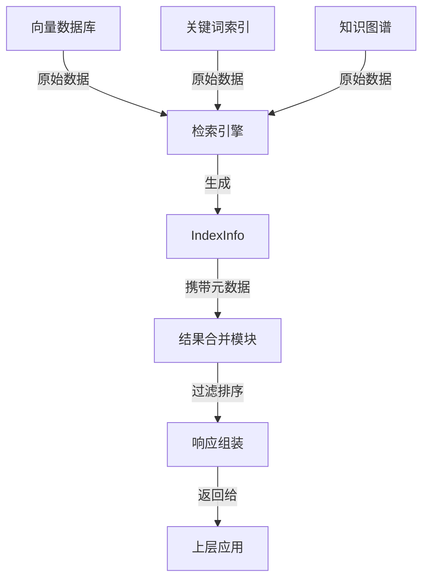

# Index Metadata Definition 模块深度技术文档

## 1. 模块概览与问题解决

`index_metadata_definition` 模块是整个检索系统的核心元数据定义模块，它解决了**统一表示不同来源的索引内容元数据**这一关键问题。在检索系统中，我们需要处理多种来源的内容（文本块、段落、摘要、FAQ等），同时支持多种匹配算法（向量嵌入、关键词匹配、父块匹配、知识图谱等）。

这个模块的核心价值在于：
- **统一元数据模型**：为所有类型的索引内容提供一致的数据结构
- **完整的溯源信息**：记录内容从知识库→知识→文档→文本块的完整层级关系
- **检索控制能力**：提供启用/禁用、推荐状态等检索控制标志
- **分类标记支持**：通过TagID支持FAQ优先级过滤等业务场景

## 2. 核心组件与设计思想

### 2.1 IndexInfo 结构体

`IndexInfo` 是本模块的核心结构体，它充当了**检索结果的"身份证"**角色。

```go
type IndexInfo struct {
	ID              string     // 唯一标识符
	Content         string     // 内容文本
	SourceID        string     // 源文档ID
	SourceType      SourceType // 源类型
	ChunkID         string     // 文本块ID
	KnowledgeID     string     // 知识ID
	KnowledgeBaseID string     // 知识库ID
	KnowledgeType   string     // 知识类型（如"faq", "manual"）
	TagID           string     // 标签ID（用于FAQ优先级过滤）
	IsEnabled       bool       // 是否启用检索
	IsRecommended   bool       // 是否为推荐内容
}
```

**设计意图分析**：
- **层级标识体系**：从KnowledgeBaseID→KnowledgeID→SourceID→ChunkID的完整层级，支持灵活的溯源和过滤
- **内容与元数据分离**：Content字段存储实际内容，其他字段存储元数据信息
- **布尔控制字段**：IsEnabled和IsRecommended提供了简单而强大的检索控制机制

### 2.2 SourceType 枚举

```go
type SourceType int

const (
	ChunkSourceType   SourceType = iota // 文本块源
	PassageSourceType                   // 段落源
	SummarySourceType                   // 摘要源
)
```

**设计意图分析**：
- 使用iota实现自增枚举，保证类型安全
- 区分不同粒度的内容源，支持多粒度检索策略

### 2.3 MatchType 枚举

```go
type MatchType int

const (
	MatchTypeEmbedding MatchType = iota
	MatchTypeKeywords
	MatchTypeNearByChunk
	MatchTypeHistory
	MatchTypeParentChunk   // 父Chunk匹配类型
	MatchTypeRelationChunk // 关系Chunk匹配类型
	MatchTypeGraph
	MatchTypeWebSearch    // 网络搜索匹配类型
	MatchTypeDirectLoad   // 直接加载匹配类型
	MatchTypeDataAnalysis // 数据分析匹配类型
)
```

**设计意图分析**：
- 支持10种不同的匹配类型，覆盖了从传统检索到现代知识图谱的各种场景
- 注释清晰标明了中文含义，便于跨语言团队协作
- 扩展性设计，可轻松添加新的匹配类型

## 3. 架构角色与数据流动

### 3.1 模块在系统中的位置

`index_metadata_definition` 模块位于：
```
core_domain_types_and_interfaces
  └── knowledge_graph_retrieval_and_content_contracts
      └── retrieval_engine_and_search_contracts
          └── index_metadata_and_scored_reference_models
              └── index_metadata_definition (当前模块)
```

### 3.2 数据流向图



### 3.3 核心协作关系

1. **与检索引擎的关系**：检索引擎的各种实现（向量、关键词、图谱等）都会生成 `IndexInfo` 对象
2. **与结果处理模块的关系**：`scored_index_reference_model` 会基于 `IndexInfo` 添加评分信息
3. **与检索契约的关系**：`retrieval_result_contracts` 定义了如何使用 `IndexInfo` 构建最终响应

## 4. 设计权衡与决策

### 4.1 扁平化 vs 层级化结构

**决策**：采用扁平化的结构体设计，而非嵌套的层级结构

**原因分析**：
- 简化序列化/反序列化，提高性能
- 便于数据库存储和索引
- 提供更大的灵活性，支持部分字段的使用

**权衡**：
- ✅ 优点：性能更好，使用更灵活
- ❌ 缺点：丢失了一些层级关系的语义表达

### 4.2 枚举类型 vs 字符串类型

**决策**：使用自定义枚举类型（`SourceType`、`MatchType`）而非普通字符串

**原因分析**：
- 类型安全，编译时捕获错误
- IDE自动补全支持
- 明确的有效值集合

**权衡**：
- ✅ 优点：更安全，更易维护
- ❌ 缺点：需要额外的序列化/反序列化处理

### 4.3 最小元数据集 vs 完整元数据集

**决策**：包含完整的元数据信息，而非仅包含最小必要字段

**原因分析**：
- 支持多样化的业务场景（FAQ优先级、推荐内容等）
- 减少后续查询数据库的需要
- 提供完整的溯源能力

**权衡**：
- ✅ 优点：功能更强大，减少数据库查询
- ❌ 缺点：内存占用更大，网络传输开销增加

## 5. 使用指南与最佳实践

### 5.1 基本使用示例

```go
// 创建一个基本的IndexInfo实例
indexInfo := &types.IndexInfo{
    ID:              "chunk-123",
    Content:         "这是一段示例文本内容...",
    SourceID:        "doc-456",
    SourceType:      types.ChunkSourceType,
    ChunkID:         "chunk-123",
    KnowledgeID:     "know-789",
    KnowledgeBaseID: "kb-012",
    KnowledgeType:   "manual",
    IsEnabled:       true,
    IsRecommended:   false,
}
```

### 5.2 高级场景：FAQ优先级处理

```go
// 创建带有TagID的FAQ索引信息，用于优先级过滤
faqIndex := &types.IndexInfo{
    ID:              "faq-123",
    Content:         "如何重置密码？",
    SourceType:      types.ChunkSourceType,
    KnowledgeType:   "faq",
    TagID:           "priority-high", // 用于优先级过滤
    IsEnabled:       true,
    IsRecommended:   true,
}
```

### 5.3 最佳实践

1. **始终填充完整的层级ID**：即使当前用不到，也应填充KnowledgeBaseID、KnowledgeID、SourceID和ChunkID
2. **合理设置IsEnabled**：对于已删除或不应检索的内容，设置为false而非从索引中移除
3. **利用IsRecommended**：对于高质量内容，设置IsRecommended=true，便于在结果排序时优先展示
4. **正确使用KnowledgeType**：使用标准化的类型字符串（如"faq"、"manual"、"api_doc"）
5. **TagID的应用**：对于FAQ场景，TagID可用于实现优先级分类和过滤

## 6. 注意事项与潜在陷阱

### 6.1 常见陷阱

1. **忘记设置SourceType**：默认为ChunkSourceType，但实际可能是其他类型
2. **ID字段冲突**：确保全局唯一的ID生成策略
3. **Content字段过大**：避免将整个文档放入Content，应只保留检索需要的片段
4. **忽略IsEnabled检查**：在自定义检索逻辑中，务必检查IsEnabled字段

### 6.2 性能考虑

1. **批量处理**：当处理大量IndexInfo时，考虑批量操作以减少开销
2. **Content长度限制**：合理设置Content的最大长度，避免内存和网络压力
3. **选择性使用字段**：在某些场景下，可只使用部分字段，减少处理开销

### 6.3 扩展性提示

1. **添加新的SourceType**：在SourceType枚举末尾添加新值，保持向后兼容
2. **添加新的MatchType**：同样在末尾添加，并在相关处理逻辑中添加支持
3. **扩展IndexInfo**：如需添加新字段，考虑向后兼容性，提供默认值

## 7. 总结

`index_metadata_definition` 模块是整个检索系统的基础元数据定义，它通过简洁而强大的设计，解决了多源、多类型索引内容的统一表示问题。它的设计体现了**性能与功能的平衡**、**简洁性与扩展性的兼顾**，是理解整个检索系统架构的关键入口。

对于新加入团队的开发者，深入理解这个模块将帮助你快速把握整个检索系统的数据模型和工作原理，为后续的开发和调试工作打下坚实基础。
