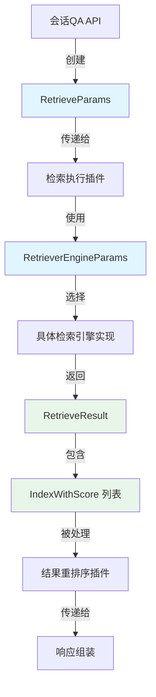

# retrieval_request_and_engine_parameters 模块技术深度分析

## 1. 模块概述

`retrieval_request_and_engine_parameters` 模块是整个检索系统的核心契约层，定义了检索请求、引擎配置和返回结果的统一数据结构。这个模块解决了一个关键问题：如何在支持多种检索类型（关键词、向量、Web搜索）和多种检索引擎（Postgres、Elasticsearch、Milvus等）的同时，保持 API 层面的一致性和可扩展性。

想象一下这个模块就像是航空业的标准行李标签系统——无论你乘坐哪家航空公司的航班、飞往哪个目的地，行李标签都遵循统一的格式，包含必要的信息，同时支持特定航空公司的自定义字段。这种设计使得整个系统可以灵活地切换检索后端，而不需要改变上层调用代码。

## 2. 核心组件详解

### 2.1 类型定义

#### RetrieverEngineType
```go
type RetrieverEngineType string
```

这是一个字符串类型的枚举，定义了系统支持的检索引擎类型。当前支持：
- `PostgresRetrieverEngineType` - PostgreSQL 向量检索
- `ElasticsearchRetrieverEngineType` - Elasticsearch 检索
- `InfinityRetrieverEngineType` - Infinity 检索引擎
- `ElasticFaissRetrieverEngineType` - Elasticsearch + Faiss 组合
- `QdrantRetrieverEngineType` - Qdrant 向量数据库
- `MilvusRetrieverEngineType` - Milvus 向量数据库

**设计意图**：使用字符串类型而非整数枚举，提高了调试和日志的可读性，同时便于 JSON/YAML 序列化。

#### RetrieverType
```go
type RetrieverType string
```

定义了检索的逻辑类型：
- `KeywordsRetrieverType` - 关键词检索（基于倒排索引）
- `VectorRetrieverType` - 向量检索（基于语义相似度）
- `WebSearchRetrieverType` - Web 搜索（外部搜索提供商）

**设计意图**：这里的关键抽象是将"检索方式"（RetrieverType）与"检索引擎"（RetrieverEngineType）分离。这是一个重要的解耦设计——例如，向量检索可以在 Postgres、Milvus 或 Qdrant 上实现，而关键词检索可以在 Elasticsearch 或 Postgres 上实现。

### 2.2 RetrieveParams - 检索请求参数

```go
type RetrieveParams struct {
    Query string                    // 查询文本
    Embedding []float32            // 查询向量（用于向量检索）
    KnowledgeBaseIDs []string      // 知识库 ID 列表
    KnowledgeIDs []string          // 知识项 ID 列表
    TagIDs []string                // 标签 ID（用于 FAQ 优先级过滤）
    ExcludeKnowledgeIDs []string   // 排除的知识项 ID
    ExcludeChunkIDs []string       // 排除的知识块 ID
    TopK int                       // 返回结果数量
    Threshold float64              // 相似度阈值
    KnowledgeType string           // 知识类型（如 "faq", "manual"）
    AdditionalParams map[string]interface{}  // 额外参数
    RetrieverType RetrieverType    // 检索类型
}
```

**设计意图分析**：

这个结构体是检索请求的"一站式商店"，设计上体现了几个关键原则：

1. **统一参数集**：无论使用哪种检索类型，都使用同一个参数结构。这避免了上层调用者需要根据检索类型使用不同的参数结构。

2. **可选字段语义化**：字段本身就是文档。例如，`Embedding` 字段只在 `RetrieverType` 为 `VectorRetrieverType` 时使用，但字段的存在就告诉开发者"向量检索需要这个"。

3. **过滤组合能力**：提供了多层过滤机制——知识库级、知识项级、知识块级、标签级，以及排除列表。这种设计支持复杂的访问控制和内容筛选场景。

4. **扩展点**：`AdditionalParams` 作为一个 `map[string]interface{}`，为特定检索引擎的特殊需求提供了逃逸口，避免了核心结构的膨胀。

**使用示例**：
```go
// 向量检索请求
params := &RetrieveParams{
    Query: "如何配置数据库连接？",
    Embedding: queryEmbedding,  // 预计算的向量
    KnowledgeBaseIDs: []string{"kb-123"},
    TopK: 5,
    Threshold: 0.75,
    RetrieverType: VectorRetrieverType,
}

// 关键词检索请求
params := &RetrieveParams{
    Query: "数据库配置",
    KnowledgeBaseIDs: []string{"kb-123"},
    KnowledgeType: "manual",
    TopK: 10,
    RetrieverType: KeywordsRetrieverType,
}
```

### 2.3 RetrieverEngineParams - 检索引擎配置

```go
type RetrieverEngineParams struct {
    RetrieverEngineType RetrieverEngineType `yaml:"retriever_engine_type" json:"retriever_engine_type"`
    RetrieverType       RetrieverType       `yaml:"retriever_type"        json:"retriever_type"`
}
```

这个结构体用于配置检索引擎的组合，支持 YAML 和 JSON 序列化标签，表明它主要用于配置文件和 API 响应。

**设计意图**：这是一个"配置契约"，它将"用什么引擎"和"用什么检索方式"绑定在一起。这种设计使得系统可以为不同的场景预配置不同的引擎组合——例如，生产环境用 Milvus 做向量检索，测试环境用 Postgres。

### 2.4 IndexWithScore - 带评分的索引项

```go
type IndexWithScore struct {
    ID             string
    Content        string
    SourceID       string
    SourceType     SourceType
    ChunkID        string
    KnowledgeID    string
    KnowledgeBaseID string
    TagID          string
    Score          float64
    MatchType      MatchType
    IsEnabled      bool
}

func (i *IndexWithScore) GetScore() float64 {
    return i.Score
}
```

**设计意图分析**：

这个结构体是检索结果的基本单元，设计上有几个值得注意的点：

1. **完整的溯源信息**：从 `KnowledgeBaseID` 到 `ChunkID`，包含了完整的层级信息，使得调用者可以追溯结果的来源。

2. **多维度标识**：同时提供了 `ID`（可能是检索引擎内部 ID）和业务级 ID（`ChunkID`、`KnowledgeID`），这种双重标识设计在跨引擎迁移时非常有用。

3. **评分契约**：实现了一个 `GetScore()` 方法，暗示这个结构体可能满足某个 `ScoreComparable` 接口（虽然代码中没有显式定义）。这种设计支持统一的结果排序逻辑。

### 2.5 RetrieveResult - 检索结果

```go
type RetrieveResult struct {
    Results             []*IndexWithScore
    RetrieverEngineType RetrieverEngineType
    RetrieverType       RetrieverType
    Error               error
}
```

**设计意图**：这是一个"自描述"的结果结构。它不仅包含结果数据，还告诉调用者"这个结果是用什么引擎、什么检索方式得到的"。这种设计在混合检索场景中特别重要——当你合并多个检索源的结果时，你需要知道每个结果来自哪里。

## 3. 架构角色与数据流

### 3.1 在系统中的位置

这个模块位于 `core_domain_types_and_interfaces` → `knowledge_graph_retrieval_and_content_contracts` → `retrieval_engine_and_search_contracts` → `retrieval_execution_parameters_and_result_contracts` 的最底层，是整个检索系统的"语言"。

### 3.2 数据流向图



### 3.3 关键交互路径

1. **请求构建路径**：
   - 起源：`session_qa_and_search_request_contracts` 中的 HTTP 请求处理器
   - 转换：将 API 请求转换为 `RetrieveParams`
   - 流向：`retrieval_execution` 插件

2. **结果处理路径**：
   - 起源：具体的检索引擎实现（如 `elasticsearch_vector_retrieval_repository`）
   - 封装：返回 `RetrieveResult`
   - 流向：`retrieval_result_refinement_and_merge` 插件

## 4. 设计决策与权衡

### 4.1 统一参数结构 vs 专用参数结构

**决策**：使用统一的 `RetrieveParams` 结构，而不是为每种检索类型创建专用结构。

**权衡分析**：
- ✅ **优点**：
  - 上层代码不需要关心底层使用的检索类型
  - 添加新的检索类型不需要改变调用代码
  - 简化了混合检索场景（同时使用多种检索类型）
  
- ⚠️ **缺点**：
  - 某些字段在特定检索类型下是冗余的（例如关键词检索不需要 `Embedding`）
  - 没有编译时检查来确保必要字段的存在（需要运行时验证）
  - 文档负担增加——需要在注释中说明哪些字段用于哪种检索类型

**为什么这样选择**：在这个系统中，检索类型的切换是一个常见的场景（A/B 测试、性能优化、功能演进），统一的接口可以大大降低这种切换的成本。冗余字段的代价相比灵活性的收益是可接受的。

### 4.2 AdditionalParams 的使用

**决策**：包含 `map[string]interface{}` 类型的 `AdditionalParams` 字段。

**权衡分析**：
- ✅ **优点**：
  - 为特定引擎的特殊需求提供了扩展点
  - 避免了核心结构的频繁变更
  - 支持实验性功能的快速迭代
  
- ⚠️ **缺点**：
  - 失去了类型安全
  - 序列化/反序列化需要额外处理
  - API 契约变得不明确（"黑盒子"参数）

**为什么这样选择**：这是一个经典的"开放性-封闭性"原则的应用。核心结构应该对扩展开放，但对修改关闭。`AdditionalParams` 就是这个原则的具体体现。同时，这个字段的名称本身就是一种文档——它告诉开发者"这里的参数是非标准的，使用时要小心"。

### 4.3 结果自描述设计

**决策**：`RetrieveResult` 包含产生它的引擎类型和检索类型。

**权衡分析**：
- ✅ **优点**：
  - 结果可以被追溯和调试
  - 支持混合检索结果的差异化处理
  - 便于性能分析和 A/B 测试
  
- ⚠️ **缺点**：
  - 结果结构稍微变大
  - 某种程度上违反了"结果不应关心它是如何产生的"这一纯粹性原则

**为什么这样选择**：在实际的生产环境中，可观测性和调试能力往往比理论上的纯粹性更重要。当你在排查"为什么这个结果排在前面"时，知道它来自哪个引擎、用了哪种检索方式，是非常有价值的信息。

## 5. 依赖关系分析

### 5.1 被依赖的模块

这个模块是整个系统的基础契约，它几乎不依赖其他模块（除了同包内的 `SourceType` 和 `MatchType` 定义）。这种"低依赖"设计是有意为之——作为核心数据结构，它应该是稳定的，不应该被频繁变化的上层逻辑所影响。

### 5.2 依赖这个模块的模块

从依赖关系来看，这个模块被以下关键模块依赖：

1. **检索执行插件**：`retrieval_execution` - 使用 `RetrieveParams` 执行检索
2. **检索引擎仓库**：各个具体的检索引擎实现（如 `elasticsearch_vector_retrieval_repository`）
3. **结果处理插件**：`retrieval_result_refinement_and_merge` - 处理 `RetrieveResult`

## 6. 实际使用指南

### 6.1 创建检索请求

```go
// 向量检索
params := &types.RetrieveParams{
    Query:              "用户问题",
    Embedding:          embedding, // []float32 类型的向量
    KnowledgeBaseIDs:   []string{"kb-001"},
    TopK:               5,
    Threshold:          0.7,
    RetrieverType:      types.VectorRetrieverType,
}

// 关键词检索
params := &types.RetrieveParams{
    Query:              "搜索关键词",
    KnowledgeBaseIDs:   []string{"kb-001", "kb-002"},
    KnowledgeType:      "faq",
    TopK:               10,
    RetrieverType:      types.KeywordsRetrieverType,
}
```

### 6.2 处理检索结果

```go
// 处理单个检索结果
func processRetrieveResult(result *types.RetrieveResult) {
    if result.Error != nil {
        log.Printf("检索失败 [%s/%s]: %v", 
            result.RetrieverType, 
            result.RetrieverEngineType, 
            result.Error)
        return
    }
    
    for _, item := range result.Results {
        if !item.IsEnabled {
            continue
        }
        log.Printf("匹配结果: %s (分数: %.2f, 来源: %s)", 
            item.Content, 
            item.Score, 
            item.KnowledgeBaseID)
    }
}
```

### 6.3 扩展 AdditionalParams

```go
// 使用 AdditionalParams 传递引擎特定参数
params := &types.RetrieveParams{
    Query:           "搜索内容",
    KnowledgeBaseIDs: []string{"kb-001"},
    TopK:            10,
    RetrieverType:   types.KeywordsRetrieverType,
    AdditionalParams: map[string]interface{}{
        "boost_fields":  []string{"title^2.0", "content^1.0"}, // Elasticsearch 特定参数
        "minimum_should_match": "75%",
    },
}
```

## 7. 边缘情况与注意事项

### 7.1 常见陷阱

1. **忘记设置 RetrieverType**：虽然字段是可选的（因为它是字符串类型），但实际上大多数检索引擎都需要明确的检索类型。

2. **VectorRetrieverType 但没有 Embedding**：这是一个运行时错误。编译时无法捕获，因为结构是统一的。

3. **TopK 为 0 或负数**：不同的检索引擎对这种情况的处理可能不一致，最好在调用前验证参数。

4. **AdditionalParams 中的类型问题**：因为是 `interface{}`，很容易传递错误的类型（例如传递 `int` 但引擎期望 `float64`）。

### 7.2 隐式契约

1. **Embedding 的维度**：虽然结构中没有定义，但向量的维度必须与检索引擎中存储的向量维度一致。

2. **KnowledgeType 的值**：虽然是自由字符串，但应该与知识库配置中定义的类型一致。

3. **Score 的范围**：不同的检索引擎返回的分数范围可能不同（有些是 0-1，有些是相似度距离），但通常约定分数越高表示匹配越好。

### 7.3 性能考虑

1. **KnowledgeBaseIDs 的数量**：虽然没有硬编码限制，但一次查询太多知识库可能会导致性能问题，因为可能需要跨多个索引查询。

2. **TopK 的大小**：获取更多结果意味着更多的数据传输和处理，应该根据实际需要设置合理的值。

3. **Embedding 的重用**：如果同一个查询需要多次检索（例如混合检索），应该重用计算好的 embedding，而不是每次都重新计算。

## 8. 总结

`retrieval_request_and_engine_parameters` 模块是一个看似简单但设计精妙的核心契约模块。它通过统一的接口支持多样化的检索后端，通过精心设计的字段组合提供灵活的过滤能力，通过自描述的结果结构支持可观测性和调试。

这个模块的设计体现了几个重要的软件工程原则：
- **接口与实现分离**：RetrieverType 与 RetrieverEngineType 的分离
- **开放性-封闭性原则**：AdditionalParams 作为扩展点
- **自描述设计**：结果包含自身的来源信息
- **实用主义**：在纯粹性和实际可维护性之间做出合理权衡

理解这个模块，是理解整个检索系统的第一步——因为它定义了检索系统的"语言"。
