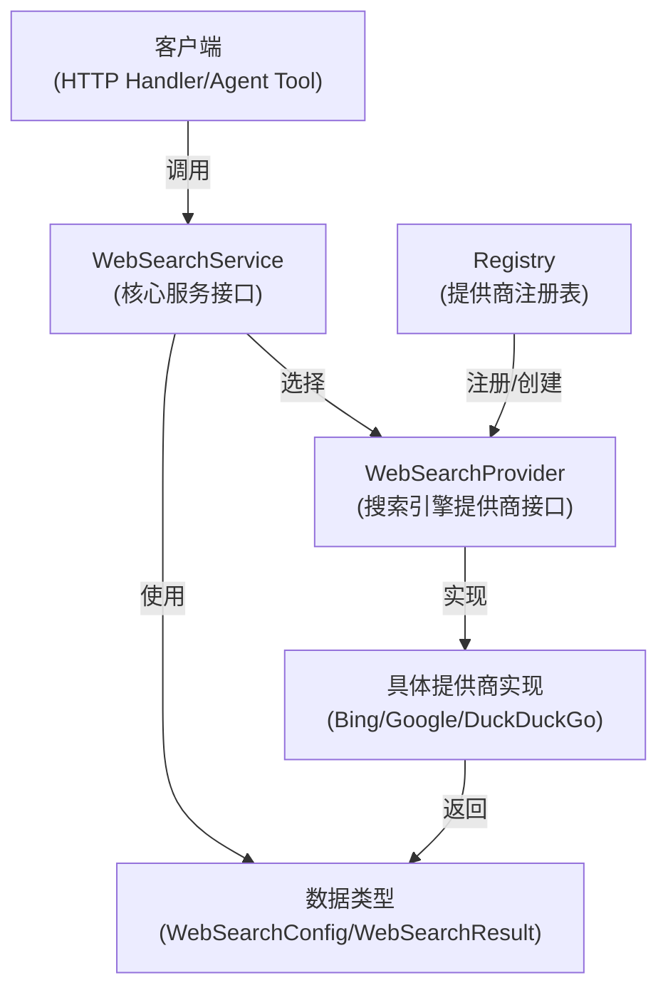
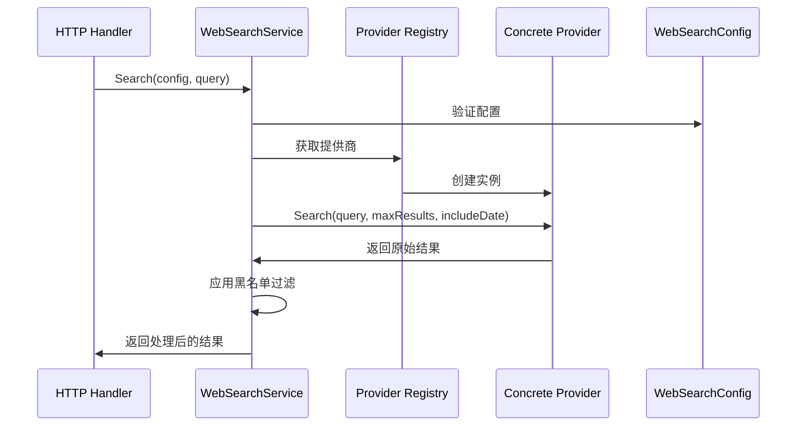

# Web Search Service Contracts 模块技术深度解析

## 1. 问题空间与模块定位

### 1.1 解决什么问题？

在多租户、多搜索引擎提供商的环境中，我们面临着几个关键挑战：

- **搜索提供商异构性**：不同搜索引擎（如 Bing、Google、DuckDuckGo）的 API 接口、认证方式、响应格式各不相同
- **租户配置隔离**：每个租户可能有自己偏好的搜索引擎、API 密钥、黑名单规则和结果处理策略
- **搜索结果处理**：原始搜索结果往往信息冗余，需要智能压缩和精炼
- **扩展性**：需要能够轻松添加新的搜索引擎提供商，而不需要修改核心逻辑

一个朴素的解决方案是直接在代码中调用各个搜索引擎的 API，但这种方法存在明显缺陷：
- 代码会紧密耦合到具体的搜索引擎实现
- 添加新的搜索引擎需要修改核心逻辑
- 难以统一处理搜索结果和错误
- 租户级别的配置管理会变得复杂

### 1.2 设计洞察

`web_search_service_contracts` 模块通过定义清晰的接口契约，将搜索引擎的"具体实现"与"使用方式"解耦。这种设计遵循了**策略模式**和**工厂模式**的思想，让搜索引擎提供商可以像插件一样插拔，同时保持核心搜索服务逻辑的稳定性。

## 2. 核心抽象与心理模型

这个模块的核心抽象可以类比为**"插座与插头"系统**：

想象一下，你有一个电源插座（`WebSearchService` 接口），和多个不同类型的插头（`WebSearchProvider` 实现）。虽然每个插头的形状不同，但它们都能通过适配器插入插座供电。

同样，这个模块的设计思路是：
1. **插座**：`WebSearchService` 定义了统一的使用方式
2. **插头**：`WebSearchProvider` 定义了统一的实现接口
3. **适配器**：具体的提供商实现（Bing、Google 等）
4. **电流**：`WebSearchConfig` 和 `WebSearchResult` 构成了数据流

这种设计让系统可以灵活地插拔不同的搜索引擎提供商，同时保持使用方式的一致性。

## 3. 核心架构与设计模式

### 3.1 架构概览



这一架构的设计理念是"接口驱动开发"，通过两个核心接口 `WebSearchService` 和 `WebSearchProvider` 实现了关注点分离：

1. **`WebSearchProvider`**：负责与具体搜索引擎 API 交互的低级接口
2. **`WebSearchService`**：负责协调提供商、应用配置、处理结果的高级服务接口

### 3.2 关键抽象

#### 3.2.1 WebSearchProvider 接口

`WebSearchProvider` 是搜索引擎提供商的抽象接口，它的设计非常简洁：

```go
type WebSearchProvider interface {
    Name() string
    Search(ctx context.Context, query string, maxResults int, includeDate bool) ([]*types.WebSearchResult, error)
}
```

这个接口的设计体现了**最小接口原则**，它只关注两个核心能力：
- 标识自己（`Name()`）
- 执行搜索（`Search()`）

这种设计使得添加新的搜索引擎提供商变得非常容易，只需要实现这两个方法即可。

#### 3.2.2 WebSearchService 接口

`WebSearchService` 是更高层次的抽象，它处理搜索的业务逻辑：

```go
type WebSearchService interface {
    Search(ctx context.Context, config *types.WebSearchConfig, query string) ([]*types.WebSearchResult, error)
    CompressWithRAG(...) (...)
}
```

这个接口不仅负责执行搜索，还引入了两个重要概念：
- **配置驱动**：通过 `WebSearchConfig` 控制搜索行为
- **结果增强**：通过 `CompressWithRAG` 提供智能结果压缩能力

## 4. 核心组件深度解析

### 4.1 数据契约

#### 4.1.1 WebSearchConfig：租户级搜索配置

`WebSearchConfig` 是整个模块的"指挥棒"，它封装了租户对搜索行为的所有偏好：

```go
type WebSearchConfig struct {
    Provider          string   // 搜索引擎提供商ID
    APIKey            string   // API密钥
    MaxResults        int      // 最大搜索结果数
    IncludeDate       bool     // 是否包含日期
    CompressionMethod string   // 压缩方法：none, summary, extract, rag
    Blacklist         []string // 黑名单规则列表
    // RAG压缩相关配置
    EmbeddingModelID   string // 嵌入模型ID
    EmbeddingDimension int    // 嵌入维度
    RerankModelID      string // 重排模型ID
    DocumentFragments  int    // 文档片段数量
}
```

这个配置结构体的设计有几个值得注意的地方：
- **完整性**：它包含了从"选择提供商"到"结果处理"的全链路配置
- **可选性**：RAG 相关字段使用 `omitempty`，允许灵活配置
- **数据库友好**：实现了 `driver.Valuer` 和 `sql.Scanner` 接口，支持直接存储到数据库

#### 4.1.2 WebSearchResult：统一结果格式

`WebSearchResult` 定义了所有搜索引擎返回结果的统一格式：

```go
type WebSearchResult struct {
    Title       string     // 搜索结果标题
    URL         string     // 结果URL
    Snippet     string     // 摘要片段
    Content     string     // 完整内容（可选）
    Source      string     // 来源
    PublishedAt *time.Time // 发布时间
}
```

这个结构的关键设计是 **"最小公分母"原则**，它只包含所有搜索引擎都能提供的字段，同时允许通过 `Content` 字段扩展更丰富的内容。

### 4.2 注册表模式：Provider Registry

在 `internal/application/service/web_search/registry.go` 中，我们看到了一个优雅的注册表实现：

```go
type Registry struct {
    providers map[string]*ProviderRegistration
    mu        sync.RWMutex
}
```

这个注册表的设计体现了几个重要的模式：
1. **工厂模式**：通过 `ProviderFactory` 延迟创建提供商实例
2. **线程安全**：使用 `sync.RWMutex` 保证并发安全
3. **容错设计**：`CreateAllProviders` 会跳过初始化失败的提供商

这种设计使得系统可以在启动时注册所有可能的提供商，但只在运行时创建实际可用的实例。

### 4.3 服务实现：WebSearchService

在 `internal/application/service/web_search.go` 中，我们看到了核心服务的实现。让我们重点分析几个关键方法：

#### 4.3.1 Search 方法：搜索执行流程

```go
func (s *WebSearchService) Search(ctx context.Context, config *types.WebSearchConfig, query string) ([]*types.WebSearchResult, error)
```

这个方法的执行流程可以分解为：
1. **配置验证**：确保配置有效
2. **提供商选择**：从注册表中选择指定的提供商
3. **超时控制**：设置上下文超时，防止长时间阻塞
4. **搜索执行**：调用提供商的 Search 方法
5. **黑名单过滤**：应用配置的黑名单规则
6. **结果返回**：返回处理后的结果

这个流程的设计体现了**关注点分离**，每个步骤都有明确的职责。

#### 4.3.2 CompressWithRAG 方法：智能结果压缩

这是该模块最具创新性的部分，它使用 RAG 技术来压缩搜索结果：

```go
func (s *WebSearchService) CompressWithRAG(
    ctx context.Context, sessionID string, tempKBID string, questions []string,
    webSearchResults []*types.WebSearchResult, cfg *types.WebSearchConfig,
    kbSvc interfaces.KnowledgeBaseService, knowSvc interfaces.KnowledgeService,
    seenURLs map[string]bool, knowledgeIDs []string,
) (...)
```

这个方法的工作原理非常巧妙：
1. **创建临时知识库**：创建一个隐藏的、临时的知识库（`IsTemporary: true`）
2. **导入搜索结果**：将搜索结果作为文档片段导入这个临时知识库
3. **语义检索**：使用问题在这个知识库中进行混合搜索
4. **结果合并**：将检索到的相关片段重新组合成压缩后的结果
5. **资源清理**：通过 `IsTemporary` 标记，确保 UI 不会显示这个临时知识库

这种设计的优点是：
- **复用现有基础设施**：不需要重新实现一套语义检索逻辑
- **隔离性**：临时知识库不会污染用户的真实数据
- **可观测性**：UI 通过 repo 过滤自然隐藏了临时知识库

## 5. 架构与数据流

### 5.1 搜索请求的完整旅程

让我们追踪一个搜索请求从发起到响应的完整路径：



### 5.2 数据流动与依赖关系

这个模块在整个系统中的位置是**服务层**，它依赖于：
- **数据层**：`types` 包定义的数据结构
- **基础设施层**：`config` 包提供的配置
- **知识库服务**：`KnowledgeBaseService` 和 `KnowledgeService`（用于 RAG 压缩）

同时，它被以下模块依赖：
- **HTTP 处理层**：`web_search_endpoint_handler`
- **Agent 工具层**：`web_search_tooling`

## 6. 设计决策与权衡

### 6.1 接口设计：简洁 vs 丰富

**决策**：`WebSearchProvider` 接口设计得非常简洁，只有两个方法。

**权衡分析**：
- ✅ **优点**：易于实现新的提供商，降低了接入门槛
- ❌ **缺点**：高级特性（如分页、排序）无法通过接口直接支持

**为什么这样设计**：
搜索引擎的高级特性差异很大，强行统一会导致接口臃肿。简洁的接口保证了核心功能的一致性，而高级特性可以通过扩展实现。

### 6.2 错误处理：严格 vs 宽容

**决策**：`CreateAllProviders` 会跳过初始化失败的提供商，而不是让整个服务启动失败。

**权衡分析**：
- ✅ **优点**：提高了系统的韧性，一个提供商的问题不会影响整个服务
- ❌ **缺点**：问题可能被延迟发现，直到实际使用时才会暴露

**为什么这样设计**：
在多提供商环境中，可用性比完整性更重要。系统应该在部分组件失败时仍能提供服务。

### 6.3 RAG 压缩：临时知识库 vs 内存索引

**决策**：使用临时知识库而不是在内存中构建索引。

**权衡分析**：
- ✅ **优点**：复用了现有的知识库基础设施，代码复用度高
- ❌ **缺点**：有额外的数据库开销，创建和删除知识库有延迟

**为什么这样设计**：
1. **一致性**：使用相同的检索逻辑，确保结果质量
2. **可维护性**：不需要维护两套检索代码
3. **可观测性**：临时知识库在调试时可以保留，方便排查问题

## 7. 实际使用与示例

### 7.1 如何添加新的搜索引擎提供商

添加新的搜索引擎提供商只需要几个简单步骤：

1. **实现 `WebSearchProvider` 接口**：
```go
type MyProvider struct{}

func (p *MyProvider) Name() string {
    return "my-provider"
}

func (p *MyProvider) Search(ctx context.Context, query string, maxResults int, includeDate bool) ([]*types.WebSearchResult, error) {
    // 实现搜索逻辑
}
```

2. **注册提供商**：
```go
registry.Register(types.WebSearchProviderInfo{
    ID:             "my-provider",
    Name:           "My Search Provider",
    Free:           true,
    RequiresAPIKey: false,
    Description:    "My custom search provider",
}, func() (interfaces.WebSearchProvider, error) {
    return &MyProvider{}, nil
})
```

### 7.2 配置最佳实践

1. **黑名单规则**：支持两种格式
   - 通配符模式：`*://*.example.com/*`
   - 正则表达式：`/example\.(net|org)/`

2. **RAG 压缩配置**：
   - `DocumentFragments`：建议设置为 3-5，平衡信息量和延迟
   - `EmbeddingModelID`：使用与主知识库相同的模型，确保一致性

### 7.3 常见陷阱

1. **忘记处理 Context 超时**：所有提供商实现都应该尊重 `ctx.Done()` 信号
2. **忽略 URL 去重**：在 `CompressWithRAG` 中，`seenURLs` 参数是为了避免重复导入相同 URL 的内容
3. **临时知识库清理**：虽然 `IsTemporary` 标记会让 UI 隐藏，但定期清理这些临时知识库仍然是个好主意

## 8. 边缘情况与注意事项

### 8.1 边缘情况

#### 8.1.1 所有提供商都初始化失败
**问题**：如果 `CreateAllProviders` 中所有提供商都初始化失败，`providers` 映射将为空，后续的 `Search` 调用会失败。

**建议**：在服务初始化后检查是否至少有一个可用的提供商，并在日志中发出警告。

#### 8.1.2 临时知识库创建失败
**问题**：在 `CompressWithRAG` 中，如果临时知识库创建失败，整个压缩过程会失败。

**建议**：考虑降级策略，当 RAG 压缩不可用时，返回原始搜索结果。

#### 8.1.3 搜索结果 URL 为空
**问题**：如果 `WebSearchResult.URL` 为空，`seenURLs` 去重和后续的参考选择将无法正常工作。

**建议**：在提供商实现中确保 URL 字段有值，或者在服务层添加验证。

### 8.2 扩展与未来方向

1. **自定义提供商**：通过实现 `WebSearchProvider` 接口
2. **自定义压缩策略**：虽然当前只支持 RAG，但可以扩展 `CompressionMethod` 字段
3. **黑名单规则引擎**：可以通过实现更复杂的规则匹配逻辑来扩展

### 8.3 可能的改进方向

1. **异步搜索**：支持异步搜索和结果回调
2. **结果缓存**：对相同查询的结果进行缓存
3. **提供商故障转移**：当主提供商失败时，自动切换到备用提供商
4. **结果合并**：支持从多个提供商获取结果并合并

## 9. 总结

`web_search_service_contracts` 模块是一个优雅的接口设计范例，它通过清晰的契约和巧妙的抽象，解决了多搜索引擎提供商环境中的复杂性问题。

这个模块的设计教会我们几个重要的设计原则：
1. **接口隔离**：定义最小的、专注的接口
2. **关注点分离**：将"做什么"和"怎么做"分开
3. **复用优于重写**：通过临时知识库的设计，我们看到了如何创造性地复用现有组件
4. **韧性设计**：通过容错注册表和优雅降级，提高系统的整体可用性

对于新加入团队的开发者来说，理解这个模块的设计思想，比单纯记住 API 更重要。这种接口驱动的设计理念，可以应用到系统的许多其他部分。

