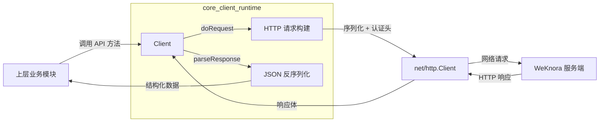

# core_client_runtime

## 模块概述

想象你要在一个微服务架构中构建一个 SDK —— 每次调用 API 都要手动处理 HTTP 连接、认证头、JSON 序列化、错误解析，代码会迅速变得重复且脆弱。`core_client_runtime` 模块正是为了解决这个问题而存在的。

这个模块提供了与 WeKnora 服务交互的**基础 HTTP 客户端抽象**。它不是业务逻辑的入口，而是整个 SDK 的"网络层基石" —— 所有上层 API 调用（会话管理、知识库操作、Agent 交互等）最终都会通过这个客户端发出 HTTP 请求。它的核心价值在于**统一封装网络通信的复杂性**，让上层代码只需关注业务语义，而不必关心 HTTP 细节。

从架构角色来看，这是一个**网关型模块**：它位于 SDK 内部与远程服务之间，负责将结构化的 Go 对象转换为 HTTP 请求，并将 HTTP 响应转换回结构化数据。这种设计遵循了"关注点分离"原则 —— 网络传输逻辑被隔离在这一层，业务代码无需感知底层通信机制。

## 架构与数据流



### 组件角色说明

| 组件 | 职责 | 设计意图 |
|------|------|----------|
| `Client` | 核心客户端结构体，持有连接配置和执行逻辑 | 封装所有 HTTP 交互状态，提供单一入口点 |
| `ClientOption` | 函数式选项类型，用于配置客户端 | 支持灵活、可扩展的配置方式，避免构造函数参数爆炸 |
| `doRequest` | 执行 HTTP 请求的私有方法 | 统一处理序列化、认证、上下文传播等横切关注点 |
| `parseResponse` | 解析 HTTP 响应的静态方法 | 集中处理状态码检查和 JSON 解码，确保错误处理一致性 |

### 数据流追踪

当一个上层模块（如 [`agent_session_and_message_api`](agent_session_and_message_api.md)）需要创建会话时，数据流经以下路径：

1. **请求构建**：业务对象（如 `CreateSessionRequest`）作为 `body` 参数传入 `doRequest`
2. **序列化**：`json.Marshal` 将 Go 结构体转换为 JSON 字节流
3. **URL 组装**：`baseURL + path + query` 拼接完整请求 URL
4. **上下文注入**：从 `context.Context` 提取 `RequestID` 并注入请求头，实现链路追踪
5. **认证注入**：若配置了 `token`，自动添加 `X-API-Key` 头
6. **网络发送**：通过 `httpClient.Do()` 发出请求
7. **响应校验**：`parseResponse` 检查状态码，非 2xx 状态码会读取响应体并返回错误
8. **反序列化**：成功响应通过 `json.NewDecoder` 解码到目标结构体

这个流程的关键在于**透明性** —— 调用者无需知道 JSON 序列化发生在哪一层，也无需手动管理认证头，这些细节被完全封装在 `doRequest` 内部。

## 组件深度解析

### Client 结构体

```go
type Client struct {
    baseURL    string
    httpClient *http.Client
    token      string
}
```

这是整个模块的**核心状态容器**。三个字段分别对应：

- **`baseURL`**：服务根地址，所有请求路径都相对于此地址拼接。设计为不可变（无 setter），因为运行时切换服务端地址通常意味着配置错误。
- **`httpClient`**：标准库的 `*http.Client`，但由本模块控制生命周期。默认超时 30 秒，可通过 `WithTimeout` 选项覆盖。
- **`token`**：认证令牌，通过 `X-API-Key` 头传递。注意这是**进程级共享状态** —— 一个 Client 实例只能使用一个 token，多租户场景需要创建多个 Client 实例。

**设计权衡**：为什么不用接口抽象 `httpClient`？这里选择了组合而非接口，原因是：
1. 标准库 `*http.Client` 本身已足够抽象，支持 Transport 层定制
2. 引入接口会增加测试复杂度（需要 mock 接口），而直接持有具体类型可以在测试中用 `http.Transport` 的 `RoundTrip` 钩子拦截请求
3. 保持简单 —— 这个模块的职责是封装协议细节，而非提供可替换的网络后端

### 函数式选项模式 (ClientOption)

```go
type ClientOption func(*Client)

func WithTimeout(timeout time.Duration) ClientOption {
    return func(c *Client) {
        c.httpClient.Timeout = timeout
    }
}

func WithToken(token string) ClientOption {
    return func(c *Client) {
        c.token = token
    }
}
```

这是 Go 生态中的经典模式，用于解决**构造函数参数过多**的问题。与传统的 `NewClient(baseURL, timeout, token, ...)` 相比，函数式选项的优势在于：

1. **可选参数自然表达**：调用者只需传递需要覆盖的选项，`NewClient("http://api", WithToken("xyz"))` 比 `NewClient("http://api", 30*time.Second, "xyz", "", true, ...)` 清晰得多
2. **向后兼容扩展**：新增配置项时只需添加新的 `WithXxx` 函数，不破坏现有调用代码
3. **类型安全**：每个选项函数有明确的参数类型，避免位置参数导致的类型混淆

**使用示例**：
```go
// 默认配置
client := NewClient("https://api.weknora.com")

// 自定义超时和认证
client := NewClient(
    "https://api.weknora.com",
    WithTimeout(60*time.Second),
    WithToken("secret-token"),
)
```

### doRequest 方法

```go
func (c *Client) doRequest(ctx context.Context,
    method, path string, body interface{}, query url.Values,
) (*http.Response, error)
```

这是客户端的**核心执行引擎**，承担了以下职责：

| 步骤 | 实现逻辑 | 设计原因 |
|------|----------|----------|
| 请求体序列化 | `json.Marshal(body)` | 统一处理所有 POST/PUT 请求的 JSON 编码，调用者无需重复编写 |
| URL 拼接 | `baseURL + path + query.Encode()` | 隔离路径构建逻辑，避免调用者手动处理 `?` 和 `&` |
| 上下文绑定 | `http.NewRequestWithContext(ctx, ...)` | 支持请求取消和超时控制，与 Go 的 `context` 生态集成 |
| 认证头注入 | `X-API-Key: token` | 集中管理认证策略，未来切换到 OAuth 只需修改此处 |
| 链路追踪头 | `X-Request-ID: ctx.Value("RequestID")` | 从上下文提取追踪 ID，实现分布式追踪的透明传递 |
| 执行请求 | `httpClient.Do(req)` | 委托给标准库，保持网络层最小化 |

**关键设计决策**：

1. **为什么返回 `*http.Response` 而非直接解析？** —— 这是为了**分离关注点**。`doRequest` 负责"发送请求"，`parseResponse` 负责"解析响应"。这种分离允许上层在需要时访问原始响应（如检查特定头信息），同时也便于单元测试（可以 mock 响应而不触发网络）。

2. **为什么 `body` 是 `interface{}`？** —— 为了支持任意可序列化的请求体。Go 的 `json.Marshal` 会自动处理结构体、map、slice 等类型，这种设计让客户端可以适应未来 API 的变化而无需修改签名。

3. **上下文键 `"RequestID"` 的隐式契约**：这是一个**隐式依赖** —— 调用者必须知道需要在 context 中设置这个键才能启用链路追踪。这是一个设计缺陷（应该用类型安全的 context key），但为了向后兼容而保留。

### parseResponse 函数

```go
func parseResponse(resp *http.Response, target interface{}) error
```

这是一个**静态辅助函数**（不依赖 Client 状态），职责是：

1. **资源清理**：`defer resp.Body.Close()` 确保响应体始终关闭，防止连接泄漏
2. **状态码校验**：2xx 以外的状态码被视为错误，读取响应体并返回包含原始错误信息的错误
3. **空目标处理**：`target == nil` 时跳过反序列化（适用于 DELETE 等无返回值的接口）
4. **JSON 解码**：使用 `json.NewDecoder` 流式解码，比 `io.ReadAll + json.Unmarshal` 更节省内存

**错误处理策略**：当遇到非 2xx 状态码时，函数会尝试读取响应体并嵌入错误消息：
```go
body, _ := io.ReadAll(resp.Body)
return fmt.Errorf("HTTP error %d: %s", resp.StatusCode, string(body))
```

这种设计的优点是**调试友好** —— 错误信息包含服务端返回的具体错误描述。但需要注意，如果响应体非常大（如意外返回了整个 HTML 页面），可能会消耗大量内存。生产环境中应考虑限制读取字节数。

## 依赖关系分析

### 被谁调用（Depended By）

`core_client_runtime` 是 `sdk_client_library` 的基础层，被以下模块依赖：

- **[agent_session_and_message_api](agent_session_and_message_api.md)**：会话创建、消息查询、流式响应等 API 通过 Client 发送 HTTP 请求
- **[knowledge_and_chunk_api](knowledge_and_chunk_api.md)**：知识库和 Chunk 的 CRUD 操作依赖 Client 的网络能力
- **[faq_api](faq_api.md)**、**[knowledge_base_api](knowledge_base_api.md)**：所有 FAQ 和知识库管理接口
- **[tenant_and_evaluation_api](tenant_and_evaluation_api.md)**：租户配置和评估任务提交

这些模块通常会在内部持有 `*client.Client` 实例，并在各自的 Service/Handler 方法中调用 `doRequest`。典型的调用模式：

```go
// 在 agent_session_and_message_api 中的伪代码
func (s *SessionService) CreateSession(ctx context.Context, req *CreateSessionRequest) (*Session, error) {
    resp, err := s.client.doRequest(ctx, "POST", "/sessions", req, nil)
    if err != nil {
        return nil, err
    }
    var session Session
    err = parseResponse(resp, &session)
    return &session, err
}
```

### 调用谁（Depends On）

| 依赖 | 类型 | 使用原因 |
|------|------|----------|
| `net/http` | Go 标准库 | HTTP 协议实现，客户端的核心依赖 |
| `encoding/json` | Go 标准库 | JSON 序列化和反序列化 |
| `context` | Go 标准库 | 请求取消、超时、链路追踪上下文传递 |
| `bytes`, `io`, `fmt`, `time`, `net/url` | Go 标准库 | 辅助工具，无外部依赖 |

**关键观察**：这个模块**零外部依赖** —— 完全基于 Go 标准库构建。这是一个刻意的设计选择：
1. 减少 SDK 的依赖体积，便于集成
2. 避免第三方库的版本冲突
3. 标准库的 HTTP 和 JSON 包已足够成熟，无需额外抽象

## 设计决策与权衡

### 1. 同步阻塞 vs 异步非阻塞

**选择**：同步阻塞模型（`httpClient.Do()` 直接返回响应）

**原因**：
- SDK 的典型使用场景是**请求 - 响应**模式，调用者期望立即获得结果
- Go 的 `net/http.Client` 内部已使用连接池和 goroutine 处理并发，同步调用不会阻塞整个进程
- 异步模型会增加回调或 channel 的复杂度，而收益有限

**权衡**：对于流式接口（如 Agent 流式响应），上层需要自行处理 SSE 或 chunked 编码，客户端不提供特殊抽象。这是为了保持简单，但意味着流式逻辑会分散到各个业务模块中。

### 2. 认证策略：X-API-Key vs OAuth2

**选择**：简单的 `X-API-Key` 头

**原因**：
- 内部服务间调用场景，API Key 足够安全且实现简单
- 减少 SDK 的复杂度（OAuth2 需要 token 刷新、scope 管理等）

**权衡**：如果未来需要支持多租户 OAuth2，需要修改 `Client` 结构体以支持 token 刷新逻辑，或者引入认证策略接口。当前的设计将认证逻辑硬编码在 `doRequest` 中，扩展性有限。

### 3. 错误处理：返回 error vs panic

**选择**：始终返回 `error`，永不 panic

**原因**：
- SDK 是库代码，panic 会导致调用方进程崩溃，违反库的契约
- 所有错误（包括 JSON 序列化失败、网络错误、HTTP 状态码错误）都通过 `error` 返回，调用方可以统一处理

**权衡**：调用方必须检查每个返回的 `error`，否则错误会被静默忽略。这是 Go 的惯用模式，但需要文档强调错误处理的重要性。

### 4. 配置可变性：不可变 Client vs 可变 Client

**选择**：Client 创建后，`baseURL` 和 `token` 不可变（无 setter 方法）

**原因**：
- 运行时切换服务端地址通常是配置错误，应该通过创建新 Client 解决
- 不可变设计避免了并发修改的风险（Client 可能被多个 goroutine 共享）

**权衡**：如果 token 需要定期刷新（如 JWT 过期），调用方需要创建新的 Client 实例，或者在外部维护 token 并通过闭包更新。这是一个已知的限制，未来可以考虑添加 `WithTokenRefresher` 选项。

## 使用指南

### 基本用法

```go
import "client/client"

// 创建默认客户端
client := client.NewClient("https://api.weknora.com")

// 创建带认证和超时的客户端
client := client.NewClient(
    "https://api.weknora.com",
    client.WithToken("your-api-key"),
    client.WithTimeout(60 * time.Second),
)

// 执行请求（通常由上层模块封装，不直接调用）
ctx := context.WithValue(context.Background(), "RequestID", "req-123")
resp, err := client.doRequest(ctx, "GET", "/sessions", nil, nil)
if err != nil {
    // 处理错误
}
defer resp.Body.Close()
```

### 链路追踪集成

客户端支持从 context 中提取 `RequestID` 并注入请求头。要启用此功能：

```go
// 生成或获取 RequestID
requestID := generateRequestID()

// 注入 context
ctx := context.WithValue(context.Background(), "RequestID", requestID)

// 所有通过此 context 发出的请求都会携带 X-Request-ID 头
resp, err := client.doRequest(ctx, "POST", "/sessions", req, nil)
```

**注意**：使用字符串 `"RequestID"` 作为 context key 是不安全的（可能与其他库冲突），建议在生产环境中使用类型安全的 key：

```go
type contextKey string
const RequestIDKey contextKey = "requestID"
ctx := context.WithValue(context.Background(), RequestIDKey, requestID)
```

但这需要修改 `doRequest` 中的 `ctx.Value("RequestID")` 为 `ctx.Value(RequestIDKey)`。

### 自定义 HTTP 客户端

如果需要更细粒度的控制（如自定义 Transport、TLS 配置），可以直接修改 `httpClient` 字段：

```go
client := client.NewClient("https://api.weknora.com")
client.httpClient = &http.Client{
    Timeout: 30 * time.Second,
    Transport: &http.Transport{
        MaxIdleConns:        100,
        MaxIdleConnsPerHost: 10,
        IdleConnTimeout:     90 * time.Second,
        TLSClientConfig:     &tls.Config{MinVersion: tls.VersionTLS12},
    },
}
```

**警告**：这是直接修改结构体字段，绕过了 `WithTimeout` 选项。虽然可行，但不推荐作为常规用法，因为未来 `Client` 内部可能添加其他初始化逻辑。

## 边界情况与陷阱

### 1. Context 取消与超时

`doRequest` 使用 `http.NewRequestWithContext`，这意味着：
- 如果传入的 `ctx` 被取消，请求会立即中止并返回 `context.Canceled` 错误
- 如果 `ctx` 有超时（`context.WithTimeout`），超时后请求会自动取消

**陷阱**：Client 级别的 `httpClient.Timeout` 和 Context 超时是**叠加**的 —— 实际超时时间是两者的较小值。建议优先使用 Context 超时，因为它可以针对每个请求定制。

### 2. JSON 序列化失败

当 `body` 参数包含无法序列化的类型（如 channel、函数、循环引用结构）时，`json.Marshal` 会返回错误：

```go
// 错误示例：包含 channel 的结构体
type BadRequest struct {
    Data chan int  // json.Marshal 会失败
}
```

**防御措施**：确保所有请求结构体的字段都是 JSON 可序列化的类型（基本类型、slice、map、结构体）。

### 3. 响应体未关闭导致的连接泄漏

`parseResponse` 内部使用 `defer resp.Body.Close()`，但如果调用方直接使用 `doRequest` 的返回值而不调用 `parseResponse`，必须手动关闭：

```go
resp, err := client.doRequest(ctx, "GET", "/health", nil, nil)
if err != nil {
    return err
}
defer resp.Body.Close()  // 必须！
```

**最佳实践**：始终通过 `parseResponse` 处理响应，除非有特殊需求需要访问原始响应。

### 4. 大响应体内存消耗

`parseResponse` 在非 2xx 状态码时会读取整个响应体到内存：

```go
body, _ := io.ReadAll(resp.Body)  // 可能消耗大量内存
```

如果服务端意外返回大文件（如几 MB 的错误页面），可能导致内存峰值。**建议改进**：限制读取字节数，如 `io.ReadAll(io.LimitReader(resp.Body, 1024*1024))`。

### 5. 并发安全性

`Client` 实例是**并发安全**的：
- `baseURL` 和 `token` 在创建后不可变
- `httpClient.Do()` 是并发安全的（标准库保证）
- 无共享可变状态

这意味着可以在多个 goroutine 中共享同一个 `Client` 实例，无需加锁。

### 6. Token 刷新问题

当前设计不支持动态 token 刷新。如果 token 过期，需要：
1. 创建新的 `Client` 实例
2. 或者在外部维护 token，每次请求前更新 `client.token` 字段（需要加锁，不推荐）

**未来改进方向**：添加 `TokenProvider` 接口，允许调用方注入 token 获取逻辑：

```go
type TokenProvider interface {
    GetToken() (string, error)
}
```

## 扩展点

虽然当前设计偏向简单，但仍有以下扩展可能：

1. **自定义认证策略**：通过添加 `AuthStrategy` 接口，支持 OAuth2、JWT 等多种认证方式
2. **请求/响应拦截器**：类似 HTTP 中间件，在 `doRequest` 前后执行自定义逻辑（如日志、指标采集）
3. **重试机制**：在网络错误时自动重试，可配置重试次数和退避策略
4. **指标埋点**：在 `doRequest` 中集成 Prometheus 指标，记录请求延迟、状态码分布等

这些扩展应遵循"不破坏现有接口"的原则，优先通过 `ClientOption` 添加配置，而非修改方法签名。

## 相关模块

- **[sdk_client_library](sdk_client_library.md)**：父模块，包含所有 API 契约定义
- **[agent_session_and_message_api](agent_session_and_message_api.md)**：使用 Client 进行会话和消息操作
- **[knowledge_and_chunk_api](knowledge_and_chunk_api.md)**：使用 Client 进行知识库和 Chunk 管理
- **[http_handlers_and_routing](http_handlers_and_routing.md)**：服务端的 HTTP 处理器，与 Client 形成请求 - 响应对应关系

## 总结

`core_client_runtime` 是一个典型的**基础设施层模块** —— 它不直接实现业务逻辑，但为所有业务模块提供网络通信能力。其设计哲学可以概括为：

> **简单优于灵活，约定优于配置**

通过函数式选项、上下文感知、统一错误处理等模式，它在保持代码简洁的同时，提供了足够的扩展性。对于新加入的开发者，理解这个模块的关键是认识到：**它是 SDK 与外部世界的边界，所有网络复杂性都应在此处被吸收，而非泄漏到业务代码中**。
