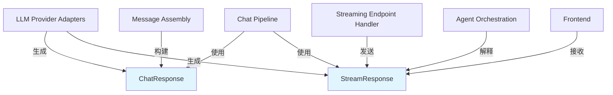

# chat_response_payload_contracts 模块技术深度解析

## 1. 模块概述与问题空间

在一个多Agent协作的对话系统中，核心挑战之一是统一不同LLM提供商、不同对话模式（同步/流式）以及不同组件间的消息传递契约。`chat_response_payload_contracts` 模块正是为了解决这一问题而设计的——它定义了整个系统中聊天响应和流式事件的核心数据结构，作为组件间通信的"通用语言"。

想象一下，如果你正在构建一个机场空管系统：不同的雷达、塔台、飞行员使用不同的方言交流，系统会陷入混乱。这个模块就像是空管系统的标准通信协议，确保所有参与者都能准确理解对方的意图，无论是回答问题、调用工具、还是展示思考过程。

## 2. 核心抽象与心智模型

这个模块的核心抽象可以分为两个层次：

### 2.1 同步响应契约 (ChatResponse)
**心智模型**：这是一次完整对话交互的"最终成绩单"——包含了LLM生成的完整内容、工具调用请求、以及资源消耗信息。

### 2.2 流式响应契约 (StreamResponse)
**心智模型**：这是对话过程的"实况转播"——由一系列带有类型标记的事件片段组成，每个片段代表对话演进的一个瞬间（思考过程、工具调用、引用展示等）。

### 2.3 事件类型系统 (ResponseType)
**心智模型**：这是"实况转播"的"节目表"——定义了所有可能的事件类型，让接收方知道如何解析和展示每个片段。

## 3. 组件深度解析

### 3.1 ChatResponse - 同步对话响应

```go
type ChatResponse struct {
    Content      string        `json:"content"`
    ToolCalls    []LLMToolCall `json:"tool_calls,omitempty"`
    FinishReason string        `json:"finish_reason,omitempty"`
    Usage        struct {
        PromptTokens     int `json:"prompt_tokens"`
        CompletionTokens int `json:"completion_tokens"`
        TotalTokens      int `json:"total_tokens"`
    } `json:"usage"`
}
```

**设计意图**：
- **Content**：LLM生成的纯文本回答，是最基础的响应形式
- **ToolCalls**：当LLM需要调用外部工具时，这里包含了所有工具调用请求
- **FinishReason**：解释对话结束的原因（"stop"正常结束、"tool_calls"需要工具调用、"length"达到长度限制等）
- **Usage**：资源消耗统计，用于计费、限流和性能优化

**关键决策**：
- 使用`omitempty`让字段可选，保持JSON响应的简洁性
- Token使用量单独嵌套在一个结构体中，保持逻辑上的内聚性

### 3.2 StreamResponse - 流式对话响应

```go
type StreamResponse struct {
    ID                  string                 `json:"id"`
    ResponseType        ResponseType           `json:"response_type"`
    Content             string                 `json:"content"`
    Done                bool                   `json:"done"`
    KnowledgeReferences References             `json:"knowledge_references,omitempty"`
    SessionID           string                 `json:"session_id,omitempty"`
    AssistantMessageID  string                 `json:"assistant_message_id,omitempty"`
    ToolCalls           []LLMToolCall          `json:"tool_calls,omitempty"`
    Data                map[string]interface{} `json:"data,omitempty"`
}
```

**设计意图**：
- **ID**：每个流式事件的唯一标识，用于追踪和去重
- **ResponseType**：事件类型标记，告诉接收方如何处理这个事件
- **Content**：当前事件片段的内容（可以是文本、JSON等）
- **Done**：标记流是否结束
- **KnowledgeReferences**：知识引用，用于展示检索到的相关文档
- **SessionID/AssistantMessageID**：会话上下文标识，用于关联相关事件
- **ToolCalls**：流式工具调用（可能是部分的）
- **Data**：灵活的扩展字段，用于传递额外的元数据

**关键决策**：
- 几乎所有字段都是可选的（除了基础标识字段），这种灵活性让同一个结构体可以服务于多种事件类型
- `Data`字段作为逃生舱，提供了无限的扩展能力而无需修改结构体定义
- 事件ID的存在允许接收方处理乱序到达的事件

### 3.3 ResponseType - 事件类型枚举

```go
type ResponseType string

const (
    ResponseTypeAnswer       ResponseType = "answer"
    ResponseTypeReferences   ResponseType = "references"
    ResponseTypeThinking     ResponseType = "thinking"
    ResponseTypeToolCall     ResponseType = "tool_call"
    ResponseTypeToolResult   ResponseType = "tool_result"
    ResponseTypeError        ResponseType = "error"
    ResponseTypeReflection   ResponseType = "reflection"
    ResponseTypeSessionTitle ResponseType = "session_title"
    ResponseTypeAgentQuery   ResponseType = "agent_query"
    ResponseTypeComplete     ResponseType = "complete"
)
```

**设计意图**：
这个类型系统定义了Agent对话过程中所有可能的事件类型，形成了一个完整的对话生命周期图谱：
1. **开始**：`ResponseTypeAgentQuery` - 表示查询已接收并开始处理
2. **过程**：
   - `ResponseTypeThinking` - Agent的思考过程
   - `ResponseTypeToolCall` - Agent调用工具
   - `ResponseTypeToolResult` - 工具执行结果
   - `ResponseTypeReflection` - Agent的反思过程
   - `ResponseTypeReferences` - 知识引用展示
3. **内容**：`ResponseTypeAnswer` - 实际的回答内容
4. **元信息**：`ResponseTypeSessionTitle` - 会话标题生成
5. **结束**：`ResponseTypeComplete` - 表示整个交互完成
6. **错误**：`ResponseTypeError` - 错误处理

**关键决策**：
- 使用字符串类型而非整数枚举，便于调试和日志阅读
- 类型设计覆盖了从查询接收到完成的完整生命周期
- 分离了"思考"和"反思"两种不同的内部过程

### 3.4 LLMToolCall 与 FunctionCall - 工具调用契约

```go
type LLMToolCall struct {
    ID       string       `json:"id"`
    Type     string       `json:"type"` // "function"
    Function FunctionCall `json:"function"`
}

type FunctionCall struct {
    Name      string `json:"name"`
    Arguments string `json:"arguments"` // JSON string
}
```

**设计意图**：
- **LLMToolCall**：封装了工具调用的高层信息，包括唯一标识和类型
- **FunctionCall**：具体的函数调用信息，包含函数名和参数
- **Arguments作为JSON字符串**：这是一个关键设计——参数被序列化为字符串，而不是直接使用`interface{}`，这种方式提供了更好的兼容性和延迟解析能力

**关键决策**：
- 工具调用有独立的ID，便于将调用与结果关联
- 参数作为JSON字符串存储，而不是结构化数据，这避免了复杂的类型断言，同时允许接收方按需解析
- Type字段预留了扩展性（目前只有"function"，但未来可能支持其他类型的工具调用）

## 4. 数据流向与架构角色



### 数据流向说明

1. **生产者**：
   - **LLM Provider Adapters**：将不同LLM提供商的响应转换为统一的`ChatResponse`和`StreamResponse`格式
   - **Chat Pipeline**：在处理对话请求时生成这些响应结构
   - **Agent Orchestration**：在Agent执行过程中生成各种类型的流式事件

2. **消费者**：
   - **Streaming Endpoint Handler**：通过SSE（Server-Sent Events）将`StreamResponse`发送到前端
   - **Message Assembly**：使用`ChatResponse`构建完整的消息记录
   - **Frontend**：接收并渲染`StreamResponse`事件，提供实时的对话体验

### 架构角色

这个模块在整个系统中扮演着**"契约定义者"**的角色——它不包含任何业务逻辑，而是定义了组件间通信的语言。这种设计使得：
- LLM提供商的切换不会影响上游组件
- 前端和后端可以独立演进，只要保持契约不变
- 不同的Agent实现可以互操作

## 5. 设计决策与权衡

### 5.1 灵活性 vs 严格性

**决策**：选择了相对灵活的设计，许多字段是可选的，且有`Data`作为扩展点。

**理由**：
- 对话系统是快速演进的，难以预先定义所有可能的字段
- 不同的LLM提供商有不同的能力，需要容纳这种差异
- 前端展示逻辑可能需要额外的元数据

**权衡**：
- ✅ 优点：极大的灵活性，适应变化
- ❌ 缺点：编译时检查较少，更多错误会在运行时发现

### 5.2 参数作为JSON字符串

**决策**：`FunctionCall.Arguments`是JSON字符串而不是`interface{}`。

**理由**：
- 工具调用参数的结构取决于具体工具，无法预先定义
- 延迟解析允许不同的消费者以不同方式处理参数
- 避免了复杂的类型断言和序列化问题

**权衡**：
- ✅ 优点：极大的灵活性，参数可以是任意JSON结构
- ❌ 缺点：需要二次解析，且IDE无法提供自动补全

### 5.3 同一结构体服务多种事件类型

**决策**：`StreamResponse`单个结构体用于所有类型的流式事件，通过`ResponseType`区分。

**理由**：
- 简化了API——只有一种流式响应类型
- 许多字段在不同事件类型间共享（如ID、Content、Done）
- 避免了类型断言的复杂性

**权衡**：
- ✅ 优点：API简单，易于使用
- ❌ 缺点：结构体可能包含不相关的字段，内存使用略不高效

### 5.4 References实现database/sql接口

**决策**：`References`类型实现了`driver.Valuer`和`sql.Scanner`接口。

**理由**：
- 知识引用需要存储到数据库中
- 这种方式让ORM可以无缝处理这个类型，无需额外的转换代码

**权衡**：
- ✅ 优点：数据库操作简洁，类型安全
- ❌ 缺点：将数据库关注点混入了类型定义，增加了耦合

## 6. 使用指南与常见模式

### 6.1 创建基本的ChatResponse

```go
response := &types.ChatResponse{
    Content: "这是一个回答",
    FinishReason: "stop",
}
response.Usage.PromptTokens = 100
response.Usage.CompletionTokens = 50
response.Usage.TotalTokens = 150
```

### 6.2 创建带工具调用的ChatResponse

```go
response := &types.ChatResponse{
    Content: "",
    FinishReason: "tool_calls",
    ToolCalls: []types.LLMToolCall{
        {
            ID: "call_123",
            Type: "function",
            Function: types.FunctionCall{
                Name: "search_knowledge",
                Arguments: `{"query": "什么是RAG？"}`,
            },
        },
    },
}
```

### 6.3 创建流式事件序列

```go
// 1. 开始事件
startEvent := &types.StreamResponse{
    ID: "evt_1",
    ResponseType: types.ResponseTypeAgentQuery,
    SessionID: "session_123",
    Done: false,
}

// 2. 思考过程
thinkingEvent := &types.StreamResponse{
    ID: "evt_2",
    ResponseType: types.ResponseTypeThinking,
    Content: "我需要搜索相关知识...",
    Done: false,
}

// 3. 回答内容
answerEvent := &types.StreamResponse{
    ID: "evt_3",
    ResponseType: types.ResponseTypeAnswer,
    Content: "根据检索结果，RAG是...",
    Done: false,
}

// 4. 完成事件
completeEvent := &types.StreamResponse{
    ID: "evt_4",
    ResponseType: types.ResponseTypeComplete,
    Done: true,
}
```

### 6.4 使用Data字段传递额外信息

```go
event := &types.StreamResponse{
    ID: "evt_1",
    ResponseType: types.ResponseTypeAnswer,
    Content: "这是回答",
    Data: map[string]interface{}{
        "confidence": 0.85,
        "source": "knowledge_base",
        "timestamps": map[string]int64{
            "start": startTime,
            "end": endTime,
        },
    },
}
```

## 7. 边界情况与注意事项

### 7.1 工具调用参数解析

**陷阱**：直接访问`Arguments`而不解析它。

```go
// 错误做法
arguments := functionCall.Arguments // 这是一个字符串，不是结构体

// 正确做法
var params map[string]interface{}
if err := json.Unmarshal([]byte(functionCall.Arguments), &params); err != nil {
    // 处理错误
}
```

### 7.2 StreamResponse的Done字段语义

**陷阱**：认为只有`ResponseTypeComplete`事件才会设置`Done=true`。

实际上，任何事件类型都可能设置`Done=true`来表示流的结束。消费者应该始终检查`Done`字段，而不是仅依赖事件类型。

### 7.3 可选字段的存在性检查

**陷阱**：假设字段一定存在。

```go
// 错误做法
sessionID := streamResponse.SessionID // 可能是空字符串

// 正确做法
if streamResponse.SessionID != "" {
    // 使用sessionID
}
```

### 7.4 References的nil处理

**陷阱**：假设`References`总是非nil的。

```go
// 错误做法
for _, ref := range references {
    // 可能panic，如果references是nil
}

// 正确做法
if references != nil {
    for _, ref := range references {
        // 处理引用
    }
}
```

## 8. 总结

`chat_response_payload_contracts` 模块是整个对话系统的"交通规则"——它定义了组件间通信的语言，确保了不同部分可以无缝协作。它的设计体现了以下核心原则：

1. **契约优先**：明确定义数据结构，让组件间的交互有章可循
2. **灵活性**：通过可选字段和扩展点，适应系统的快速演进
3. **兼容性**：字符串类型的枚举和JSON参数，提供了最大的兼容性
4. **完整性**：事件类型覆盖了对话生命周期的每个阶段

对于新加入团队的开发者，理解这个模块是理解整个对话系统的第一步——它就像系统的"词汇表"，掌握了它，你就能读懂系统中各个组件间的"对话"。
