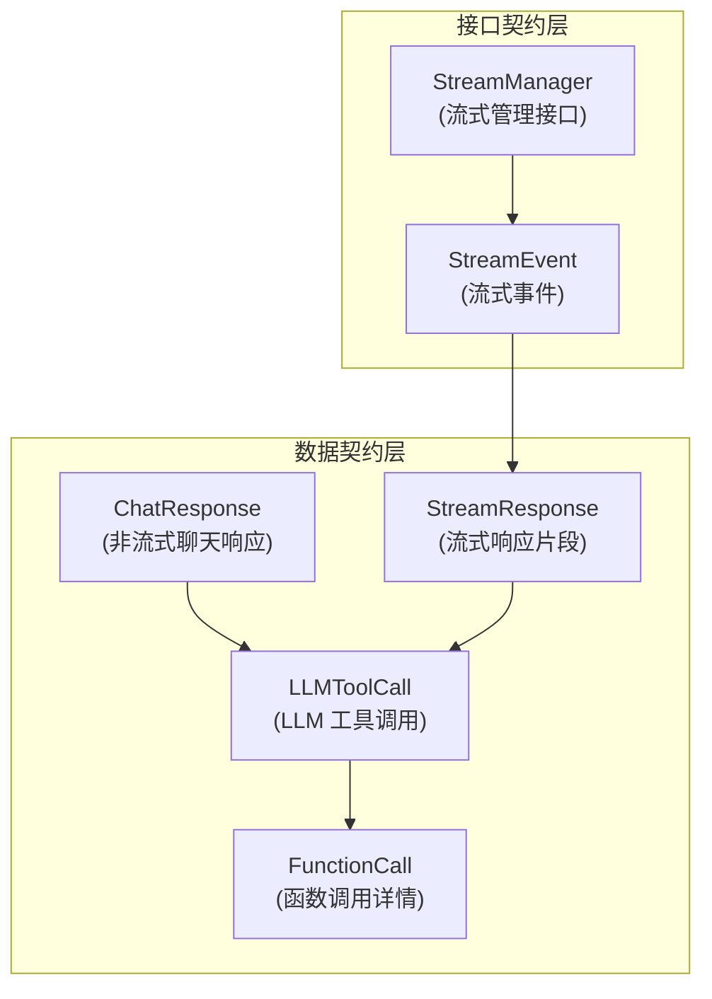

# 聊天完成与流式传输契约模块

## 1. 模块概述

想象一下，你正在构建一个与大型语言模型（LLM）交互的系统。这个系统需要处理两种基本场景：
1. **请求-响应模式**：你发送一条消息，等待完整的回复
2. **流式传输模式**：你发送一条消息，然后实时接收回复的片段，就像打字机一样

同时，LLM 可能不仅仅回复文本——它可能要求调用工具、生成思考过程、返回引用来源等。这就是 `chat_completion_and_streaming_contracts` 模块要解决的问题：**为 LLM 交互提供统一的、类型安全的数据结构和接口契约**。

这个模块位于系统的核心位置，定义了所有与 LLM 聊天相关的数据交换格式，确保了上游服务（如聊天管道、HTTP 处理器）和下游服务（如模型提供商、流式传输状态管理）之间的一致性。

## 2. 架构设计

### 2.1 核心组件关系图



### 2.2 设计理念

这个模块采用了**契约优先**的设计理念。它不包含任何业务逻辑，而是专注于定义：
- **数据结构**：聊天响应、工具调用、流式事件等应该是什么样子
- **接口契约**：流式管理器应该提供哪些功能

这种设计有几个关键优势：
1. **解耦**：生产者和消费者只依赖契约，而不依赖具体实现
2. **一致性**：整个系统使用相同的数据结构，避免了格式转换的混乱
3. **可测试性**：可以轻松模拟这些接口进行单元测试

## 3. 核心组件详解

### 3.1 工具调用契约

#### FunctionCall 和 LLMToolCall

```go
type FunctionCall struct {
    Name      string `json:"name"`
    Arguments string `json:"arguments"` // JSON 字符串
}

type LLMToolCall struct {
    ID       string       `json:"id"`
    Type     string       `json:"type"` // "function"
    Function FunctionCall `json:"function"`
}
```

**设计意图**：
- `FunctionCall` 封装了实际的函数调用信息，包括函数名和 JSON 格式的参数
- `LLMToolCall` 为工具调用添加了标识符和类型信息，这是为了兼容 OpenAI 等主流 LLM 提供商的 API 格式

**为什么 Arguments 是字符串而不是 map？**
这是一个有意的设计选择。使用字符串而不是结构化类型有几个好处：
1. **灵活性**：不同的工具可能有不同的参数结构，使用字符串可以避免类型转换问题
2. **延迟解析**：可以在实际调用工具时再解析参数，而不是在接收响应时就解析
3. **兼容性**：直接匹配大多数 LLM API 的响应格式

### 3.2 非流式响应契约

#### ChatResponse

```go
type ChatResponse struct {
    Content      string        `json:"content"`
    ToolCalls    []LLMToolCall `json:"tool_calls,omitempty"`
    FinishReason string        `json:"finish_reason,omitempty"`
    Usage        struct {
        PromptTokens     int `json:"prompt_tokens"`
        CompletionTokens int `json:"completion_tokens"`
        TotalTokens      int `json:"total_tokens"`
    } `json:"usage"`
}
```

**设计意图**：
- 这是一个完整的、一次性的聊天响应结构
- 包含了文本内容、可能的工具调用、完成原因和 token 使用统计
- `FinishReason` 可以是 "stop"（正常结束）、"tool_calls"（需要调用工具）、"length"（达到长度限制）等

**数据流向**：
1. 模型提供商实现 → 生成 `ChatResponse`
2. 聊天管道服务 → 处理 `ChatResponse`
3. HTTP 处理器 → 将 `ChatResponse` 返回给客户端

### 3.3 流式响应契约

#### ResponseType 和 StreamResponse

```go
type ResponseType string

const (
    ResponseTypeAnswer      ResponseType = "answer"
    ResponseTypeReferences  ResponseType = "references"
    ResponseTypeThinking    ResponseType = "thinking"
    ResponseTypeToolCall    ResponseType = "tool_call"
    ResponseTypeToolResult  ResponseType = "tool_result"
    ResponseTypeError       ResponseType = "error"
    ResponseTypeReflection  ResponseType = "reflection"
    ResponseTypeSessionTitle ResponseType = "session_title"
    ResponseTypeAgentQuery  ResponseType = "agent_query"
    ResponseTypeComplete    ResponseType = "complete"
)

type StreamResponse struct {
    ID                 string                 `json:"id"`
    ResponseType       ResponseType           `json:"response_type"`
    Content            string                 `json:"content"`
    Done               bool                   `json:"done"`
    KnowledgeReferences References             `json:"knowledge_references,omitempty"`
    SessionID          string                 `json:"session_id,omitempty"`
    AssistantMessageID string                 `json:"assistant_message_id,omitempty"`
    ToolCalls          []LLMToolCall          `json:"tool_calls,omitempty"`
    Data               map[string]interface{} `json:"data,omitempty"`
}
```

**设计意图**：
- `ResponseType` 定义了流式响应中可能出现的所有事件类型，这是一个丰富的类型系统，支持复杂的代理推理流程
- `StreamResponse` 是流式传输中的单个片段，包含了类型标识、内容、完成状态和附加数据
- `Done` 字段用于标记整个流式传输的结束

**为什么需要这么多响应类型？**
这反映了系统设计的一个核心理念：**代理的思考过程应该是可观察的**。通过将思考、工具调用、工具结果等作为独立的事件类型，我们可以：
1. 在前端实时展示代理的推理过程
2. 为调试和分析提供详细的执行轨迹
3. 支持不同的 UI 渲染策略（例如，工具调用可以显示为可展开的卡片）

### 3.4 流式管理接口

#### StreamEvent 和 StreamManager

```go
type StreamEvent struct {
    ID        string                 `json:"id"`
    Type      types.ResponseType     `json:"type"`
    Content   string                 `json:"content"`
    Done      bool                   `json:"done"`
    Timestamp time.Time              `json:"timestamp"`
    Data      map[string]interface{} `json:"data,omitempty"`
}

type StreamManager interface {
    AppendEvent(ctx context.Context, sessionID, messageID string, event StreamEvent) error
    GetEvents(ctx context.Context, sessionID, messageID string, fromOffset int) ([]StreamEvent, int, error)
}
```

**设计意图**：
- `StreamEvent` 是 `StreamResponse` 的增强版，添加了时间戳，用于持久化和回放
- `StreamManager` 是一个最小化的仅追加接口，专注于两个核心操作：追加事件和获取事件

**为什么是仅追加设计？**
这是一个关键的设计决策，有几个重要原因：
1. **性能**：追加操作在大多数存储系统中都是 O(1) 的，而修改操作通常更慢
2. **不可变性**：事件一旦产生就不应该被修改，这保证了审计和回放的可靠性
3. **简单性**：接口只定义了两个方法，实现起来非常简单
4. **可扩展性**：新的事件类型可以轻松添加，而不需要修改接口

**数据流向**：
1. 聊天管道服务 → 调用 `AppendEvent` 添加事件
2. 流式状态后端（Redis/内存）→ 存储事件
3. HTTP 流式处理器 → 调用 `GetEvents` 获取事件并推送给客户端

## 4. 设计权衡与决策

### 4.1 结构化 vs 非结构化数据

**决策**：在 `FunctionCall.Arguments` 和 `StreamResponse.Data` 中使用非结构化数据

**权衡**：
- ✅ 灵活性：可以处理任意格式的数据
- ✅ 向前兼容：新字段可以添加而不会破坏现有代码
- ❌ 类型安全性：编译时无法发现数据格式错误
- ❌ 文档负担：需要额外的文档来描述数据结构

**为什么这样选择**：
在 LLM 交互场景中，灵活性比严格的类型安全更重要。LLM 可能返回各种意想不到的内容，工具参数也可能因工具而异。使用非结构化数据可以让系统更容易适应这些变化。

### 4.2 丰富的事件类型 vs 通用事件类型

**决策**：定义了丰富的 `ResponseType` 枚举

**权衡**：
- ✅ 语义清晰：每个事件类型都有明确的含义
- ✅ 便于处理：可以根据类型轻松分支处理逻辑
- ❌ 枚举膨胀：可能需要不断添加新的类型
- ❌ 兼容性：添加新类型可能需要更新所有消费者

**为什么这样选择**：
代理系统的推理过程是复杂的，包含多个阶段和状态。使用丰富的事件类型可以让每个阶段的状态都得到清晰的表达，这对于调试、监控和用户体验都非常重要。

### 4.3 最小化接口 vs 功能丰富接口

**决策**：`StreamManager` 采用最小化设计

**权衡**：
- ✅ 易于实现：只需要实现两个方法
- ✅ 易于测试：接口简单，mock 起来也简单
- ❌ 可能不够用：某些高级功能可能需要额外的方法
- ❌ 消费者可能需要自己实现更多逻辑

**为什么这样选择**：
接口设计的一个重要原则是"接口隔离原则"——客户端不应该依赖它不需要的方法。通过只定义最核心的两个操作，我们确保了接口的稳定性和可实现性。

## 5. 与其他模块的关系

### 5.1 依赖关系

这个模块是系统中的**基础契约模块**，它被许多其他模块依赖，但几乎不依赖任何其他业务模块：

- **被依赖**：[聊天管道插件与流](application_services_and_orchestration-chat_pipeline_plugins_and_flow.md)、[HTTP 处理器与路由](http_handlers_and_routing.md)、[模型提供商与 AI 后端](model_providers_and_ai_backends.md)
- **依赖**：仅依赖标准库和一些基础类型

### 5.2 数据流向示例

让我们看一个典型的流式聊天请求的数据流向：

1. **HTTP 层**：[流式端点处理器](http_handlers_and_routing-session_message_and_streaming_http_handlers-streaming_endpoints_and_sse_context.md) 接收请求
2. **服务层**：[LLM 流式响应生成](application_services_and_orchestration-chat_pipeline_plugins_and_flow-response_assembly_and_generation-llm_response_generation-llm_streaming_response_generation.md) 处理业务逻辑
3. **模型层**：[聊天完成后端与流式](model_providers_and_ai_backends-chat_completion_backends_and_streaming.md) 调用 LLM
4. **契约层**：使用本模块定义的数据结构交换信息
5. **存储层**：[流式状态后端](platform_infrastructure_and_runtime-stream_state_backends.md) 实现 `StreamManager` 接口

## 6. 使用指南与注意事项

### 6.1 正确使用 StreamManager

**示例**：
```go
// 追加事件
err := streamManager.AppendEvent(ctx, sessionID, messageID, StreamEvent{
    ID:        eventID,
    Type:      types.ResponseTypeThinking,
    Content:   "我正在思考这个问题...",
    Timestamp: time.Now(),
})

// 获取事件（从偏移量 0 开始）
events, nextOffset, err := streamManager.GetEvents(ctx, sessionID, messageID, 0)
```

**注意事项**：
- 总是提供唯一的事件 ID，这对于去重和追踪很重要
- 记得设置 `Timestamp`，这对于排序和回放很重要
- 最后一个事件应该设置 `Done: true`，以标记流的结束

### 6.2 处理工具调用

**示例**：
```go
// 解析工具调用参数
var args map[string]interface{}
err := json.Unmarshal([]byte(functionCall.Arguments), &args)
if err != nil {
    // 处理错误
}

// 执行工具调用
result, err := toolRegistry.Call(functionCall.Name, args)
```

**注意事项**：
- 始终验证 `Arguments` 是否为有效的 JSON
- 在调用工具之前，验证工具名称和参数是否符合预期
- 考虑使用参数模式验证来确保安全性

### 6.3 常见陷阱

1. **忘记处理所有 ResponseType**：在编写消费者代码时，确保处理所有可能的响应类型，或者至少有一个默认的处理方式
2. **假设 Arguments 是有效的 JSON**：始终检查解析错误
3. **在 StreamResponse 中过度使用 Data 字段**：虽然 Data 字段很灵活，但过度使用会导致代码难以理解。对于常见的数据，考虑添加专用字段
4. **忽略 Done 标志**：确保在收到 Done 标志后正确关闭流

## 7. 子模块

这个模块包含以下子模块，每个子模块都有更详细的文档：

- [聊天工具调用契约](core_domain_types_and_interfaces-agent_conversation_and_runtime_contracts-chat_completion_and_streaming_contracts-chat_tool_call_contracts.md)：更深入地探讨工具调用相关的契约
- [聊天响应有效载荷契约](core_domain_types_and_interfaces-agent_conversation_and_runtime_contracts-chat_completion_and_streaming_contracts-chat_response_payload_contracts.md)：详细介绍响应有效载荷的结构和用法
- [流式管理接口与事件](core_domain_types_and_interfaces-agent_conversation_and_runtime_contracts-chat_completion_and_streaming_contracts-stream_management_interfaces_and_events.md)：深入探讨流式管理的接口设计和事件处理

## 8. 总结

`chat_completion_and_streaming_contracts` 模块是系统中的核心契约模块，它定义了 LLM 交互的数据结构和接口。通过采用契约优先的设计理念、仅追加的流式管理接口和丰富的事件类型系统，这个模块为构建灵活、可扩展的 LLM 交互系统提供了坚实的基础。

作为新加入的工程师，理解这个模块的设计理念和权衡是非常重要的，因为它会影响你在系统中许多其他部分的工作。
