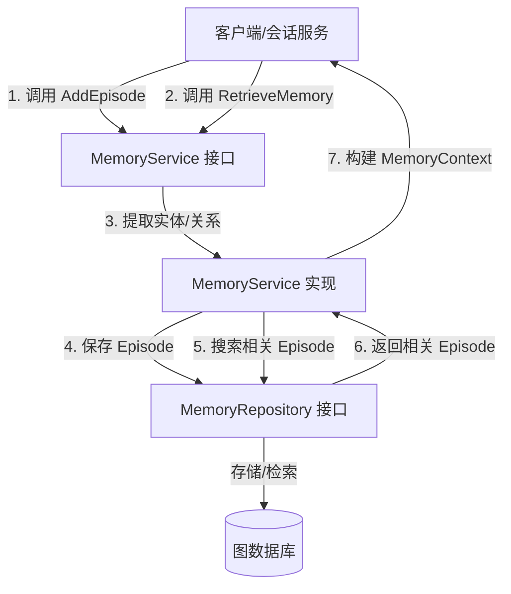

# Memory Service Contract 模块深度解析

## 1. 问题空间与存在意义

在智能对话系统中，用户与代理的交互往往是连续性的、上下文相关的。一个简单的问答系统可能只处理当前请求，但真正有用的代理需要记住：
- 用户之前问过什么问题
- 之前的回答是什么
- 对话中提到的关键实体和关系
- 跨会话的长期偏好和模式

如果没有记忆系统，每次对话都像是第一次，用户需要不断重复上下文，体验会非常糟糕。传统的会话历史存储只是简单地追加消息，无法智能地提取、关联和检索相关信息。

**memory_service_contract** 模块就是为了解决这个问题而设计的。它定义了一套契约，将原始对话转换为结构化的"记忆"，并能根据当前查询智能地检索相关的历史上下文。这不是简单的存储/检索接口，而是一个关于如何将对话转化为可复用知识的抽象。

## 2. 核心抽象与心智模型

理解这个模块的关键在于把握两个核心抽象：**Episode（片段）** 和 **MemoryContext（记忆上下文）**。

### 心智模型：记忆图书馆

可以将 MemoryService 想象成一个专门管理对话记忆的图书馆：

1. **AddEpisode** 就像图书管理员处理一本新书（一次会话）：
   - 把整本书（会话）归档保存
   - 提取书中的关键概念（实体）
   - 标记概念之间的关联（关系）
   - 建立索引以便未来查找

2. **RetrieveMemory** 则像读者在图书馆查找资料：
   - 输入当前的查询（研究主题）
   - 系统在索引中查找相关的书籍（相关历史会话）
   - 提取最相关的内容片段（记忆上下文）
   - 返回给读者使用

### 关键抽象

- **Episode**：一次完整的对话会话，包含时间、参与者、消息序列等元数据
- **Entity**：对话中提到的关键实体（人、地点、事物等）
- **Relationship**：实体之间的关系（如"用户A提到了产品B"）
- **MemoryContext**：为当前查询构建的相关记忆集合，用于增强 LLM 的上下文

## 3. 架构与数据流



### 数据流详解

#### AddEpisode 流程（记忆写入）

1. **输入接收**：`MemoryService.AddEpisode()` 接收 `userID`、`sessionID` 和完整的 `messages` 列表
2. **处理与提取**：实现类会分析消息内容，提取关键实体和它们之间的关系
3. **结构化存储**：通过 `MemoryRepository.SaveEpisode()` 将 Episode、Entity 和 Relationship 保存到图数据库
4. **索引建立**：底层存储会自动建立实体和关系的索引，为后续检索做准备

#### RetrieveMemory 流程（记忆读取）

1. **查询接收**：`MemoryService.RetrieveMemory()` 接收 `userID` 和当前 `query`
2. **关键词提取**：实现类分析查询，提取关键搜索词
3. **相关记忆搜索**：通过 `MemoryRepository.FindRelatedEpisodes()` 查找相关的历史 Episode
4. **上下文构建**：将找到的相关 Episode 整合成 `MemoryContext`，包含最相关的历史信息
5. **结果返回**：返回结构化的记忆上下文，供 LLM 生成更智能的回复

## 4. 核心组件深度解析

### MemoryService 接口

```go
type MemoryService interface {
    AddEpisode(ctx context.Context, userID string, sessionID string, messages []types.Message) error
    RetrieveMemory(ctx context.Context, userID string, query string) (*types.MemoryContext, error)
}
```

**设计意图**：
- 这是一个极简的接口，只定义了两个核心操作，体现了"接口隔离原则"
- 专注于"记忆"的本质：记录过去，为现在提供参考
- 将具体的实现细节（如实体提取算法、图数据库操作）完全隐藏

**参数设计**：
- `ctx context.Context`：标准的 Go 上下文模式，支持取消、超时和链路追踪
- `userID`：用户隔离的关键，确保记忆是用户级别的，不会泄露
- `sessionID`：关联到具体会话，便于按会话组织记忆
- `messages []types.Message`：原始对话数据，包含完整的上下文
- `query string`：当前查询，用于检索相关记忆

### MemoryRepository 接口

```go
type MemoryRepository interface {
    SaveEpisode(ctx context.Context, episode *types.Episode, entities []*types.Entity, relations []*types.Relationship) error
    FindRelatedEpisodes(ctx context.Context, userID string, keywords []string, limit int) ([]*types.Episode, error)
    IsAvailable(ctx context.Context) bool
}
```

**设计意图**：
- 分离关注点：MemoryService 处理业务逻辑，MemoryRepository 处理持久化
- 图数据模型的抽象：Episode、Entity、Relationship 是图数据库的核心概念
- 可用性检查：`IsAvailable` 允许系统在记忆服务不可用时优雅降级

**关键方法**：
- `SaveEpisode`：原子性地保存整个 Episode 及其关联的实体和关系，确保数据一致性
- `FindRelatedEpisodes`：基于关键词的语义搜索，返回最相关的历史片段
- `IsAvailable`：健康检查方法，支持断路器模式

## 5. 依赖关系分析

### 依赖流入（谁使用这个模块）

从模块树可以看出，`memory_service_contract` 位于 `core_domain_types_and_interfaces` 之下，这意味着它是一个核心领域契约，会被上层的应用服务调用：

1. **conversation_context_and_memory_services** 模块：很可能包含 MemoryService 的实现
2. **chat_pipeline_plugins_and_flow** 模块：在对话流程中可能会调用 RetrieveMemory 来获取历史上下文
3. **agent_core_orchestration_and_tooling_foundation** 模块：代理编排可能需要记忆来增强推理

### 依赖流出（这个模块使用谁）

- `types` 包：依赖 `types.Message`、`types.MemoryContext`、`types.Episode`、`types.Entity`、`types.Relationship` 等核心领域模型
- 标准库：`context.Context` 用于上下文传递

### 契约依赖

这个模块定义的接口依赖于以下隐式契约：

1. **Message 结构**：必须包含足够的信息来提取实体和关系
2. **Episode 结构**：必须能完整表示一次会话的记忆
3. **图数据一致性**：SaveEpisode 必须原子性地保存 Episode、Entity 和 Relationship

## 6. 设计决策与权衡

### 决策 1：接口极简主义

**选择**：MemoryService 只定义了两个方法

**权衡**：
- ✅ **优点**：接口简单易懂，符合单一职责原则，易于测试和实现
- ⚠️ **缺点**：可能无法满足某些高级用例（如删除记忆、标记记忆重要性等）

**原因**：设计团队选择从最核心的需求出发，避免过度设计。未来可以通过扩展接口或创建新接口来添加功能。

### 决策 2：分离 Service 和 Repository

**选择**：将业务逻辑和持久化分离为两个接口

**权衡**：
- ✅ **优点**：
  - 符合关注点分离原则
  - 可以独立测试 Service（使用 mock Repository）
  - 可以轻松切换不同的 Repository 实现（如从 Neo4j 切换到其他图数据库）
- ⚠️ **缺点**：增加了一层抽象，对于简单场景可能显得过度设计

**原因**：记忆系统的实现可能会频繁变化（如改进实体提取算法、切换图数据库），这种分离可以保护上层代码不受影响。

### 决策 3：基于图的数据模型

**选择**：使用 Episode、Entity、Relationship 的图模型

**权衡**：
- ✅ **优点**：
  - 自然表示实体之间的关系
  - 支持复杂的关联查询（如"找到所有提到产品X的会话"）
  - 适合知识图谱式的记忆组织
- ⚠️ **缺点**：
  - 图数据库的运维复杂度较高
  - 对于简单的顺序记忆可能过于复杂

**原因**：智能代理需要理解实体之间的关联，图模型是实现这种理解的最佳方式。

### 决策 4：用户级别的记忆隔离

**选择**：所有操作都以 userID 为关键参数

**权衡**：
- ✅ **优点**：
  - 确保数据隐私，用户之间的记忆不会混淆
  - 支持多租户架构
- ⚠️ **缺点**：
  - 无法直接支持共享记忆（如团队共享记忆）
  - 限制了某些协作场景

**原因**：在当前阶段，用户隐私和隔离被认为是更重要的需求。未来可以通过扩展接口来支持共享记忆。

## 7. 使用指南与最佳实践

### 基本使用模式

#### 添加记忆片段

```go
// 假设你有一个 MemoryService 的实例
var memoryService MemoryService

// 处理完一次会话后，将其添加到记忆
err := memoryService.AddEpisode(
    ctx,
    userID,
    sessionID,
    messages, // 完整的消息列表
)
if err != nil {
    // 处理错误：可以记录日志，但不应该阻塞主流程
    log.Printf("Failed to add episode to memory: %v", err)
}
```

#### 检索记忆

```go
// 在生成回复前，检索相关记忆
memoryContext, err := memoryService.RetrieveMemory(
    ctx,
    userID,
    currentQuery,
)
if err != nil {
    // 处理错误：可以降级为不使用记忆
    log.Printf("Failed to retrieve memory: %v", err)
    memoryContext = nil // 或空的 MemoryContext
}

// 使用 memoryContext 增强 LLM 的上下文
if memoryContext != nil {
    // 将记忆上下文整合到提示词中
    prompt = buildPromptWithMemory(prompt, memoryContext)
}
```

### 最佳实践

1. **错误处理策略**：
   - 记忆服务应该是"尽力而为"的，失败不应该阻塞主对话流程
   - 记录错误但继续执行，使用降级策略（如不使用记忆）

2. **性能考虑**：
   - RetrieveMemory 可能会比较慢，考虑在后台预取或缓存
   - 设置合理的 limit 参数，避免返回过多的历史数据

3. **数据一致性**：
   - AddEpisode 应该在会话结束后调用，确保消息列表完整
   - 考虑在事务中执行 SaveEpisode，确保数据一致性

4. **监控与观测**：
   - 监控记忆服务的调用频率、延迟和错误率
   - 记录记忆检索的质量（如用户是否引用了历史信息）

## 8. 边界情况与潜在陷阱

### 边界情况

1. **空消息列表**：
   - 如果传入空的 messages，AddEpisode 应该如何处理？
   - **建议**：返回错误或静默忽略，但不要创建空的 Episode

2. **极长的对话**：
   - 如果一次会话有几千条消息，如何处理？
   - **建议**：在 AddEpisode 内部进行采样或摘要，避免存储过多冗余信息

3. **记忆检索为空**：
   - 如果没有找到相关记忆，RetrieveMemory 应该返回什么？
   - **建议**：返回空的 MemoryContext 而不是 nil，便于调用方统一处理

4. **存储不可用**：
   - 如果图数据库暂时不可用，如何优雅降级？
   - **建议**：IsAvailable 应该返回 false，调用方可以选择跳过记忆操作

### 潜在陷阱

1. **过度依赖记忆**：
   - 陷阱：每次回复都加入大量历史上下文，导致 LLM 上下文窗口溢出
   - **避免**：合理限制 MemoryContext 的大小，进行优先级排序

2. **隐私泄露风险**：
   - 陷阱：在多租户环境中，没有正确隔离用户记忆
   - **避免**：始终验证 userID，在 Repository 层强制执行用户隔离

3. **记忆过时问题**：
   - 陷阱：旧的、过时的记忆仍然被检索出来，干扰当前对话
   - **避免**：考虑时间衰减因子，近期的记忆权重更高

4. **实体提取错误**：
   - 陷阱：实体提取算法错误，导致记忆关联不正确
   - **避免**：在 AddEpisode 中加入实体验证逻辑，允许人工反馈修正

## 9. 扩展点与未来方向

### 现有扩展点

1. **MemoryService 实现**：可以创建不同的实现，如：
   - 基于规则的简单记忆服务
   - 基于 LLM 的智能记忆提取服务
   - 混合策略记忆服务

2. **MemoryRepository 实现**：可以支持不同的后端：
   - Neo4j 图数据库
   - 其他图数据库（如 Amazon Neptune、JanusGraph）
   - 甚至关系型数据库（通过模拟图结构）

### 未来可能的扩展

1. **记忆管理功能**：
   - 删除特定记忆
   - 标记记忆的重要性
   - 合并相似记忆
   - 记忆摘要和压缩

2. **高级检索功能**：
   - 基于时间范围的检索
   - 基于会话的检索
   - 语义相似度检索（不仅仅是关键词）

3. **共享记忆**：
   - 团队共享记忆
   - 组织级知识库
   - 记忆分享和协作

4. **记忆学习**：
   - 自动学习用户偏好
   - 记忆质量评估
   - 自适应的实体提取策略

## 10. 相关模块参考

- [memory_repository_contract](core_domain_types_and_interfaces-agent_conversation_and_runtime_contracts-memory_state_and_storage_contracts-memory_repository_contract.md)：MemoryRepository 接口的详细文档
- [memory_state_and_episode_models](core_domain_types_and_interfaces-agent_conversation_and_runtime_contracts-memory_state_and_storage_contracts-memory_state_and_episode_models.md)：Episode、Entity、Relationship 等数据模型的定义
- [memory_graph_repository](data_access_repositories-graph_retrieval_and_memory_repositories-memory_graph_repository.md)：MemoryRepository 的图数据库实现
- [memory_extraction_and_recall_service](application_services_and_orchestration-conversation_context_and_memory_services-memory_extraction_and_recall_service.md)：MemoryService 的实现服务

---

这个模块是整个记忆系统的基石，它定义了"什么是记忆"以及"如何与记忆交互"。理解这个模块的设计意图，对于构建一个真正智能的、有"记忆"的代理系统至关重要。
