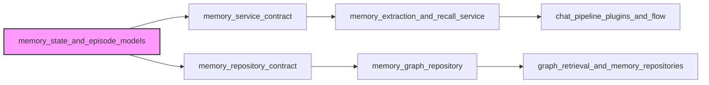

# memory_state_and_episode_models 模块技术深度解析

## 1. 问题空间与模块定位

### 1.1 为什么需要这个模块？

在构建具有长期记忆能力的对话代理系统时，我们面临一个核心挑战：如何在跨会话的上下文中保持对话的连贯性和个性化。当用户与代理进行多次交互时，简单地将所有历史记录塞入当前对话上下文既不可行（受限于 token 限制），也不高效（会淹没重要信息）。

想象一下，一个用户在第一次对话中提到"我是一名数据科学家，正在研究神经网络优化"，然后在第二天的对话中询问"如何提高模型训练效率"。系统需要能够"记住"用户的背景和之前的讨论，而不是每次都从头开始。

这就是 `memory_state_and_episode_models` 模块要解决的问题：它提供了一套核心数据模型，用于表示和组织对话记忆，使系统能够检索、关联和利用过去的交互信息。

### 1.2 模块在架构中的位置

这个模块位于系统的**核心领域类型层**，具体路径为：
`core_domain_types_and_interfaces > agent_conversation_and_runtime_contracts > memory_state_and_storage_contracts > memory_state_and_episode_models`

它的定位是：
- **领域模型定义层**：不包含业务逻辑，只定义核心数据结构
- **契约层**：为上层服务和下层存储提供统一的数据契约
- **内存系统的基础**：为整个记忆提取、存储和召回机制提供数据模型支持

## 2. 核心抽象与心智模型

### 2.1 关键概念

让我们用一个"人类记忆图书馆"的类比来理解这个模块的设计：

- **Episode（情节）**：就像图书馆中的一本书，记录了一次完整的对话或交互事件。每本书都有标题（summary）、作者（user_id）、所属系列（session_id）和出版时间（created_at）。
- **MemoryContext（记忆上下文）**：就像图书馆员根据当前查询推荐的相关资源集合，包含相关的书籍（episodes）、人物（entities）和它们之间的关系（relations）。

### 2.2 数据模型详解

#### Episode 结构

```go
type Episode struct {
    ID        string    `json:"id"`
    UserID    string    `json:"user_id"`
    SessionID string    `json:"session_id"`
    Summary   string    `json:"summary"`
    CreatedAt time.Time `json:"created_at"`
}
```

**设计意图**：
- **ID**：全局唯一标识符，用于精确引用特定情节
- **UserID**：建立用户与记忆的归属关系，确保记忆的用户隔离
- **SessionID**：将会话与情节关联，支持在同一会话内的上下文连贯性
- **Summary**：这是设计的关键点——不存储完整对话，而是存储摘要。这是在信息量和效率之间的权衡
- **CreatedAt**：时间维度，支持时序召回和遗忘机制

#### MemoryContext 结构

```go
type MemoryContext struct {
    RelatedEpisodes   []Episode      `json:"related_episodes"`
    RelatedEntities   []Entity       `json:"related_entities"`
    RelatedRelations  []Relationship `json:"related_relations"`
}
```

**设计意图**：
- **RelatedEpisodes**：相关的对话情节，提供历史上下文
- **RelatedEntities**：相关的实体（如人物、地点、项目等），丰富语义理解
- **RelatedRelations**：实体之间的关系，构建知识图谱结构

这种三维结构（情节-实体-关系）的设计反映了人类记忆的多面性：我们不仅记得发生了什么（情节），还记得涉及了谁（实体）以及它们之间的联系（关系）。

## 3. 数据流向与架构关系

### 3.1 依赖关系图



### 3.2 数据流动路径

让我们追踪一个典型的记忆使用场景：

1. **记忆提取阶段**：
   - 当对话结束时，`memory_extraction_and_recall_service` 会调用 LLM 生成对话摘要
   - 摘要和元数据被封装成 `Episode` 对象
   - 同时提取对话中的实体和关系，构建 `Entity` 和 `Relationship` 对象

2. **记忆存储阶段**：
   - `memory_service_contract` 的实现接收这些对象
   - 通过 `memory_repository_contract` 将 `Episode` 持久化到 `memory_graph_repository`

3. **记忆召回阶段**：
   - 在新对话开始时，`chat_pipeline_plugins_and_flow` 中的记忆插件触发召回
   - `memory_extraction_and_recall_service` 根据当前查询检索相关记忆
   - 组装成 `MemoryContext` 对象，包含相关的情节、实体和关系
   - 这个上下文被注入到当前对话的 prompt 中

## 4. 设计决策与权衡

### 4.1 摘要 vs 完整对话

**决策**：存储摘要而非完整对话

**权衡分析**：
- ✅ **优点**：显著减少存储开销和 token 使用；摘要更聚焦于重要信息
- ❌ **缺点**：可能丢失细节；摘要质量依赖于 LLM 能力

**为什么这样选择**：
在对话系统中，上下文窗口是稀缺资源。通过存储摘要，我们可以在有限的上下文中包含更多的历史信息，同时避免了信息过载。这是在"完整性"和"实用性"之间的务实选择。

### 4.2 三维记忆结构

**决策**：采用情节-实体-关系的三维结构

**权衡分析**：
- ✅ **优点**：提供丰富的语义关联；支持多种召回策略（时序、语义、实体关联）
- ❌ **缺点**：增加了系统复杂度；需要维护多个索引

**为什么这样选择**：
人类记忆本身就是多维度的。单一的时序召回无法捕捉"用户之前提到过这个项目"这种实体关联，而纯语义召回可能忽略"这是我们上周讨论过的问题"这种时间连续性。三维结构提供了最大的灵活性。

### 4.3 简洁的模型设计

**决策**：保持核心模型的简洁性，不包含业务逻辑

**权衡分析**：
- ✅ **优点**：模型稳定，不易变化；易于序列化和存储；明确的契约边界
- ❌ **缺点**：业务逻辑需要分散到其他层；可能导致贫血领域模型

**为什么这样选择**：
作为核心域类型，这些模型需要被多个子系统依赖。保持它们的简洁性可以减少耦合，使整个系统更加稳定。业务逻辑被上移到服务层，这符合分层架构的原则。

## 5. 使用指南与注意事项

### 5.1 正确使用方式

**创建 Episode**：
```go
episode := &Episode{
    ID:        generateUUID(),
    UserID:    user.ID,
    SessionID: session.ID,
    Summary:   llmGeneratedSummary,  // 应由 LLM 生成的简洁摘要
    CreatedAt: time.Now(),
}
```

**构建 MemoryContext**：
```go
context := &MemoryContext{
    RelatedEpisodes:  retrievedEpisodes,   // 检索到的相关情节
    RelatedEntities:  extractedEntities,    // 提取的相关实体
    RelatedRelations: foundRelations,       // 实体间的关系
}
```

### 5.2 注意事项与潜在陷阱

1. **Summary 的质量至关重要**
   - ❌ 错误：直接将用户最后一条消息作为 summary
   - ✅ 正确：使用 LLM 生成真正反映对话核心内容的摘要
   - 提示：摘要应该包含关键决策、用户偏好和未解决的问题

2. **避免过度填充 MemoryContext**
   - ❌ 错误：将所有相关情节都塞入上下文
   - ✅ 正确：进行相关性排序和过滤，只包含最相关的 3-5 个情节
   - 注意：太多的历史信息反而会干扰当前对话

3. **Episode 的时间维度**
   - 不要忽略 CreatedAt 字段，它对时序召回和遗忘机制至关重要
   - 考虑实现时间衰减的相关性评分

4. **与 Entity 和 Relationship 的配合**
   - 这些类型在同一模块中定义，确保它们的一致性
   - 实体和关系应该从对话中自动提取，而不是手动构建

## 6. 扩展与演进方向

虽然当前模型设计简洁，但为未来的扩展预留了空间：

1. **情节类型扩展**：可以添加 Type 字段来区分不同类型的交互（如问题解决、信息收集、任务执行等）

2. **情感维度**：可以添加 EmotionalTone 字段来记录对话的情感色彩，用于更个性化的回应

3. **重要性评分**：可以添加 Importance 字段，让系统能够优先召回重要的记忆

4. **记忆状态**：可以添加 State 字段（如 active、archived、forgotten）来实现记忆的生命周期管理

## 7. 相关模块参考

- [memory_service_contract](core_domain_types_and_interfaces-agent_conversation_and_runtime_contracts-memory_state_and_storage_contracts-memory_service_contract.md) - 记忆服务的接口定义
- [memory_repository_contract](core_domain_types_and_interfaces-agent_conversation_and_runtime_contracts-memory_state_and_storage_contracts-memory_repository_contract.md) - 记忆存储的接口定义
- [memory_extraction_and_recall_service](application_services_and_orchestration-conversation_context_and_memory_services-memory_extraction_and_recall_service.md) - 记忆提取和召回的服务实现
- [memory_graph_repository](data_access_repositories-graph_retrieval_and_memory_repositories-memory_graph_repository.md) - 记忆图存储的实现
