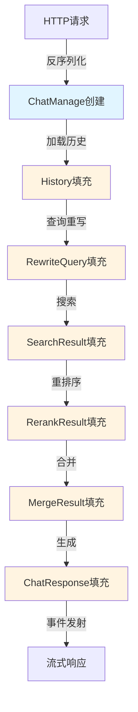

# chat_management_contract 模块技术深度解析

## 1. 模块概述

### 1.1 问题空间

在构建企业级对话系统时，我们面临一个核心挑战：如何将复杂的 RAG（检索增强生成）流程、会话管理、知识库配置、模型选择等多种关注点统一在一个单一的数据结构中，同时保持系统的可扩展性和可维护性？

一个简单的解决方案可能是将这些配置分散在不同的参数对象中，但这会导致：
- 数据流不清晰，难以追踪配置在管道中的变化
- 管道各阶段之间的接口变得复杂且脆弱
- 难以支持不同的对话模式（如简单聊天、RAG、流式对话等）
- 缺乏统一的上下文载体，导致状态管理困难

### 1.2 设计洞察

`chat_management_contract` 模块的核心设计洞察是：**将整个对话生命周期的配置、状态和中间结果封装在一个单一的契约对象中**，这个对象作为"上下文背包"在整个管道中传递。

这种设计类似于 Web 框架中的请求上下文（Request Context），它：
- 在请求入口点创建
- 在各个处理阶段中被读取和修改
- 包含处理请求所需的所有配置和状态
- 最终在响应生成后被清理或持久化

## 2. 核心组件详解

### 2.1 ChatManage 结构体

`ChatManage` 是这个模块的核心，它扮演着三个关键角色：
1. **配置容器**：存储会话、搜索、模型等所有配置
2. **状态载体**：在管道各阶段之间传递中间结果
3. **事件协调者**：通过 EventBus 协调流式响应

#### 2.1.1 字段分组与职责

让我们按照功能维度来理解这个结构体的设计：

##### 会话与用户标识
```go
SessionID    string     // 会话唯一标识
UserID       string     // 用户唯一标识
Query        string     // 原始用户查询
RewriteQuery string     // 重写后的查询
EnableMemory bool       // 是否启用记忆功能
History      []*History // 对话历史
```
这些字段建立了会话的基本上下文，是整个对话流程的起点。

##### 知识库与搜索配置
```go
KnowledgeBaseIDs []string    // 要搜索的知识库ID列表
KnowledgeIDs     []string    // 特定文件ID列表（可选）
SearchTargets    SearchTargets // 预计算的统一搜索目标
VectorThreshold  float64     // 向量搜索结果的最低分数阈值
KeywordThreshold float64     // 关键词搜索结果的最低分数阈值
EmbeddingTopK    int         // 嵌入搜索返回的Top K结果数
VectorDatabase   string      // 要使用的向量数据库类型/名称
```
这组字段定义了检索阶段的行为，是 RAG 流程的核心配置。

##### 重排序配置
```go
RerankModelID   string  // 用于重排序搜索结果的模型ID
RerankTopK      int     // 重排序后的Top K结果数
RerankThreshold float64 // 重排序结果的最低分数阈值
```
重排序是提高检索质量的关键步骤，这些字段控制着重排序的行为。

##### 聊天模型与生成配置
```go
ChatModelID      string           // 要使用的聊天模型ID
SummaryConfig    SummaryConfig    // 摘要生成配置
FallbackStrategy FallbackStrategy // 无相关结果时的策略
FallbackResponse string           // 回退时的默认响应
FallbackPrompt   string           // 基于模型的回退响应提示词
```
这些字段控制着最终响应生成的行为。

##### 查询增强配置
```go
EnableRewrite        bool   // 是否启用查询重写
EnableQueryExpansion bool   // 是否启用LLM查询扩展
RewritePromptSystem  string // 重写阶段的自定义系统提示词
RewritePromptUser    string // 重写阶段的自定义用户提示词
```
查询增强是提高检索准确性的重要手段。

##### 内部管道字段（json:"-"）
这是设计中最有趣的部分，这些字段不会被序列化到 JSON，但在管道内部起着关键作用：

```go
SearchResult    []*SearchResult   // 搜索阶段的结果
RerankResult    []*SearchResult   // 重排序后的结果
MergeResult     []*SearchResult   // 所有处理后的最终合并结果
Entity          []string          // 识别出的实体列表
EntityKBIDs     []string          // 启用了ExtractConfig的知识库ID
EntityKnowledge map[string]string // 图启用文件的KnowledgeID->KnowledgeBaseID映射
GraphResult     *GraphData        // 搜索阶段的图数据
UserContent     string            // 处理后的用户内容
ChatResponse    *ChatResponse     // 聊天模型的最终响应
```

这些字段形成了一个数据流水线，每个阶段读取上一阶段的结果，写入自己的输出。

##### 事件系统字段
```go
EventBus  EventBusInterface // 用于发射流式事件的事件总线
MessageID string            // 用于事件发射的助手消息ID
```
这些字段支持流式响应和事件驱动的架构。

#### 2.1.2 Clone 方法设计

`Clone` 方法是一个深思熟虑的设计，它创建 `ChatManage` 对象的深拷贝。让我们分析为什么需要这个方法：

```go
func (c *ChatManage) Clone() *ChatManage {
    // 深拷贝知识ID切片
    knowledgeBaseIDs := make([]string, len(c.KnowledgeBaseIDs))
    copy(knowledgeBaseIDs, c.KnowledgeBaseIDs)
    
    // 深拷贝搜索目标切片
    searchTargets := make(SearchTargets, len(c.SearchTargets))
    for i, t := range c.SearchTargets {
        if t != nil {
            kidsCopy := make([]string, len(t.KnowledgeIDs))
            copy(kidsCopy, t.KnowledgeIDs)
            searchTargets[i] = &SearchTarget{
                Type:            t.Type,
                KnowledgeBaseID: t.KnowledgeBaseID,
                KnowledgeIDs:    kidsCopy,
            }
        }
    }
    
    // ... 复制其他字段
}
```

**设计意图**：
1. **安全性**：防止管道中的某个阶段意外修改共享状态
2. **可追溯性**：保留原始请求的快照，便于调试和审计
3. **重试支持**：在需要重试某个阶段时，可以从克隆的状态开始

**注意**：`Clone` 方法并没有克隆所有字段（如 `SearchResult`、`EventBus` 等内部管道字段），这是一个有意的设计决策——这些字段是管道执行过程中的临时状态，不需要在克隆时保留。

### 2.2 EventType 和 Pipeline 定义

这是模块中另一个关键的设计部分，它定义了 RAG 管道的阶段和不同对话模式的流程。

#### 2.2.1 EventType 枚举

`EventType` 定义了管道中的各个阶段：

```go
type EventType string

const (
    LOAD_HISTORY           EventType = "load_history"           // 加载对话历史
    REWRITE_QUERY          EventType = "rewrite_query"          // 查询重写
    CHUNK_SEARCH           EventType = "chunk_search"           // 搜索相关块
    CHUNK_SEARCH_PARALLEL  EventType = "chunk_search_parallel"  // 并行搜索：块 + 实体
    // ... 更多事件类型
)
```

#### 2.2.2 Pipeline 映射

`Pipeline` 是一个关键的设计，它将不同的对话模式映射到事件序列：

```go
var Pipline = map[string][]EventType{
    "chat": { // 无检索的简单聊天
        CHAT_COMPLETION,
    },
    "chat_stream": { // 无检索的流式聊天（无历史）
        CHAT_COMPLETION_STREAM,
        STREAM_FILTER,
    },
    "chat_history_stream": { // 带对话历史的流式聊天
        LOAD_HISTORY,
        MEMORY_RETRIEVAL,
        CHAT_COMPLETION_STREAM,
        STREAM_FILTER,
        MEMORY_STORAGE,
    },
    "rag": { // 检索增强生成
        CHUNK_SEARCH,
        CHUNK_RERANK,
        CHUNK_MERGE,
        INTO_CHAT_MESSAGE,
        CHAT_COMPLETION,
    },
    "rag_stream": { // 流式检索增强生成
        REWRITE_QUERY,
        CHUNK_SEARCH_PARALLEL,
        CHUNK_RERANK,
        CHUNK_MERGE,
        FILTER_TOP_K,
        DATA_ANALYSIS,
        INTO_CHAT_MESSAGE,
        CHAT_COMPLETION_STREAM,
        STREAM_FILTER,
    },
}
```

**设计意图**：
1. **声明式管道定义**：不是硬编码流程，而是通过数据结构定义
2. **可扩展性**：添加新的对话模式只需在映射中添加新条目
3. **可视化**：清晰地展示了不同模式下的执行流程

## 3. 架构与数据流动

### 3.1 架构角色

`chat_management_contract` 模块在整个系统中扮演着**上下文契约**的角色，它是连接以下组件的桥梁：

- **HTTP 处理层**：将请求反序列化为 `ChatManage` 对象
- **会话生命周期服务**：管理会话的创建、加载和持久化
- **检索管道**：使用 `ChatManage` 中的配置执行检索
- **LLM 集成层**：使用 `ChatManage` 中的模型配置生成响应
- **事件系统**：通过 `EventBus` 发射流式事件

### 3.2 数据流动图



### 3.3 关键数据流路径

让我们以 `rag_stream` 模式为例，追踪数据如何在 `ChatManage` 中流动：

1. **请求入口**：HTTP 处理器创建 `ChatManage` 对象，填充 `SessionID`、`UserID`、`Query`、`KnowledgeBaseIDs` 等配置字段
2. **查询重写阶段**：读取 `Query`，写入 `RewriteQuery`
3. **并行搜索阶段**：读取 `RewriteQuery`、`KnowledgeBaseIDs`、`SearchTargets`，写入 `SearchResult` 和 `Entity`
4. **重排序阶段**：读取 `SearchResult`，写入 `RerankResult`
5. **合并阶段**：读取 `RerankResult`，写入 `MergeResult`
6. **Top K 过滤阶段**：读取 `MergeResult`，更新 `MergeResult` 为 Top K 结果
7. **数据分阶段**：读取 `MergeResult`，可能更新 `UserContent`
8. **消息组装阶段**：读取 `MergeResult`、`History`，构建消息上下文
9. **流式生成阶段**：通过 `EventBus` 发射 `CHAT_COMPLETION_STREAM` 事件，写入 `ChatResponse`
10. **流过滤阶段**：处理流式输出

## 4. 设计决策与权衡

### 4.1 单一上下文对象 vs 分散参数

**决策**：使用单一的 `ChatManage` 结构体作为整个管道的上下文

**理由**：
- **简化接口**：管道中的每个函数只需接收一个 `*ChatManage` 参数，而不是一长串参数
- **灵活性**：可以添加新的配置或状态字段，而不需要修改所有函数签名
- **可观察性**：在任何断点都可以检查整个上下文状态

**权衡**：
- **耦合增加**：管道各阶段都依赖于这个大结构体，可能导致不必要的依赖
- **可发现性降低**：一个函数实际使用哪些字段不那么明显
- **性能考虑**：传递大对象可能有轻微的性能开销（但在 Go 中指针传递很高效）

### 4.2 内部字段使用 json:"-" 标签

**决策**：将管道内部字段标记为 `json:"-"`，不进行序列化

**理由**：
- **分离关注点**：公共 API 契约与内部管道状态分离
- **安全性**：不将内部处理细节暴露给外部
- **性能**：避免序列化大的中间结果

**权衡**：
- **调试复杂性**：无法直接从 JSON 表示中看到内部状态
- **需要额外机制**：在需要记录完整状态时，需要自定义序列化逻辑

### 4.3 Pipeline 作为数据驱动的配置

**决策**：使用映射数据结构定义管道流程，而不是硬编码

**理由**：
- **声明式设计**：流程定义更清晰，更易理解
- **可扩展性**：添加新模式无需修改核心执行逻辑
- **可测试性**：可以独立测试每个流程定义

**权衡**：
- **间接性增加**：流程执行不是线性的，需要查找映射
- **类型安全降低**：使用字符串作为模式键，编译时无法检查

### 4.4 Clone 方法的选择性复制

**决策**：`Clone` 方法只复制配置字段，不复制内部管道状态

**理由**：
- **语义清晰**：克隆的是"请求配置"，而不是"执行状态"
- **性能优化**：避免复制大的结果列表
- **安全边界**：确保克隆的对象可以安全地用于新的执行

**权衡**：
- **可能导致混淆**：有人可能期望 Clone 是完全深拷贝
- **文档依赖**：需要清楚地文档化 Clone 的行为

## 5. 使用指南与注意事项

### 5.1 正确使用模式

#### 创建 ChatManage 对象

```go
// 在请求入口点创建
chatManage := &types.ChatManage{
    SessionID:        sessionID,
    UserID:           userID,
    Query:            query,
    KnowledgeBaseIDs: kbIDs,
    VectorThreshold:  0.7,
    // ... 其他配置
}
```

#### 在管道阶段中使用

```go
func SearchChunk(ctx context.Context, chatManage *types.ChatManage) error {
    // 读取配置
    kbIDs := chatManage.KnowledgeBaseIDs
    topK := chatManage.EmbeddingTopK
    
    // 执行搜索
    results, err := doSearch(kbIDs, chatManage.RewriteQuery, topK)
    if err != nil {
        return err
    }
    
    // 写入结果
    chatManage.SearchResult = results
    return nil
}
```

#### 使用事件总线

```go
// 发射事件
if chatManage.EventBus != nil {
    chatManage.EventBus.Emit(types.CHUNK_SEARCH, map[string]interface{}{
        "results": chatManage.SearchResult,
    })
}
```

### 5.2 常见陷阱与注意事项

#### 陷阱 1：忽略 nil 检查

```go
// 危险：不检查 nil 直接访问
firstResult := chatManage.SearchResult[0]

// 安全：先检查
if len(chatManage.SearchResult) > 0 {
    firstResult := chatManage.SearchResult[0]
    // ...
}
```

#### 陷阱 2：在管道外修改内部字段

```go
// 不推荐：在管道阶段之外修改内部字段
chatManage.SearchResult = someResults

// 推荐：通过专门的函数或方法修改
func SetSearchResults(chatManage *types.ChatManage, results []*SearchResult) {
    // 可以在这里添加验证逻辑
    chatManage.SearchResult = results
}
```

#### 陷阱 3：滥用 Clone 方法

```go
// 不必要：每个小步骤都克隆
func SomeStep(chatManage *types.ChatManage) {
    clone := chatManage.Clone()
    // 使用 clone 工作
    // ... 但结果不会反映到原始对象
}

// 正确：只在真正需要隔离时克隆
func SomeIsolatedStep(chatManage *types.ChatManage) *types.ChatManage {
    clone := chatManage.Clone()
    // 使用 clone 工作
    return clone
}
```

### 5.3 扩展点

#### 添加新的管道阶段

1. 在 `EventType` 枚举中添加新类型
2. 在需要的管道模式中添加新事件
3. 实现处理该事件的函数，操作 `ChatManage` 中的相应字段

#### 添加新的配置

1. 在 `ChatManage` 结构体中添加新字段
2. 如果是内部字段，添加 `json:"-"` 标签
3. 在 `Clone` 方法中添加复制逻辑
4. 更新相关文档

## 6. 总结

`chat_management_contract` 模块是一个精心设计的上下文契约，它通过单一的 `ChatManage` 结构体统一了整个对话生命周期的配置、状态和中间结果。这种设计虽然增加了一定的耦合度，但带来了更好的数据流清晰度、接口简化和可扩展性。

关键的设计决策包括使用单一上下文对象、分离公共和内部字段、数据驱动的管道定义，以及选择性的克隆行为。理解这些决策及其权衡，对于正确使用和扩展这个模块至关重要。

新的贡献者应该特别注意 `ChatManage` 对象的生命周期、内部字段的使用约定，以及管道阶段之间的数据流动模式。
