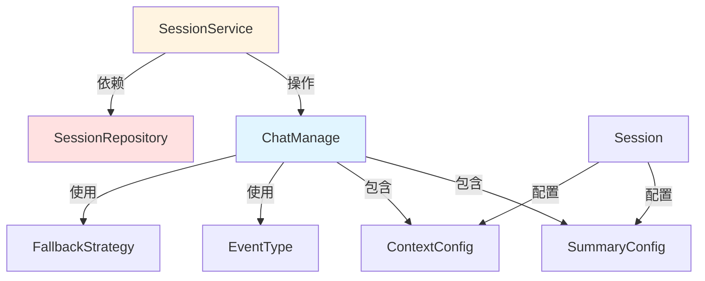

# 会话生命周期与对话控制契约

## 概述

这个模块是整个对话系统的"指挥中心"契约层。它定义了会话从创建到销毁的完整生命周期管理接口，以及对话过程中所有关键控制参数的数据结构。在深入代码之前，让我们先理解这个模块解决的核心问题：

**问题空间**：在一个支持多轮对话、知识检索、流式输出的复杂 RAG 系统中，如何统一管理会话状态、对话历史、检索参数、模型配置等一系列相互关联的变量，同时保持足够的灵活性来支持不同的对话模式（纯聊天、RAG、Agent 模式等）？

**解决方案**：这个模块提供了一套完整的契约，包括：
- `ChatManage`：对话流程的"上下文容器"，承载所有配置和状态
- `SessionService`/`SessionRepository`：会话生命周期管理的接口契约
- `SummaryConfig`/`ContextConfig`：精细控制对话质量的配置模型
- 事件驱动的管道定义：灵活支持多种对话模式

想象一下，它就像一个交响乐团的乐谱和指挥棒——乐谱（数据结构）定义了演奏什么，指挥棒（接口）控制了什么时候演奏。

## 核心组件架构



## 核心组件解析

### ChatManage：对话上下文的"指挥中心"

`ChatManage` 是整个模块的核心数据结构，它承载了一次完整对话请求所需的全部配置、状态和中间结果。这个结构体设计得相当精巧，将公共配置字段（JSON序列化）和内部处理字段（`json:"-"`）清晰地分离开来。

**设计亮点**：
- 分离了公共API字段和内部处理字段，避免内部状态泄漏到API响应中
- 提供了 `Clone()` 方法确保在处理流程中的数据隔离
- 集成了事件总线（EventBus）支持流式响应
- 支持多知识库检索、FAQ策略、Web搜索等多种检索模式

**关键字段分组**：
1. **会话标识与用户信息**：`SessionID`, `UserID`
2. **查询与历史**：`Query`, `RewriteQuery`, `History`, `MaxRounds`
3. **知识库配置**：`KnowledgeBaseIDs`, `KnowledgeIDs`, `SearchTargets`
4. **检索参数**：`VectorThreshold`, `KeywordThreshold`, `EmbeddingTopK`, `VectorDatabase`
5. **重排序配置**：`RerankModelID`, `RerankTopK`, `RerankThreshold`
6. **聊天模型**：`ChatModelID`, `SummaryConfig`
7. **兜底策略**：`FallbackStrategy`, `FallbackResponse`, `FallbackPrompt`
8. **查询改写**：`EnableRewrite`, `EnableQueryExpansion`, `RewritePromptSystem`, `RewritePromptUser`
9. **内部处理状态**：`SearchResult`, `RerankResult`, `MergeResult`, `Entity`, `GraphResult` 等
10. **事件与流式**：`EventBus`, `MessageID`
11. **Web搜索**：`TenantID`, `WebSearchEnabled`
12. **FAQ策略**：`FAQPriorityEnabled`, `FAQDirectAnswerThreshold`, `FAQScoreBoost`

### SessionService & SessionRepository：会话生命周期的"管理者"

这两个接口定义了会话管理的核心能力，采用了清晰的服务-仓库分离模式：

**SessionService** 定义了业务逻辑层的接口：
- 基本的CRUD操作：`CreateSession`, `GetSession`, `UpdateSession`, `DeleteSession`
- 批量操作：`BatchDeleteSessions`
- 会话查询：`GetSessionsByTenant`, `GetPagedSessionsByTenant`
- 高级功能：`GenerateTitle`, `GenerateTitleAsync`, `KnowledgeQA`, `AgentQA`, `ClearContext`

**SessionRepository** 定义了数据访问层的接口：
- 类似的CRUD操作，但增加了 `tenantID` 参数确保多租户隔离
- 分页查询：`GetPagedByTenantID` 返回总记录数

**设计决策**：
- 服务层不直接暴露 `tenantID`，而是通过上下文隐式处理，简化了API使用
- 仓库层强制要求 `tenantID`，确保数据访问的安全性
- 支持异步标题生成，避免阻塞主对话流程

### SummaryConfig & ContextConfig：对话质量的"调校器"

这两个配置结构体分别控制了摘要生成和上下文管理的行为：

**SummaryConfig** 提供了细粒度的LLM生成参数控制：
- 标准生成参数：`MaxTokens`, `Temperature`, `TopK`, `TopP`
- 惩罚参数：`RepeatPenalty`, `FrequencyPenalty`, `PresencePenalty`
- 提示词配置：`Prompt`, `ContextTemplate`, `NoMatchPrefix`
- 高级特性：`Seed`（确定性生成）, `Thinking`（思考模式）

**ContextConfig** 管理LLM上下文窗口的策略：
- 支持两种压缩策略：
  - `sliding_window`：简单保留最近N条消息
  - `smart`：使用LLM总结旧消息，保留最近消息不压缩
- 参数配置：`MaxTokens`, `RecentMessageCount`, `SummarizeThreshold`

## 对话流程控制：Pipline映射

模块定义了 `Pipline` 映射，将不同的对话模式映射到事件序列：

```go
var Pipline = map[string][]EventType{
    "chat": { CHAT_COMPLETION },
    "chat_stream": { CHAT_COMPLETION_STREAM, STREAM_FILTER },
    "chat_history_stream": { LOAD_HISTORY, MEMORY_RETRIEVAL, CHAT_COMPLETION_STREAM, STREAM_FILTER, MEMORY_STORAGE },
    "rag": { CHUNK_SEARCH, CHUNK_RERANK, CHUNK_MERGE, INTO_CHAT_MESSAGE, CHAT_COMPLETION },
    "rag_stream": { REWRITE_QUERY, CHUNK_SEARCH_PARALLEL, CHUNK_RERANK, CHUNK_MERGE, FILTER_TOP_K, DATA_ANALYSIS, INTO_CHAT_MESSAGE, CHAT_COMPLETION_STREAM, STREAM_FILTER },
}
```

这种设计使得对话流程可以通过配置而非硬编码来定义，提高了系统的灵活性和可扩展性。

## 数据流向

让我们以一个典型的 RAG 流式对话请求为例，追踪数据如何通过这个模块：

```
1. 请求入口 → 创建 ChatManage 实例
   ↓
2. SessionService.KnowledgeQA() → 从 Session 加载基础配置
   ↓
3. 根据模式选择 Pipline["rag_stream"] 事件序列
   ↓
4. 依次执行事件：
   - REWRITE_QUERY: 修改 ChatManage.RewriteQuery
   - CHUNK_SEARCH_PARALLEL: 填充 ChatManage.SearchResult
   - CHUNK_RERANK: 填充 ChatManage.RerankResult
   - ... 更多阶段
   ↓
5. 通过 EventBus 发射流式事件
   ↓
6. 最终结果存储在 ChatManage.ChatResponse
```

## 架构角色与依赖关系

这个模块在整个系统中扮演着"契约定义者"的角色：
- 它不包含具体实现，只定义接口和数据结构
- 它被多个上游模块依赖，包括HTTP处理器、应用服务、Agent运行时
- 它依赖于更基础的类型定义和事件系统

**关键依赖流向**：
1. HTTP 处理器层 → SessionService 接口 → 应用服务实现
2. 应用服务 → SessionRepository 接口 → 数据访问实现
3. 对话管道 → ChatManage 结构体 → 各个处理阶段

## 设计决策与权衡

### 1. 为什么 ChatManage 同时包含配置和状态？

**选择**：将配置参数（如 `VectorThreshold`）和处理状态（如 `SearchResult`）放在同一个结构体中。

**权衡分析**：
- ✅ 优点：简化管道函数签名，所有数据在一个对象中传递，减少参数爆炸
- ❌ 缺点：结构体变得庞大，职责不够单一

**设计理由**：在 RAG 管道这种多阶段处理流程中，数据会在不同阶段间频繁传递和修改。将所有相关数据封装在一个对象中，可以避免"参数地狱"，同时使得管道的中间状态更容易调试和日志记录。

### 2. 事件驱动的管道设计

**选择**：定义 `EventType` 枚举和 `Pipline` 映射，将处理流程表示为事件序列。

**权衡分析**：
- ✅ 优点：灵活支持多种对话模式（chat、rag、rag_stream 等），易于扩展新模式
- ❌ 缺点：增加了间接层，调试时需要跟踪事件序列

**设计理由**：这种设计使得对话模式的定义变得"声明式"而非"命令式"。添加新的对话模式只需要在 `Pipline` 映射中添加一个新的事件序列，而不需要修改核心处理逻辑。

### 3. 明确的接口契约

**选择**：分离 `SessionService` 和 `SessionRepository` 接口。

**权衡分析**：
- ✅ 优点：遵循依赖倒置原则，业务逻辑不依赖具体实现，便于单元测试
- ❌ 缺点：增加了接口数量，初期开发可能感觉繁琐

**设计理由**：会话管理是系统的核心功能，通过明确的接口契约，可以：
1. 支持多种存储实现（数据库、缓存、混合等）
2. 便于编写单元测试（可以 mock Repository）
3. 明确各层职责，降低维护成本

### 4. 分离公共字段和内部字段

**选择**：使用 `json:"-"` 标签明确区分 API 字段和内部处理字段。

**权衡分析**：
- ✅ 优点：避免内部状态泄漏到 API 响应，提高安全性
- ❌ 缺点：需要开发者清楚哪些字段会被序列化

**设计理由**：`ChatManage` 在请求入口处从 JSON 反序列化，然后在管道中被填充各种内部状态。如果没有明确区分，这些内部状态可能会意外地出现在 API 响应中，导致信息泄漏或响应过大。

## 使用指南与注意事项

### 1. ChatManage 的正确使用方式

```go
// 正确：使用 Clone() 创建副本，避免副作用
func SomePipelineStep(chatManage *types.ChatManage) {
    cm := chatManage.Clone()
    // 修改 cm，不影响原始对象
    cm.Query = "modified"
}

// 注意：内部字段不会被 JSON 序列化，只在管道内部使用
```

### 2. 扩展新的对话模式

要添加新的对话模式，只需在 `Pipline` 映射中添加新的事件序列：

```go
Pipline["my_custom_mode"] = []types.EventType{
    types.LOAD_HISTORY,
    types.REWRITE_QUERY,
    // ... 自定义事件序列
}
```

### 3. 常见陷阱

1. **不要忽略 Clone()：** 在需要修改 ChatManage 但不想影响原始对象时，务必使用 Clone()
2. **内部字段 vs 序列化字段：** 记住 `json:"-"` 标签的字段不会被序列化，只在内存中使用
3. **事件顺序：** `Pipline` 中的事件顺序很重要，改变顺序可能导致意外行为
4. **混淆会话级和请求级配置**：`ChatManage` 是请求级的，而 `Session` 是会话级的，两者的生命周期不同
5. **忘记处理租户隔离**：在实现 `SessionRepository` 时，务必确保所有操作都受到 `tenantID` 的限制

### 扩展点

1. **自定义管道**：可以在 `Pipline` 映射中添加新的对话模式
2. **新事件类型**：可以定义新的 `EventType` 来扩展处理阶段
3. **配置扩展**：可以在 `SummaryConfig` 或 `ContextConfig` 中添加新的参数
4. **服务接口扩展**：可以在 `SessionService` 中添加新的业务方法

### 调试技巧

1. **跟踪 ChatManage 状态**：在管道的关键阶段记录 `ChatManage` 的状态变化
2. **事件序列验证**：验证实际执行的事件序列是否符合预期的管道定义
3. **配置参数检查**：确保所有必要的配置参数都已正确设置

## 子模块文档

- [会话持久化与服务接口](core_domain_types_and_interfaces-agent_conversation_and_runtime_contracts-session_lifecycle_and_conversation_controls_contracts-session_persistence_and_service_interfaces.md)
- [会话摘要与上下文配置模型](core_domain_types_and_interfaces-agent_conversation_and_runtime_contracts-session_lifecycle_and_conversation_controls_contracts-session_summary_and_context_configuration_models.md)
- [对话管理契约](core_domain_types_and_interfaces-agent_conversation_and_runtime_contracts-session_lifecycle_and_conversation_controls_contracts-chat_management_contract.md)

## 与其他模块的关系

- **上游依赖**：HTTP 处理层（[session_message_and_streaming_http_handlers](../http_handlers_and_routing-session_message_and_streaming_http_handlers.md)）使用这些接口和类型处理会话请求
- **下游依赖**：会话服务实现依赖数据访问层（[session_conversation_record_persistence](../data_access_repositories-content_and_knowledge_management_repositories-conversation_history_repositories-session_conversation_record_persistence.md)）进行持久化
- **协同模块**：与对话历史契约（[message_history_and_mentions_contracts](core_domain_types_and_interfaces-agent_conversation_and_runtime_contracts-message_history_and_mentions_contracts.md)）一起构成完整的对话管理体系
