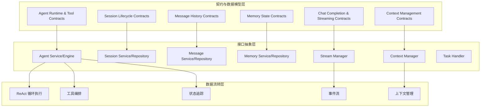
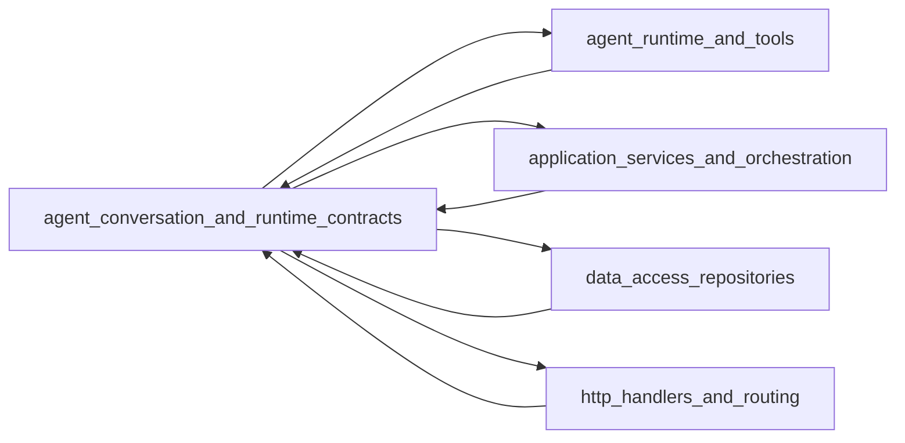

# Agent Conversation and Runtime Contracts 模块

## 1. 概述

想象一个智能助手，它不仅能回答问题，还能：像侦探一样收集信息、像工程师一样调用工具、像记账员一样记住每一步操作。`agent_conversation_and_runtime_contracts` 模块就是这个智能助手的"神经系统"——它定义了所有智能体运行时的核心契约、数据结构和接口协议，让整个系统的各个组件能够像一个有机整体一样协同工作。

这个模块解决的核心问题是：**如何在一个复杂的 AI 系统中，以统一、一致、可扩展的方式定义智能体的行为、对话流程、工具调用、状态管理和内存机制？** 它不直接实现业务逻辑，而是提供了一套"共同语言"，让系统的不同部分能够互相理解和协作。

## 2. 架构设计



### 架构解析

这个模块采用了**分层契约设计**，从底层到顶层可以分为三个层次：

1. **数据模型层**：定义核心数据结构（如 `AgentState`、`Message`、`ChatResponse`）
2. **接口抽象层**：定义服务契约（如 `AgentService`、`SessionService`）
3. **交互流程层**：通过数据结构和接口定义系统的交互模式

### 核心数据流向

以一个典型的智能体问答流程为例：

1. **会话初始化**：通过 `SessionService` 创建会话，`ContextManager` 初始化上下文
2. **消息处理**：用户消息通过 `MessageService` 存储，同时添加到 `ContextManager`
3. **智能体执行**：`AgentEngine` 启动 ReAct 循环
   - **思考阶段**：生成 `AgentStep.Thought`
   - **行动阶段**：执行 `ToolCall`，产生 `ToolResult`
   - **观察阶段**：收集结果，更新 `AgentState`
4. **流式输出**：通过 `StreamManager` 发送 `StreamEvent`
5. **记忆存储**：完成后通过 `MemoryService` 保存交互记忆

## 3. 核心设计决策

### 3.1 契约优先设计

**决策**：将所有核心概念定义为接口和数据结构，而不是具体实现

**原因**：
- 系统需要支持多种实现方式（如不同的 AgentEngine、不同的 StreamManager 后端）
- 便于测试（可以轻松创建 Mock 实现）
- 降低模块间耦合，每个组件只依赖契约而非实现

**权衡**：
- ✅ 优点：灵活性高、可测试性强、演进路径清晰
- ❌ 缺点：代码量增加，初期学习曲线稍陡

### 3.2 分层配置模型

**决策**：采用 `AgentConfig`（租户级）+ `SessionAgentConfig`（会话级）的分层配置

**原因**：
- 租户级配置提供默认值和安全控制（如允许的工具列表）
- 会话级配置允许用户自定义（如是否启用 Web 搜索）
- 避免在每个会话中重复存储完整配置

**关键实现**：
```go
// 租户级完整配置
type AgentConfig struct {
    MaxIterations     int
    ReflectionEnabled bool
    AllowedTools      []string
    // ... 更多配置
}

// 会话级轻量配置
type SessionAgentConfig struct {
    AgentModeEnabled bool
    WebSearchEnabled bool
    KnowledgeBases   []string
    // 只存储差异化配置
}
```

### 3.3 渐进式披露（Progressive Disclosure）模式

**决策**：在 Agent 配置中引入 `SkillsEnabled`、`AllowedSkills` 等字段

**原因**：
- 不是所有用户都需要技能功能，默认关闭可以降低认知负担
- 通过白名单机制控制可用技能，提高安全性
- 为未来的功能扩展预留空间

### 3.4 上下文与存储分离

**决策**：`ContextManager` 管理 LLM 上下文，`MessageService` 管理持久化存储

**原因**：
- LLM 上下文有 token 限制，需要压缩和裁剪
- 历史消息需要完整保存用于审计和回溯
- 两者的访问模式和性能要求完全不同

**实现细节**：
- `ContextManager` 提供 `CompressionStrategy` 接口支持不同的压缩策略
- `Message` 结构体中的 `AgentSteps` 字段存储但不参与 LLM 上下文

### 3.5 事件驱动的流式输出

**决策**：通过 `StreamManager` 接口统一管理所有流式输出

**原因**：
- 支持多种输出类型（思考、工具调用、结果、引用等）
- 便于实现不同的后端（内存、Redis 等）
- 统一的事件模型让前端处理更简单

## 4. 核心组件解析

### 4.1 ReAct 循环模型

**核心概念**：Reasoning（思考）→ Acting（行动）→ Observing（观察）的循环

**关键数据结构**：

```go
// AgentStep 代表 ReAct 循环的一次迭代
type AgentStep struct {
    Iteration int        // 迭代次数（0 索引）
    Thought   string     // LLM 的推理过程（思考阶段）
    ToolCalls []ToolCall // 本步骤调用的工具（行动阶段）
    Timestamp time.Time  // 时间戳
}

// ToolCall 代表一次工具调用
type ToolCall struct {
    ID         string                 // 工具调用 ID
    Name       string                 // 工具名称
    Args       map[string]interface{} // 工具参数
    Result     *ToolResult            // 执行结果
    Reflection string                 // 对结果的反思
    Duration   int64                  // 执行耗时（毫秒）
}

// AgentState 跟踪整个执行过程
type AgentState struct {
    CurrentRound  int             // 当前轮次
    RoundSteps    []AgentStep     // 所有执行步骤
    IsComplete    bool            // 是否完成
    FinalAnswer   string          // 最终答案
    KnowledgeRefs []*SearchResult // 收集的知识引用
}
```

**设计意图**：
- 每个步骤都完整记录思考、行动和结果，便于调试和回溯
- `Reflection` 字段支持智能体对自己的行为进行反思
- `AgentState` 可以随时序列化和恢复，支持中断和续作

### 4.2 工具契约系统

**核心接口**：

```go
type Tool interface {
    Name() string                 // 工具唯一标识
    Description() string          // 工具描述（用于 LLM 理解）
    Parameters() json.RawMessage  // JSON Schema 定义参数
    Execute(ctx context.Context, args json.RawMessage) (*ToolResult, error)
}
```

**设计亮点**：
- 自描述性：工具通过 `Description` 和 `Parameters` 告诉 LLM 如何使用自己
- 统一返回格式：`ToolResult` 包含结构化数据和人类可读输出
- 上下文传递：`Execute` 接收 `context.Context`，支持超时和链路追踪

### 4.3 消息与历史模型

**核心数据结构**：

```go
// Message 代表一条对话消息
type Message struct {
    ID                    string              // 唯一标识
    SessionID             string              // 所属会话
    Content               string              // 消息内容
    Role                  string              // "user"、"assistant"、"system"
    KnowledgeReferences   References          // 知识引用
    AgentSteps            AgentSteps          // Agent 执行步骤（仅 Assistant）
    MentionedItems        MentionedItems      // @提及的项目（仅 User）
    IsCompleted           bool                // 是否已完成
}

// History 代表历史对话条目
type History struct {
    Query               string     // 用户查询
    Answer              string     // 系统回答
    CreateAt            time.Time  // 创建时间
    KnowledgeReferences References // 使用的知识引用
}
```

**设计细节**：
- `AgentSteps` 存储但不参与 LLM 上下文（避免冗余）
- `MentionedItems` 支持用户显式 @提及知识库或文件
- `IsCompleted` 标志支持流式输出的状态追踪

### 4.4 上下文管理

**核心接口**：

```go
type ContextManager interface {
    AddMessage(ctx context.Context, sessionID string, message chat.Message) error
    GetContext(ctx context.Context, sessionID string) ([]chat.Message, error)
    ClearContext(ctx context.Context, sessionID string) error
    GetContextStats(ctx context.Context, sessionID string) (*ContextStats, error)
    SetSystemPrompt(ctx context.Context, sessionID string, systemPrompt string) error
}

type CompressionStrategy interface {
    Compress(ctx context.Context, messages []chat.Message, maxTokens int) ([]chat.Message, error)
    EstimateTokens(messages []chat.Message) int
}
```

**设计意图**：
- 独立于存储的上下文管理，专注于 LLM token 限制
- 可插拔的压缩策略（滑动窗口、智能摘要等）
- `ContextStats` 提供监控和调试信息

### 4.5 记忆系统契约

**核心概念**：将对话历史提取为可检索的记忆

**数据结构**：

```go
// Episode 代表一次完整的交互事件
type Episode struct {
    ID        string
    UserID    string
    SessionID string
    Summary   string    // 交互摘要
    CreatedAt time.Time
}

// MemoryContext 代表检索到的记忆上下文
type MemoryContext struct {
    RelatedEpisodes []Episode
    RelatedEntities []Entity
    RelatedRelations []Relationship
}
```

**接口设计**：

```go
type MemoryService interface {
    AddEpisode(ctx context.Context, userID string, sessionID string, messages []types.Message) error
    RetrieveMemory(ctx context.Context, userID string, query string) (*types.MemoryContext, error)
}
```

**设计亮点**：
- 分离服务层和存储层，便于不同的后端实现
- 不仅存储对话，还提取实体和关系，支持更智能的记忆检索

### 4.6 流式事件系统

**核心概念**：通过统一的事件模型支持多种输出类型

**事件类型**：

```go
type ResponseType string

const (
    ResponseTypeAnswer      ResponseType = "answer"
    ResponseTypeReferences  ResponseType = "references"
    ResponseTypeThinking    ResponseType = "thinking"
    ResponseTypeToolCall    ResponseType = "tool_call"
    ResponseTypeToolResult  ResponseType = "tool_result"
    ResponseTypeReflection  ResponseType = "reflection"
    ResponseTypeComplete    ResponseType = "complete"
    // ... 更多类型
)
```

**StreamManager 接口**：

```go
type StreamManager interface {
    AppendEvent(ctx context.Context, sessionID, messageID string, event StreamEvent) error
    GetEvents(ctx context.Context, sessionID, messageID string, fromOffset int) ([]StreamEvent, int, error)
}
```

**设计意图**：
- 最小化接口设计，只提供追加和读取
- 支持增量读取（通过 `fromOffset`）
- 所有类型的输出都通过统一的事件模型

## 5. 子模块概览

本模块包含以下子模块，每个子模块负责特定领域的契约定义：

| 子模块 | 职责 | 文档链接 |
|--------|------|----------|
| Agent Runtime & Tool Call Contracts | 智能体运行时状态、工具调用契约、Agent 服务接口 | [core_domain_types_and_interfaces-agent_conversation_and_runtime_contracts-agent_runtime_and_tool_call_contracts.md](core_domain_types_and_interfaces-agent_conversation_and_runtime_contracts-agent_runtime_and_tool_call_contracts.md) |
| Chat Completion & Streaming Contracts | 聊天响应、流式输出、工具调用契约 | [core_domain_types_and_interfaces-agent_conversation_and_runtime_contracts-chat_completion_and_streaming_contracts.md](core_domain_types_and_interfaces-agent_conversation_and_runtime_contracts-chat_completion_and_streaming_contracts.md) |
| Session Lifecycle & Conversation Controls | 会话管理、摘要配置、对话控制契约 | [core_domain_types_and_interfaces-agent_conversation_and_runtime_contracts-session_lifecycle_and_conversation_controls_contracts.md](core_domain_types_and_interfaces-agent_conversation_and_runtime_contracts-session_lifecycle_and_conversation_controls_contracts.md) |
| Message History & Mentions Contracts | 消息实体、历史记录、提及项目契约 | [core_domain_types_and_interfaces-agent_conversation_and_runtime_contracts-message_history_and_mentions_contracts.md](core_domain_types_and_interfaces-agent_conversation_and_runtime_contracts-message_history_and_mentions_contracts.md) |
| Memory State & Storage Contracts | 记忆状态、Episode 模型、存储契约 | [core_domain_types_and_interfaces-agent_conversation_and_runtime_contracts-memory_state_and_storage_contracts.md](core_domain_types_and_interfaces-agent_conversation_and_runtime_contracts-memory_state_and_storage_contracts.md) |
| Context Management & Compression Contracts | 上下文管理、压缩策略、统计信息契约 | [core_domain_types_and_interfaces-agent_conversation_and_runtime_contracts-context_management_and_compression_contracts.md](core_domain_types_and_interfaces-agent_conversation_and_runtime_contracts-context_management_and_compression_contracts.md) |

## 6. 跨模块依赖关系

### 6.1 依赖关系图



### 6.2 关键交互

1. **与 agent_runtime_and_tools 模块**：
   - 本模块定义 `Tool` 接口和 `AgentEngine` 接口
   - agent_runtime_and_tools 实现这些接口
   - 两者通过 `AgentConfig`、`AgentState` 等数据结构传递信息

2. **与 application_services_and_orchestration 模块**：
   - 本模块定义 `SessionService`、`AgentService` 等服务接口
   - application_services_and_orchestration 实现这些服务
   - `ChatManage` 结构在两者之间传递管道状态

3. **与 data_access_repositories 模块**：
   - 本模块定义 `SessionRepository`、`MessageRepository` 等仓储接口
   - data_access_repositories 实现这些仓储
   - 数据结构（如 `Session`、`Message`）实现了 `driver.Valuer` 和 `sql.Scanner` 用于数据库序列化

4. **与 http_handlers_and_routing 模块**：
   - 本模块定义 `ChatResponse`、`StreamResponse` 等 API 契约
   - http_handlers_and_routing 使用这些契约进行 HTTP 响应
   - `StreamManager` 接口支持 SSE 流式输出

## 7. 实战指南

### 7.1 实现自定义 AgentEngine

如果你需要实现自定义的智能体执行引擎：

```go
type MyAgentEngine struct {
    config *types.AgentConfig
    // 你的依赖
}

func (e *MyAgentEngine) Execute(
    ctx context.Context,
    sessionID, messageID, query string,
    llmContext []chat.Message,
) (*types.AgentState, error) {
    // 1. 初始化状态
    state := &types.AgentState{
        CurrentRound: 0,
        RoundSteps:   make([]types.AgentStep, 0),
        IsComplete:   false,
    }
    
    // 2. ReAct 循环
    for state.CurrentRound < e.config.MaxIterations {
        // 思考阶段
        thought, toolCalls := e.think(ctx, query, llmContext, state)
        
        // 行动阶段
        for _, toolCall := range toolCalls {
            result, err := e.executeTool(ctx, toolCall)
            if err != nil {
                // 处理错误
            }
            toolCall.Result = result
        }
        
        // 记录步骤
        step := types.AgentStep{
            Iteration: state.CurrentRound,
            Thought:   thought,
            ToolCalls: toolCalls,
            Timestamp: time.Now(),
        }
        state.RoundSteps = append(state.RoundSteps, step)
        
        // 检查是否完成
        if e.isComplete(state) {
            state.IsComplete = true
            state.FinalAnswer = e.extractAnswer(state)
            break
        }
        
        state.CurrentRound++
    }
    
    return state, nil
}
```

### 7.2 实现自定义 ContextCompressionStrategy

```go
type MyCompressionStrategy struct{}

func (s *MyCompressionStrategy) Compress(
    ctx context.Context,
    messages []chat.Message,
    maxTokens int,
) ([]chat.Message, error) {
    // 1. 估算 token
    tokens := s.EstimateTokens(messages)
    if tokens <= maxTokens {
        return messages, nil
    }
    
    // 2. 你的压缩逻辑
    // 例如：保留系统消息和最近 N 条消息，压缩中间消息
    
    return compressedMessages, nil
}

func (s *MyCompressionStrategy) EstimateTokens(messages []chat.Message) int {
    // 你的 token 估算逻辑
    return estimatedTokens
}
```

### 7.3 常见使用模式

**创建 Agent 配置**：

```go
config := &types.AgentConfig{
    MaxIterations:     10,
    ReflectionEnabled: true,
    AllowedTools:      []string{"search", "calculate", "web_fetch"},
    Temperature:       0.7,
    WebSearchEnabled:  true,
    MultiTurnEnabled:  true,
    HistoryTurns:      5,
    SkillsEnabled:     true,
}
```

**使用 StreamManager 发送事件**：

```go
streamManager.AppendEvent(ctx, sessionID, messageID, types.StreamEvent{
    ID:        eventID,
    Type:      types.ResponseTypeThinking,
    Content:   "我需要搜索相关信息...",
    Done:      false,
    Timestamp: time.Now(),
})
```

## 8. 注意事项与陷阱

### 8.1 配置管理的向后兼容

**注意**：`AgentConfig` 中有一些字段标记为 Deprecated（如 `SystemPromptWebEnabled`），通过 `ResolveSystemPrompt` 方法处理兼容性。

**陷阱**：直接使用这些弃用字段可能导致行为不一致。

**建议**：始终使用 `ResolveSystemPrompt` 方法获取系统提示词。

### 8.2 上下文与存储的区别

**注意**：`ContextManager` 和 `MessageService` 是两个独立的系统。

**陷阱**：只更新其中一个而不同步另一个。

**建议**：
- 消息到达时：先通过 `MessageService` 持久化，再通过 `ContextManager` 添加到上下文
- 清除上下文时：不要同时删除历史消息

### 8.3 工具参数的 JSON Schema

**注意**：`Tool.Parameters()` 返回 JSON Schema，LLM 使用这个 Schema 生成正确的参数。

**陷阱**：Schema 定义不正确会导致 LLM 生成的参数无法解析。

**建议**：
- 仔细定义 JSON Schema，包含必要的验证规则
- 在 `Execute` 方法中再次验证参数，不要完全依赖 LLM

### 8.4 流式事件的顺序

**注意**：`StreamManager.AppendEvent` 是追加操作，事件顺序很重要。

**陷阱**：并发调用可能导致事件顺序错乱。

**建议**：
- 对于同一个会话和消息，确保事件按顺序追加
- 使用 `ID` 字段在前端重新排序（如果需要）

### 8.5 数据库序列化

**注意**：很多数据结构实现了 `driver.Valuer` 和 `sql.Scanner` 接口。

**陷阱**：修改这些结构时忘记更新序列化逻辑。

**建议**：
- 添加新字段后，确认 JSON 序列化行为符合预期
- 考虑数据库迁移策略（如果字段有兼容性问题）

## 9. 总结

`agent_conversation_and_runtime_contracts` 模块是整个系统的"骨架"和"神经系统"。它不直接实现业务逻辑，但定义了所有核心概念的交互方式。通过契约优先的设计，它为系统提供了：

- **一致性**：所有组件使用相同的数据结构和接口
- **灵活性**：可以轻松替换实现而不影响其他部分
- **可测试性**：基于接口的设计便于创建 Mock 实现
- **演进性**：清晰的分层和契约使系统更容易演进

理解这个模块的设计思想，是理解整个系统的关键。当你需要扩展系统功能时，先想想：这个功能应该定义什么样的契约？应该放在哪个层次？如何与现有概念协同？
