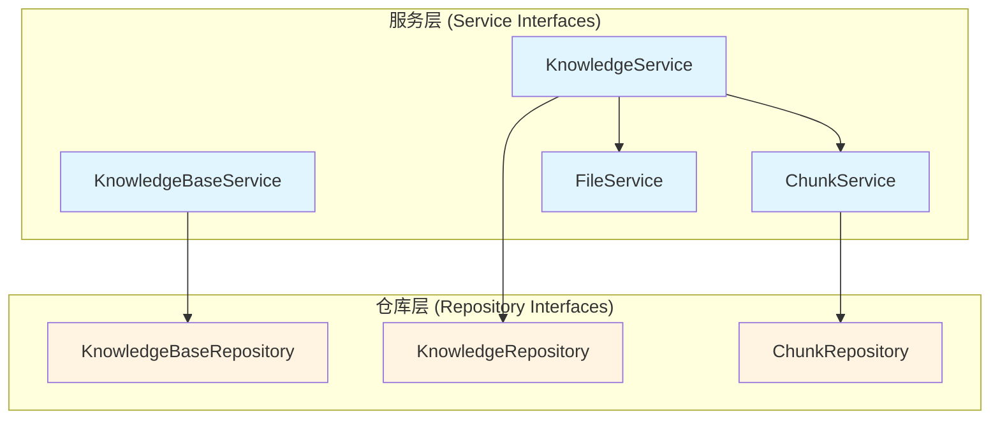

# 内容服务与仓库接口 (content_service_and_repository_interfaces)

## 概述

想象一下，你正在构建一个图书馆管理系统。你需要管理书架（知识库）、图书（知识内容）、图书章节（知识块），以及图书的实际存储位置。这个模块就像是这个图书馆系统的"契约蓝图"——它不负责实际的书架建造、图书搬运或章节划分，而是定义了**应该如何**与这些资源交互的标准接口。

这个模块是整个系统的**核心抽象层**，它通过接口定义将业务逻辑与具体实现解耦，使得：
- 业务逻辑可以专注于"做什么"而不是"怎么做"
- 不同的存储后端（数据库、文件系统、云存储）可以互换使用
- 测试变得更加简单（可以轻松 mock 这些接口）

## 架构概览



这个模块采用了经典的**分层架构**，通过服务层和仓库层的分离实现关注点分离：

1. **服务层**：提供面向业务的高级操作接口，处理权限、租户隔离、异步任务编排等业务逻辑
2. **仓库层**：提供面向数据持久化的低级操作接口，专注于数据的增删改查

数据流向通常是：
- 上层应用 → 服务层 → 仓库层 → 实际存储
- 实际存储 → 仓库层 → 服务层 → 上层应用

## 核心组件详解

### 1. KnowledgeBaseService & KnowledgeBaseRepository

**设计意图**：这对接口定义了知识库（Knowledge Base）的生命周期管理。知识库是知识内容的容器，就像图书馆中的书架。

**核心职责**：
- `KnowledgeBaseService`：提供创建、查询、更新、删除知识库的高级业务操作，包括混合搜索、知识库复制等功能
- `KnowledgeBaseRepository`：专注于知识库数据的持久化操作

**关键设计决策**：
- 接口中包含 `GetKnowledgeBaseByIDOnly` 方法，允许绕过租户过滤进行查询——这是为了支持跨租户的知识库共享场景，权限检查在服务层完成
- `FillKnowledgeBaseCounts` 方法用于填充知识库的统计信息（知识数量、块数量等），这表明统计信息可能不是实时计算的，而是需要显式填充

### 2. KnowledgeService & KnowledgeRepository

**设计意图**：这对接口管理知识内容（Knowledge）本身，就像管理图书馆中的图书。知识内容可以来自文件、URL、文本段落或手动编辑的 Markdown。

**核心职责**：
- `KnowledgeService`：处理知识的创建（从各种来源）、查询、更新、删除，以及FAQ管理、知识库克隆等高级功能
- `KnowledgeRepository`：专注于知识数据的持久化操作

**关键设计决策**：
- 提供了多种创建知识的方法（`CreateKnowledgeFromFile`、`CreateKnowledgeFromURL`、`CreateKnowledgeFromPassage` 等），这反映了系统支持多种知识来源的设计目标
- 包含多个 `Process*` 方法用于处理异步任务（文档处理、FAQ导入、问题生成等），这表明系统将耗时操作放在后台执行
- `CheckKnowledgeExists` 方法用于避免重复导入，通过文件哈希、URL等进行去重

### 3. ChunkService & ChunkRepository

**设计意图**：这对接口管理知识块（Chunk）——知识内容被分割成的小片段，用于语义搜索。就像把图书分成章节，方便读者快速定位相关内容。

**核心职责**：
- `ChunkService`：提供知识块的增删改查操作，以及生成问题删除等高级功能
- `ChunkRepository`：专注于知识块数据的持久化操作

**关键设计决策**：
- `ListPagedChunksByKnowledgeID` 方法非常复杂，支持按类型、标签、关键词、搜索字段、排序顺序等多种条件过滤——这反映了知识块查询的多样化需求
- 区分了 FAQ 类型和文档（manual）类型的知识块，它们有不同的排序和搜索行为
- 提供了 `FAQChunkDiff` 方法用于比较两个知识库中的 FAQ 块差异，支持知识库同步
- 包含批量操作方法（`UpdateChunkFlagsBatch`、`UpdateChunkFieldsByTagID`）以提高性能

### 4. FileService

**设计意图**：这个接口定义了文件存储的标准操作，是系统与实际存储介质（本地文件系统、云存储等）之间的抽象层。

**核心职责**：
- 保存文件（从上传的文件或字节数据）
- 检索文件（获取文件内容或下载URL）
- 删除文件

**关键设计决策**：
- `SaveBytes` 方法支持 `temp` 参数，允许将文件保存到可能自动过期的临时存储——这用于处理中间文件
- `GetFileURL` 方法是可选的（"if supported by the storage backend"），这表明不是所有存储后端都支持生成直接访问URL

## 设计决策与权衡

### 1. 接口与实现分离

**选择**：定义清晰的接口契约，将实现细节隐藏在接口背后

**原因**：
- 支持多种存储后端的切换（例如从本地数据库切换到云数据库）
- 简化单元测试（可以轻松 mock 这些接口）
- 使代码更加模块化，降低耦合度

**权衡**：
- 增加了代码的抽象层次，可能让新手难以理解
- 需要维护接口和实现两套代码

### 2. 租户隔离设计

**选择**：在仓库层方法中显式传递 `tenantID` 参数，同时提供绕过租户过滤的方法（如 `GetKnowledgeBaseByIDOnly`）

**原因**：
- 确保数据安全，防止租户之间的数据泄露
- 支持知识库共享等跨租户场景

**权衡**：
- 需要在每个方法中传递和验证 `tenantID`，增加了代码复杂度
- 绕过租户过滤的方法需要非常小心地使用，必须在服务层进行权限检查

### 3. 同步与异步操作并存

**选择**：同时提供同步和异步操作方法（例如 `CreateKnowledgeFromPassage` 和 `CreateKnowledgeFromPassageSync`）

**原因**：
- 同步操作提供即时反馈，适合快速操作
- 异步操作处理耗时任务，避免阻塞用户界面

**权衡**：
- 增加了接口的复杂性
- 需要额外的机制来跟踪异步任务的进度（如 `GetFAQImportProgress`）

### 4. 丰富的查询方法

**选择**：提供大量细粒度的查询方法，而不是少数几个通用方法

**原因**：
- 每个方法都有明确的用途，代码可读性更好
- 可以针对特定查询进行性能优化

**权衡**：
- 接口变得庞大，维护成本增加
- 实现者需要实现很多方法

## 依赖关系与数据流

### 依赖关系

这个模块是整个系统的**核心抽象层**，它不依赖于其他具体实现模块，而是被其他模块依赖：

- **被依赖**：[application_services_and_orchestration](../application_services_and_orchestration.md) 模块中的服务实现会实现这些接口
- **被依赖**：[data_access_repositories](../data_access_repositories.md) 模块中的仓库实现会实现这些接口
- **依赖**：使用了 `internal/types` 包中的数据模型
- **依赖**：使用了 `github.com/hibiken/asynq` 用于异步任务处理

### 典型数据流

#### 1. 知识创建流程

```
用户上传文件 
  → HTTP Handler 
    → KnowledgeService.CreateKnowledgeFromFile
      → FileService.SaveFile (保存文件)
      → KnowledgeRepository.CreateKnowledge (保存知识元数据)
      → 提交异步任务 (Asynq)
        → KnowledgeService.ProcessDocument (异步处理)
          → 文档解析
          → ChunkService.CreateChunks (创建知识块)
          → 向量化索引
```

#### 2. 知识搜索流程

```
用户搜索查询
  → HTTP Handler
    → KnowledgeBaseService.HybridSearch
      → 向量检索 + 关键词检索
      → 结果融合与排序
      → 返回搜索结果
```

## 使用指南与注意事项

### 对于服务实现者

1. **租户隔离**：始终在服务层验证租户权限，不要依赖仓库层的过滤来保证安全
2. **错误处理**：定义清晰的错误类型，让调用者能够区分不同的错误情况（如未找到、权限不足、验证失败等）
3. **异步任务**：实现 `Process*` 方法时，确保任务是幂等的，因为任务可能会被重试
4. **事务管理**：当多个操作需要原子执行时，使用事务（虽然接口中没有显式定义事务）

### 对于仓库实现者

1. **性能优化**：针对 `ListPaged*` 等查询方法进行索引优化，这些方法可能会被频繁调用
2. **批量操作**：高效实现批量操作方法（如 `UpdateChunks`、`DeleteChunks`），避免循环执行单条操作
3. **数据完整性**：实现外键约束或应用级别的完整性检查，确保数据一致性
4. **租户过滤**：在仓库层始终应用租户过滤，除非方法名明确表示不使用（如 `*Only` 方法）

### 常见陷阱

1. **绕过租户过滤**：使用 `*Only` 方法时必须非常小心，确保在服务层进行了适当的权限检查
2. **忽略分页**：`ListPaged*` 方法返回大量数据时，必须使用分页，否则可能导致内存问题
3. **异步任务状态**：提交异步任务后，不要假设任务会立即完成或成功完成，需要提供进度查询和错误处理机制
4. **文件存储清理**：删除知识时，记得同时删除关联的文件，否则会造成存储空间浪费

## 总结

`content_service_and_repository_interfaces` 模块是整个知识管理系统的**核心契约层**，它通过定义清晰的接口，实现了业务逻辑与数据持久化的解耦。这个模块的设计体现了以下几个关键原则：

1. **接口驱动设计**：依赖抽象而不依赖具体实现
2. **分层架构**：服务层处理业务逻辑，仓库层处理数据持久化
3. **租户优先**：从设计之初就考虑多租户隔离
4. **同步异步结合**：提供灵活的操作模式以适应不同场景

理解这个模块的关键是理解它的**抽象本质**——它不做实际的工作，而是定义了**应该如何工作**的标准。这种设计使得系统具有极高的灵活性和可扩展性，同时也为测试和维护带来了便利。
