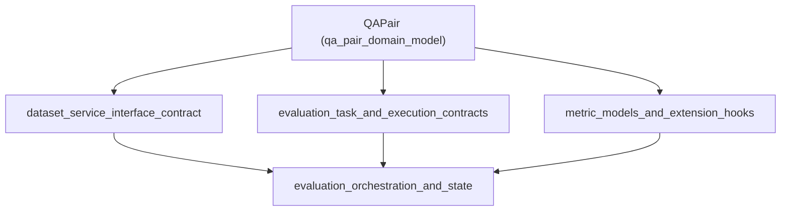

# qa_pair_domain_model 模块技术深度文档

## 1. 模块概述

`qa_pair_domain_model` 模块是系统中用于表示问答对（Question-Answer Pair）数据结构的核心领域模型。它解决了评估数据集管理中的基础数据表示问题，为整个评估系统提供了标准化的问答数据容器。

想象一下，这个模块就像图书馆中的标准化卡片目录——每张卡片都包含了问题、相关参考资料和标准答案的完整信息，使得研究人员可以系统地组织、检索和评估问答系统的性能。

## 2. 核心组件详解

### QAPair 结构体

`QAPair` 是这个模块的核心，也是整个评估数据集的基础构建块。

```go
type QAPair struct {
    QID      int      // Question ID
    Question string   // Question text
    PIDs     []int    // Related passage IDs
    Passages []string // Passage texts
    AID      int      // Answer ID
    Answer   string   // Answer text
}
```

#### 设计意图

这个结构体的设计体现了几个关键的设计决策：

1. **完整性原则**：每个 `QAPair` 实例都包含了一个问答示例所需的全部信息，从问题到相关段落再到标准答案，形成了一个自包含的数据单元。

2. **双重标识机制**：同时使用数字ID（QID、AID、PIDs）和文本内容（Question、Answer、Passages），既支持高效的数据库索引和关联，又保证了数据的自解释性和可移植性。

3. **多段落支持**：通过 `PIDs` 和 `Passages` 切片，允许一个问题关联多个参考段落，这反映了真实世界中复杂问题往往需要多个信息源来回答的现实。

#### 字段说明

- **QID**: 问题的唯一标识符，用于在数据集中准确定位和引用特定问题。
- **Question**: 问题的文本内容，是评估的核心输入。
- **PIDs**: 相关段落的ID列表，与 `Passages` 一一对应，建立了段落内容与外部资源的关联。
- **Passages**: 相关段落的文本内容，为回答问题提供上下文信息。
- **AID**: 答案的唯一标识符，用于标准化答案引用。
- **Answer**: 标准答案的文本内容，作为评估模型输出质量的基准。

## 3. 数据流动与依赖关系

### 模块在系统中的位置

`qa_pair_domain_model` 位于系统的领域模型层，作为评估数据的基础表示：



### 数据流动路径

1. **数据集创建**：在 [dataset_service_interface_contract](core_domain_types_and_interfaces-evaluation_dataset_and_metric_contracts-dataset_service_interface_contract.md) 中，`QAPair` 作为数据集的基本单元被创建和组织。

2. **评估执行**：在 [evaluation_task_and_execution_contracts](core_domain_types_and_interfaces-evaluation_dataset_and_metric_contracts-evaluation_task_and_execution_contracts.md) 中，`QAPair` 被传递给评估引擎，作为评估的输入和基准。

3. **指标计算**：在 [metric_models_and_extension_hooks](core_domain_types_and_interfaces-evaluation_dataset_and_metric_contracts-metric_models_and_extension_hooks.md) 中，`QAPair` 的标准答案与模型输出进行比较，计算各种评估指标。

## 4. 设计决策与权衡

### 1. 自包含 vs 引用分离

**决策**：同时包含ID和文本内容。

**权衡分析**：
- ✅ **优点**：数据自包含，便于调试和独立使用；无需额外查询即可获取完整信息。
- ⚠️ **缺点**：存在数据冗余；如果段落内容更新，需要同步更新所有相关的 `QAPair`。

**设计理由**：在评估场景中，数据的一致性和可复现性比存储空间更重要。通过同时包含ID和内容，确保了评估结果的可复现性，即使原始数据源发生变化。

### 2. 多个段落 vs 单个段落

**决策**：支持多个相关段落。

**权衡分析**：
- ✅ **优点**：更符合真实世界场景，复杂问题往往需要多个信息源；支持评估模型的多文档推理能力。
- ⚠️ **缺点**：增加了数据结构的复杂性；在某些简单场景下可能过度设计。

**设计理由**：考虑到系统的长期发展和评估需求的多样性，支持多段落关联提供了更大的灵活性，能够适应从简单问答到复杂多跳推理的各种评估场景。

### 3. 结构体 vs 接口

**决策**：使用具体结构体而非接口。

**权衡分析**：
- ✅ **优点**：简单直接，性能好；易于序列化和反序列化；明确的数据结构定义。
- ⚠️ **缺点**：灵活性较低，扩展时需要修改结构体定义。

**设计理由**：`QAPair` 作为核心数据模型，其结构相对稳定，使用结构体提供了清晰的契约和更好的性能，符合领域模型的设计原则。

## 5. 使用指南与最佳实践

### 基本用法

```go
// 创建一个新的问答对
qaPair := &types.QAPair{
    QID:      1,
    Question: "什么是机器学习？",
    PIDs:     []int{101, 102},
    Passages: []string{
        "机器学习是人工智能的一个分支...",
        "机器学习算法可以分为监督学习、无监督学习..."
    },
    AID:      201,
    Answer:   "机器学习是人工智能的一个分支，使系统能够从经验中学习和改进...",
}
```

### 最佳实践

1. **ID一致性**：确保在整个数据集中，QID、AID和PID的唯一性和一致性，避免ID冲突导致的关联错误。

2. **段落同步**：维护 `PIDs` 和 `Passages` 切片的顺序一致性，确保ID与内容的正确对应。

3. **答案质量**：`Answer` 字段应该是权威、准确的标准答案，作为评估的基准，其质量直接影响评估结果的可信度。

4. **上下文完整性**：在 `Passages` 中提供足够的上下文信息，使问题能够基于这些段落得到合理回答。

## 6. 边缘情况与注意事项

### 常见陷阱

1. **空切片处理**：当没有相关段落时，`PIDs` 和 `Passages` 应该是空切片而非 nil，以保持一致性。

2. **ID溢出**：在大规模数据集中，注意 `int` 类型的溢出问题，特别是在32位系统上。

3. **文本编码**：确保 `Question`、`Passages` 和 `Answer` 字段使用统一的字符编码（推荐UTF-8），避免乱码问题。

### 隐式契约

1. **段落相关性**：虽然没有强制验证，但隐含假设 `Passages` 中的内容确实与 `Question` 相关，并且足以回答问题。

2. **答案可验证性**：隐含假设 `Answer` 可以基于 `Passages` 中的信息推导出来，这是评估检索增强生成系统的关键前提。

## 7. 扩展与演进方向

虽然当前的 `QAPair` 设计已经能够满足大多数评估场景，但未来可能的扩展方向包括：

1. **元数据支持**：添加元数据字段，如问题类型、难度级别、创建时间等。

2. **多语言支持**：扩展为支持多语言问答对，可能通过嵌套结构或映射实现。

3. **替代答案**：支持多个可接受的答案， recognizing that some questions may have multiple valid responses.

4. **证据标注**：添加段落中具体支持答案的证据片段标注，便于更精细的评估。

## 8. 相关模块参考

- [dataset_service_interface_contract](core_domain_types_and_interfaces-evaluation_dataset_and_metric_contracts-dataset_service_interface_contract.md)：定义了数据集服务的接口，使用 `QAPair` 作为基本数据单元。
- [evaluation_task_and_execution_contracts](core_domain_types_and_interfaces-evaluation_dataset_and_metric_contracts-evaluation_task_and_execution_contracts.md)：定义了评估任务和执行的契约，处理 `QAPair` 数据的评估流程。
- [metric_models_and_extension_hooks](core_domain_types_and_interfaces-evaluation_dataset_and_metric_contracts-metric_models_and_extension_hooks.md)：定义了评估指标模型，使用 `QAPair` 作为计算指标的基准。
