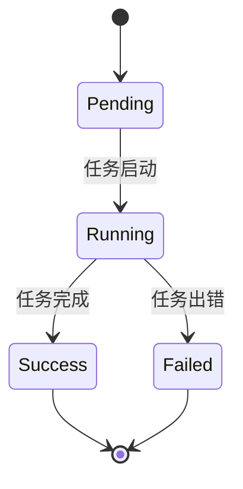
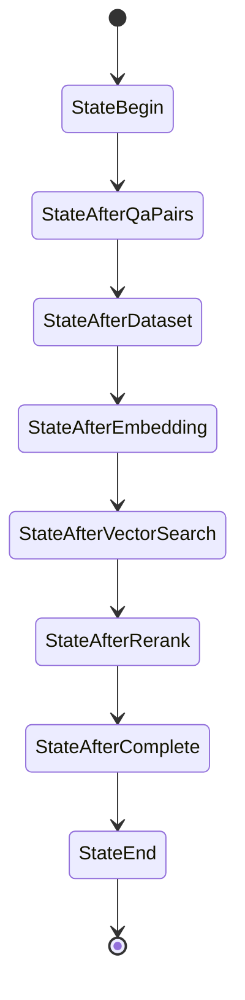
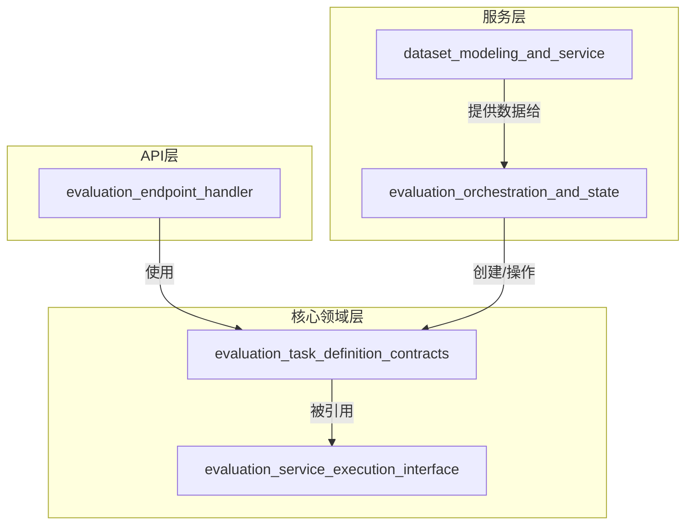
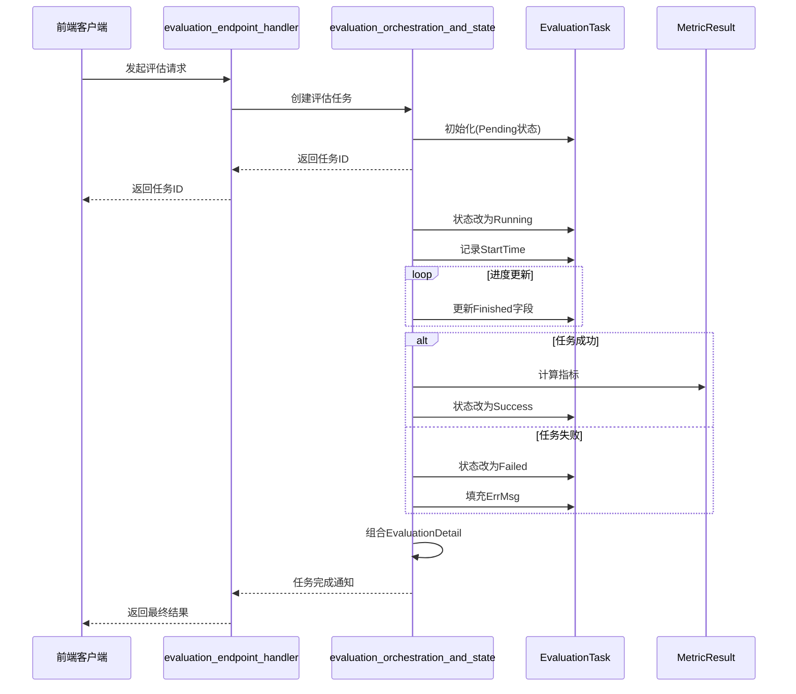

# evaluation_task_definition_contracts 模块技术深度解析

## 1. 模块概述

### 1.1 问题空间

在评估系统中，我们需要一个清晰、可序列化且可扩展的方式来定义和跟踪评估任务的状态。如果没有一个统一的契约，不同组件之间传递评估信息时会面临数据不一致、状态管理混乱和接口耦合度过高的问题。

想象一下：如果没有 `EvaluationTask` 这样的契约，当评估服务需要通知前端任务状态时，可能需要传递多个零散的参数（如任务ID、状态、进度等），这会导致：
- 参数列表过长，调用方容易出错
- 不同接口可能使用不同的字段名表示相同概念
- 状态转换逻辑分散在各处，难以维护
- 难以支持新的评估类型和指标

### 1.2 解决方案

`evaluation_task_definition_contracts` 模块提供了一套完整的领域模型和数据契约，用于标准化评估任务的定义、状态跟踪和结果表示。它就像评估系统的"通用语言"，确保所有相关组件对评估任务有一致的理解。

## 2. 核心概念与心智模型

### 2.1 核心抽象

这个模块的核心是**将评估任务建模为一个有状态的、可观察的实体**。我们可以把它想象成一个快递包裹：
- `EvaluationTask` 是包裹本身，包含了寄件人（租户）、目的地（数据集）、当前位置（状态）和进度信息
- `EvaluationStatue` 是包裹的物流状态（待发货、运输中、已签收、异常）
- `MetricResult` 是包裹的"质量检验报告"，包含了各项性能指标
- `EvalState` 是更细粒度的"处理步骤"，类似于包裹在物流中心的各个处理环节

### 2.2 状态机模型

评估任务的生命周期可以用一个简单的状态机来表示：



而 `EvalState` 则提供了更细粒度的执行阶段跟踪，让我们能够知道任务具体卡在哪个环节：



## 3. 核心组件深度解析

### 3.1 EvaluationTask 结构体

```go
type EvaluationTask struct {
    ID        string        `json:"id"`         // 唯一任务ID
    TenantID  uint64        `json:"tenant_id"`  // 租户/组织ID
    DatasetID string        `json:"dataset_id"` // 评估数据集ID
    StartTime time.Time     `json:"start_time"` // 任务开始时间
    Status    EvaluationStatue `json:"status"`    // 当前任务状态
    ErrMsg    string        `json:"err_msg,omitempty"` // 错误信息
    Total     int           `json:"total,omitempty"`   // 总评估项数
    Finished  int           `json:"finished,omitempty"` // 已完成项数
}
```

**设计意图**：
- 这个结构体是评估任务的"身份证"，包含了识别和跟踪任务所需的所有核心信息
- 使用 `omitempty` 标记可选字段，减少序列化后的JSON大小
- `ErrMsg` 字段只在失败时填充，避免正常情况下的冗余数据

**关键方法**：
```go
func (e *EvaluationTask) String() string {
    b, _ := json.Marshal(e)
    return string(b)
}
```
这个方法提供了方便的JSON序列化能力，便于日志记录和调试。

### 3.2 EvaluationStatue 枚举

```go
type EvaluationStatue int

const (
    EvaluationStatuePending EvaluationStatue = iota
    EvaluationStatueRunning
    EvaluationStatueSuccess
    EvaluationStatueFailed
)
```

**设计意图**：
- 使用整数枚举而非字符串，提高比较效率和类型安全性
- 采用标准的四状态模型，覆盖了任务生命周期的所有关键阶段
- 从0开始递增，便于将来扩展新状态

### 3.3 EvaluationDetail 结构体

```go
type EvaluationDetail struct {
    Task   *EvaluationTask `json:"task"`
    Params *ChatManage     `json:"params"`
    Metric *MetricResult   `json:"metric,omitempty"`
}
```

**设计意图**：
- 这是一个"组合"结构体，将任务信息、参数和结果聚合在一起
- 类似于"完整档案"，包含了理解一次评估所需的全部信息
- `Metric` 字段是可选的，因为在任务开始时可能还没有结果

**依赖关系**：
- 依赖 `ChatManage` 类型（来自 [agent_conversation_and_runtime_contracts](../core_domain_types_and_interfaces-agent_conversation_and_runtime_contracts.md)）
- 依赖 `MetricResult` 类型（定义在本模块）

### 3.4 MetricResult 及相关结构体

```go
type MetricResult struct {
    RetrievalMetrics  RetrievalMetrics  `json:"retrieval_metrics"`
    GenerationMetrics GenerationMetrics `json:"generation_metrics"`
}

type RetrievalMetrics struct {
    Precision float64 `json:"precision"`
    Recall    float64 `json:"recall"`
    NDCG3     float64 `json:"ndcg3"`
    NDCG10    float64 `json:"ndcg10"`
    MRR       float64 `json:"mrr"`
    MAP       float64 `json:"map"`
}

type GenerationMetrics struct {
    BLEU1  float64 `json:"bleu1"`
    BLEU2  float64 `json:"bleu2"`
    BLEU4  float64 `json:"bleu4"`
    ROUGE1 float64 `json:"rouge1"`
    ROUGE2 float64 `json:"rouge2"`
    ROUGEL float64 `json:"rougel"`
}
```

**设计意图**：
- 将检索指标和生成指标分离，反映了评估系统的两大核心功能
- 涵盖了信息检索和文本生成领域的标准指标
- 使用小写字段名的JSON标签，符合API设计的常见约定

### 3.5 EvalState 枚举

```go
type EvalState int

const (
    StateBegin EvalState = iota
    StateAfterQaPairs
    StateAfterDataset
    StateAfterEmbedding
    StateAfterVectorSearch
    StateAfterRerank
    StateAfterComplete
    StateEnd
)
```

**设计意图**：
- 提供比 `EvaluationStatue` 更细粒度的状态跟踪
- 每个状态对应评估流程的一个关键步骤
- 便于调试和性能分析，可以快速定位任务卡在哪个环节

## 4. 架构角色与数据流向

### 4.1 模块在系统中的位置

`evaluation_task_definition_contracts` 位于系统的 **核心领域层**，扮演着"数据契约"的角色。让我们通过一个架构图来理解它的位置和关系：



- **上游依赖**：[evaluation_service_execution_interface](../core_domain_types_and_interfaces-evaluation_dataset_and_metric_contracts-evaluation_task_and_execution_contracts-evaluation_service_execution_interface.md) 模块定义的服务接口会使用这些类型
- **下游消费者**：
  - [evaluation_orchestration_and_state](../application_services_and_orchestration-evaluation_dataset_and_metric_services-evaluation_orchestration_and_state.md) 服务会创建和操作 `EvaluationTask`
  - [evaluation_endpoint_handler](../http_handlers_and_routing-evaluation_and_web_search_handlers-evaluation_endpoint_handler.md) 会将这些类型序列化为JSON返回给前端

### 4.2 典型数据流

让我们通过一个序列图来展示评估任务的典型流程：



具体的数据流程如下：
1. **任务创建**：评估服务创建 `EvaluationTask` 实例，初始状态为 `Pending`
2. **任务启动**：状态变为 `Running`，记录 `StartTime`
3. **进度更新**：周期性更新 `Finished` 字段，反映任务进度
4. **状态转换**：
   - 成功时：状态变为 `Success`，填充 `MetricResult`
   - 失败时：状态变为 `Failed`，填充 `ErrMsg`
5. **结果聚合**：将 `EvaluationTask`、`ChatManage` 参数和 `MetricResult` 组合成 `EvaluationDetail`

## 5. 设计决策与权衡

### 5.1 使用结构体指针而非值

在 `EvaluationDetail` 中，所有字段都是指针类型：
```go
type EvaluationDetail struct {
    Task   *EvaluationTask `json:"task"`
    Params *ChatManage     `json:"params"`
    Metric *MetricResult   `json:"metric,omitempty"`
}
```

**决策**：使用指针
**原因**：
- 允许字段为 `nil`，更灵活地表示"不存在"的概念
- 避免大结构体的拷贝，提高性能
- 与 `omitempty` 结合使用，可以在序列化时省略空字段

**权衡**：
- ✅ 优点：灵活性高、性能好
- ⚠️ 缺点：需要注意空指针解引用的风险

### 5.2 两种状态枚举的设计

模块同时定义了 `EvaluationStatue`（粗粒度）和 `EvalState`（细粒度）两种状态枚举。

**决策**：分离粗粒度和细粒度状态
**原因**：
- `EvaluationStatue` 用于外部API和用户界面，简单易懂
- `EvalState` 用于内部调试和监控，提供更详细的执行信息
- 两者各司其职，避免了单一状态枚举过于复杂的问题

**权衡**：
- ✅ 优点：职责清晰，满足不同场景需求
- ⚠️ 缺点：需要维护两种状态之间的映射关系

### 5.3 全局 Jieba 实例

```go
var Jieba *gojieba.Jieba = gojieba.NewJieba()
```

**决策**：使用全局单例
**原因**：
- Jieba 分词器初始化开销大，全局共享可以避免重复初始化
- 分词器是线程安全的，可以在多个 goroutine 中共享使用

**权衡**：
- ✅ 优点：性能好，资源利用率高
- ⚠️ 缺点：
  - 增加了模块的隐式依赖
  - 使得测试时难以 mock
  - 没有提供关闭或清理的机制

**建议**：考虑使用依赖注入的方式，或者提供一个初始化函数和清理函数。

## 6. 使用指南与最佳实践

### 6.1 创建评估任务

```go
task := &types.EvaluationTask{
    ID:        "task-123",
    TenantID:  456,
    DatasetID: "dataset-789",
    StartTime: time.Now(),
    Status:    types.EvaluationStatuePending,
    Total:     100,
    Finished:  0,
}
```

### 6.2 状态转换

```go
// 启动任务
task.Status = types.EvaluationStatueRunning

// 更新进度
task.Finished = 50

// 完成任务
task.Status = types.EvaluationStatueSuccess
task.Finished = task.Total

// 或失败时
task.Status = types.EvaluationStatueFailed
task.ErrMsg = "connection timeout"
```

### 6.3 最佳实践

1. **始终检查状态转换的有效性**：
   ```go
   // 错误示例
   task.Status = types.EvaluationStatueSuccess
   task.Status = types.EvaluationStatueRunning // 不应该从成功回到运行中

   // 正确做法：添加状态转换验证
   func canTransition(from, to EvaluationStatue) bool {
       // 实现状态转换规则
   }
   ```

2. **避免直接修改结构体字段**：
   考虑添加方法来封装状态转换逻辑：
   ```go
   func (e *EvaluationTask) MarkFailed(errMsg string) {
       e.Status = EvaluationStatueFailed
       e.ErrMsg = errMsg
   }
   ```

3. **处理 nil 指针**：
   ```go
   // 错误示例
   detail.Metric.RetrievalMetrics.Precision = 0.8 // 如果 Metric 是 nil 会 panic

   // 正确做法
   if detail.Metric == nil {
       detail.Metric = &MetricResult{}
   }
   detail.Metric.RetrievalMetrics.Precision = 0.8
   ```

## 7. 注意事项与潜在陷阱

### 7.1 EvaluationStatue 的拼写错误

注意 `EvaluationStatue` 这个类型名拼写有误（应该是 Status），但由于已经在代码库中广泛使用，修复成本较高。

**影响**：
- 代码可读性稍差
- 可能让新开发者感到困惑

**建议**：
- 在文档中明确指出这个拼写问题
- 考虑在将来的重构中修复，但要确保向后兼容

### 7.2 线程安全性

`EvaluationTask` 结构体没有内置的同步机制，如果在多个 goroutine 中并发修改，可能会导致竞态条件。

**解决方案**：
```go
type SafeEvaluationTask struct {
    mu   sync.RWMutex
    task *EvaluationTask
}

func (s *SafeEvaluationTask) UpdateProgress(finished int) {
    s.mu.Lock()
    defer s.mu.Unlock()
    s.task.Finished = finished
}
```

### 7.3 JSON 序列化的一致性

注意 `String()` 方法忽略了序列化错误：
```go
func (e *EvaluationTask) String() string {
    b, _ := json.Marshal(e)
    return string(b)
}
```

在生产环境中，可能需要处理这个错误，或者使用更安全的序列化方式。

## 8. 相关模块与参考文档

- [evaluation_service_execution_interface](../core_domain_types_and_interfaces-evaluation_dataset_and_metric_contracts-evaluation_task_and_execution_contracts-evaluation_service_execution_interface.md)：评估服务接口定义
- [evaluation_orchestration_and_state](../application_services_and_orchestration-evaluation_dataset_and_metric_services-evaluation_orchestration_and_state.md)：评估编排服务
- [evaluation_endpoint_handler](../http_handlers_and_routing-evaluation_and_web_search_handlers-evaluation_endpoint_handler.md)：评估 HTTP 处理器
- [dataset_modeling_and_service](../application_services_and_orchestration-evaluation_dataset_and_metric_services-dataset_modeling_and_service.md)：数据集服务

## 9. 总结

`evaluation_task_definition_contracts` 模块是评估系统的基石，它提供了一套清晰、一致的数据契约，确保了不同组件之间能够可靠地交换评估信息。

这个模块的设计体现了几个重要的原则：
1. **关注点分离**：粗粒度和细粒度状态分离，检索和生成指标分离
2. **实用性优先**：虽然有一些小瑕疵（如拼写错误），但整体设计实用且高效
3. **可扩展性**：结构体设计考虑了将来的扩展，枚举值从0开始递增

对于新加入团队的开发者，理解这个模块的关键是：
- 把 `EvaluationTask` 看作评估任务的"身份证"
- 理解两种状态枚举的不同用途
- 注意线程安全和空指针处理
