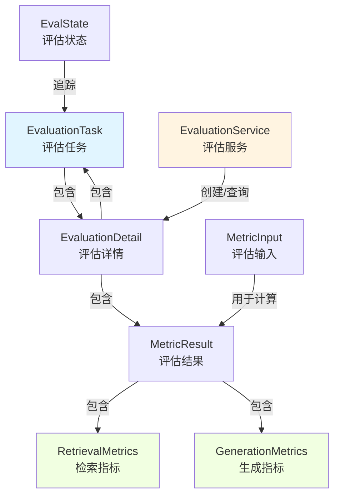

# 评估任务与执行契约 (Evaluation Task and Execution Contracts)

## 模块概述

想象一下，你是一位产品经理，刚刚部署了一个新的智能问答系统。你怎么知道它比旧版本更好？你如何量化"回答质量"的提升？这就是评估模块要解决的问题。

**evaluation_task_and_execution_contracts** 模块定义了评估系统的核心数据结构和契约，它是整个评估框架的"骨架"。这个模块不直接执行评估，而是为评估任务提供了标准化的表示方式、状态管理和交互接口。它的核心价值在于：

1. **统一契约**：为评估任务提供了标准化的定义，确保系统各组件对"评估"有一致的理解
2. **状态追踪**：管理评估任务的完整生命周期，从待处理、运行中到成功或失败
3. **数据契约**：定义了评估输入和输出的标准格式，支持检索质量和生成质量的双维度评估

## 架构总览



### 核心组件说明

1. **EvaluationTask**：评估任务的核心表示，记录任务的基本信息、状态和进度
2. **EvaluationDetail**：评估任务的完整视图，包含任务信息、参数和评估结果
3. **MetricInput**：指标计算的输入数据契约，定义了如何为检索和生成指标提供数据
4. **MetricResult**：评估结果的容器，包含检索质量和生成质量两大维度的指标
5. **EvaluationService**：评估服务的核心接口，定义了如何启动评估和获取结果

## 设计决策分析

### 1. 分离任务定义与执行细节

**决策**：将 `EvaluationTask` 和 `EvaluationDetail` 分为两个独立的结构

```go
type EvaluationTask struct {
    ID        string           // 任务标识
    TenantID  uint64           // 租户标识
    DatasetID string           // 数据集标识
    Status    EvaluationStatue // 任务状态
    // ... 其他字段
}

type EvaluationDetail struct {
    Task   *EvaluationTask // 任务信息
    Params *ChatManage     // 评估参数
    Metric *MetricResult   // 评估结果
}
```

**为什么这样设计？**
- **关注点分离**：`EvaluationTask` 专注于任务的基本信息和状态管理，而 `EvaluationDetail` 提供了任务的完整视图
- **灵活性**：在简单场景下只需 `EvaluationTask`，在需要详细信息时使用 `EvaluationDetail`
- **网络传输优化**：列表查询可以只返回轻量级的 `EvaluationTask`，详情页面再请求 `EvaluationDetail`

### 2. 双维度评估契约

**决策**：同时支持检索质量和生成质量评估

```go
type MetricResult struct {
    RetrievalMetrics  RetrievalMetrics  // 检索性能指标
    GenerationMetrics GenerationMetrics // 生成质量指标
}
```

**为什么这样设计？**
- **覆盖完整评估场景**：现代 RAG（检索增强生成）系统同时需要评估检索的准确性和生成的质量
- **可组合性**：可以根据需要只启用一种评估类型，或者同时使用两种
- **扩展性**：未来可以轻松添加新的评估维度（如推理质量、连贯性等）

### 3. 状态驱动的流程设计

**决策**：定义了详细的评估状态枚举和生命周期钩子

```go
type EvalState int

const (
    StateBegin        EvalState = iota // 评估开始
    StateAfterQaPairs                  // 加载 QA 对后
    StateAfterDataset                  // 处理数据集后
    StateAfterEmbedding                // 生成嵌入后
    StateAfterVectorSearch             // 向量搜索后
    StateAfterRerank                   // 重排序后
    StateAfterComplete                 // 完成后
    StateEnd                           // 评估结束
)
```

**为什么这样设计？**
- **可观察性**：可以精确追踪评估在每个阶段的进度和状态
- **可调试性**：当评估失败时，可以知道是在哪个阶段出了问题
- **钩子机制**：为 `EvalHook` 接口提供了明确的接入点，支持在评估的不同阶段插入自定义逻辑

### 4. 接口与实现分离

**决策**：通过 `EvaluationService` 接口定义契约，而不是具体实现

```go
type EvaluationService interface {
    // Evaluation 启动新的评估任务
    Evaluation(ctx context.Context, datasetID string, knowledgeBaseID string,
        chatModelID string, rerankModelID string) (*types.EvaluationDetail, error)
    // EvaluationResult 根据任务 ID 获取评估结果
    EvaluationResult(ctx context.Context, taskID string) (*types.EvaluationDetail, error)
}
```

**为什么这样设计？**
- **依赖倒置**：高层模块依赖接口而不是具体实现，降低了耦合度
- **可测试性**：可以轻松创建 `EvaluationService` 的 mock 实现进行单元测试
- **灵活性**：可以有多种实现方式（同步、异步、分布式等）而不改变使用方代码

## 数据流动分析

### 评估任务创建流程

```
请求发起
    ↓
EvaluationService.Evaluation()
    ↓
创建 EvaluationTask (状态: Pending)
    ↓
更新状态为 Running
    ↓
逐步执行评估流程 (StateBegin → StateAfterQaPairs → ... → StateEnd)
    ↓
更新状态为 Success 或 Failed
    ↓
返回 EvaluationDetail
```

### 指标计算数据流向

```
MetricInput
    ├─ RetrievalGT [][]int      → 计算 → RetrievalMetrics
    ├─ RetrievalIDs []int       → (Precision, Recall, NDCG, MRR, MAP)
    │
    ├─ GeneratedTexts string    → 计算 → GenerationMetrics
    └─ GeneratedGT string       → (BLEU, ROUGE)
           ↓
      MetricResult
```

## 子模块说明

本模块包含以下子模块，每个子模块都有详细的文档：

- **[evaluation_task_definition_contracts](core_domain_types_and_interfaces-evaluation_dataset_and_metric_contracts-evaluation_task_and_execution_contracts-evaluation_task_definition_contracts.md)**：定义评估任务的核心结构和状态管理
- **[evaluation_execution_detail_and_metric_input_contracts](core_domain_types_and_interfaces-evaluation_dataset_and_metric_contracts-evaluation_task_and_execution_contracts-evaluation_execution_detail_and_metric_input_contracts.md)**：定义评估执行详情和指标输入的契约
- **[evaluation_service_execution_interface](core_domain_types_and_interfaces-evaluation_dataset_and_metric_contracts-evaluation_task_and_execution_contracts-evaluation_service_execution_interface.md)**：定义评估服务的执行接口和契约

## 跨模块依赖

本模块与以下模块有紧密的依赖关系：

1. **[dataset_qa_contracts](core_domain_types_and_interfaces-evaluation_dataset_and_metric_contracts-dataset_qa_contracts.md)**：提供评估所需的 QA 数据集定义
2. **[metric_models_and_extension_hooks](core_domain_types_and_interfaces-evaluation_dataset_and_metric_contracts-metric_models_and_extension_hooks.md)**：定义具体的评估指标实现和扩展钩子
3. **[application_services_and_orchestration-evaluation_dataset_and_metric_services](../application_services_and_orchestration-evaluation_dataset_and_metric_services.md)**：包含评估服务的具体实现

## 使用指南与注意事项

### 基本使用模式

```go
// 1. 创建评估任务
detail, err := evaluationService.Evaluation(
    ctx,
    datasetID,
    knowledgeBaseID,
    chatModelID,
    rerankModelID,
)
if err != nil {
    // 处理错误
}

// 2. 获取任务 ID
taskID := detail.Task.ID

// 3. 轮询获取评估结果（实际项目中可能使用 WebSocket 或回调）
for {
    result, err := evaluationService.EvaluationResult(ctx, taskID)
    if err != nil {
        // 处理错误
    }
    
    if result.Task.Status == types.EvaluationStatueSuccess {
        // 评估成功，处理结果
        break
    } else if result.Task.Status == types.EvaluationStatueFailed {
        // 评估失败，处理错误
        break
    }
    
    // 等待一段时间后继续轮询
    time.Sleep(2 * time.Second)
}
```

### 注意事项与潜在陷阱

1. **状态管理**：`EvaluationTask` 的状态需要正确更新，特别是在错误处理路径上
2. **并发安全**：如果多个 goroutine 同时访问同一个 `EvaluationTask`，需要考虑同步机制
3. **MetricInput 的正确构造**：
   - `RetrievalGT` 的格式是 Ground Truth 文档 ID 的二维数组，每个 QA 对对应一组相关文档
   - `RetrievalIDs` 是实际检索到的文档 ID 列表
   - 确保 `GeneratedTexts` 和 `GeneratedGT` 是完整的文本，不是截断的
4. **错误信息记录**：当评估失败时，确保在 `EvaluationTask.ErrMsg` 中记录有用的错误信息，便于调试
5. **Jieba 全局实例**：注意代码中有一个全局的 `Jieba` 实例，这是中文分词工具，在多 goroutine 环境下使用时需确保线程安全

## 总结

**evaluation_task_and_execution_contracts** 模块是评估系统的基础设施，它通过定义清晰的数据结构和接口契约，为评估任务提供了标准化的表示和管理方式。这个模块的设计体现了关注点分离、接口驱动、状态追踪等优秀的软件工程原则，为构建一个灵活、可扩展、可观察的评估系统奠定了坚实的基础。
