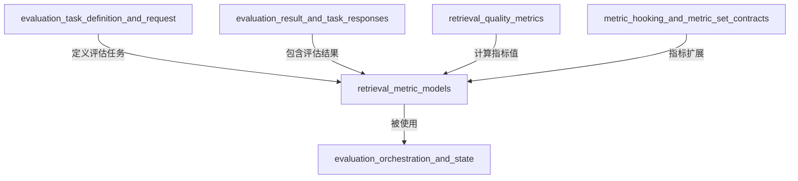

# retrieval_metric_models 模块技术深度文档

## 1. 模块概述

### 1.1 问题空间

在信息检索系统中，如何科学、客观地评估检索结果的质量是一个核心挑战。想象一下，当您搜索"如何配置 Kubernetes 集群"时，搜索引擎返回了 100 个结果，但您真正需要的那 5 个关键文档可能排在第 50 位之后——这种情况下，检索系统实际上是"失败"的，尽管它找到了相关文档。

传统的简单计数方法（如"找到了多少相关文档"）无法全面反映检索质量，因为：
- 相关文档的**位置**至关重要（用户很少翻到第 10 页之后）
- 不同用户对"相关"的定义可能不同（需要考虑多个相关文档的集合）
- 检索系统需要在"精确性"和"召回率"之间做权衡（找到所有相关文档 vs 只返回最相关的文档）

### 1.2 解决方案

`retrieval_metric_models` 模块定义了一套标准化的检索质量评估指标数据模型，这些指标从多个维度综合衡量检索系统的性能：

- **Precision（精确率）**：返回的结果中有多少是真正相关的
- **Recall（召回率）**：所有相关文档中有多少被成功检索到
- **NDCG（归一化折损累计增益）**：考虑了文档相关性程度和位置的综合指标
- **MRR（平均倒数排名）**：衡量第一个相关文档出现位置的指标
- **MAP（平均精度均值）**：综合考虑多个相关文档位置的指标

这些指标共同构成了一个完整的评估框架，帮助开发者理解检索系统在不同场景下的表现。

## 2. 核心组件详解

### 2.1 RetrievalMetrics 结构体

```go
type RetrievalMetrics struct {
    Precision float64 `json:"precision"` // 精确率
    Recall    float64 `json:"recall"`    // 召回率

    NDCG3  float64 `json:"ndcg3"`  // 前 3 个结果的 NDCG
    NDCG10 float64 `json:"ndcg10"` // 前 10 个结果的 NDCG
    MRR    float64 `json:"mrr"`    // 平均倒数排名
    MAP    float64 `json:"map"`    // 平均精度均值
}
```

#### 设计意图

`RetrievalMetrics` 结构体是一个**纯数据容器**，它的设计遵循了几个关键原则：

1. **维度完整性**：同时包含了基于集合的指标（Precision/Recall）和基于位置的指标（NDCG/MRR/MAP），确保评估的全面性
2. **多粒度评估**：提供 NDCG3 和 NDCG10 两个不同截断点的指标，分别评估"第一眼"和"前一页"的检索质量
3. **JSON 友好**：所有字段都有清晰的 JSON 标签，便于与前端展示和后端存储集成
4. **领域专用性**：这些指标是信息检索领域的标准指标，不是通用的统计度量

#### 指标详解

让我们逐个理解这些指标的意义和设计动机：

##### Precision（精确率）
- **定义**：返回的结果中相关文档的比例
- **公式**：$Precision = \frac{|\text{检索到的相关文档}|}{|\text{检索到的所有文档}|}$
- **设计意图**：衡量检索系统"不打扰用户"的能力——高精确率意味着用户不需要在大量不相关结果中筛选

##### Recall（召回率）
- **定义**：所有相关文档中被成功检索到的比例
- **公式**：$Recall = \frac{|\text{检索到的相关文档}|}{|\text{所有相关文档}|}$
- **设计意图**：衡量检索系统"不遗漏"的能力——高召回率意味着系统不会错过重要信息

##### NDCG（归一化折损累计增益）
- **设计动机**：Precision 和 Recall 不考虑结果的顺序，也不考虑相关性的程度（有些文档可能"非常相关"，有些只是"有点相关"）
- **核心思想**：
  1. 相关的文档应该排在前面
  2. 高度相关的文档比一般相关的文档更有价值
  3. 位置越靠前，价值越高（呈对数衰减）
- **NDCG3 和 NDCG10 的区别**：
  - NDCG3 评估"第一眼"质量——用户扫一眼前 3 个结果的体验
  - NDCG10 评估"第一页"质量——用户看完一页结果的体验

##### MRR（平均倒数排名）
- **设计场景**：当用户只关心"第一个相关结果什么时候出现"时（例如问答系统）
- **公式**：$MRR = \frac{1}{Q} \sum_{i=1}^{Q} \frac{1}{rank_i}$，其中 $rank_i$ 是第 i 个查询中第一个相关文档的排名
- **设计意图**：对于"找到一个好答案就够了"的场景，MRR 是最直观的指标

##### MAP（平均精度均值）
- **设计动机**：当有多个相关文档时，我们希望所有相关文档都尽可能排在前面
- **公式**：$MAP = \frac{1}{Q} \sum_{i=1}^{Q} AP_i$，其中 $AP_i$ 是第 i 个查询的平均精度
- **设计意图**：MAP 是最严格的指标之一，它要求检索系统不仅要找到相关文档，还要把它们都排在前面

## 3. 架构与数据流

### 3.1 模块在系统中的位置

`retrieval_metric_models` 模块位于系统的**领域核心层**，它是一个纯数据模型定义模块，不包含任何业务逻辑或计算代码。



### 3.2 数据流向

1. **输入阶段**：评估编排模块从 [evaluation_task_definition_and_request](core_domain_types_and_interfaces-evaluation_dataset_and_metric_contracts-evaluation_task_and_execution_contracts.md) 获取评估任务定义
2. **计算阶段**：[retrieval_quality_metrics](application_services_and_orchestration-evaluation_dataset_and_metric_services-retrieval_quality_metrics.md) 模块中的具体指标计算器（如 MAP、MRR、NDCG）执行计算
3. **结果封装阶段**：计算结果被填充到 `RetrievalMetrics` 结构体中
4. **输出阶段**：完整的 `MetricResult`（包含 `RetrievalMetrics` 和 `GenerationMetrics`）被传递给 [evaluation_result_and_task_responses](core_domain_types_and_interfaces-evaluation_dataset_and_metric_contracts-evaluation_task_and_execution_contracts.md) 进行后续处理

## 4. 依赖关系分析

### 4.1 被依赖模块

`retrieval_metric_models` 是一个**底层数据模型模块**，它的设计非常简洁，不依赖任何其他业务模块，只依赖标准库和基础工具。

这种设计有两个重要优势：
1. **稳定性**：作为核心数据模型，它的变化会影响整个评估系统，因此保持简单和稳定至关重要
2. **可测试性**：不依赖复杂的外部组件，使得测试变得非常简单

### 4.2 依赖它的模块

从依赖关系图中可以看到，以下模块依赖 `retrieval_metric_models`：

1. **[evaluation_orchestration_and_state](application_services_and_orchestration-evaluation_dataset_and_metric_services-evaluation_orchestration_and_state.md)**：评估编排模块，负责协调整个评估流程
2. **[retrieval_quality_metrics](application_services_and_orchestration-evaluation_dataset_and_metric_services-retrieval_quality_metrics.md)**：具体的指标计算模块，包含 MAP、MRR、NDCG 等指标的实现
3. **[metric_hooking_and_metric_set_contracts](core_domain_types_and_interfaces-evaluation_dataset_and_metric_contracts-metric_models_and_extension_hooks-metric_extension_interfaces.md)**：指标扩展模块，允许添加自定义指标
4. **[evaluation_result_and_task_responses](core_domain_types_and_interfaces-evaluation_dataset_and_metric_contracts-evaluation_task_and_execution_contracts.md)**：评估结果处理模块

## 5. 设计决策与权衡

### 5.1 纯数据模型 vs 包含计算逻辑

**设计选择**：将 `RetrievalMetrics` 设计为纯数据容器，不包含任何计算逻辑。

**权衡分析**：
- ✅ **优点**：
  - 遵循单一职责原则——数据模型只负责存储数据
  - 计算逻辑可以独立演进，不影响数据结构
  - 便于序列化和反序列化（JSON/数据库存储）
  - 可以在不同的计算实现之间共享相同的数据结构
- ❌ **缺点**：
  - 使用者需要知道去哪里找到对应的计算逻辑
  - 可能出现"数据结构和计算逻辑分离"的理解障碍

**为什么这个选择是正确的**：在评估系统中，指标计算逻辑可能会因为算法优化、业务需求变化而频繁调整，但指标的数据结构（我们关心哪些指标）是相对稳定的。将它们分离可以让系统更灵活地适应变化。

### 5.2 固定指标集 vs 可扩展指标集

**设计选择**：`RetrievalMetrics` 包含一组固定的、信息检索领域标准的指标。

**权衡分析**：
- ✅ **优点**：
  - 确保所有评估结果都包含相同的核心指标，便于比较
  - 标准指标有明确的定义和解释，避免歧义
  - 简化了下游消费代码（不需要处理动态指标集）
- ❌ **缺点**：
  - 如果需要添加新的自定义指标，需要修改结构体定义
  - 可能对某些特殊场景不够灵活

**为什么这个选择是正确的**：信息检索领域已经有一套成熟的标准指标，这些指标能够覆盖绝大多数场景。同时，系统在 [metric_hooking_and_metric_set_contracts](core_domain_types_and_interfaces-evaluation_dataset_and_metric_contracts-metric_models_and_extension_hooks-metric_extension_interfaces.md) 模块中提供了扩展机制，可以在不修改核心数据结构的情况下添加自定义指标。

### 5.3 同时提供多个 NDCG 截断点

**设计选择**：同时提供 NDCG3 和 NDCG10 两个指标。

**权衡分析**：
- ✅ **优点**：
  - 可以评估不同使用场景下的检索质量（快速浏览 vs 深度查看）
  - 多粒度的指标可以帮助定位问题（例如：NDCG3 高但 NDCG10 低，说明前几个结果很好，但后面的结果质量下降很快）
- ❌ **缺点**：
  - 增加了数据结构的复杂性
  - 对于某些场景可能是冗余的

**为什么这个选择是正确的**：用户的搜索行为是多样的——有些用户只看前 3 个结果，有些用户会翻一页。提供多个截断点的指标可以更全面地反映检索系统在不同用户行为下的表现。

## 6. 使用指南与最佳实践

### 6.1 如何解读这些指标

当您拿到一个 `RetrievalMetrics` 实例时，应该从多个维度综合分析：

1. **先看 Precision 和 Recall**：了解系统的整体准确性和完整性
   - 如果 Precision 高但 Recall 低：系统过于"保守"，只返回最相关的文档，但可能遗漏了一些相关文档
   - 如果 Recall 高但 Precision 低：系统过于"激进"，返回了很多文档，但很多是不相关的

2. **再看 MRR**：了解第一个相关文档的位置
   - MRR 接近 1：第一个结果通常就是相关的
   - MRR 较低：用户需要翻找才能找到第一个相关文档

3. **然后看 MAP**：了解所有相关文档的整体排序质量
   - MAP 高：所有相关文档都排在前面
   - MAP 低但 MRR 高：第一个相关文档位置很好，但后续的相关文档可能排得很靠后

4. **最后看 NDCG3 和 NDCG10**：了解不同截断点的质量
   - NDCG3 高但 NDCG10 低：前 3 个结果很好，但第 4-10 个结果质量下降
   - 两者都高：整体排序质量都很好

### 6.2 常见使用模式

在实际应用中，您可能会这样使用 `RetrievalMetrics`：

```go
// 假设您已经有了计算好的指标
metrics := &types.RetrievalMetrics{
    Precision: 0.75,
    Recall:    0.60,
    NDCG3:     0.85,
    NDCG10:    0.78,
    MRR:       0.92,
    MAP:       0.68,
}

// 1. 序列化为 JSON（用于 API 响应）
jsonData, _ := json.Marshal(metrics)

// 2. 存储到数据库（需要 ORM 映射）
// db.Create(&EvaluationResult{Metrics: metrics})

// 3. 与阈值比较（用于质量监控）
if metrics.NDCG3 < 0.7 {
    log.Printf("警告：NDCG3 (%.2f) 低于阈值 0.7", metrics.NDCG3)
}

// 4. A/B 测试比较
if newMetrics.NDCG10 > oldMetrics.NDCG10 {
    log.Println("新检索算法表现更好！")
}
```

## 7. 注意事项与陷阱

### 7.1 指标的局限性

重要的是要理解，这些指标虽然是标准的，但它们也有局限性：

1. **依赖高质量的 Ground Truth**：所有指标都依赖人工标注的相关文档集合。如果标注质量不高，指标结果就不可信。
2. **不考虑用户满意度**：指标高不等于用户满意——例如，系统返回了所有相关文档，但用了很技术化的语言，用户可能仍然不满意。
3. **不考虑文档多样性**：指标只关心相关性，不关心结果的多样性——例如，返回的 10 个结果都是同一个文档的不同版本，指标可能很高，但用户体验很差。

### 7.2 常见误解

1. **"Precision 和 Recall 是对立的"**：不完全正确。通过改进检索算法，有可能同时提高两者。
2. **"NDCG 比 MAP 好"**：取决于场景。如果关心多个相关文档的整体排序，MAP 更合适；如果关心相关性程度和位置的综合，NDCG 更合适。
3. **"MRR 不重要"**：对于问答系统等只需要一个好答案的场景，MRR 可能是最重要的指标。

### 7.3 实现细节注意事项

虽然 `retrieval_metric_models` 模块本身很简单，但在使用它时需要注意：

1. **指标范围**：所有指标的值都应该在 [0, 1] 范围内。如果您计算出的值超出这个范围，说明计算逻辑有问题。
2. **空值处理**：在某些边界情况下（例如没有相关文档），需要小心处理除零错误，确保指标有合理的默认值（通常是 0）。
3. **JSON 序列化**：由于浮点数的精度问题，序列化时可能会出现类似 0.7999999999999999 的值，可能需要进行四舍五入处理。

## 8. 总结

`retrieval_metric_models` 模块虽然代码量不大，但它是整个评估系统的核心。它定义了一套标准化的检索质量评估指标，这些指标从多个维度综合衡量检索系统的性能，帮助开发者理解系统在不同场景下的表现。

该模块的设计体现了几个重要的软件工程原则：
- **单一职责**：只负责定义数据结构，不包含计算逻辑
- **标准导向**：使用信息检索领域的标准指标，确保评估结果的权威性
- **多维度**：同时提供多种指标，确保评估的全面性

当您需要理解检索系统的质量时，不要只看一个指标，而应该综合考虑所有指标，结合实际的使用场景进行分析。
