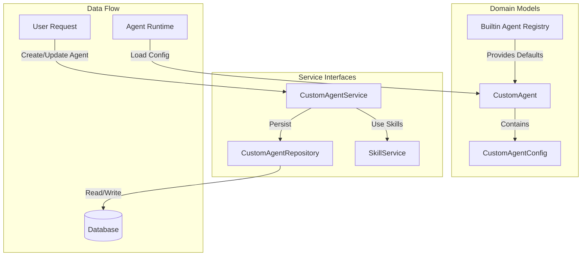
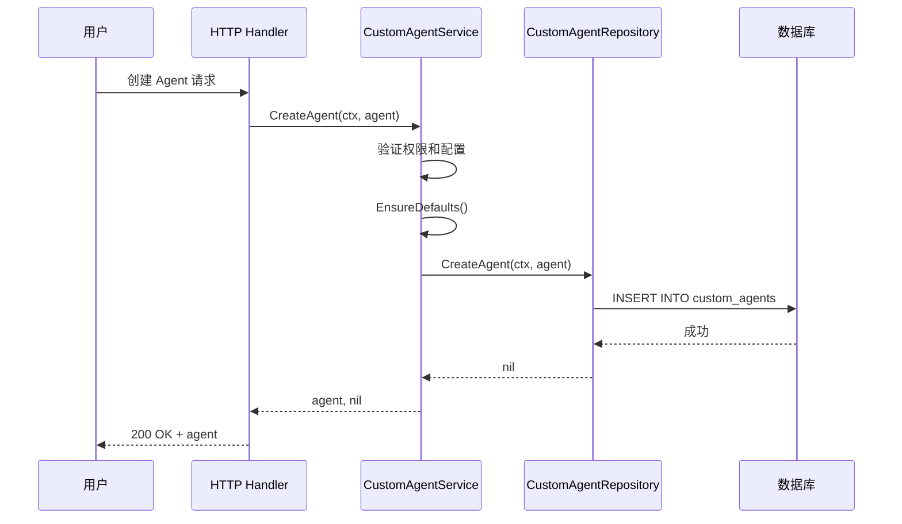
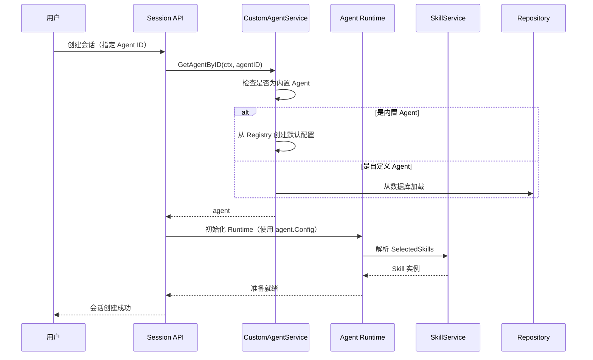

# custom_agent_and_skill_capability_contracts 模块技术文档

## 1. 模块概览

### 1.1 问题空间

在构建企业级 AI 助手平台时，我们面临一个核心挑战：如何让不同角色的用户（从普通员工到数据分析师）都能拥有符合其工作流的专属 AI 助手，同时保持系统的可维护性和可扩展性？

传统的单 Agent 模式显然无法满足这种需求：
- **RAG 模式**（快速问答）适合基于知识库的快速查询，但缺乏复杂推理能力
- **ReAct 模式**（智能推理）支持多步工具调用，但对于简单问题过于复杂
- **不同业务场景**需要不同的工具集、知识库和提示词配置

这个模块就是为了解决这个问题而存在的——它提供了一套完整的契约，让系统能够支持多种预配置的内置 Agent，同时允许用户创建完全自定义的 Agent。

### 1.2 核心价值

这个模块定义了**智能体配置和能力的核心契约**，它是整个系统中 Agent 生态系统的"宪法"——规定了：
- 什么是 Agent（数据模型）
- Agent 可以有什么能力（配置选项）
- 如何管理 Agent（服务接口）
- 如何与 Skill 系统交互（能力集成）

## 2. 核心抽象与架构

### 2.1 心智模型

把 Agent 想象成**"智能工作台"**：

1. **工作台类型**（AgentMode）：
   - `quick-answer` = 快速咨询台 - 适合简单问题，直接从知识库找答案
   - `smart-reasoning` = 实验室工作台 - 适合复杂任务，支持多步实验和工具使用

2. **工作台配置**（CustomAgentConfig）：
   - 就像给工作台配备不同的工具、材料和工作流程
   - 可以选择用哪些工具（AllowedTools）
   - 可以接入哪些知识库（KnowledgeBases）
   - 可以调整"工作风格"（Temperature、SystemPrompt）

3. **内置工作台**（Builtin Agents）：
   - 系统预设的专业工作台，如"数据分析师"、"知识图谱专家"
   - 它们有固定的配置，但用户可以复制后自定义

### 2.2 架构图



**架构说明：**

1. **Domain Models 层**：
   - `CustomAgent`：Agent 的核心数据模型，包含基本信息和配置
   - `CustomAgentConfig`：Agent 的详细配置，是一个大而全的配置结构体
   - `Builtin Agent Registry`：内置 Agent 的注册表，提供默认配置

2. **Service Interfaces 层**：
   - `CustomAgentService`：Agent 管理的业务逻辑接口
   - `CustomAgentRepository`：Agent 数据持久化接口
   - `SkillService`：Skill 能力服务接口

3. **数据流向**：
   - 用户请求通过 Service 层处理
   - Service 层通过 Repository 层与数据库交互
   - Agent Runtime 加载 Agent 配置并执行

## 3. 核心组件详解

### 3.1 CustomAgent 结构体

**设计意图**：作为 Agent 的核心数据模型，它既需要支持数据库持久化，又需要支持 YAML/JSON 序列化，同时还要区分内置 Agent 和自定义 Agent。

**关键设计点**：
- **复合主键**：`ID` + `TenantID`，确保多租户隔离
- **IsBuiltin 标志**：区分内置 Agent 和自定义 Agent
- **Config 字段**：使用 JSON 类型存储复杂配置，灵活性与可查询性的权衡

**代码位置**：`internal/types/custom_agent.go::CustomAgent`

### 3.2 CustomAgentConfig 结构体

**设计意图**：这是整个模块的"心脏"——它定义了 Agent 可以拥有的所有能力和配置选项。

**配置分组**：
1. **基础设置**：AgentMode、SystemPrompt、ContextTemplate
2. **模型设置**：ModelID、Temperature、MaxCompletionTokens
3. **Agent 模式设置**：MaxIterations、AllowedTools、ReflectionEnabled
4. **Skills 设置**：SkillsSelectionMode、SelectedSkills
5. **知识库设置**：KBSelectionMode、KnowledgeBases
6. **Web 搜索设置**：WebSearchEnabled、WebSearchMaxResults
7. **检索策略设置**：EmbeddingTopK、RerankThreshold 等
8. **高级设置**：QueryExpansion、FallbackStrategy 等

**设计权衡**：
- ✅ **优点**：单一配置结构体，易于理解和使用
- ⚠️ **缺点**：结构体较大，部分字段只在特定模式下有效（如 MaxIterations 只在 smart-reasoning 模式下有用）

**代码位置**：`internal/types/custom_agent.go::CustomAgentConfig`

### 3.3 内置 Agent 系统

**设计意图**：提供开箱即用的专业 Agent，同时作为自定义 Agent 的模板。

**核心机制**：
- **Registry 模式**：`BuiltinAgentRegistry` 是一个 map，存储 Agent ID 到工厂函数的映射
- **工厂函数**：每个内置 Agent 都有自己的工厂函数（如 `GetBuiltinDataAnalystAgent`）
- **有序列表**：`builtinAgentIDsOrdered` 定义了内置 Agent 的显示顺序

**现有内置 Agent**：
1. **快速问答**（quick-answer）：基于 RAG 的快速问答
2. **智能推理**（smart-reasoning）：基于 ReAct 的多步推理
3. **数据分析师**（data-analyst）：专注于 CSV/Excel 数据分析

**扩展性设计**：
- 添加新的内置 Agent 只需：
  1. 定义新的常量 ID
  2. 创建工厂函数
  3. 注册到 `BuiltinAgentRegistry`
  4. 添加到 `builtinAgentIDsOrdered`

**代码位置**：`internal/types/custom_agent.go::BuiltinAgentRegistry`

### 3.4 CustomAgentService 接口

**设计意图**：定义 Agent 管理的业务逻辑契约，遵循依赖倒置原则——高层模块不依赖低层实现，而是依赖抽象。

**核心方法**：
- `CreateAgent`：创建新的自定义 Agent
- `GetAgentByID`：通过 ID 获取 Agent（自动处理内置 Agent）
- `ListAgents`：列出当前租户的所有 Agent（内置 Agent 优先）
- `UpdateAgent`：更新 Agent 信息
- `DeleteAgent`：删除 Agent（不能删除内置 Agent）
- `CopyAgent`：复制现有 Agent（自定义内置 Agent 的方式）

**设计亮点**：
- `GetAgentByIDAndTenant` 方法专门用于共享 Agent 场景
- 明确区分了"当前租户"和"指定租户"的操作

**代码位置**：`internal/types/interfaces/custom_agent.go::CustomAgentService`

### 3.5 CustomAgentRepository 接口

**设计意图**：定义 Agent 数据持久化的契约，将业务逻辑与数据访问分离。

**关键设计点**：
- 所有方法都显式接收 `tenantID` 参数，确保多租户隔离
- `CreateAgent` 不返回 ID（依赖数据库自生成或调用方预先设置）
- `DeleteAgent` 需要同时提供 `id` 和 `tenantID`（复合主键要求）

**代码位置**：`internal/types/interfaces/custom_agent.go::CustomAgentRepository`

### 3.6 SkillService 接口

**设计意图**：定义 Skill 能力服务的契约，让 Agent 系统能够与 Skill 系统解耦。

**核心方法**：
- `ListPreloadedSkills`：列出所有预加载的 Skill 元数据
- `GetSkillByName`：通过名称获取 Skill

**设计意图**：
- Agent 配置中引用 Skill 名称，而不是直接依赖 Skill 实现
- 运行时通过 SkillService 解析 Skill 名称到实际实现

**代码位置**：`internal/types/interfaces/skill.go::SkillService`

## 4. 关键设计决策与权衡

### 4.1 内置 Agent 与自定义 Agent 的统一建模

**决策**：使用同一个 `CustomAgent` 结构体表示内置 Agent 和自定义 Agent，通过 `IsBuiltin` 标志区分。

**替代方案**：
- 方案 A：完全分离的结构体（BuiltinAgent 和 CustomAgent）
- 方案 B：使用继承/接口抽象

**选择理由**：
- ✅ **一致性**：内置 Agent 本质上就是"系统创建的自定义 Agent"，统一建模简化了逻辑
- ✅ **可复制性**：用户可以复制内置 Agent 作为自定义 Agent 的起点
- ✅ **存储简化**：不需要两张表

**权衡**：
- ⚠️ 需要在业务逻辑中处理 `IsBuiltin` 的特殊情况（如不能删除、不能更新等）
- ⚠️ 内置 Agent 的默认配置需要在代码中维护，而不是数据库

### 4.2 配置字段的 JSON 序列化

**决策**：`CustomAgentConfig` 实现 `driver.Valuer` 和 `sql.Scanner` 接口，作为 JSON 存储在数据库中。

**替代方案**：
- 方案 A：将配置字段平铺到表的列中
- 方案 B：使用独立的配置表（EAV 模式）

**选择理由**：
- ✅ **灵活性**：配置结构可以频繁变化，不需要数据库迁移
- ✅ **简单性**：单一表结构，查询简单
- ✅ **表达力**：支持嵌套结构和数组

**权衡**：
- ⚠️ **查询限制**：无法直接在 SQL 中查询配置字段（虽然 PostgreSQL 支持 JSON 查询，但代码中没有利用）
- ⚠️ **类型安全**：数据库层面没有类型约束，完全依赖应用层验证

### 4.3 AgentMode 的二元选择

**决策**：只定义两种 AgentMode：`quick-answer` 和 `smart-reasoning`。

**替代方案**：
- 方案 A：更多预定义模式（如 "data-analysis"、"coding" 等）
- 方案 B：完全开放的模式系统

**选择理由**：
- ✅ **简单性**：两种模式覆盖了 90% 的使用场景
- ✅ **清晰性**：用户容易理解两种模式的区别
- ✅ **可扩展性**：可以通过配置在两种模式基础上创建专业 Agent（如"数据分析师"本质上是配置了特定工具和提示词的 `smart-reasoning` Agent）

**权衡**：
- ⚠️ 某些专业 Agent 可能不完全 fit 这两种模式
- ⚠️ 未来可能需要添加新模式，这将是一个 breaking change

### 4.4 选择模式的统一设计

**决策**：对于知识库、Skills、MCP 服务，都使用统一的"选择模式"设计：
- `SelectionMode`："all" | "selected" | "none"
- `SelectedXXX`：具体的选择列表

**替代方案**：
- 方案 A：每种资源使用不同的配置方式
- 方案 B：只支持"all"或"selected"，不支持"none"

**选择理由**：
- ✅ **一致性**：用户学习一次，理解所有
- ✅ **灵活性**：覆盖了从"完全开放"到"完全封闭"的所有场景
- ✅ **可预测性**：行为清晰，不容易出错

**权衡**：
- ⚠️ 对于某些资源，"none" 可能没有意义
- ⚠️ 需要在运行时正确处理三种模式的逻辑

## 5. 数据流向与依赖关系

### 5.1 Agent 创建流程



**关键步骤**：
1. 用户提交 Agent 配置
2. Service 层验证权限和配置
3. 调用 `EnsureDefaults()` 设置默认值
4. 通过 Repository 持久化到数据库
5. 返回创建的 Agent（包含生成的 ID）

### 5.2 Agent 使用流程（运行时）



**关键步骤**：
1. 用户创建会话时指定 Agent ID
2. Service 层解析 Agent（内置 Agent 从 Registry 创建，自定义 Agent 从数据库加载）
3. Runtime 根据 AgentConfig 初始化
4. 通过 SkillService 解析 Skill 名称到实际实现

## 6. 子模块概述

本模块包含以下子模块：

### 6.1 custom_agent_domain_models
**职责**：定义 Agent 的核心数据模型和配置结构。  
**核心组件**：`CustomAgent`、`CustomAgentConfig`、内置 Agent 注册表。  
**详细文档**：[custom_agent_domain_models](core_domain_types_and_interfaces-identity_tenant_organization_and_configuration_contracts-custom_agent_and_skill_capability_contracts-custom_agent_domain_models.md)

### 6.2 custom_agent_service_and_persistence_interfaces
**职责**：定义 Agent 管理的业务逻辑和数据持久化接口。  
**核心组件**：`CustomAgentService`、`CustomAgentRepository`。  
**详细文档**：[custom_agent_service_and_persistence_interfaces](core_domain_types_and_interfaces-identity_tenant_organization_and_configuration_contracts-custom_agent_and_skill_capability_contracts-custom_agent_service_and_persistence_interfaces.md)

### 6.3 skill_capability_service_interface
**职责**：定义 Skill 能力服务的接口，让 Agent 系统能够与 Skill 系统解耦。  
**核心组件**：`SkillService`。  
**详细文档**：[skill_capability_service_interface](core_domain_types_and_interfaces-identity_tenant_organization_and_configuration_contracts-custom_agent_and_skill_capability_contracts-skill_capability_service_interface.md)

## 7. 跨模块依赖关系

### 7.1 依赖的模块

- **core_domain_types_and_interfaces**：提供基础类型定义
- **agent_runtime_and_tools**：Agent 运行时使用这些配置
- **data_access_repositories**：实现 Repository 接口
- **application_services_and_orchestration**：实现 Service 接口

### 7.2 被依赖的模块

- **application_services_and_orchestration**：实现 Agent 管理业务逻辑
- **http_handlers_and_routing**：暴露 Agent 管理 API
- **agent_runtime_and_tools**：运行时加载 Agent 配置

## 8. 使用指南与最佳实践

### 8.1 创建自定义 Agent

**正确做法**：
```go
agent := &types.CustomAgent{
    Name:        "我的专属助手",
    Description: "一个配置了特定知识库的助手",
    TenantID:    tenantID,
    CreatedBy:   userID,
    Config: types.CustomAgentConfig{
        AgentMode:       types.AgentModeQuickAnswer,
        KBSelectionMode: "selected",
        KnowledgeBases:  []string{"kb1", "kb2"},
        // 其他字段会被 EnsureDefaults 设置默认值
    },
}
agent.EnsureDefaults()
createdAgent, err := service.CreateAgent(ctx, agent)
```

**常见错误**：
- ❌ 忘记调用 `EnsureDefaults()`
- ❌ 在 `smart-reasoning` 模式下设置 `MaxCompletionTokens`（无效）
- ❌ 试图修改内置 Agent（应该复制后修改）

### 8.2 添加入口的内置 Agent

**步骤**：
1. 在 `custom_agent.go` 中添加新的常量 ID
2. 创建工厂函数（如 `GetBuiltinXxxAgent`）
3. 在 `BuiltinAgentRegistry` 中注册
4. 在 `builtinAgentIDsOrdered` 中添加（如果需要显示）

**示例**：
```go
const BuiltinMySpecialistID = "builtin-my-specialist"

func GetBuiltinMySpecialistAgent(tenantID uint64) *CustomAgent {
    return &CustomAgent{
        ID:          BuiltinMySpecialistID,
        Name:        "我的专家",
        Description: "...",
        IsBuiltin:   true,
        TenantID:    tenantID,
        Config: CustomAgentConfig{
            // 特定配置
        },
    }
}

var BuiltinAgentRegistry = map[string]func(uint64) *CustomAgent{
    // ... 现有
    BuiltinMySpecialistID: GetBuiltinMySpecialistAgent,
}
```

## 9. 陷阱与注意事项

### 9.1 配置字段的有效性

**问题**：`CustomAgentConfig` 中的某些字段只在特定模式下有效，但结构体本身不强制这一点。

**示例**：
- `MaxIterations` 只在 `AgentModeSmartReasoning` 模式下有效
- `ContextTemplate` 只在 `AgentModeQuickAnswer` 模式下有效

**建议**：
- 在 Service 层添加验证逻辑
- 在运行时忽略无效字段
- 文档中明确说明字段的适用范围

### 9.2 内置 Agent 的更新

**问题**：内置 Agent 的配置在代码中维护，更新后不会自动反映到现有租户。

**当前行为**：内置 Agent 是在需要时动态创建的，不会持久化到数据库。

**建议**：
- 如果需要更新内置 Agent 配置，只需更新代码
- 租户总是使用最新版本的内置 Agent
- 如果租户需要固定版本，应该复制为自定义 Agent

### 9.3 多租户隔离

**问题**：Repository 层的所有方法都需要显式传递 `tenantID`，容易出错。

**建议**：
- 始终从 context 中提取 tenantID（Service 层应该这样做）
- 不要相信用户输入的 tenantID
- 在 Repository 层添加验证，确保 tenantID 一致

### 9.4 JSON 配置的向后兼容性

**问题**：当 `CustomAgentConfig` 结构变化时，数据库中已存储的 JSON 可能无法反序列化。

**建议**：
- 只添加字段，不要删除或重命名字段
- 如果必须删除字段，使用 `json:"-"` 标记
- 添加新字段时，确保有合理的默认值
- 考虑使用版本化配置结构

## 10. 总结

`custom_agent_and_skill_capability_contracts` 模块是整个 Agent 生态系统的基石。它通过精心设计的抽象和契约，实现了：

✅ **灵活性**：支持从简单 RAG 到复杂 ReAct 的各种 Agent 类型  
✅ **可扩展性**：内置 Agent 注册表让添加新的专业 Agent 变得简单  
✅ **解耦**：通过接口定义，让业务逻辑与实现分离  
✅ **多租户**：从设计层面考虑了多租户隔离  

这个模块的设计哲学是：**约定优于配置，但配置应该足够灵活**。它提供了合理的默认值（通过 `EnsureDefaults`），但也允许用户几乎完全自定义 Agent 的行为。

对于新加入的开发者，理解这个模块的关键是：
1. 把 Agent 想象成"智能工作台"
2. 理解 `quick-answer` 和 `smart-reasoning` 两种模式的区别
3. 掌握内置 Agent 的 Registry 模式
4. 注意配置字段的适用范围和默认值
