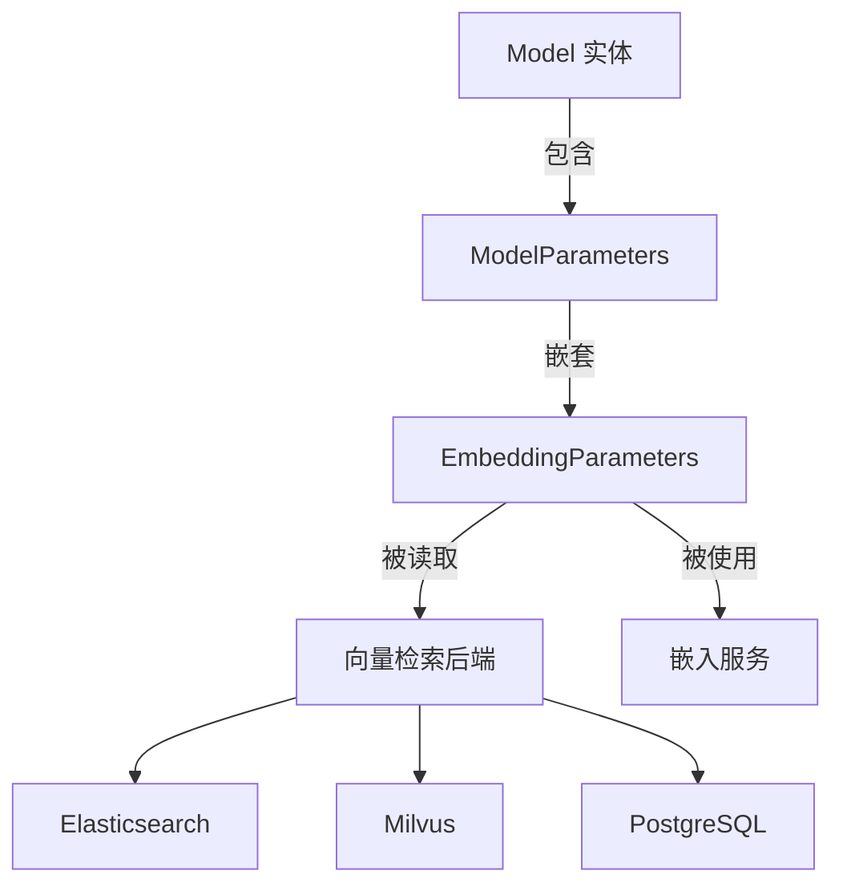

# Embedding Parameter Contracts 模块深度解析

## 1. 模块概述

### 1.1 问题背景

在多租户 AI 系统中，嵌入模型的配置管理是一个核心挑战。不同的嵌入模型具有不同的特性：
- 输出向量维度差异巨大（从 128 维到 4096 维不等）
- 对输入文本长度的限制各不相同
- 不同的提供商（OpenAI、阿里云、智谱等）有不同的参数要求

一个简单的字符串配置无法满足这种复杂性——我们需要一个**结构化、类型安全、可序列化**的数据契约来统一管理这些差异。

### 1.2 模块定位

`embedding_parameter_contracts` 模块位于系统的**核心域类型层**，它定义了嵌入模型参数的标准化数据结构，是连接：
- 模型目录配置
- 向量检索后端
- 嵌入服务实现
- 数据库持久化

的关键桥梁。

## 2. 核心组件：EmbeddingParameters

### 2.1 数据结构设计

```go
type EmbeddingParameters struct {
    Dimension            int `yaml:"dimension"              json:"dimension"`
    TruncatePromptTokens int `yaml:"truncate_prompt_tokens" json:"truncate_prompt_tokens"`
}
```

### 2.2 字段深度解析

#### Dimension（维度）
**设计意图**：明确指定嵌入模型输出向量的维度。

**为什么需要这个字段？**
- 不同的向量数据库（Elasticsearch、Milvus、PostgreSQL）需要预先知道向量维度来创建索引
- 同一提供商的不同模型（如 OpenAI 的 text-embedding-3-small vs text-embedding-3-large）维度不同
- 维度直接影响检索精度和存储成本

**典型值**：
- 1536（OpenAI text-embedding-3-small）
- 3072（OpenAI text-embedding-3-large）
- 1024（阿里云文本嵌入-v2）

#### TruncatePromptTokens（截断提示词令牌数）
**设计意图**：控制输入文本的最大长度，防止超出模型限制。

**为什么需要这个字段？**
- 每个嵌入模型都有最大上下文窗口限制
- 超过限制的文本需要被截断或分割
- 不同模型的限制差异很大（从 512 到 8192 令牌不等）

**工作原理**：
当输入文本超过此值时，系统会：
1. 将文本截断到指定令牌数
2. 对截断后的文本生成嵌入
3. （可选）对剩余部分生成额外嵌入

## 3. 数据流转与依赖关系

### 3.1 在系统中的位置



### 3.2 完整数据流

让我们追踪一个典型的嵌入参数使用场景：

1. **配置阶段**：
   - 管理员通过模型目录 API 配置嵌入模型
   - `EmbeddingParameters` 被设置并存储在 `Model.Parameters.EmbeddingParameters` 中
   - 整个 `ModelParameters` 通过 JSON 序列化存入数据库

2. **检索准备阶段**：
   - 向量检索仓库从数据库加载模型配置
   - 读取 `EmbeddingParameters.Dimension` 来创建/验证向量索引
   - 如果维度不匹配，会抛出配置错误

3. **嵌入生成阶段**：
   - 嵌入服务获取模型配置
   - 使用 `TruncatePromptTokens` 来截断过长的输入文本
   - 调用提供商 API 生成嵌入
   - 验证返回的向量维度与配置一致

4. **检索执行阶段**：
   - 查询文本被截断到 `TruncatePromptTokens`
   - 生成的向量用于相似度搜索
   - 向量数据库使用预先配置的维度进行计算

## 4. 设计决策与权衡

### 4.1 为什么使用独立的结构体而不是内联字段？

**选择**：将嵌入参数抽取为独立的 `EmbeddingParameters` 结构体，而不是直接放在 `ModelParameters` 中。

**原因**：
1. **关注点分离**：嵌入参数是一组逻辑上相关的配置，应该在一起
2. **可扩展性**：未来可以轻松添加更多嵌入特定参数（如池化策略、编码方式等）
3. **类型安全**：可以在函数签名中明确要求 `EmbeddingParameters` 类型
4. **文档清晰**：结构体本身就是最好的文档

**权衡**：
- ✅ 优点：更好的封装和可维护性
- ❌ 缺点：增加了一层间接访问（`model.Parameters.EmbeddingParameters.Dimension`）

### 4.2 为什么同时支持 YAML 和 JSON 标签？

**选择**：字段同时带有 `yaml` 和 `json` 标签。

**原因**：
1. **配置文件**：YAML 用于人类可读的配置文件（如模型目录的初始化配置）
2. **API 交互**：JSON 用于 HTTP API 的请求/响应
3. **数据库存储**：JSON 用于 GORM 的 JSON 字段序列化

**权衡**：
- ✅ 优点：灵活性高，适应多种场景
- ❌ 缺点：需要保持两种标签的一致性

### 4.3 为什么维度是必需字段？

**选择**：将 `Dimension` 设计为必需的整数字段，而不是可选的。

**原因**：
1. **数据库约束**：向量索引创建时必须知道维度
2. **错误预防**：避免因忘记配置维度而导致的运行时错误
3. **性能考虑**：预先知道维度可以优化内存分配

**权衡**：
- ✅ 优点：更早发现配置错误
- ❌ 缺点：增加了配置的复杂性（需要预先知道模型维度）

## 5. 使用指南与最佳实践

### 5.1 正确初始化

```go
params := EmbeddingParameters{
    Dimension:            1536,           // 必须与实际模型输出一致
    TruncatePromptTokens: 8191,           // 不要超过模型的最大限制
}
```

### 5.2 常见陷阱

#### 陷阱 1：维度不匹配
**问题**：配置的维度与实际模型输出不一致。

**后果**：
- 向量索引创建失败
- 相似度搜索结果错误
- 数据库存储异常

**解决方案**：
```go
// 验证维度是否匹配
if generatedVector.Dimension() != params.Dimension {
    return fmt.Errorf("dimension mismatch: expected %d, got %d", 
        params.Dimension, generatedVector.Dimension())
}
```

#### 陷阱 2：截断值设置过大
**问题**：`TruncatePromptTokens` 超过模型实际支持的最大长度。

**后果**：
- API 调用失败
- 静默丢弃部分文本

**解决方案**：
查阅提供商文档，设置为模型支持的最大值减 1（作为安全边际）。

### 5.3 扩展指南

如果需要添加新的嵌入参数，遵循以下模式：

1. 在 `EmbeddingParameters` 中添加字段
2. 同时添加 `yaml` 和 `json` 标签
3. 更新相关的验证逻辑
4. 添加文档说明新参数的用途

示例：
```go
type EmbeddingParameters struct {
    Dimension            int    `yaml:"dimension"              json:"dimension"`
    TruncatePromptTokens int    `yaml:"truncate_prompt_tokens" json:"truncate_prompt_tokens"`
    PoolingStrategy      string `yaml:"pooling_strategy"       json:"pooling_strategy"` // 新增
}
```

## 6. 依赖关系

### 6.1 被依赖模块

- **[model_catalog_and_parameter_contracts](core_domain_types_and_interfaces-identity_tenant_organization_and_configuration_contracts-model_catalog_and_parameter_contracts.md)**：包含此模块的父模块
- **[vector_retrieval_backend_repositories](data_access_repositories-vector_retrieval_backend_repositories.md)**：使用嵌入参数配置向量索引
- **[embedding_interfaces_batching_and_backends](model_providers_and_ai_backends-embedding_interfaces_batching_and_backends.md)**：使用嵌入参数控制嵌入生成

### 6.2 数据契约

`EmbeddingParameters` 通过以下方式与其他模块交互：
- **JSON 序列化**：用于 API 和数据库存储
- **YAML 序列化**：用于配置文件
- **直接字段访问**：用于运行时配置读取

## 7. 总结

`embedding_parameter_contracts` 模块虽然小巧，但它是整个向量检索系统的基础。它通过简洁的设计解决了多模型、多提供商环境下的配置管理问题，体现了"结构胜于约定"的设计理念。

这个模块的价值不在于复杂的逻辑，而在于它建立了一个**共同语言**——让系统的各个部分能够以一致的方式理解和使用嵌入模型配置。
