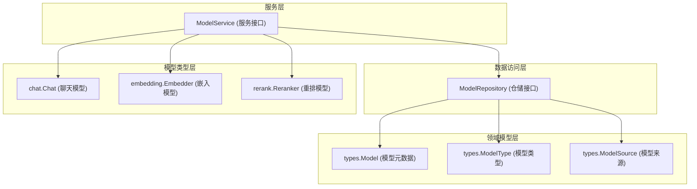

# model_catalog_service_and_repository_interfaces 模块深度解析

## 1. 模块概览与问题定位

**model_catalog_service_and_repository_interfaces** 模块是整个系统中模型管理的核心抽象层，它定义了模型目录（Model Catalog）的服务与数据访问契约。在现代 AI 系统中，模型管理是一个复杂的问题：

**问题空间**：
- 系统需要同时支持多种类型的模型（聊天模型、嵌入模型、重排模型）
- 不同模型可能来自不同的供应商（OpenAI、阿里云、自托管等）
- 模型需要支持多租户隔离与跨租户共享
- 模型配置需要持久化存储与运行时实例化分离

这个模块的核心价值在于：将模型的"元数据管理"与"运行时实例"解耦，同时为上层应用提供统一的接口，屏蔽底层模型供应商的差异。

## 2. 核心架构与数据流程

### 2.1 组件关系图



### 2.2 数据流程解析

模型管理的典型数据流程如下：

1. **模型注册流程**：
   - 上层应用通过 `ModelService.CreateModel()` 注册新模型
   - 服务层将 `types.Model` 元数据传递给 `ModelRepository.Create()` 持久化
   - 仓储层负责将元数据存储到数据库

2. **模型使用流程**：
   - 应用需要使用模型时，调用如 `ModelService.GetChatModel()` 方法
   - 服务层首先通过 `ModelRepository.GetByID()` 获取模型元数据
   - 然后根据元数据配置实例化对应的 `chat.Chat` 运行时对象
   - 返回可直接调用的模型实例给应用层

## 3. 核心组件深度解析

### 3.1 ModelRepository 接口

**职责**：定义模型元数据的持久化访问契约，负责与数据库交互。

**设计意图**：
- 采用仓储模式（Repository Pattern），将数据访问逻辑抽象化
- 所有方法都包含 `tenantID` 参数，体现多租户隔离的设计原则
- `ClearDefaultByType` 方法支持设置默认模型的业务逻辑

**关键方法解析**：

1. **List 方法**：
   ```go
   List(ctx context.Context, tenantID uint64, modelType types.ModelType, source types.ModelSource) ([]*types.Model, error)
   ```
   - 支持按模型类型和来源过滤，体现了灵活的查询能力
   - 这种设计允许应用层按需要筛选可用模型

2. **ClearDefaultByType 方法**：
   ```go
   ClearDefaultByType(ctx context.Context, tenantID uint, modelType types.ModelType, excludeID string) error
   ```
   - 这是一个业务语义很强的方法，用于管理"默认模型"概念
   - `excludeID` 参数允许在清除其他模型默认标记时保留特定模型

### 3.2 ModelService 接口

**职责**：定义模型目录的业务逻辑契约，是连接元数据管理和运行时实例的桥梁。

**设计意图**：
- 分离 CRUD 操作和模型实例获取操作
- 提供租户感知的模型实例化能力
- 屏蔽不同类型模型实例化的复杂性

**关键方法解析**：

1. **GetEmbeddingModelForTenant 方法**：
   ```go
   GetEmbeddingModelForTenant(ctx context.Context, modelId string, tenantID uint64) (embedding.Embedder, error)
   ```
   - 这个方法体现了跨租户模型共享的设计
   - 允许在特定租户上下文中使用其他租户的模型（需权限验证）

2. **三种模型获取方法**：
   - `GetChatModel()` - 获取聊天模型
   - `GetEmbeddingModel()` - 获取嵌入模型
   - `GetRerankModel()` - 获取重排模型
   
   这种分离设计反映了系统对不同类型模型的明确划分，每种模型有不同的使用场景和接口契约。

## 4. 设计决策与权衡

### 4.1 接口分离设计

**决策**：将 `ModelService` 和 `ModelRepository` 分离为两个独立接口。

**权衡分析**：
- ✅ **优点**：符合单一职责原则，仓储层只关注数据访问，服务层关注业务逻辑
- ✅ **优点**：便于测试，可以独立 mock 仓储层测试服务逻辑
- ⚠️ **考虑**：增加了一层抽象，简单场景下可能显得过度设计
- **适用性**：在这个复杂的模型管理场景下，这种分离是合理的

### 4.2 租户隔离策略

**决策**：在仓储层的所有方法中显式传递 `tenantID`。

**权衡分析**：
- ✅ **优点**：租户隔离明确，不易出错
- ✅ **优点**：支持跨租户操作（如 `GetEmbeddingModelForTenant`）
- ⚠️ **考虑**：方法签名冗长，每次调用都需要传递租户ID
- **替代方案**：可以使用上下文隐式传递租户ID，但显式传递更清晰安全

### 4.3 模型实例化延迟加载

**决策**：不直接返回模型配置，而是返回已实例化的模型对象（`chat.Chat`、`embedding.Embedder` 等）。

**权衡分析**：
- ✅ **优点**：上层应用无需关心模型实例化细节
- ✅ **优点**：可以在实例化过程中进行缓存、连接池管理等优化
- ⚠️ **考虑**：服务层需要了解各种模型的实例化逻辑，增加了耦合
- **设计理由**：这种设计为上层应用提供了更好的封装性，符合"依赖倒置原则"

## 5. 使用指南与注意事项

### 5.1 典型使用场景

1. **注册新模型**：
   ```go
   model := &types.Model{
       ID: "my-chat-model",
       Type: types.ModelTypeChat,
       Source: types.ModelSourceOpenAI,
       Config: /* 模型配置 */,
   }
   err := modelService.CreateModel(ctx, model)
   ```

2. **使用聊天模型**：
   ```go
   chatModel, err := modelService.GetChatModel(ctx, "my-chat-model")
   if err != nil {
       // 处理错误
   }
   response, err := chatModel.Chat(ctx, messages)
   ```

### 5.2 注意事项与边界情况

1. **租户隔离**：
   - 始终确保在正确的租户上下文中操作模型
   - 跨租户共享模型时，确保有适当的权限验证机制

2. **模型实例生命周期**：
   - 模型实例可能被缓存，不要假设每次调用都返回新实例
   - 模型实例通常是线程安全的，可以在多个 goroutine 中共享使用

3. **错误处理**：
   - 模型实例化可能失败（配置错误、网络问题等），务必检查错误
   - 模型调用时也可能出现临时错误，考虑实现重试逻辑

## 6. 与其他模块的关系

- **依赖模块**：
  - [llm_model_parameter_contracts](core_domain_types_and_interfaces-identity_tenant_organization_and_configuration_contracts-model_catalog_and_parameter_contracts-llm_model_parameter_contracts.md) - 定义模型参数契约
  - [embedding_parameter_contracts](core_domain_types_and_interfaces-identity_tenant_organization_and_configuration_contracts-model_catalog_and_parameter_contracts-embedding_parameter_contracts.md) - 定义嵌入模型参数契约
  
- **被依赖模块**：
  - [model_catalog_configuration_services](application_services_and_orchestration-agent_identity_tenant_and_configuration_services-model_and_tag_configuration_services-model_catalog_configuration_services.md) - 实现这些接口的服务层
  - [model_catalog_repository](data_access_repositories-content_and_knowledge_management_repositories-model_catalog_repository.md) - 实现这些接口的仓储层

## 7. 总结

**model_catalog_service_and_repository_interfaces** 模块是模型管理的核心抽象层，它通过精心设计的接口契约，解决了多类型、多供应商、多租户环境下的模型管理复杂性。其关键价值在于：

1. **解耦**：将元数据管理与运行时实例分离
2. **统一**：为不同类型的模型提供一致的访问接口
3. **灵活**：支持多租户隔离与跨租户共享
4. **可扩展**：接口设计便于添加新的模型类型和供应商

这个模块虽然只包含接口定义，但它定义了整个模型管理子系统的架构形状，是理解和扩展系统模型能力的关键入口。
