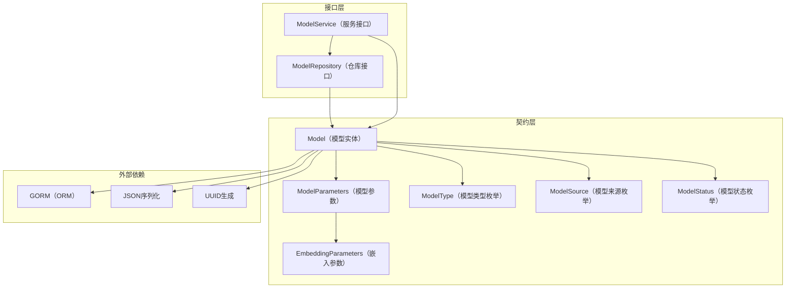

# model_catalog_and_parameter_contracts 模块技术深度解析

## 1. 模块概述

在多租户 AI 平台中，模型管理是一个核心挑战：不同租户可能需要使用不同提供商的模型（OpenAI、阿里云、智谱等），每种模型有不同的参数配置，同时还要处理模型的生命周期、访问权限和默认设置。`model_catalog_and_parameter_contracts` 模块正是为了解决这一问题而设计的。

**问题空间：**
- 如何统一管理来自不同提供商的异构模型？
- 如何在多租户环境下安全地隔离模型配置？
- 如何将模型元数据与具体的调用实现解耦？
- 如何处理不同模型类型（嵌入、重排序、对话等）的参数差异？

**该模块的核心价值：**
它提供了一套标准化的模型目录和参数契约，就像一个"模型图书馆"的目录系统——定义了书架分类（模型类型）、图书标签（模型元数据）和借阅规则（参数契约），而不关心图书的具体内容（模型实现细节）。

## 2. 核心架构与数据流

### 2.1 架构组件图



### 2.2 核心组件详解

#### 2.2.1 模型类型与元数据契约

**设计意图：**
通过强类型枚举（`ModelType`、`ModelSource`、`ModelStatus`）定义了模型的分类体系，避免了字符串配置的随意性。这就像给图书规定了标准的分类号和状态标签，让整个系统能够一致地理解和处理模型。

**核心枚举：**
- `ModelType`：区分模型功能（嵌入、重排序、知识问答、VLLM）
- `ModelSource`：标识模型提供商（本地、远程、阿里云、智谱等15种来源）
- `ModelStatus`：跟踪模型生命周期（活跃、下载中、下载失败）

#### 2.2.2 ModelParameters 与 EmbeddingParameters

**设计意图：**
这两个结构体采用了"参数分层"的设计模式：
- `ModelParameters` 包含通用的模型连接参数（BaseURL、APIKey、Provider等）
- `EmbeddingParameters` 专门处理嵌入模型特有的参数（维度、截断长度）

**关键设计决策：**
将嵌入参数作为 `ModelParameters` 的嵌套字段，而不是采用继承或独立配置。这种设计既保持了参数的逻辑分组，又避免了过度抽象——毕竟大多数模型不需要嵌入参数，只有嵌入模型才需要。

**数据库序列化：**
```go
// Value 实现 driver.Valuer 接口，将 ModelParameters 转换为数据库值
func (c ModelParameters) Value() (driver.Value, error) {
    return json.Marshal(c)
}

// Scan 实现 sql.Scanner 接口，将数据库值转换为 ModelParameters
func (c *ModelParameters) Scan(value interface{}) error {
    // ...
}
```
这种设计将复杂的参数结构序列化为 JSON 存储在数据库中，既保持了关系型数据库的简洁性，又支持灵活的参数扩展。

#### 2.2.3 Model 实体

**设计意图：**
`Model` 结构体是整个模块的核心，它封装了一个 AI 模型的完整元数据。

**关键字段设计：**
- `TenantID`：支持多租户隔离
- `IsDefault`：标记默认模型，简化使用体验
- `IsBuiltin`：支持系统内置模型（对所有租户可见）
- `Parameters`：嵌套的 `ModelParameters`，存储具体配置
- `Status`：跟踪模型下载/部署状态

**生命周期钩子：**
```go
func (m *Model) BeforeCreate(tx *gorm.DB) (err error) {
    m.ID = uuid.New().String()
    return nil
}
```
自动生成 UUID 确保了模型 ID 的全局唯一性，这在多租户环境和分布式系统中尤为重要。

#### 2.2.4 ModelRepository 与 ModelService 接口

**设计意图：**
采用了经典的"仓库-服务"分层模式，将数据访问与业务逻辑分离：

**ModelRepository（仓库接口）：**
- 负责纯数据访问操作（CRUD）
- 包含 `ClearDefaultByType` 这样的特定数据操作
- 所有方法都接受 `tenantID` 参数，确保租户隔离

**ModelService（服务接口）：**
- 构建在仓库之上，提供业务语义
- 包含 `GetEmbeddingModel`、`GetChatModel` 等工厂方法
- 支持跨租户模型访问（`GetEmbeddingModelForTenant`）

**关键设计决策：**
服务接口返回的是抽象接口（`embedding.Embedder`、`chat.Chat`、`rerank.Reranker`），而不是具体实现。这实现了"依赖倒置原则"——高层模块（服务层）不依赖低层模块（具体实现），两者都依赖抽象。

## 3. 设计决策与权衡

### 3.1 JSON 序列化 vs 关系型表设计

**选择：** 将 `ModelParameters` 序列化为 JSON 存储在单个字段中

**为什么这样做：**
- ✅ **灵活性：** 不同提供商的模型参数差异很大，JSON 可以轻松容纳这种差异
- ✅ **扩展性：** 添加新的参数不需要数据库迁移
- ✅ **简化 ORM 映射：** 避免了复杂的表关联

**权衡：**
- ❌ **查询能力受限：** 无法高效地查询特定参数值（如所有使用特定 BaseURL 的模型）
- ❌ **类型安全：** 数据库层面无法验证参数结构的正确性

**缓解措施：**
通过 Go 的结构体和 JSON 标签在应用层保证类型安全，同时将查询需求限制在元数据字段（Type、Source、TenantID 等）上。

### 3.2 枚举 vs 字符串配置

**选择：** 使用强类型枚举（`ModelType`、`ModelSource`、`ModelStatus`）

**为什么这样做：**
- ✅ **编译时检查：** 避免了拼写错误
- ✅ **自文档化：** 枚举值本身就是文档
- ✅ **IDE 支持：** 自动补全和重构支持

**权衡：**
- ❌ **添加新值需要重新编译：** 无法在运行时动态添加新的模型来源
- ❌ **数据库存储：** 本质上还是字符串存储，但有类型约束

### 3.3 嵌套参数结构 vs 扁平结构

**选择：** 将 `EmbeddingParameters` 嵌套在 `ModelParameters` 中

**为什么这样做：**
- ✅ **逻辑分组：** 嵌入参数只对嵌入模型有意义
- ✅ **避免字段污染：** 非嵌入模型不需要关心这些字段
- ✅ **可扩展性：** 未来可以轻松添加 `RerankParameters`、`ChatParameters` 等

**权衡：**
- ❌ **访问路径变长：** 需要通过 `model.Parameters.EmbeddingParameters.Dimension` 访问
- ❌ **序列化复杂度：** 需要处理嵌套结构的序列化

### 3.4 服务接口返回抽象接口 vs 具体实现

**选择：** 返回 `embedding.Embedder`、`chat.Chat` 等抽象接口

**为什么这样做：**
- ✅ **解耦：** 服务层不依赖具体的模型实现
- ✅ **可测试性：** 可以轻松 mock 这些接口进行单元测试
- ✅ **多态：** 不同提供商的模型可以统一处理

**权衡：**
- ❌ **接口爆炸：** 每种模型类型都需要一个接口
- ❌ **实现复杂度：** 需要为每个提供商实现这些接口

## 4. 数据流与依赖关系

### 4.1 典型数据流程

#### 场景1：创建新模型

```
HTTP 请求 → ModelService.CreateModel → ModelRepository.Create → 数据库
     ↓
BeforeCreate 钩子生成 UUID
     ↓
ModelParameters 序列化为 JSON
     ↓
持久化 Model 记录
```

#### 场景2：获取嵌入模型实例

```
调用者 → ModelService.GetEmbeddingModel → ModelRepository.GetByID
     ↓
从数据库加载 Model 记录
     ↓
反序列化 ModelParameters
     ↓
根据 Provider 创建具体的 embedding.Embedder 实现
     ↓
返回抽象接口
```

### 4.2 依赖关系分析

**该模块依赖：**
- `gorm.io/gorm`：ORM 映射和数据库操作
- `encoding/json`：参数序列化
- `github.com/google/uuid`：ID 生成
- `database/sql/driver`：自定义类型序列化

**该模块被依赖：**
- 应用服务层：通过 `ModelService` 接口使用模型
- 仓库实现层：实现 `ModelRepository` 接口
- HTTP 处理层：通过服务接口暴露模型管理 API

## 5. 新开发者注意事项

### 5.1 常见陷阱

1. **忘记租户隔离**
   - 陷阱：在调用仓库方法时忽略 `tenantID` 参数
   - 后果：可能导致跨租户数据泄露
   - 规避：始终检查 `tenantID` 是否正确传递

2. **参数序列化问题**
   - 陷阱：修改 `ModelParameters` 结构后忘记测试数据库读写
   - 后果：可能导致现有数据无法反序列化
   - 规避：添加向后兼容的字段，或编写数据迁移脚本

3. **默认模型设置**
   - 陷阱：在设置新的默认模型时忘记清除旧的默认标志
   - 后果：可能有多个模型被标记为默认
   - 规避：使用 `ClearDefaultByType` 方法确保只有一个默认模型

### 5.2 扩展点

1. **添加新的模型类型**
   - 在 `ModelType` 枚举中添加新值
   - 可能需要添加对应的参数结构（如 `RerankParameters`）
   - 在 `ModelService` 中添加对应的工厂方法

2. **添加新的模型来源**
   - 在 `ModelSource` 枚举中添加新值
   - 在 `ExtraConfig` 中添加提供商特定的配置
   - 确保服务层能正确处理新来源

3. **自定义参数验证**
   - 可以在 `ModelService` 实现中添加验证逻辑
   - 考虑使用验证库（如 `go-playground/validator`）

### 5.3 测试建议

1. **测试参数序列化**
   - 验证复杂的 `ModelParameters` 结构能正确读写
   - 测试向后兼容性（旧数据能被新代码读取）

2. **测试租户隔离**
   - 确保一个租户无法访问另一个租户的模型
   - 验证内置模型对所有租户可见

3. **测试默认模型逻辑**
   - 验证设置新默认模型时旧默认模型被清除
   - 测试清除默认模型时排除特定 ID 的功能

## 6. 子模块详解

本模块由以下三个核心子模块组成，每个子模块都有详细的技术文档：

### 6.1 模型目录服务与仓库接口
- **文档**：[model_catalog_service_and_repository_interfaces](core_domain_types_and_interfaces-identity_tenant_organization_and_configuration_contracts-model_catalog_and_parameter_contracts-model_catalog_service_and_repository_interfaces.md)
- **职责**：定义了模型管理的核心业务接口和数据访问契约，包括 `ModelService` 和 `ModelRepository` 接口
- **重点**：服务接口与仓库接口的分离设计、跨租户模型访问支持、抽象工厂模式的应用

### 6.2 LLM 模型参数契约
- **文档**：[llm_model_parameter_contracts](core_domain_types_and_interfaces-model_catalog_and_parameter_contracts-llm_model_parameter_contracts.md)
- **职责**：定义了模型参数的数据结构和序列化契约，包括 `Model`、`ModelParameters` 和 `EmbeddingParameters`
- **重点**：参数分层设计、JSON 序列化策略、多租户元数据管理、模型状态跟踪

### 6.3 嵌入参数契约
- **文档**：[embedding_parameter_contracts](core_domain_types_and_interfaces-identity_tenant_organization_and_configuration_contracts-model_catalog_and_parameter_contracts-embedding_parameter_contracts.md)
- **职责**：专门定义嵌入模型的参数契约，包括 `Dimension` 和 `TruncatePromptTokens` 等关键字段
- **重点**：向量维度管理、输入文本截断策略、与向量检索后端的集成

## 7. 总结

`model_catalog_and_parameter_contracts` 模块是整个系统的模型管理基石，它通过精心设计的契约和接口，实现了以下目标：

1. **统一模型管理**：通过强类型枚举和标准结构，统一了不同提供商模型的表示
2. **多租户支持**：从设计之初就考虑了租户隔离
3. **灵活扩展**：通过 JSON 序列化和接口抽象，支持轻松添加新的模型类型和提供商
4. **解耦实现**：通过服务接口和抽象工厂，将模型元数据与具体实现分离

这个模块的设计体现了"契约优于实现"的思想——它不关心模型如何工作，只关心模型如何被表示、存储和访问。这种设计使得系统能够在保持核心稳定的同时，灵活地适应不断变化的 AI 模型生态。

要深入了解各个子模块的实现细节和使用方法，请参考对应的子模块文档。
