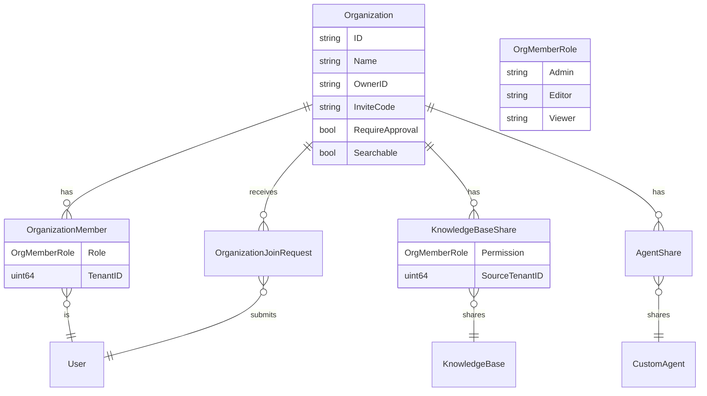

# organization_lifecycle_request_contracts 模块技术深度文档

## 1. 问题空间与模块目的

### 为什么需要这个模块？

在多租户、跨团队协作的知识管理系统中，我们面临一个核心挑战：如何在保持租户隔离的同时，实现资源的安全共享与协作？

想象一下这样的场景：
- 公司内部有多个部门（租户），每个部门有自己的知识库和智能体
- 跨部门项目需要共享某些知识库，但又不能暴露部门的全部资源
- 需要灵活的权限控制，让不同角色的用户拥有不同的操作能力
- 需要处理成员加入、权限升级、资源共享等复杂的协作流程

一个简单的解决方案可能是：
- 直接在用户间共享资源，但这会导致权限混乱和管理困难
- 使用静态的权限组，但无法适应动态的协作需求
- 完全开放，但会带来严重的安全隐患

### 设计洞察

这个模块的核心设计思想是：**引入"组织"作为中间协作层，在租户隔离的基础上实现资源共享**。通过将用户、资源和权限都关联到组织，我们可以：

- 在保持租户数据隔离的前提下，实现跨租户资源共享
- 提供细粒度的权限控制（admin/editor/viewer）
- 支持完整的成员生命周期管理（加入、审批、升级、移除）
- 支持资源共享的细粒度控制（知识库、智能体等）

## 2. 核心概念与心智模型

### 核心抽象

这个模块构建了几个关键的抽象概念：

1. **Organization（组织）**：协作的容器，拥有自己的成员、资源和规则
2. **OrgMemberRole（成员角色）**：定义权限级别的枚举，支持权限层次检查
3. **OrganizationMember（组织成员）**：用户与组织的关联，包含角色信息
4. **OrganizationJoinRequest（加入请求）**：处理成员加入和权限升级的工作流
5. **KnowledgeBaseShare/AgentShare（资源共享）**：资源与组织的关联，定义共享权限

### 心智模型：协作空间

你可以把 `Organization` 想象成一个**协作空间**或**项目房间**：

- **房间主人**（Owner）：创建房间，拥有完全控制权
- **管理员**（Admin）：可以管理成员和设置
- **编辑者**（Editor）：可以修改共享的内容
- **查看者**（Viewer）：只能查看和搜索

**资源共享**就像把你的物品放到这个共享空间里，你可以指定：
- 谁可以看到（权限级别）
- 谁可以修改（权限级别）
- 这个物品在空间里的展示方式

**加入请求**就像申请进入这个房间，可能需要：
- 邀请码（类似房间钥匙）
- 管理员审批（类似门房检查）
- 或者两者都需要

### 权限层次模型

权限设计采用了**层次化模型**：

```
Admin (3) > Editor (2) > Viewer (1)
```

这种设计有两个关键特性：
1. **权限继承**：高级角色自动拥有低级角色的所有权限
2. **权限比较**：可以通过 `HasPermission()` 方法轻松检查角色是否满足最低要求

## 3. 架构与数据流

### 模块架构

这个模块在整个系统架构中扮演着**契约定义层**的角色：

```
┌─────────────────────────────────────────────────────────────┐
│                    organization_lifecycle_request_contracts  │
│  ┌───────────────────────────────────────────────────────┐  │
│  │  Domain Models (Organization, OrganizationMember, ...) │  │
│  └───────────────────────────────────────────────────────┘  │
│  ┌───────────────────────────────────────────────────────┐  │
│  │  Request Types (CreateOrganizationRequest, ...)        │  │
│  └───────────────────────────────────────────────────────┘  │
│  ┌───────────────────────────────────────────────────────┐  │
│  │  Response Types (OrganizationResponse, ...)            │  │
│  └───────────────────────────────────────────────────────┘  │
└─────────────────────────────────────────────────────────────┘
                            ▲
                            │
        ┌───────────────────┼───────────────────┐
        │                   │                   │
        ▼                   ▼                   ▼
┌───────────────┐  ┌───────────────┐  ┌───────────────┐
│   HTTP Hand-  │  │   Application │  │   Data Access │
│    lers       │  │   Services    │  │  Repositories │
└───────────────┘  └───────────────┘  └───────────────┘
```

### 核心数据流转

让我们追踪一个典型的**创建组织并共享知识库**的完整流程：

1. **创建组织**
   ```
   CreateOrganizationRequest → Organization Service → Organization Repository → Database
   ```

2. **邀请成员**
   ```
   AddMemberRequest → Organization Service → OrganizationMember Repository → Database
   ```

3. **共享知识库**
   ```
   ShareKnowledgeBaseRequest → KnowledgeBaseShare Repository → Database
   ```

4. **成员访问共享资源**
   ```
   Access Request → Permission Check (min(SharePermission, UserRole)) → Resource Access
   ```

### 关键组件关系



## 4. 核心组件深度解析

### 4.1 OrgMemberRole - 权限系统的基石

```go
type OrgMemberRole string

const (
    OrgRoleAdmin   OrgMemberRole = "admin"
    OrgRoleEditor  OrgMemberRole = "editor"
    OrgRoleViewer  OrgMemberRole = "viewer"
)
```

**设计意图**：
- 使用字符串类型而非枚举，便于数据库存储和API交互
- 清晰的权限层次，支持权限继承

**关键方法**：

```go
func (r OrgMemberRole) HasPermission(required OrgMemberRole) bool
```

这个方法是整个权限系统的核心，它通过一个简单的映射表实现权限比较：

```go
roleLevel := map[OrgMemberRole]int{
    OrgRoleAdmin:  3,
    OrgRoleEditor: 2,
    OrgRoleViewer: 1,
}
return roleLevel[r] >= roleLevel[required]
```

**设计亮点**：
- 将权限检查逻辑封装在类型内部，符合面向对象设计原则
- 易于扩展新的权限级别（只需添加新的常量和映射）
- 调用者无需了解具体的权限数值，只需使用语义化的方法

### 4.2 Organization - 协作容器

```go
type Organization struct {
    ID                     string         `json:"id" gorm:"type:varchar(36);primaryKey"`
    Name                   string         `json:"name" gorm:"type:varchar(255);not null"`
    Description            string         `json:"description" gorm:"type:text"`
    Avatar                 string         `json:"avatar" gorm:"type:varchar(512)"`
    OwnerID                string         `json:"owner_id" gorm:"type:varchar(36);not null;index"`
    InviteCode             string         `json:"invite_code" gorm:"type:varchar(32);uniqueIndex"`
    InviteCodeExpiresAt    *time.Time     `json:"invite_code_expires_at" gorm:"type:timestamp with time zone"`
    InviteCodeValidityDays int            `json:"invite_code_validity_days" gorm:"default:7"`
    RequireApproval        bool           `json:"require_approval" gorm:"default:false"`
    Searchable             bool           `json:"searchable" gorm:"default:false"`
    MemberLimit            int            `json:"member_limit" gorm:"default:50"`
    // ...
}
```

**设计意图**：
- 完整的组织生命周期管理
- 灵活的加入策略配置
- 可发现性控制

**关键字段解析**：

| 字段 | 作用 | 设计考虑 |
|------|------|----------|
| `InviteCode` | 组织邀请码 | 支持无审批加入流程，使用唯一索引保证唯一性 |
| `InviteCodeValidityDays` | 邀请码有效期 | 支持临时邀请，增加安全性，默认7天 |
| `RequireApproval` | 是否需要审批 | 灵活的加入策略，可以选择开放或严格控制 |
| `Searchable` | 是否可搜索 | 支持组织发现，让用户可以主动找到感兴趣的组织 |
| `MemberLimit` | 成员上限 | 控制组织规模，0表示无限制，默认50人 |

### 4.3 OrganizationMember - 成员关系

```go
type OrganizationMember struct {
    ID             string         `json:"id" gorm:"type:varchar(36);primaryKey"`
    OrganizationID string         `json:"organization_id" gorm:"type:varchar(36);not null;index"`
    UserID         string         `json:"user_id" gorm:"type:varchar(36);not null;index"`
    TenantID       uint64         `json:"tenant_id" gorm:"not null;index"`
    Role           OrgMemberRole  `json:"role" gorm:"type:varchar(32);not null;default:'viewer'"`
    // ...
}
```

**设计亮点**：
- **多维度索引**：同时索引 OrganizationID、UserID、TenantID，支持各种查询场景
- **租户隔离**：记录成员所属的 TenantID，支持跨租户协作时的身份追踪
- **默认角色**：新成员默认为 viewer，遵循最小权限原则

### 4.4 OrganizationJoinRequest - 工作流管理

```go
type OrganizationJoinRequest struct {
    ID             string            `json:"id" gorm:"type:varchar(36);primaryKey"`
    OrganizationID string            `json:"organization_id" gorm:"type:varchar(36);not null;index"`
    UserID         string            `json:"user_id" gorm:"type:varchar(36);not null;index"`
    TenantID       uint64            `json:"tenant_id" gorm:"not null"`
    RequestType    JoinRequestType   `json:"request_type" gorm:"type:varchar(32);not null;default:'join';index"`
    PrevRole       OrgMemberRole     `json:"prev_role" gorm:"column:prev_role;type:varchar(32)"`
    RequestedRole  OrgMemberRole     `json:"requested_role" gorm:"type:varchar(32);not null;default:'viewer'"`
    Status         JoinRequestStatus `json:"status" gorm:"type:varchar(32);not null;default:'pending';index"`
    Message        string            `json:"message" gorm:"type:text"`
    ReviewedBy     string            `json:"reviewed_by" gorm:"type:varchar(36)"`
    ReviewedAt     *time.Time        `json:"reviewed_at"`
    ReviewMessage  string            `json:"review_message" gorm:"type:text"`
    // ...
}
```

**设计意图**：
- **统一的请求模型**：同时支持"加入请求"和"权限升级请求"
- **完整的审计追踪**：记录谁、在什么时候、做了什么决定
- **灵活的工作流**：支持消息传递，让申请和审批过程更人性化

**关键设计决策**：
1. **使用 RequestType 区分请求类型**：
   - 优点：可以复用同一套审批流程
   - 缺点：部分字段只对特定类型有意义（如 PrevRole 只对升级请求有意义）

2. **完整的审计字段**：
   - 记录审核人、审核时间、审核消息
   - 支持后续的责任追溯和合规检查

### 4.5 资源共享模型

#### KnowledgeBaseShare
```go
type KnowledgeBaseShare struct {
    ID               string         `json:"id" gorm:"type:varchar(36);primaryKey"`
    KnowledgeBaseID  string         `json:"knowledge_base_id" gorm:"type:varchar(36);not null;index"`
    OrganizationID   string         `json:"organization_id" gorm:"type:varchar(36);not null;index"`
    SharedByUserID   string         `json:"shared_by_user_id" gorm:"type:varchar(36);not null"`
    SourceTenantID   uint64         `json:"source_tenant_id" gorm:"not null;index"`
    Permission       OrgMemberRole  `json:"permission" gorm:"type:varchar(32);not null;default:'viewer'"`
    // ...
}
```

**设计亮点**：
- **SourceTenantID 记录**：支持跨租户资源访问时的权限验证和计费
- **SharedByUserID 记录**：追踪是谁共享的资源，便于管理和追责
- **独立的 Permission 字段**：资源共享权限与用户在组织中的角色分离，实现更细粒度的控制

#### 有效权限计算

这是一个关键的隐式设计：**用户对共享资源的有效权限是资源共享权限和用户组织角色的最小值**

```
有效权限 = min(资源共享权限, 用户组织角色)
```

例如：
- 如果资源以 editor 权限共享，但用户只是 viewer，则用户只能以 viewer 权限访问
- 如果用户是 admin，但资源只以 viewer 权限共享，则用户也只能以 viewer 权限访问

这种设计确保了：
1. 资源所有者不会意外暴露过高的权限
2. 组织管理员可以控制成员能做什么

### 4.6 请求/响应契约

#### CreateOrganizationRequest
```go
type CreateOrganizationRequest struct {
    Name                   string `json:"name" binding:"required,min=1,max=255"`
    Description            string `json:"description" binding:"max=1000"`
    Avatar                 string `json:"avatar" binding:"omitempty,max=512"`
    InviteCodeValidityDays *int   `json:"invite_code_validity_days"`
    MemberLimit            *int   `json:"member_limit"`
}
```

**设计特点**：
- **使用 binding 标签进行验证**：在请求到达业务逻辑前进行验证，提前拦截无效请求
- **合理的默认值**：如 InviteCodeValidityDays 默认为 7，MemberLimit 默认为 50
- **指针类型表示可选字段**：使用指针可以区分"未设置"和"设置为空值"

#### UpdateOrganizationRequest
```go
type UpdateOrganizationRequest struct {
    Name                   *string `json:"name" binding:"omitempty,min=1,max=255"`
    Description            *string `json:"description" binding:"omitempty,max=1000"`
    Avatar                 *string `json:"avatar" binding:"omitempty,max=512"`
    RequireApproval        *bool   `json:"require_approval"`
    Searchable             *bool   `json:"searchable"`
    InviteCodeValidityDays *int    `json:"invite_code_validity_days"`
    MemberLimit            *int    `json:"member_limit"`
}
```

**关键设计**：
- **全部字段都是指针**：支持部分更新，只有非 nil 的字段会被更新
- **omitempty 验证**：如果字段为 nil，则跳过验证，符合部分更新的语义

#### OrganizationResponse
```go
type OrganizationResponse struct {
    ID                      string     `json:"id"`
    Name                    string     `json:"name"`
    Description             string     `json:"description"`
    Avatar                  string     `json:"avatar,omitempty"`
    OwnerID                 string     `json:"owner_id"`
    InviteCode              string     `json:"invite_code,omitempty"`
    InviteCodeExpiresAt     *time.Time `json:"invite_code_expires_at,omitempty"`
    InviteCodeValidityDays  int        `json:"invite_code_validity_days"`
    RequireApproval         bool       `json:"require_approval"`
    Searchable              bool       `json:"searchable"`
    MemberLimit             int        `json:"member_limit"`
    MemberCount             int        `json:"member_count"`
    ShareCount              int        `json:"share_count"`
    AgentShareCount         int        `json:"agent_share_count"`
    PendingJoinRequestCount int        `json:"pending_join_request_count"`
    IsOwner                 bool       `json:"is_owner"`
    MyRole                  string     `json:"my_role,omitempty"`
    HasPendingUpgrade       bool       `json:"has_pending_upgrade"`
    CreatedAt               time.Time  `json:"created_at"`
    UpdatedAt               time.Time  `json:"updated_at"`
}
```

**设计亮点**：
1. **上下文相关的字段**：
   - `IsOwner`、`MyRole`、`HasPendingUpgrade` 都是根据当前请求用户动态计算的
   - 同一个组织，不同用户看到的这些字段值可能不同

2. **聚合统计字段**：
   - `MemberCount`、`ShareCount`、`AgentShareCount`、`PendingJoinRequestCount`
   - 减少客户端需要发起的额外请求

3. **条件可见性**：
   - `InviteCode` 使用 `omitempty`，可能只对管理员可见
   - `PendingJoinRequestCount` 只对管理员可见

## 5. 依赖分析

### 依赖关系

这个模块是一个**底层契约模块**，它的依赖非常简单：

```
organization_lifecycle_request_contracts
  ├── gorm.io/gorm (用于数据库映射标签)
  └── time (标准库)
```

**设计优势**：
-  minimal dependencies，降低了耦合度
-  可以被上层模块轻松引用，不会引入过多的传递依赖

### 被依赖情况

根据架构，这个模块会被以下类型的模块依赖：

1. **HTTP 处理层**：使用请求/响应类型进行 API 契约定义
2. **应用服务层**：使用领域模型和请求/响应类型进行业务逻辑处理
3. **数据访问层**：使用领域模型进行数据库操作

### 数据契约

这个模块定义了几个关键的数据契约：

1. **请求验证契约**：通过 `binding` 标签定义
2. **数据库映射契约**：通过 `gorm` 标签定义
3. **API 序列化契约**：通过 `json` 标签定义

**三层标签的设计考量**：

```go
type Organization struct {
    ID   string `json:"id" gorm:"type:varchar(36);primaryKey"`
    Name string `json:"name" gorm:"type:varchar(255);not null"`
}
```

- **json 标签**：定义 API 契约，控制什么字段暴露给客户端
- **gorm 标签**：定义数据库契约，控制如何存储数据
- **binding 标签**（在请求类型中）：定义验证契约，控制什么是有效输入

这种分离使得每一层都可以独立演进，同时通过同一个结构体保持一致性。

## 6. 设计决策与权衡

### 6.1 权限模型：层次化 vs 细粒度

**选择**：层次化权限模型（Admin > Editor > Viewer）

**权衡分析**：

| 维度 | 层次化模型 | 细粒度权限 |
|------|-----------|-----------|
| 简单性 | ✅ 简单直观 | ❌ 复杂，需要管理大量权限 |
| 灵活性 | ❌ 受限，只有3个级别 | ✅ 可以精确控制每个操作 |
| 可理解性 | ✅ 用户容易理解 | ❌ 用户可能困惑 |
| 实现成本 | ✅ 低成本 | ❌ 高成本 |

**为什么选择层次化？**
- 对于协作场景，大多数情况下3个级别已经足够
- 简单的模型更容易正确实现，减少安全漏洞
- 用户体验更好，不需要理解复杂的权限矩阵

**扩展性考虑**：
如果未来需要更细粒度的控制，可以在现有模型基础上扩展，例如：
- 保持层次化作为基础
- 添加可选的细粒度权限覆盖

### 6.2 可选字段：指针 vs 零值

**选择**：使用指针表示可选字段

**权衡分析**：

```go
// 指针方式
type UpdateOrganizationRequest struct {
    Name *string `json:"name"`
}

// 零值方式
type UpdateOrganizationRequest struct {
    Name string `json:"name"`
    UpdateName bool `json:"update_name"`
}
```

| 维度 | 指针方式 | 零值+标志方式 |
|------|---------|--------------|
| 简洁性 | ✅ 一个字段搞定 | ❌ 需要两个字段 |
| 直观性 | ✅ nil 自然表示"未设置" | ❌ 需要额外的标志字段 |
| 安全性 | ⚠️ 可能有空指针异常 | ✅ 更安全 |
| JSON 序列化 | ✅ 原生支持 omitempty | ❌ 需要自定义处理 |

**为什么选择指针？**
- Go 语言的惯用法
- 与 JSON 序列化的 omitempty 配合良好
- 代码更简洁，可读性更好

**风险缓解**：
- 在业务逻辑层进行 nil 检查
- 使用辅助方法安全地获取值

### 6.3 邀请码机制：单一用途 vs 多用途

**选择**：多用途邀请码 + 可选过期时间

**权衡分析**：

| 维度 | 多用途邀请码 | 单一用途邀请码 |
|------|------------|--------------|
| 便利性 | ✅ 一个码可以邀请多人 | ❌ 每个邀请需要新码 |
| 安全性 | ⚠️ 码泄露可能导致多人加入 | ✅ 泄露影响有限 |
| 管理成本 | ✅ 低，无需管理大量码 | ❌ 高，需要生成和追踪 |

**为什么选择多用途？**
- 对于内部协作场景，便利性更重要
- 通过过期时间和审批机制可以缓解安全风险
- 支持"公开招募"模式，让任何人都可以申请加入

**安全措施**：
1. 可设置过期时间
2. 可要求审批
3. 可随时重新生成邀请码

### 6.4 资源共享权限：独立控制 vs 继承用户角色

**选择**：独立控制 + 有效权限计算

**设计**：
```
有效权限 = min(资源共享权限, 用户组织角色)
```

**为什么这样设计？**

1. **保护资源所有者**：资源所有者可以控制资源的最大权限，不会因为用户是组织管理员就暴露过高权限

2. **保护组织管理员**：组织管理员可以控制成员的最大权限，不会因为资源共享权限高就允许成员越权操作

3. **最小权限原则**：最终权限取两者的最小值，确保用户只有完成工作所需的最小权限

**权衡**：
- ✅ 安全性更高
- ⚠️ 理解成本稍高，需要向用户解释有效权限的计算方式

## 7. 使用指南与最佳实践

### 7.1 权限检查最佳实践

**不要这样做**：
```go
if member.Role == OrgRoleAdmin {
    // 执行管理操作
}
```

**应该这样做**：
```go
if member.Role.HasPermission(OrgRoleAdmin) {
    // 执行管理操作
}
```

**原因**：
- 使用 `HasPermission` 可以正确处理权限层次
- 即使未来添加新的角色级别，代码仍然正常工作

### 7.2 有效权限计算

当需要计算用户对共享资源的有效权限时：

```go
func CalculateEffectivePermission(userRole, sharePermission OrgMemberRole) OrgMemberRole {
    if userRole.HasPermission(sharePermission) {
        return sharePermission
    }
    return userRole
}
```

### 7.3 部分更新的处理

处理更新请求时，要检查字段是否为 nil：

```go
func UpdateOrganization(org *Organization, req *UpdateOrganizationRequest) {
    if req.Name != nil {
        org.Name = *req.Name
    }
    if req.Description != nil {
        org.Description = *req.Description
    }
    // ...
}
```

### 7.4 邀请码生成

生成邀请码时，应该考虑：

```go
import (
    "crypto/rand"
    "encoding/hex"
)

func GenerateInviteCode(length int) (string, error) {
    bytes := make([]byte, length/2)
    _, err := rand.Read(bytes)
    if err != nil {
        return "", err
    }
    return hex.EncodeToString(bytes), nil
}
```

**注意**：
- 使用加密安全的随机数生成器
- 邀请码应该足够长（建议16-32字符）
- 检查数据库中是否已存在（使用唯一索引）

## 8. 注意事项与陷阱

### 8.1 隐式契约：有效权限计算

**陷阱**：容易忘记有效权限是资源共享权限和用户角色的最小值

**后果**：
- 可能给用户过高的权限
- 或者给用户过低的权限，导致功能无法使用

**缓解**：
- 在文档中明确说明有效权限的计算方式
- 在代码中添加注释
- 编写单元测试覆盖各种组合

### 8.2 邀请码过期处理

**陷阱**：邀请码过期时间是可选的，nil 表示永不过期

**常见错误**：
```go
// 错误：只检查非 nil 的情况
if inviteCodeExpiresAt != nil && time.Now().Before(*inviteCodeExpiresAt) {
    // 邀请码有效
}

// 正确：处理 nil 的情况
inviteValid := true
if inviteCodeExpiresAt != nil {
    inviteValid = time.Now().Before(*inviteCodeExpiresAt)
}
```

### 8.3 成员上限检查

**陷阱**：MemberLimit = 0 表示无限制，不是限制为0

**常见错误**：
```go
// 错误：没有处理 0 的情况
if memberCount >= org.MemberLimit {
    return errors.New("member limit reached")
}

// 正确：处理 0 的情况
if org.MemberLimit > 0 && memberCount >= org.MemberLimit {
    return errors.New("member limit reached")
}
```

### 8.4 所有者权限

**陷阱**：组织所有者应该始终拥有完全权限，不受角色限制

**设计考虑**：
- OwnerID 字段明确标识所有者
- 在权限检查时，应该特殊处理所有者
- 所有者不应该被降级或移除（除非转让所有权）

### 8.5 软删除

**陷阱**：Organization、KnowledgeBaseShare、AgentShare 都使用软删除

**注意事项**：
- 查询时需要考虑软删除的记录
- 唯一索引需要包含 DeletedAt（如果使用 GORM 的软删除）
- 统计数量时要排除已删除的记录

## 9. 扩展点与未来演进

### 9.1 可能的扩展方向

1. **更多的权限级别**：
   - 可以在现有模型基础上添加新的角色
   - 例如：Moderator（管理员）、Contributor（贡献者）等

2. **更细粒度的资源权限**：
   - 目前资源权限是整体的（viewer/editor/admin）
   - 未来可以添加针对特定操作的权限（如：可以搜索但不能下载）

3. **组织层次结构**：
   - 目前组织是扁平的
   - 未来可以支持父组织/子组织的层次结构

4. **更丰富的加入策略**：
   - 目前支持邀请码和审批
   - 未来可以添加域名限制、IP限制等

### 9.2 设计的扩展性

当前设计已经为未来扩展做好了准备：

1. **OrgMemberRole 使用字符串类型**：添加新角色不需要改变类型系统
2. **HasPermission 方法封装权限逻辑**：权限计算逻辑集中在一处，易于修改
3. **请求/响应类型使用指针**：可以轻松添加新字段而不破坏兼容性
4. **组织设置使用独立字段**：可以轻松添加新的设置项

## 10. 总结

`organization_lifecycle_request_contracts` 模块是整个组织协作功能的基石，它通过精心设计的领域模型和数据契约，解决了多租户环境下的跨团队协作问题。

**关键设计理念**：
1. **组织作为协作容器**：在租户隔离和资源共享之间找到平衡
2. **层次化权限模型**：简单但足够强大，易于理解和实现
3. **双重权限控制**：有效权限取资源权限和用户角色的最小值
4. **灵活的加入策略**：支持邀请码、审批、可搜索等多种模式
5. **完整的审计追踪**：记录谁在什么时候做了什么

**这个模块的价值**：
- 定义了清晰的 API 契约，让前后端开发可以并行进行
- 提供了可复用的领域模型，避免了重复定义
- 封装了权限逻辑，让业务代码更简洁
- 为整个组织协作功能奠定了坚实的基础

作为一个新加入团队的工程师，理解这个模块的设计理念和权衡，将帮助你更好地理解整个系统的协作功能，并在需要时做出正确的扩展决策。
