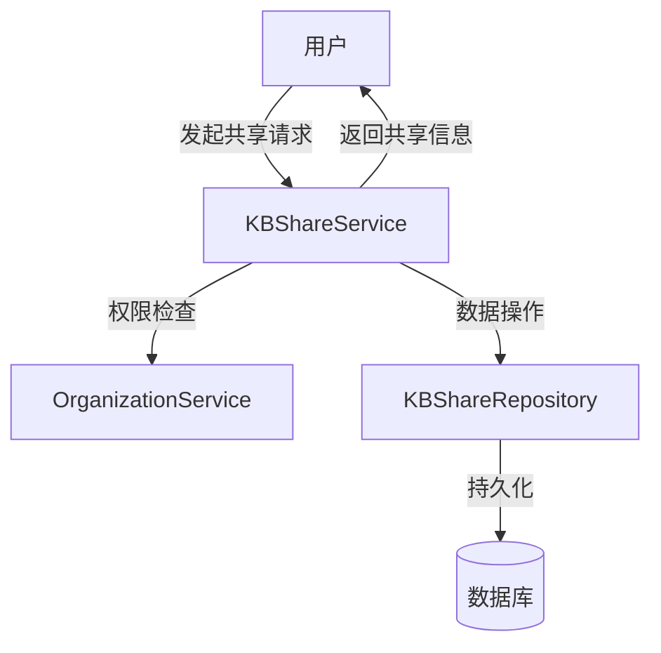

# 知识库共享服务与仓库接口技术深潜

## 1. 为什么需要这个模块？

在多租户、多组织的协作环境中，知识库的安全共享是一个核心挑战。想象一下：一个企业有多个团队（组织），每个团队都有自己的知识库，但有时需要将特定知识库共享给其他团队使用，同时还要保持严格的权限控制。

**问题空间**：
- 如何在不同组织间安全地共享知识库？
- 如何确保只有授权用户才能访问共享的知识库？
- 如何灵活地管理共享权限（只读、编辑等）？
- 如何处理跨租户的知识库访问场景？

**设计洞察**：
这个模块通过将"共享关系"抽象为独立的领域概念，解决了上述问题。它不是直接修改知识库的权限配置，而是创建了一个中间层——知识库共享记录，来管理组织与知识库之间的访问关系。这种设计使得：
- 共享关系可以独立于知识库本身进行管理
- 权限检查可以集中化和标准化
- 可以支持复杂的跨组织、跨租户协作场景

## 2. 核心抽象与架构

### 2.1 核心概念

- **KnowledgeBaseShare（知识库共享记录）**：表示一个知识库与一个组织之间的共享关系，包含权限级别等信息
- **KBShareService**：定义知识库共享的业务逻辑接口
- **KBShareRepository**：定义知识库共享数据的持久化接口

### 2.2 架构图



### 2.3 设计模式

这个模块采用了经典的**分层架构**和**仓储模式**：
- **服务层（KBShareService）**：封装业务逻辑，处理权限验证、业务规则执行
- **仓储层（KBShareRepository）**：抽象数据访问，提供CRUD操作接口
- **依赖倒置**：高层模块（服务层）依赖于抽象接口，而不是具体实现

## 3. 核心组件详解

### 3.1 KBShareService 接口

`KBShareService` 是知识库共享功能的核心服务接口，它定义了所有与知识库共享相关的业务操作。

#### 主要功能区域

1. **共享管理**
   - `ShareKnowledgeBase`：创建知识库共享
   - `UpdateSharePermission`：更新共享权限
   - `RemoveShare`：移除共享

2. **查询功能**
   - `ListSharesByKnowledgeBase`：列出知识库的所有共享
   - `ListSharesByOrganization`：列出组织获得的所有共享
   - `ListSharedKnowledgeBases`：列出用户可访问的所有共享知识库
   - `ListSharedKnowledgeBasesInOrganization`：列出组织内用户可访问的共享知识库
   - `ListSharedKnowledgeBaseIDsByOrganizations`：批量获取多个组织的共享知识库ID
   - `GetShare`：获取单个共享记录
   - `GetShareByKBAndOrg`：通过知识库和组织获取共享记录

3. **权限检查**
   - `CheckUserKBPermission`：检查用户对知识库的权限
   - `HasKBPermission`：判断用户是否具有指定权限

4. **辅助功能**
   - `GetKBSourceTenant`：获取知识库的源租户（用于跨租户嵌入）
   - `CountSharesByKnowledgeBaseIDs`：批量统计知识库的共享数量
   - `CountByOrganizations`：按组织统计共享数量

#### 设计意图

这个接口的设计体现了几个重要原则：
- **功能完整性**：覆盖了共享管理的全生命周期
- **查询灵活性**：提供了多种维度的查询方式，支持不同的业务场景
- **权限中心化**：将权限检查集中在服务层，确保一致性
- **性能优化**：提供批量操作接口，减少数据库往返

### 3.2 KBShareRepository 接口

`KBShareRepository` 定义了知识库共享数据的持久化操作接口，它抽象了底层数据存储的细节。

#### 主要功能区域

1. **CRUD操作**
   - `Create`：创建共享记录
   - `GetByID`：通过ID获取共享记录
   - `GetByKBAndOrg`：通过知识库和组织获取共享记录
   - `Update`：更新共享记录
   - `Delete`：删除共享记录

2. **级联删除**
   - `DeleteByKnowledgeBaseID`：软删除知识库的所有共享
   - `DeleteByOrganizationID`：软删除组织的所有共享

3. **列表查询**
   - `ListByKnowledgeBase`：按知识库列出共享
   - `ListByOrganization`：按组织列出共享
   - `ListByOrganizations`：批量按组织列出共享
   - `ListSharedKBsForUser`：列出用户可访问的共享知识库

4. **统计功能**
   - `CountSharesByKnowledgeBaseID`：统计单个知识库的共享数
   - `CountSharesByKnowledgeBaseIDs`：批量统计知识库的共享数
   - `CountByOrganizations`：按组织统计共享数

#### 设计意图

仓储接口的设计考虑了以下几点：
- **软删除支持**：通过 `DeleteByKnowledgeBaseID` 和 `DeleteByOrganizationID` 方法支持软删除，保留历史记录
- **批量操作**：提供批量查询和统计方法，优化性能
- **查询优化**：针对常见查询模式提供专门的方法
- **数据完整性**：通过级联删除方法确保数据一致性

## 4. 数据流向与依赖关系

### 4.1 主要数据流

1. **创建共享流程**
   ```
   用户请求 → KBShareService.ShareKnowledgeBase 
   → 权限验证（检查用户是否有共享权限）
   → KBShareRepository.Create 
   → 持久化存储
   → 返回共享记录
   ```

2. **权限检查流程**
   ```
   业务请求 → KBShareService.HasKBPermission 
   → KBShareRepository 查询共享记录
   → OrganizationService 检查用户组织关系
   → 返回权限判断结果
   ```

3. **查询共享知识库流程**
   ```
   用户请求 → KBShareService.ListSharedKnowledgeBases 
   → KBShareRepository.ListSharedKBsForUser 
   → 过滤和组装数据
   → 返回共享知识库列表
   ```

### 4.2 依赖关系

- **被依赖模块**：
  - [organization_resource_sharing_and_access_control_contracts-knowledge_base_sharing_contracts-knowledge_base_sharing_domain_and_response_models](core_domain_types_and_interfaces-identity_tenant_organization_and_configuration_contracts-organization_resource_sharing_and_access_control_contracts-knowledge_base_sharing_contracts-knowledge_base_sharing_domain_and_response_models.md)：提供领域模型和响应类型
  - [organization_resource_sharing_and_access_control_contracts-knowledge_base_sharing_contracts-knowledge_base_sharing_request_contracts](core_domain_types_and_interfaces-identity_tenant_organization_and_configuration_contracts-organization_resource_sharing_and_access_control_contracts-knowledge_base_sharing_contracts-knowledge_base_sharing_request_contracts.md)：提供请求类型
  - [organization_governance_membership_and_join_workflow_contracts](core_domain_types_and_interfaces-identity_tenant_organization_and_configuration_contracts-organization_governance_membership_and_join_workflow_contracts.md)：提供组织服务接口

- **依赖此模块的模块**：
  - [data_access_repositories-identity_tenant_and_organization_repositories-organization_membership_sharing_and_access_control_repositories-shared_resource_access_repositories-knowledge_base_share_access_repository](data_access_repositories-identity_tenant_and_organization_repositories-organization_membership_sharing_and_access_control_repositories-shared_resource_access_repositories-knowledge_base_share_access_repository.md)：实现仓储接口
  - [application_services_and_orchestration-agent_identity_tenant_and_configuration_services-resource_sharing_and_access_services-knowledge_base_sharing_access_service](application_services_and_orchestration-agent_identity_tenant_and_configuration_services-resource_sharing_and_access_services-knowledge_base_sharing_access_service.md)：实现服务接口

## 5. 设计决策与权衡

### 5.1 软删除 vs 硬删除

**决策**：采用软删除策略

**原因**：
- 保留共享历史记录，便于审计和追溯
- 支持"撤销删除"操作
- 避免因误删除导致的数据丢失

**权衡**：
- 增加了存储成本
- 查询时需要过滤已删除记录
- 需要定期清理真正不需要的历史数据

### 5.2 服务层与仓储层分离

**决策**：严格分离服务层和仓储层

**原因**：
- 职责清晰：服务层处理业务逻辑，仓储层处理数据访问
- 便于测试：可以单独测试业务逻辑而不需要真实数据库
- 灵活性：可以更换仓储实现而不影响业务逻辑

**权衡**：
- 增加了代码量
- 简单场景下可能显得过度设计

### 5.3 权限模型设计

**决策**：复用组织成员角色（OrgMemberRole）作为共享权限

**原因**：
- 保持权限模型的一致性
- 减少概念复杂度
- 便于理解和使用

**权衡**：
- 可能无法满足某些特殊的共享权限需求
- 权限粒度受限于组织角色定义

### 5.4 批量操作支持

**决策**：提供批量查询和统计接口

**原因**：
- 性能优化：减少数据库往返次数
- 支持侧边栏计数等常见场景
- 提升用户体验

**权衡**：
- 接口复杂度增加
- 需要处理部分失败的情况

## 6. 使用指南与最佳实践

### 6.1 创建知识库共享

```go
// 创建知识库共享
share, err := kbShareService.ShareKnowledgeBase(
    ctx,
    "kb-123",           // 知识库ID
    "org-456",          // 组织ID
    "user-789",         // 操作用户ID
    1001,               // 租户ID
    types.OrgMemberRoleMember, // 权限级别
)
if err != nil {
    // 处理错误
}
```

### 6.2 检查用户权限

```go
// 检查用户是否有编辑权限
hasPermission, err := kbShareService.HasKBPermission(
    ctx,
    "kb-123",
    "user-789",
    types.OrgMemberRoleAdmin,
)
if err != nil {
    // 处理错误
}
if !hasPermission {
    // 权限不足
}
```

### 6.3 最佳实践

1. **始终进行权限检查**：在执行任何共享操作前，确保用户有相应权限
2. **使用批量操作**：在需要处理多个知识库或组织时，优先使用批量接口
3. **妥善处理错误**：特别是权限相关的错误，要给用户清晰的反馈
4. **注意跨租户场景**：在处理跨租户共享时，确保正确获取源租户信息

## 7. 注意事项与潜在陷阱

### 7.1 常见陷阱

1. **忘记检查组织成员资格**：用户必须是目标组织的成员才能访问共享的知识库
2. **忽略软删除状态**：查询时要确保过滤掉已删除的共享记录
3. **权限级别混淆**：注意区分组织角色和共享权限，它们虽然使用同一类型，但语义不同
4. **跨租户数据隔离**：在处理跨租户场景时，要特别注意数据隔离和安全性

### 7.2 性能考虑

1. **批量查询 vs 单次查询**：对于大量数据，批量查询通常更高效
2. **缓存策略**：对于频繁访问的共享信息，可以考虑添加缓存层
3. **索引优化**：确保数据库表在 kb_id、org_id、user_id 等字段上有适当的索引

### 7.3 安全注意事项

1. **权限验证**：所有共享操作都必须经过严格的权限验证
2. **输入验证**：验证所有输入参数，防止注入攻击
3. **审计日志**：记录所有共享操作，便于安全审计
4. **数据加密**：敏感数据在存储和传输过程中应进行加密

## 8. 扩展与演进

### 8.1 可能的扩展方向

1. **更细粒度的权限控制**：支持比组织角色更细粒度的共享权限
2. **时间限制的共享**：支持设置共享的有效期
3. **共享审批流程**：添加共享请求和审批机制
4. **共享策略模板**：支持预定义的共享策略模板
5. **共享活动通知**：当共享发生变化时通知相关用户

### 8.2 与其他模块的集成

1. **与知识库管理模块集成**：确保知识库删除时正确处理共享关系
2. **与组织管理模块集成**：同步组织成员变化对共享权限的影响
3. **与审计日志模块集成**：记录所有共享相关的操作
4. **与通知模块集成**：实现共享变化的通知功能

## 9. 总结

`knowledge_base_sharing_service_and_repository_interfaces` 模块是实现多组织、多租户环境下知识库安全共享的核心基础设施。它通过清晰的接口定义、分层架构和完善的功能设计，为上层应用提供了强大而灵活的知识库共享能力。

理解这个模块的关键在于把握以下几点：
- 共享关系是独立的领域概念
- 服务层负责业务逻辑和权限控制
- 仓储层负责数据持久化
- 软删除、批量操作等设计决策都是为了平衡功能、性能和可维护性

对于新加入的团队成员，建议先理解核心概念和接口设计，然后通过实际使用场景来加深理解，同时注意避免常见的陷阱和性能问题。
