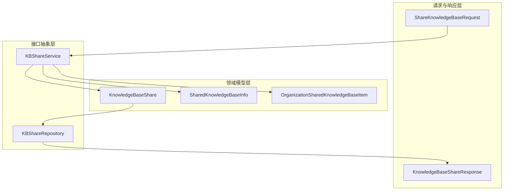

# 知识库共享合约模块

## 概述

**知识共享的基础设施**

想象一下这样的场景：您在一个团队中工作，每个人都有自己的知识库，但您需要与同事共享其中一个知识库，以便他们可以搜索、编辑或管理它。这个模块就是解决这个问题的——它提供了一套完整的合约和抽象，用于管理知识库在组织内部的共享，包括权限控制、访问管理和资源可见性。

这个模块不是一个独立的服务，而是定义了**知识库共享功能的契约**：它规定了数据结构应该是什么样子、服务应该提供什么功能、仓库应该如何操作数据。实际的业务逻辑会在其他模块中实现，但这个模块确保了所有实现都遵循相同的接口。

## 架构概览



这个架构体现了典型的**分层设计**思想：

1. **请求与响应层**：定义了 API 交互的数据结构，确保输入输出格式的一致性
2. **领域模型层**：核心业务实体，代表知识库共享关系的本质
3. **接口抽象层**：定义了服务和仓库的契约，实现了业务逻辑与数据持久化的解耦

数据流向是清晰的：API 请求通过服务接口进入，服务操作领域模型，仓库负责数据持久化，最终通过响应结构返回结果。

## 核心组件解析

### 1. 领域模型

#### KnowledgeBaseShare

这是模块的核心实体，代表一个知识库到组织的共享关系。它不仅记录了"谁共享了什么"，还包含了权限级别和来源租户信息。

**设计亮点**：
- `SourceTenantID` 字段：支持跨租户共享，这是多租户系统中非常重要的设计
- 软删除机制：使用 `DeletedAt` 字段，保留共享历史记录
- 权限与组织成员角色复用：使用相同的 `OrgMemberRole` 类型，保持权限模型的一致性

```go
// 关键字段说明
type KnowledgeBaseShare struct {
    ID                  string           // 共享记录的唯一标识
    KnowledgeBaseID     string           // 被共享的知识库ID
    OrganizationID      string           // 接收共享的组织ID
    SharedByUserID      string           // 执行共享操作的用户ID
    SourceTenantID      uint64           // 知识库的原始租户ID（跨租户访问关键）
    Permission          OrgMemberRole    // 共享权限级别
    // ... 时间戳和关联字段
}
```

#### SharedKnowledgeBaseInfo

这个结构体是一个**数据传输对象（DTO）**，它将知识库信息与共享信息组合在一起，方便前端展示。

**设计意图**：
- 聚合显示：一次性提供知识库本身和共享关系的信息
- 组织上下文：包含组织名称，让用户知道这个知识库是从哪个组织共享的
- 时间戳：记录共享时间，提供审计信息

#### OrganizationSharedKnowledgeBaseItem

这是一个更复杂的 DTO，用于在组织范围内列出共享知识库。

**特殊设计**：
- `IsMine` 字段：标识知识库是否属于当前用户
- `SourceFromAgent` 字段：支持"通过智能体可见"的知识库，这是一个重要的扩展点——知识库不仅可以直接共享，还可以通过共享的智能体间接访问

### 2. 请求与响应

#### ShareKnowledgeBaseRequest

这个结构体定义了共享知识库的请求格式，非常简洁但功能完整。

```go
type ShareKnowledgeBaseRequest struct {
    OrganizationID string        `json:"organization_id" binding:"required"`
    Permission     OrgMemberRole `json:"permission" binding:"required"`
}
```

**设计选择**：
- 知识库 ID 不在请求体中，而是通过 URL 路径传递，这符合 RESTful 设计原则
- 使用 `binding:"required"` 标签进行验证，确保请求的完整性

#### KnowledgeBaseShareResponse

响应结构体非常丰富，它包含了多方信息：
- 共享记录本身的信息
- 知识库的基本信息（名称、类型、数量统计）
- 组织信息
- 共享者信息
- 当前用户的权限上下文

**关键设计**：
- `MyPermission` 字段：这是实际生效的权限，是共享权限和用户在组织中角色的交集（取最小值）
- `MyRoleInOrg` 字段：提供上下文信息，让用户理解为什么自己有这个权限

### 3. 服务接口

#### KBShareService

这是知识库共享功能的核心服务接口，定义了完整的操作契约。

**功能分类**：

1. **共享管理**：创建、更新、删除共享关系
2. **查询功能**：按知识库、组织、用户等维度查询共享关系
3. **权限检查**：验证用户对知识库的访问权限
4. **统计功能**：计算共享数量

**关键方法解析**：

```go
// ShareKnowledgeBase：创建共享关系
// 注意参数中的 tenantID——这是权限检查的关键，确保只有知识库所有者能共享
ShareKnowledgeBase(ctx context.Context, kbID string, orgID string, userID string, tenantID uint64, permission types.OrgMemberRole) (*types.KnowledgeBaseShare, error)

// CheckUserKBPermission：权限检查的核心方法
// 返回用户的实际权限和是否有权限
CheckUserKBPermission(ctx context.Context, kbID string, userID string) (types.OrgMemberRole, bool, error)

// GetKBSourceTenant：跨租户访问的关键
// 获取知识库的源租户ID，用于正确访问嵌入模型等资源
GetKBSourceTenant(ctx context.Context, kbID string) (uint64, error)
```

**设计亮点**：
- 上下文传递：所有方法都接受 `context.Context`，支持追踪、超时控制等
- 权限检查作为一等公民：专门的权限检查方法，确保安全
- 租户感知：所有涉及知识库的操作都考虑了租户隔离

### 4. 仓库接口

#### KBShareRepository

这个接口定义了数据访问的契约，与服务接口形成鲜明对比——它更专注于数据操作，不包含业务逻辑。

**关键设计**：
- 软删除支持：`DeleteByKnowledgeBaseID` 和 `DeleteByOrganizationID` 方法，确保级联软删除
- 批量操作：`CountByOrganizations` 等方法，支持高效的统计查询
- 用户视角查询：`ListSharedKBsForUser`，从用户角度获取可访问的知识库

**与服务接口的区别**：
- 仓库接口不做权限检查，只负责数据存取
- 仓库接口更底层，直接操作数据库记录
- 服务接口调用仓库接口，并添加业务逻辑和权限控制

## 设计决策与权衡

### 1. 权限模型：复用组织角色 vs 独立权限

**决策**：复用 `OrgMemberRole` 作为共享权限级别

**权衡分析**：
- ✅ **优点**：权限模型一致，用户理解成本低；代码复用，减少维护成本
- ❌ **缺点**：组织角色和共享权限的概念并不完全相同，可能造成概念混淆
- **为什么这样选择**：在这个场景下，一致性的好处超过了概念纯度的追求。用户不需要学习两套权限模型，开发者也不需要维护两套权限逻辑。

### 2. 权限计算：取交集 vs 独立控制

**决策**：实际权限 = min(共享权限, 用户在组织中的角色)

**权衡分析**：
- ✅ **优点**：安全——即便是知识库共享者给了编辑权限，组织管理员也可以通过限制用户的组织角色来控制实际权限
- ❌ **缺点**：理解成本稍高，用户可能不理解为什么"明明给了编辑权限却只能看"
- **为什么这样选择**：安全优先。组织应该拥有最终控制权，防止知识库所有者过度授权。

### 3. 数据结构：丰富的响应 vs 简洁的响应

**决策**：提供非常丰富的响应结构体，包含多方关联信息

**权衡分析**：
- ✅ **优点**：前端一次请求就能获取所有需要的信息，减少网络往返
- ❌ **缺点**：响应体较大，可能包含前端不需要的信息；后端需要组装多种数据
- **为什么这样选择**：在这个应用场景下，前端展示需要这些关联信息，一次性获取比多次请求更高效。

### 4. 接口设计：服务与仓库分离 vs 合并

**决策**：严格分离服务接口和仓库接口

**权衡分析**：
- ✅ **优点**：关注点分离，业务逻辑与数据访问解耦；便于测试（可以轻松 mock 仓库）；符合单一职责原则
- ❌ **缺点**：代码量增加，存在一些看似重复的方法
- **为什么这样选择**：这是一个基础模块，长期可维护性比短期代码量更重要。分离设计使得模块更健壮，更易于演化。

## 与其他模块的关系

这个模块是一个**契约模块**，它定义了接口但不实现它们。实际的实现会在其他模块中：

- **服务实现**：[application_services_and_orchestration-agent_identity_tenant_and_configuration_services-resource_sharing_and_access_services](application_services_and_orchestration-agent_identity_tenant_and_configuration_services-resource_sharing_and_access_services.md) 中的 `knowledge_base_sharing_access_service`
- **仓库实现**：[data_access_repositories-identity_tenant_and_organization_repositories-organization_membership_sharing_and_access_control_repositories-shared_resource_access_repositories](data_access_repositories-identity_tenant_and_organization_repositories-organization_membership_sharing_and_access_control_repositories-shared_resource_access_repositories.md) 中的 `knowledge_base_share_access_repository`

**依赖关系**：
- 这个模块依赖于核心的组织类型（`Organization`、`OrganizationMember` 等）
- 这个模块依赖于知识库类型（`KnowledgeBase`）
- 这个模块被应用服务层依赖，被仓库实现层依赖

## 使用指南与注意事项

### 1. 权限检查的正确方式

**错误做法**：
```go
// 不要这样做——只检查了共享权限，没考虑用户在组织中的角色
share, _ := repo.GetByKBAndOrg(ctx, kbID, orgID)
if share.Permission.HasPermission(required) {
    // 允许访问
}
```

**正确做法**：
```go
// 应该使用服务接口的权限检查方法
permission, hasAccess, err := service.CheckUserKBPermission(ctx, kbID, userID)
if err != nil {
    // 处理错误
}
if !hasAccess {
    // 拒绝访问
}
// 继续操作
```

### 2. 跨租户访问的关键

当访问共享的知识库时，一定要获取源租户 ID：

```go
sourceTenantID, err := service.GetKBSourceTenant(ctx, kbID)
if err != nil {
    // 处理错误
}
// 使用 sourceTenantID 来访问嵌入模型等资源
```

### 3. 软删除的影响

所有的删除操作都是软删除，这意味着：
- 记录不会真正从数据库中消失
- 查询时需要考虑 `DeletedAt` 字段
- 可以恢复误删的共享关系

### 4. "通过智能体可见"的特殊情况

`OrganizationSharedKnowledgeBaseItem` 中的 `SourceFromAgent` 字段表示知识库是通过共享的智能体可见的，而不是直接共享的。这种情况下：
- 没有直接的 `KnowledgeBaseShare` 记录
- 权限是只读的
- 需要通过智能体来访问知识库

## 子模块

本模块包含以下子模块，它们分别聚焦于不同的关注点：

- [knowledge_base_sharing_service_and_repository_interfaces](core_domain_types_and_interfaces-identity_tenant_organization_and_configuration_contracts-organization_resource_sharing_and_access_control_contracts-knowledge_base_sharing_contracts-knowledge_base_sharing_service_and_repository_interfaces.md)：服务和仓库接口的详细说明
- [knowledge_base_sharing_request_contracts](core_domain_types_and_interfaces-identity_tenant_organization_and_configuration_contracts-organization_resource_sharing_and_access_control_contracts-knowledge_base_sharing_contracts-knowledge_base_sharing_request_contracts.md)：请求合约的详细说明
- [knowledge_base_sharing_domain_and_response_models](core_domain_types_and_interfaces-identity_tenant_organization_and_configuration_contracts-organization_resource_sharing_and_access_control_contracts-knowledge_base_sharing_contracts-knowledge_base_sharing_domain_and_response_models.md)：领域模型和响应模型的详细说明

## 总结

这个模块是知识库共享功能的**契约基石**，它不包含实际的业务逻辑，但定义了所有实现必须遵循的规则。它的设计体现了几个核心原则：

1. **接口驱动设计**：先定义契约，再实现功能
2. **安全第一**：权限检查是一等公民，实际权限取交集
3. **租户感知**：所有操作都考虑了多租户场景
4. **丰富的信息**：响应结构包含足够的上下文信息，减少前端负担

理解这个模块的关键是理解它的**契约性质**——它是一份协议，规定了"知识库共享应该是什么样子"，而实际的实现则在其他模块中完成。
